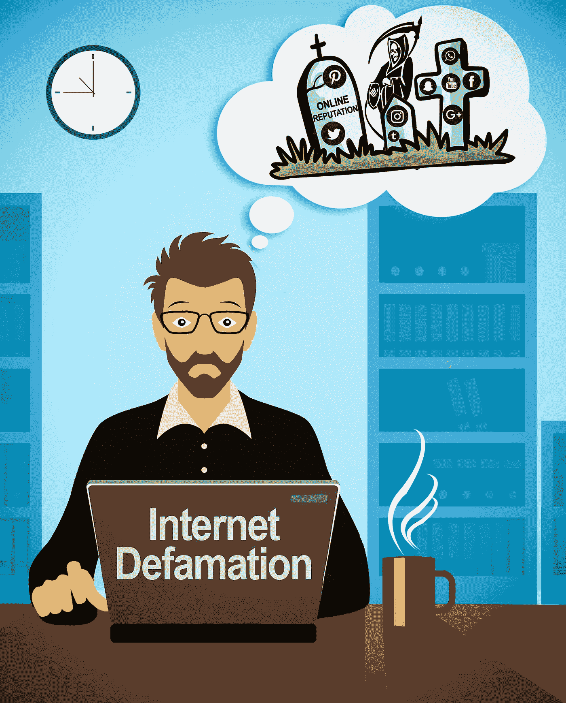
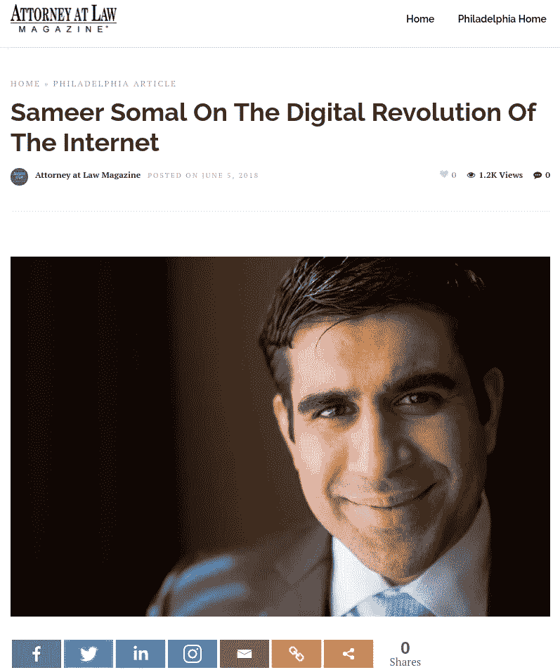
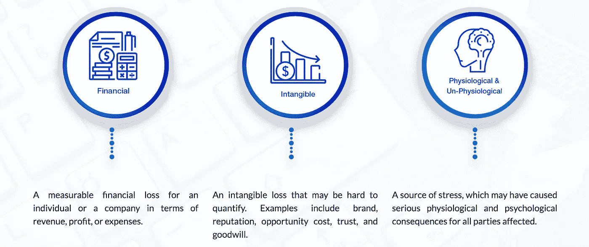

# 什么是网络诽谤？如何应对网络诽谤？

> 原文：<https://medium.datadriveninvestor.com/what-is-online-defamation-how-to-deal-with-internet-defamation-bb7e1bea9a31?source=collection_archive---------3----------------------->

## 网上诽谤源于互联网上发布的不准确或诽谤性的声明。诽谤索赔是指书面的互联网诽谤，通常通过评论、评论、博客、网站或发表的文章。通过视频或音频文件进行的诽谤被视为诽谤。

传播关于个人、团体或企业的虚假陈述的行为会直接或间接损害他们的声誉。网络诽谤有各种形式和规模。当公众从简单地访问万维网转向依靠它进行交流、商业和知识时，它变得更加突出。个人和组织都有机会在线发布不同类型的内容。

网络攻击会给个人和企业带来灾难性的后果。当有害和不想要的内容被匿名发布时，必须立即识别肇事者，以控制声誉损害。

蓝海环球科技的网络诽谤专家被 [**律师**](https://attorneyatlawmagazine.com/sameer-somal) 杂志专题报道。

我们与值得信赖的公共关系、法律、数字营销和执法合作伙伴网络一起秘密审查每个案件。我们始终会审查提起诉讼以追回您或您的公司遭受的金钱损失的利弊。在确定最佳行动方案之前，我们会与客户讨论所有合适且直接的选项。解决方案通常包括删除[内容](https://blueoceanglobaltech.com/content-removal/)、法院强制令[、禁止](https://blueoceanglobaltech.com/blog/how-to-remove-and-bury-negative-links-online/)链接、停止&停止通信以及赔偿诉讼。

作为值得信赖的主题专家，我们了解互联网诽谤、中伤和中伤的法律细微差别。法院已经确立了处理线下和线上诽谤的先例。

[https://www.youtube.com/watch?v=H2YTbTWDR4s](https://www.youtube.com/watch?v=H2YTbTWDR4s)

我们必须保护我们表达自己的权利，同时对诽谤保持警惕。尽管建设性的批评对改善某种状况没有错，但互联网诽谤会造成金钱、情感和名誉上的伤害。Web 2.0 的兴起引入了各种社交媒体平台，如脸书和 YouTube，这使得人们可以相互交流。用户全天候表达意见和分享想法的能力增加了互联网诽谤发生的机会。当分享的新闻和内容是积极的时，这可能是有利的。相反，它也有缺点，特别是当评级，评论和裁决是虚假的，误导性的，或欺骗性的。对诽谤的一个常见误解是，它打击的是从事不道德、欺诈或犯罪活动的企业。每周，蓝海全球科技都会收到顶级知名公司和个人的求助请求，他们正面临不当负面宣传的后果。

 [## 互联网诽谤后果|蓝海全球技术

### 在过去的十年里，法院已经建立了处理网络诽谤的法律先例。保持最新和…

blueoceanglobaltech.com](https://blueoceanglobaltech.com/internetdefamation/) 

# 互联网诽谤的后果

## 互联网诽谤可以表现为多种形式，但有害的结果通常包括:

# 业务损失

如果一个有成千上万追随者的受欢迎的你的 Tuber 或 blogger 诽谤你最成功的产品之一，这将可能导致收入减少。你的公司可能永远无法恢复财务，即使声称的索赔后来被证明是假的。

消费者反馈网站和 Google My Business 上的负面评论很容易阻止潜在客户购买你的产品，并将他们引向你的竞争对手。

在 ripoffreport.com 或类似网站上发布的虚假诈骗报告会立即侵蚀你的品牌信誉和声望。当信任度下降，负面内容成为潜在合作伙伴和客户谈话的框架时，可能需要相当多的时间和精力来解决这个问题。

# 生理和心理后果

诽谤引起的压力的生理后果可能会对你的身体产生负面影响:头痛，胃灼热，失眠，记忆力下降，免疫系统减弱，心脏病发作的风险增加，整体压力和紧张都在其中。从心理学的角度来看，处理诽谤会引发易怒、焦虑、紧张，甚至抑郁。纽约一家律师事务所的一位成功合伙人恰如其分地将她的声誉问题描述为“我个人生活和职业生活中的一个永久的累赘。”

你正在经历的[网络诽谤](https://blueoceanglobaltech.com/internetdefamation/)可能是匿名的。当互联网诽谤成为一个持续的问题时，[蓝海全球技术](https://blueoceanglobaltech.com/)如何帮助客户？因为每个维修案例都是独特的，必须独立调查，每个[在线声誉](https://blueoceanglobaltech.com/blog/seo-vs-orm-what-is-the-difference/)管理案例都需要定制的方法。

我们的目标是为每个专家咨询或专家见证客户确定最可行的解决方案。这个过程的第一步是客观地研究和透彻地分析案件的各个方面。与我们的客户及其信任圈的关键成员进行透明的沟通，指导并支持我们如何开发解决方案。我们利用公关、法律、数字营销和执法专业人员的战略网络的经验。我们的团队在与客户一起审查之前，会评估移除和抑制选项的可行性。

# 如果您目前面临网上诽谤，请直接联系我们 info@blueoceanglobaltech.com

访问我们的网站预约案例咨询:[https://blueoceanglobaltech.com/internetdefamation/](https://blueoceanglobaltech.com/internetdefamation/)

网络诽谤专家: [Sameer Somal](https://sameersomal.com/)