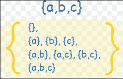
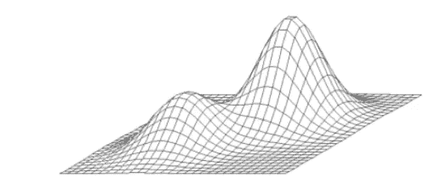

# 什么是机器学习中的优化:预算内从家到办公室的最快路径。

> 原文：<https://medium.datadriveninvestor.com/what-is-optimization-in-machine-learning-quickest-path-to-my-office-from-home-when-on-budget-27f73f4df766?source=collection_archive---------6----------------------->

> 什么是优化？

最优化可以被定义为两部分问题

> 首先，使任何目标函数最小化或最大化的过程。

优化的一个真实例子是找到从我家到我办公室的最短路线。

> 第二，必须遵守一组约束。

就像我之前的例子一样，如果必须在上午 10 点前到达办公室，或者如果我不能在旅途中花费超过 10.00 卢比。

> 因此，我去办公室的路程要求我走最短的路线，同时花费不超过 10 卢比，并确保我在上午 10 点前到达办公室。**这就是优化。**

现在我们已经定义了优化，谁知道我应该使用什么样的旅行模式，以及我应该什么时候开始旅行，以便及时到达我的办公室？

解决方案。有几个可供我们使用，但让我从最简单的一个蛮力算法开始。

> 强力算法

强力算法:

第一步:尝试每一件事，所有可能的项目组合。即生成所有可能项目的子集。这叫做**动力集。**

> 幂集“设 A 是一个集合。那么 A 的所有子集的所有集合称为幂集。”

A Power Set

第二步:删除所有旅行费用超过 10.00 卢比的组合，也删除所有让我在上午 10.00 后到达办公室的组合。

这看起来是一个简单的解决方案。然而，随着约束数量的增加，功率集的大小也增加，存在一个问题。例如，如果我需要从 100 个项目中进行选择，那么幂集的大小将是 1，267，650，600，228，229，401，496，703，205，376。使得计算上不可能。

所以蛮力是行不通的，我们需要别的东西来寻找我的解决方案以最少的花费最快的路线到达我的办公室，并在上午 10:00 之前到场！！

上述问题的问题是，随着选项数量的增加，该问题成为一个指数问题，然而，我们有一个解决方法。它被称为贪婪算法。

贪婪算法的逻辑是这样的

虽然我没有从家到办公室走最长的路线，但我也会尝试得到“最佳”的约束。

这里的“最好”是什么意思？

花费不超过卢比的旅行方式。10.00，并允许我在上午 10.00 之前到达办公室。

让我们再举一个例子

午餐时间到了，我坐下来吃饭。

我对我吃的食物有自己的价值，我认为甜食比蔬菜更有价值。然而，我的卡路里预算是每餐不能超过 1000 卡路里。这是一个最优化问题。我需要控制的事情是我对美食的渴望，并且控制在每日卡路里的限度内。

我可以根据我的口味和热量限制选择不同的食物。然而，我们必须准备好不同的答案，因为局部最优解永远不会是全局最优解，如下图所示。

Image Showing Local Optima and Global Optima resulting in different solutions