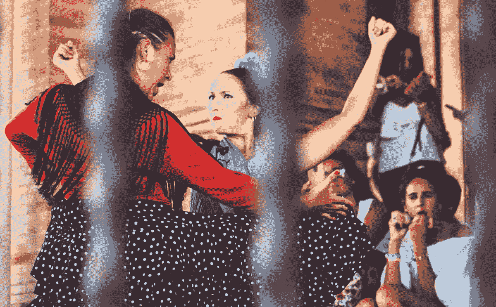

# 什么是有机音乐营销和发行？

> 原文：<https://medium.datadriveninvestor.com/what-is-organic-music-marketing-and-distribution-73a48e3d7b75?source=collection_archive---------9----------------------->

Photo by Stéphan Valentin on Unsplash

AI(人工智能)现在是许多投资者的热门话题……对大多数人来说很神奇。简单地说，人工智能是一种过滤信息的方式，由程序员为各种情况定义；从机场管制到自动驾驶汽车。人工智能是 Spotify 和 Pandora 背后的野兽，人工智能的成功实施已经通过无限量的上传音乐找到了一个家。那些小图标代表人工智能编程的焦点。他们听我们最喜欢的，提出建议。非常酷。非常…我的新兴创意在哪里？我能得到报酬吗？

AI 是另一个大词算法的花哨营销词，自 80 年代以来一直被使用。那时候这个术语是机器学习。重新包装计算机功能是常见的。有些遵循改进。有些是出于营销目的。

 [## 人工智能与创造力:梦想成真|数据驱动的投资者

### 人工智能总是让我着迷。不仅作为一套有用的工具，不断发展，而且作为一个…

www.datadriveninvestor.com](https://www.datadriveninvestor.com/2019/01/28/ai-creativity-deep-dream-comes-true/) 

人工智能在分配收入方面的作用是由非常古老的原则指导的。说到音乐，付费宣传规则。人工智能对点击和受欢迎程度做出反应。直到这个问题，“新兴音乐人如何在不掏很多钱的情况下建立稳定的收入？”音乐人将继续付费，希望他们的钱能有所回报。毫无疑问，艾会很乐意提供今天的营销和分销模式，留下许多优秀的人才。

# 有机音乐营销

有机营销发生在我们每次现场表演的时候。CD 在舞台前或摊位内的小摊上出售，或者分发下载卡。握手。不同的 OM 方法继续取得不同程度的成功。

用商业语言来说，这就是“点对点”销售，而且非常有效。在互联网上，点对点，或者 B2C(企业对客户)，是一个非常不同的问题。

多年来，营销人员开发了各种策略，旨在接触传统社交模式，如脸书、Twitter、Pinterest 等。越来越多的社交空间变得越来越满，这对那些控制大都市的人来说是一个强大的优势。权力现在正在限制接触，人工智能运行干扰，把广告放在第一位。

随着国会开始打击开放式个人信息收集，剑桥分析公司(Cambridge Analytica)的破坏性错误信息策略等组织可能会滥用这些信息，对广告美元的需求将随着投资者的需求而增加。

对于我们这些音乐人来说，有机营销仅限于我们现场表演的能力。互联网能改变这个现实吗？如果互联网提供了如此多的承诺，我们如何利用它来对听众做出真正公平的反应？一个 AI 不干涉的地方。人耳优先于自我决定。

我们如何过滤如此多的音乐并分发给正确的听众，帮助艺术家建立稳定的收入？

途径是在最喜欢的兴趣范围内的当地社会关系。有效的联系从家乡开始，并通过个人联系从家乡传播到家乡。随着平台的不断移动，联系的紧密程度将会增加。所有需要的是一个鼓舞人心的互联网窗口，包括财政支持，每一个球迷在那里。

所有的音乐都起源于家乡。乐迷从音乐家第一次表演的地方开始。只要有耐心，并且有能力从家里开始发展粉丝群，我们就能打开自己家乡之外的大门。这是一个音乐家和乐迷都可以从经济和信息上获利的门户。

带回家的出版音乐是个人的…是有机的。

*约翰·科尔，*创始人/首席开发者[Muezbiz.com](https://muezbiz.com)

通过向邻居代表支付会员发行音乐的份额，努力将音乐出版业从边缘拯救回来。

更多流浪:

[*诚实带来美味的蛋糕*](https://medium.com/datadriveninvestor/honesty-inspires-a-fabulous-cake-31318848eede)

[*区域数字内容代表能赚钱吗？绝对的。*](https://medium.com/datadriveninvestor/can-regional-digital-content-reps-make-money-absolutely-5df3460e9b20)

[*启用愿景，鼓励可能性*](https://medium.com/datadriveninvestor/enabling-visions-encouraging-possibility-2171356fd2d7)

[*音乐营销:启用“口碑”*](https://medium.com/@john_cole/music-marketing-enabling-word-of-mouth-7f3451c845da)