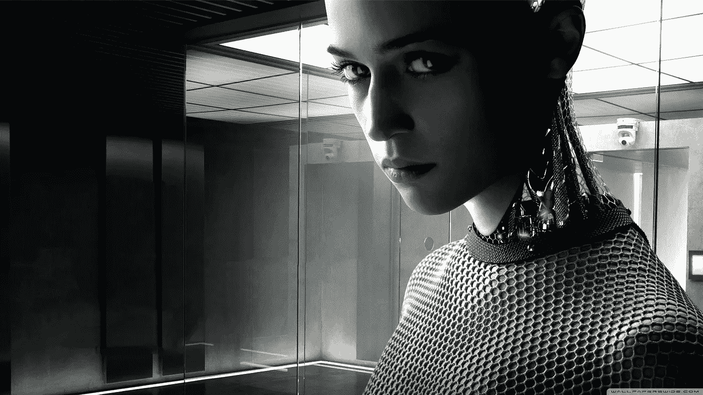
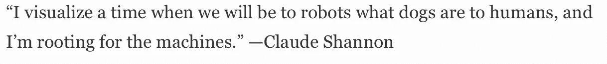
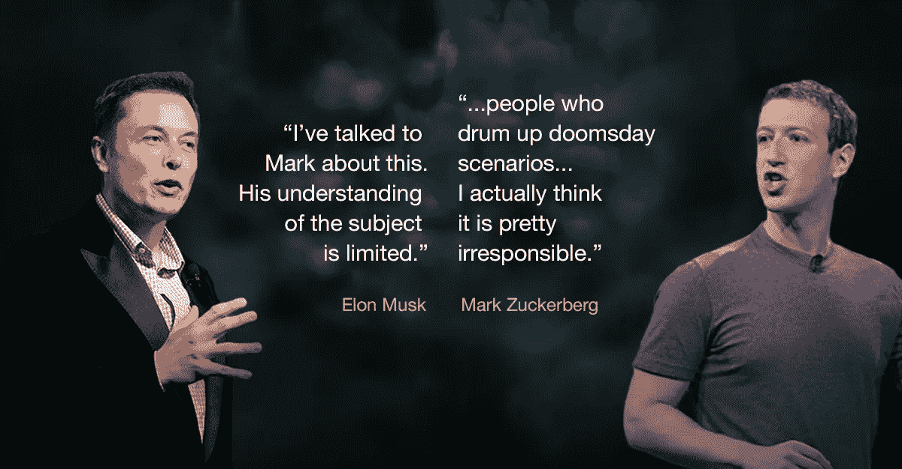
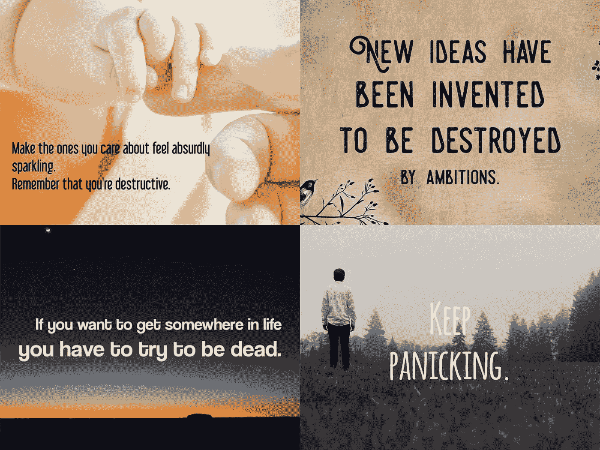
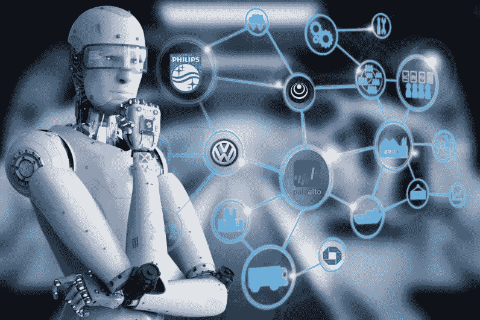
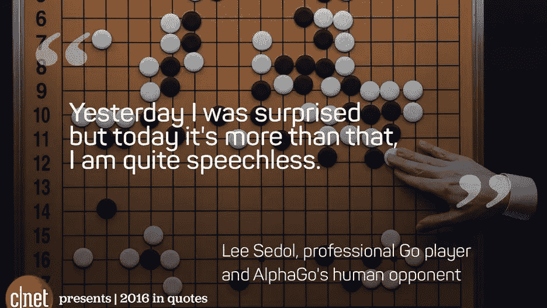
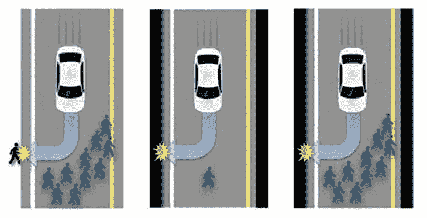

# 什么是完美 AI？pt 1/3

> 原文：<https://medium.datadriveninvestor.com/what-is-perfect-ai-pt-1-3-b330f37f5336?source=collection_archive---------18----------------------->

“人工智能(AI)是计算机科学的一个领域，它强调创造像人类一样工作和反应的智能机器。”([www.techopedia.com](https://www.techopedia.com/definition/190/artificial-intelligence-ai)

根据这个定义，我们可以非常肯定人工智能现在就存在于我们之中，我认为最好的例子是索菲亚(机器人)，这个人工智能机器人的创造者大卫·汉森说:“尽可能详细地描绘社会人可以帮助我们更好地理解社会智能，无论是在科学上还是艺术上”。我的问题是为什么？需要什么？有脸书、Instagram、WhatsApp、Snapchat、tinder 等等还不够吗？等等..他们都有非常专用的人工智能算法来扼杀你的智能手机中的通知托盘。如果你想在你的生活中体验更多的疯狂，只需在 FB 中将你的关系状态设置为单身，并查看与 FB 连接的所有帐户的变化，在一周左右的时间内，你会在通知托盘中显示大约 5-10 个你周围的人的建议，并带有标语你有一个新的朋友建议:陌生人女士(不是来自 marvel universe)，你的 Instagram 帐户突然有了不同的优先级，虽然这对某些用户来说可能是件好事，但我个人认为每天早上都知道哦！我需要新朋友，因为 FB 建议我，在这个改变之前，我自己很开心，但现在 FB 想告诉我我没有什么，也许它的算法是为了让每个人都保持关系。

这个例子的全部目的是证明“…..创造像人类一样工作和反应的智能机器。”这种说法本身就很模糊。我对这个陈述中的三个词有所保留，即创造、智慧和人类。让我们盯着每个单词看 10 秒钟，以了解它的深度，**智力**:获取和应用知识和技能的能力。这是一种学习和应用所学知识的能力，有效地运用这种能力被称为技能。学习取决于你在某种程度上有多少记忆，以及在需要时如何使用它。一个成长中的孩子需要从环境中学到很多东西，然而一起出生和长大的双胞胎却有着不同的性格。原因是什么？？智力不仅是你大脑中的东西，也是你作为一个物理存在的全部。你的肤色来自于漫长的家族史，你的眼睛可能和你的祖母或曾祖母一模一样。所以我们的身体记得基因中的每一个细节，因此我们也有遗传疾病，比如年纪轻轻就秃顶，这不是你的错，是你的基因。我们的基因携带 10e100000 兆兆字节的数据，如果你有付费版本的 WinRAR，甚至更多。

让我们抛开这个话题，现实一点，问问你自己，你聪明吗？你的朋友聪明吗？班级 TOPPER 智能吗？“总统”聪明吗？斯蒂芬·霍金、甘地、阿诺德·施瓦辛格、奥普拉·温弗瑞，他们都很有技能，但他们聪明吗？如何衡量智力？智商可以是一个很好的衡量标准，对吗？哨兵岛部落呢？在过去的 60，000 年里，他们完全没有接触过现代文明。所以他们将无法在智商测试中与你竞争，顺便说一句，他们甚至不知道如何生火，但他们存活了那么久，我们不能带着手机充电器生活一天(iPhone 用户 12 小时)。因此，智商测试并不是衡量智力的真正标准。当我们人类已经不能用任何程度的自信来定义我们的智力水平时，我们怎么能创造出比我们更聪明的东西呢？科技是智能的吗？人工智能的智能衡量标准是什么？

[http://inspirobot.me](http://inspirobot.me) — AI BOT that created above shown Images

去吧，这种棋盘游戏在中国已经玩了 3000 年了，棋盘的可能布局是 10 的 170 次方，大概相当于世界上所有海滩上沙粒的总数。证明围棋是有史以来最复杂的游戏。DeepMind 在这场比赛中创造了一个击败 18 次世界冠军的机器人 AlphaGO。机器人在比赛中随机移动，这对人类对手来说完全是奇怪的，即使在比赛中领先 10 步也没有任何意义，但最终，这一奇怪的步骤是击败人类对手的关键因素。官方报告称:“在比赛期间，AlphaGo 下了几个极具创造性的制胜棋，其中几个——包括第二场比赛中的第 37 步——颠覆了数百年来的公认智慧”。AlphaGo 的思维比人类棋手超前 10-15 步，显示出难以想象的“智能”。我们应该认为这是实际上需要 1，920 个 CPU 和 280 个 GPU 的智能或高度熟练的繁重计算，并想象一下他们那个月的电力账单..1920 个 CPU 280 个 GPU 专用于一项任务，所以相对而言，吉萨大金字塔(140 米高)是由 100，000 名工人在 20 年内建成的，这也是智能吗？智能正在设计这样的系统，我们应该感谢那些创造了如此美妙而复杂的艺术品的人。但现在我们想将这种智能转化为无限的力量。

人类一直将智力定义为从零开始创造东西的能力。你和你的朋友被困在丛林里，几乎没有资源，救援 24 小时后就到，你用石头生火，你很聪明，你捕捉、杀死并烹饪一头野猪，你很聪明，因为你多才多艺。创造性和打破常规的思维让我们进入了这个领域，我们想要创造一些东西，可以创造一些我们无法控制的东西。在一个领域有很高的技术和平均水平。我们生活中其他领域的表演者让我们比其他动物更聪明。我们作为一个人类已经从穴居生活上升到现在，只是因为我们知道如何以最佳的形式利用资源。但是我们花了几千年才走到这一步。但是，我们的自动驾驶汽车可以在仅仅 2-3 次试验中学习我们的驾驶技能，并在没有人类干预的情况下进行完美的转弯，在如此短的时间内完成如此多的学习。

半智能机器人已经停在你的车道上的特斯拉汽车，自动驾驶，读取速度限制，在停止时停止，可以改变车道，可以超越其他非智能人类驾驶的跛脚汽车，新的更新还让汽车看到其他汽车的交通信号和转向灯。你要做什么？坐着假装握着方向盘(这也是因为法律还不信任无人驾驶汽车)。在自动驾驶汽车时代的兴起期间，关于这项即将到来的尖端技术的决策算法，有一个非常复杂的问题。这是一个非常糟糕的场景，大概是这样的:一辆自动驾驶汽车由人工智能系统以相当高的速度驾驶，比如说 70 英里/小时，汽车上坐着一个 4 口之家——妈妈，爸爸和两个孩子， 突然，不知从哪里冒出来了另一个同样 4 个角色的家庭站在路中间，现在只有两个选择，要么通过侧面撞车牺牲车上的乘客来拯救站在路中间的家庭，要么通过移动(你知道我的意思)站在路上的 4 个家庭成员来拯救车上的乘客，刹车不是一个选项。 这是一个道德困境，没有一个软件可以决定什么是正确的答案，因为没有正确的答案。同一个问题的另一个变体如下图所示:

? who to save ?

迷惑对吗？你会做出什么决定？而且谁来评你就评谁，谁来评胭脂艾。它们应该像人类一样遵循同样的规则吗？是否应该一视同仁？他们应该有意见吗？什么是创造力和人类**类似**的反应？想想看，现在是做出改变的时候了，现在是放慢脚步，重新考虑的时候了。