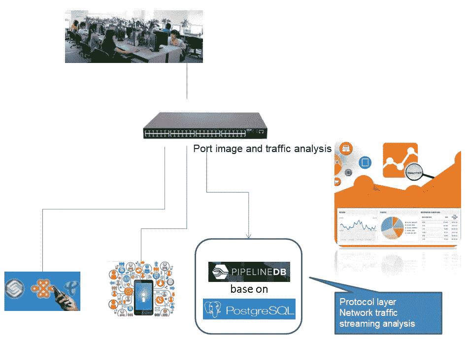
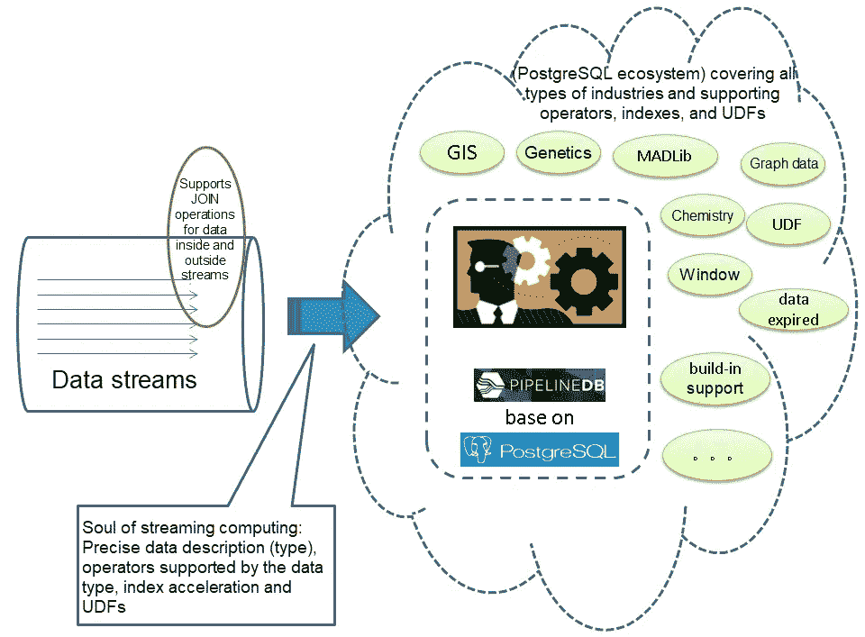

# 什么是 PipelineDB，如何使用？

> 原文：<https://medium.datadriveninvestor.com/what-is-pipelinedb-and-how-can-i-use-it-362cd6aa33af?source=collection_archive---------9----------------------->

*通过 Digoal。*

[PipelineDB](https://www.pipelinedb.com/?spm=a2c41.13585409.0.0) 是一个基于 [PostgreSQL](https://www.postgresql.org/?spm=a2c41.13585409.0.0) 的流计算数据库，用纯 c 编写，它的特点是效率高，单个 32 核服务器每天可以处理高达 250.56 亿次交易。PipelineDB 还拥有 PostgreSQL 的几个强大功能，由于其出色的性能和功能，正在帮助流行流计算数据库。

PipelineDB 广泛应用于[物联网](https://www.forbes.com/sites/jacobmorgan/2014/05/13/simple-explanation-internet-things-that-anyone-can-understand/?spm=a2c41.13585409.0.0)场景，越来越多的用户将他们的系统从其他流计算平台迁移到 PipelineDB。

[](https://www.datadriveninvestor.com/2018/11/14/how-iot-solutions-are-shifting-opportunities-in-the-supply-chain/) [## 物联网解决方案如何改变供应链中的机遇|数据驱动型投资者

### 物联网(IoT)可能开始时规模很小，但它正在成为世界经济中的一个重要因素。事实上…

www.datadriveninvestor.com](https://www.datadriveninvestor.com/2018/11/14/how-iot-solutions-are-shifting-opportunities-in-the-supply-chain/) 

PipelineDB 相对容易使用，是开发人员的高效数据库。要使用它，首先需要定义一个流，然后根据流定义相应的转换(或者事件触发模块)和连续视图(实时统计模块)。之后，您可以将数据插入到流中。转换和连续视图随后将实时处理流中的数据。(当然，我们将在本文中再次讨论这一点。)

还值得注意的是，PipelineDB 的所有接口都支持 SQL 操作，这使得 PipelineDB 更加方便。您可以将 PipelineDB 用于可以随时定义内容的流场景。

# 了解 PipelineDB 背后的概念

# 什么是溪流？

[流](http://docs.pipelinedb.com/streams.html?spm=a2c41.13585409.0.0)是 PipelineDB 的基础，连续视图和转换是处理流中数据的方法。流可以被理解为一种抽象，通过这种抽象，客户端可以通过连续视图推送时间序列数据。对于相同的数据，只需要定义一个流，只写数据的一个副本。

为了更好地说明这一点，可以这样考虑:如果数据的多维统计可以在一条 SQL 语句中完成(比如支持 windows 的一维计算或多维计算)，那么只需要定义一个连续视图或转换。如果计算不能在一个 SQL 语句中完成，那么您将需要定义多个连续视图或转换。接下来，如果有多个数据源(例如，当设计了不同的表时)，您将需要定义不同的流。

# 什么是连续视图？

[连续视图](http://docs.pipelinedb.com/continuous-views.html?spm=a2c41.13585409.0.0#continuous-views)是 PipelineDB 中的另一个基本抽象，它很像一个常规视图，但它们从流和表的组合中选择输入，并随着新数据的写入而实时更新。

连续视图是定义统计分析查询的一种方法。命令`select id`、`count(*)`、`avg(x)`和`... from stream_1 group by ...`都属于连续视图。

在定义了一个连续视图之后，可以将数据插入到流中(比如`stream_1`)，连续视图继续增量收集统计数据。只需要查询连续视图就可以查看实时统计结果。

数据库存储实时统计结果，这些结果实际上是合并的，并以递增的方式保存在内存中。

# 什么是转换？

与连续视图不同， [transform](http://docs.pipelinedb.com/continuous-transforms.html?spm=a2c41.13585409.0.0) 命令用于触发事件，或连续转换输入的时序数据，但不需要存储数据。但是，您可以为转换设置条件。当任何记录满足条件时，就会触发一个事件。

例如，当特定的监控传感器值超过您设置的值范围阈值时，将触发警报(例如，通过 [REST API](https://restfulapi.net/?spm=a2c41.13585409.0.0) 向指定的服务器发送警报通知)，或者记录警报(通过触发功能)。

PipelineDB 继承了 PostgreSQL 优秀的可扩展性。比如 PipelineDB 支持概率统计相关的函数，比如[高级编程语言](https://www.webopedia.com/TERM/H/high_level_language.html?spm=a2c41.13585409.0.0) (HLL)。这些功能强大且易于使用；例如，它们可用于计算网站的唯一访客(UV)、唯一车辆牌照号码通过红绿灯的次数或基于手机信号的基站辐射半径。

# 什么是推拉窗？

鉴于很多场景下的数据都有特定的有效期，或者在特定的时间段(或时间窗)内有效，PipelineDB 提供了滑动窗口特性，可以让你方便地定义数据有效期。

例如，您可以收集时间窗口中最近一分钟的统计数据。接下来，如果你需要一个[热图](https://www.crazyegg.com/blog/understanding-using-heatmaps-studies/)，只显示最后一分钟的热度，而不是历史数据，你可以重新定义滑动窗口，这样保留的数据更少，对服务器的要求也更低。反过来，使用也会提高效率。

# 连续视图支持连接吗？

当谈到[加入](http://docs.pipelinedb.com/joins.html)时，支持因类型而异。首先，[流-流连接](http://docs.pipelinedb.com/joins.html#stream-stream-joins)，将在未来版本中得到支持，目前可以通过转换间接实现。另一方面，支持[流表连接](http://docs.pipelinedb.com/joins.html#stream-table-joins)。要查看更多支持类型，请查看 PipelineDB 文档的本页。

# 何时何地可以使用 PipelineDB

PipelineDB 适用于任何需要流处理的场景。为了说明这一点，请考虑下面的特定场景:

# 运输和交通监控

PipelineDB 可用于对交通传感器(如道路传感器和交通灯)报告的数据进行流处理，以实时显示交通状况(在连续视图中完成)，如交通流量或波动。它还可以用于动态触发事件响应(在转换中完成)，例如交通事故。

# 水文监测

PipelineDB 可用于传感器数据的流监控。对于这些应用程序，PipelineDB 可用于显示水质何时发生变化(例如，当水被污染时)，事件响应被动态触发(在转换中完成)。

# 车联网(IoV)场景

PipelineDB 还可以用于车联网(IoV)应用。例如，PipelineDB 可以与 [PostGIS](https://postgis.net/) 合作，实时跟踪车辆位置，合并轨迹，动态绘制仪表盘(分时和区域车辆分布)。

# 物流趋势

PipelineDB 可用于动态跟踪包裹在其行程中每一步的数据，或汇总结果，或完成查询，而无需从大量数据中过滤多个条目(减少离散扫描)。

# 实时金融数据处理

PipelineDB 可用于实时金融数据处理。例如，您可以设置股票的买卖价格，并使用 transform 的事件处理机制来快速买卖股票。然后可以使用 PipelineDB 实时对股指数据进行一些数学模型运算，实时输出计算结果，绘制仪表盘。

# 犯罪调查和追踪

PipelineDB 可用于刑事调查。例如，当一辆可疑车辆的牌照已知时，可以使用 PipelineDB 对视频监控系统捕获和上传的牌照信息执行流处理。根据 transforms 设置的规则，当发现可疑车辆时，会触发一个事件，让您可以快速查看其轨迹。

# 应用源的实时分析

PipelineDB 可用于实时分析应用程序提要。许多应用程序中都配置了提要，以便于跟踪用户的行为或遵循业务处理逻辑。如果访问流量很大，结果数据量可能会很大。因此，在应用使用 PipelineDB 的流处理之前，您可能需要首先收集数据并将其存储在大型数据仓库中，以便进行离线分析。

然而，离线分析有时可能是不够的，例如当您需要根据用户或仪表板的实时行为为用户提供动态建议或进行促销时。在这种情况下，需要实时流处理。

# 使用网络协议层的流量分析

PipelineDB 可用于网络协议层的流量分析。例如，您可以使用 PipelineDB 对办公网络、运营商网关和某些服务器进行流量分析。



除了这些场景之外，还有更多可以使用 PipelineDB 的场景。

例如，任何需要快速响应服务，或可以受益于快速响应时间，或需要实时统计或转换和事件跟踪，或可以与相关通知或订阅模型或跨平台数据交换模型相结合的内容。

# PipelineDB 有什么优势？

PipelineDB 最终来自于由加州大学伯克利分校开发的 PostgreSQL，因此继承了它的许多功能。说白了，这是一件非常好的事情。PostgreSQL 有扎实的理论基础；具体来说，经过 43 年的发展，PostgreSQL 在功能、性能和可伸缩性方面已经成为该领域的领导者。

在很多方面，计算是流计算的灵魂。算法及其支持的功能是主体。请考虑下图:



一般来说，PostgreSQL 提供了极其丰富的统计维度和数据类型。那到底是什么意思？嗯，要了解 PostgreSQL 的内置数据类型，请查看[这一页](https://www.postgresql.org/docs/9.6/static/datatype.html)。当谈到内置的聚合、窗口和数学函数时，您可以查看[本页](https://www.postgresql.org/docs/9.6/static/functions.html)了解更多信息。

但是，这里简而言之，PostgreSQL 支持几种扩展，常见的扩展有 MADLib、PostGIS、Route planning、Wavelet、Genetics、Chemistry。当然，还有更多的扩展可用。这一切都要归功于 PostgreSQL 类似 BSD 的许可证，它让 PostgreSQL 的生态系统得以庞大。

当然，使用从 PostgreSQL 构建的 PipelineDB，它也具有这些优点。总而言之，PipelineDB 可以用于几乎所有您可能想到的场景中的流处理，这使得它非常强大。

# 快速开发、测试和部署管道数据库

首先，您需要设置和开发 PipelineDB，然后我们可以测试和部署它。

# 快速设置和开发 PipelineDB

在设置 PipelineDB 之前，请确保已经在系统上设置了 PostgreSQL。为此，您需要检查是否下载了合适的版本，相应地配置了操作系统，包括配置资源限制和防火墙等。然后，您应该已经部署了文件系统，还初始化并启用了数据库，配置了 PostgreSQL，等等。

在这之后，您将需要部署依赖项。作为其中的一部分，你会想要安装 ZeroMQ，你可以在这里找到。然后，您需要运行下面的命令来设置 ZeroMQ。

```
wget https://github.com/zeromq/libzmq/releases/download/v4.2.0/zeromq-4.2.0.tar.gz    

tar -zxvf zeromq-4.2.0.tar.gz    

cd zeromq-4.2.0    

./configure    
make    
make install    

vi /etc/ld.so.conf    
/usr/local/lib    

ldconfig
```

接下来，如果操作系统版本是[Red Hat Enterprise Linux](https://www.redhat.com/en/technologies/linux-platforms/enterprise-linux)(RHEL)6 或更早，您将需要更新 [LibCheck](https://github.com/libcheck) 。您可以使用以下命令对早期版本进行删除检查:

```
yum remove check
```

现在，您会想要使用`Install Check`命令来安装您想要的版本。作为参考，请查看本文档及其[发布信息](https://github.com/libcheck/check/releases)。

```
wget http://downloads.sourceforge.net/project/check/check/0.10.0/check-0.10.0.tar.gz?r=&ts=1482216800&use_mirror=ncu    

tar -zxvf check-0.10.0.tar.gz    

cd check-0.10.0    

./configure    
make     
make install
```

现在您需要下载 PipelineDB。您可以使用以下命令来完成此操作:

```
wget https://github.com/pipelinedb/pipelinedb/archive/0.9.6.tar.gz    

tar -zxvf 0.9.6.tar.gz    

cd pipelinedb-0.9.6
```

如果操作系统是 RHEL 6 或 CentOS 6，您需要修复 PipelineDB 错误。然后，如果操作系统是 RHEL 6，调整`check.h`。您可以通过以下方式实现这一点:

```
vi src/test/unit/test_hll.c     
vi src/test/unit/test_tdigest.c     
vi src/test/unit/test_bloom.c     
vi src/test/unit/test_cmsketch.c     
vi src/test/unit/test_fss.c     

Add check.h.    
#include "check.h"
```

此外，如果操作系统是 RHEL 6，您需要纠正 libzmq.a 路径错误。(这当然是为什么最好有一个更新的版本。)您可以使用以下命令来完成此操作:

```
vi src/Makefile.global.in    

LIBS := -lpthread /usr/local/lib/libzmq.a -lstdc++ $(LIBS)
```

现在，使用以下命令纠正测试解码错误:

```
cd contrib/test_decoding    

mv specs test    

cd ../../
```

并使用以下命令编译 PipelineDB:

```
export C_INCLUDE_PATH=/usr/local/include:C_INCLUDE_PATH    
export LIBRARY_PATH=/usr/local/lib:$LIBRARY_PATH    

export USE_NAMED_POSIX_SEMAPHORES=1    

LIBS=-lpthread CC="/home/digoal/gcc6.2.0/bin/gcc" CFLAGS="-O3 -flto" ./configure --prefix=/home/digoal/pgsql_pipe    

make world -j 32    

make install-world
```

现在，您需要初始化集群。为此，您要做的第一件事是配置环境变量:

```
vi env_pipe.sh     

export PS1="$USER@`/bin/hostname -s`-> "    
export PGPORT=$1    
export PGDATA=/$2/digoal/pg_root$PGPORT    
export LANG=en_US.utf8    
export PGHOME=/home/digoal/pgsql_pipe    
export LD_LIBRARY_PATH=/home/digoal/gcc6.2.0/lib:/home/digoal/gcc6.2.0/lib64:/home/digoal/python2.7.12/lib:$PGHOME/lib:/lib64:/usr/lib64:/usr/local/lib64:/lib:/usr/lib:/usr/local/lib:$LD_LIBRARY_PATH    
export PATH=/home/digoal/cmake3.6.3/bin:/home/digoal/gcc6.2.0/bin:/home/digoal/python2.7.12/bin:/home/digoal/cmake3.6.3/bin:$PGHOME/bin:$PATH:.    
export DATE=`date +"%Y%m%d%H%M"`    
export MANPATH=$PGHOME/share/man:$MANPATH    
export PGHOST=$PGDATA    
export PGUSER=postgres    
export PGDATABASE=pipeline    
alias rm='rm -i'    
alias ll='ls -lh'    
unalias vi
```

假设端口是 1922，目录是/u01:

```
. ./env_pipe.sh 1922 u01
```

现在，您可以使用以下命令初始化集群:

```
pipeline-init -D $PGDATA -U postgres -E SQL_ASCII --locale=C
```

现在，您需要修改配置。您可以通过以下方式实现这一点:

```
cd $PGDATA    

vi pipelinedb.conf    

listen_addresses = '0.0.0.0'    
port = 1922      
max_connections = 2000    
superuser_reserved_connections = 13    
unix_socket_directories = '.'    
shared_buffers = 64GB    
maintenance_work_mem = 2GB    
dynamic_shared_memory_type = posix    
vacuum_cost_delay = 0    
bgwriter_delay = 10ms    
bgwriter_lru_maxpages = 1000    
bgwriter_lru_multiplier = 10.0
max_worker_processes = 128
wal_level = minimal
synchronous_commit = off    
full_page_writes = off    
wal_buffers = 2047MB
wal_writer_delay = 10ms
max_wal_size = 64GB
min_wal_size = 32GB
checkpoint_timeout = 55min    
checkpoint_completion_target = 0.1    
random_page_cost = 1.2    
effective_cache_size = 400GB    
log_destination = 'csvlog'    
logging_collector = on    
log_truncate_on_rotation = on    
log_checkpoints = on    
log_connections = on    
log_disconnections = on    
log_error_verbosity = verbose       
log_timezone = 'PRC'    
autovacuum = on    
log_autovacuum_min_duration = 0    
autovacuum_vacuum_scale_factor = 0.05
autovacuum_analyze_scale_factor = 0.1
autovacuum_vacuum_cost_delay = 0
autovacuum_vacuum_cost_limit = 0
datestyle = 'iso, mdy'    
timezone = 'PRC'    
lc_messages = 'C'    
lc_monetary = 'C'    
lc_numeric = 'C'    
lc_time = 'C'    
default_text_search_config = 'pg_catalog.english'    
continuous_query_combiner_synchronous_commit = off    
continuous_query_combiner_work_mem = 1GB    
continuous_view_fillfactor = 50    
continuous_query_max_wait = 10    
continuous_query_commit_interval = 10    
continuous_query_batch_size = 50000    
continuous_query_num_combiners = 24    
continuous_query_num_workers = 12
```

下面是 PipelineDB 添加的配置:

```
#------------------------------------------------------------------------------    
# PIPELINEDB OPTIONS    
#------------------------------------------------------------------------------    

# synchronization level for combiner commits; off, local, remote_write, or on    
continuous_query_combiner_synchronous_commit = off    

# maximum amount of memory to use for combiner query executions    
continuous_query_combiner_work_mem = 1GB    

# the default fillfactor to use for continuous views    
continuous_view_fillfactor = 50    

# the time in milliseconds a continuous query process will wait for a batch    
# to accumulate    
continuous_query_max_wait = 10    

# time in milliseconds after which a combiner process will commit state to    
# disk    
continuous_query_commit_interval = 10    

# the maximum number of events to accumulate before executing a continuous query    
# plan on them    
continuous_query_batch_size = 50000    

# the number of parallel continuous query combiner processes to use for    
# each database    
continuous_query_num_combiners = 24    

# the number of parallel continuous query worker processes to use for    
# each database    
continuous_query_num_workers = 12    

# allow direct changes to be made to materialization tables?    
#continuous_query_materialization_table_updatable = off    

# synchronization level for stream inserts    
#stream_insert_level = sync_read    

# continuous views that should be affected when writing to streams.    
# it is string with comma separated values for continuous view names.    
#stream_targets = ''    

# the default step factor for sliding window continuous queries (as a percentage    
# of the total window size)    
#sliding_window_step_factor = 5    

# allow continuous queries?    
#continuous_queries_enabled = on    

# allow anonymous statistics collection and version checks?    
#anonymous_update_checks = on
```

接下来，您将需要启动 PipelineDB。您可以使用下面的命令来完成此操作:

```
pipeline-ctl start
```

现在，让我们进入连接方法。我们将使用与连接 PostgreSQL 相同的方法来连接 PipelineDB，因为 PipelineDB 与 PostgreSQL 兼容并基于 PostgreSQL 构建。

```
psql    
psql (9.5.3)    
Type "help" for help.    

pipeline=# \dt    
No relations found.    
pipeline=# \l    
                             List of databases    
   Name    |  Owner   | Encoding  | Collate | Ctype |   Access privileges       
-----------+----------+-----------+---------+-------+-----------------------    
 pipeline  | postgres | SQL_ASCII | C       | C     |     
 template0 | postgres | SQL_ASCII | C       | C     | =c/postgres          +    
           |          |           |         |       | postgres=CTc/postgres    
 template1 | postgres | SQL_ASCII | C       | C     | =c/postgres          +    
           |          |           |         |       | postgres=CTc/postgres    
(3 rows)    

pipeline=#
```

# 测试您的管道 DB

首先从测试步骤开始，您需要创建一个流结构。您可以使用下面的命令来完成。注意，对于这个命令，参数`id`是键，参数`val`是存储值。这些值按 ID 进行聚合以进行统计。

```
CREATE STREAM s1 (id int, val int);
```

现在你需要创建一个连续的视图。连续视图将用于收集几个常见维度的统计数据，包括`count`、`avg`、`min`、`max`和`sum`，正如我们之前所讨论的。

```
CREATE CONTINUOUS VIEW cv1 AS    
SELECT id,count(*),avg(val),min(val),max(val),sum(val)    
FROM s1 GROUP BY id;
```

PipelineDB 可以用于你能想到的几乎所有场景的流处理，大大提高了开发效率。因此，在下一个瓶颈，你会想要激活流计算。您可以使用`activate ;`命令来完成:

现在，您需要插入数据来对我们创建的系统进行压力测试。为此，我们要对一百万个随机组进行测试，并插入随机值，每个值都等于或小于 5，000，000。

```
vi test.sql    

\setrandom id 1 1000000    
\setrandom val 1 5000000    
insert into s1(id,val) values (:id, :val);
```

现在，激活 1000 个连接，并开始压力测试，以每秒大约 24 万个事务进行处理。

```
pgbench -M prepared -n -r -P 1 -f ./test.sql -c 1000 -j 1000 -T 100    

...    
progress: 2.0 s, 243282.2 tps, lat 4.116 ms stddev 5.182    
progress: 3.0 s, 237077.6 tps, lat 4.211 ms stddev 5.794    
progress: 4.0 s, 252376.8 tps, lat 3.967 ms stddev 4.998    
...
```

如果服务器有许多硬盘，并且 CPU 性能很高，则可以在一台服务器上部署两个或更多 PipelineDB 实例，以便在它们之间分配流量。例如，如果在 32 核服务器上部署两个 PipelineDB 实例，流处理能力可以达到每秒 29 万个事务和每天 250.56 亿个事务。

当部署两个 PipelineDB 实例时，我们建议您使用[numatl](https://linux.die.net/man/8/numactl?spm=a2c41.13585409.0.0)进行控制，并将两个 PipelineDB 实例分别与两个 CPU 和内存绑定。例如，您可以使用下面的命令来执行此操作:

```
numactl --physcpubind=0-31 pipeline-ctl start
```

这样做将提高性能，提供一个相当公平的结果，即每天稳定的 250.56 亿次交易。接下来可以考虑使用 [JStorm 框架](https://github.com/alibaba/jstorm/wiki/Acking-Framework-Implementation?spm=a2c41.13585409.0.0)，同样可以给你带来很大的效果。事实上，如果你决定不使用它，你可能需要做出几十倍甚至几百倍于 PipelineDB 通常价格的硬件投资才能达到同样的效果。

# 部署 PipelineDB 集群

尽管 PipelineDB 提供了强大的性能(根据前面的测试，32 核服务器每天可以处理大约 250.56 亿个事务)，但在这种情况下，单个服务器总是会遇到瓶颈。然而，部署集群也是避免这种瓶颈的好方法。通过分发、聚合以及部署，您可以有效地提高系统的效率。

关于写操作，如果您不需要特定的分片规则，您可以考虑使用 [HAProxy](http://www.haproxy.org/?spm=a2c41.13585409.0.0) 来满足您的分发需求。如果你需要添加分片规则，你可以使用 [PLPproxy](https://www.postgresql.org/message-id/74996d3d52c64180a9c98c82d5e9b223@BY2PR02MB491.namprd02.prod.outlook.com?spm=a2c41.13585409.0.0&file=74996d3d52c64180a9c98c82d5e9b223@BY2PR02MB491.namprd02.prod.outlook.com) 来代替。说到查询聚合，您需要使用 PLProxy，它实际上很容易使用；你需要做的就是写一个动态函数。

# 原始资料

[](https://www.alibabacloud.com/blog/what-is-pipelinedb-and-how-can-i-use-it_595357?spm=a2c41.13585409.0.0) [## 什么是 PipelineDB，如何使用？

### di goal 2019 年 9 月 17 日 629 PipelineDB 是一个基于 PostgreSQL 的流计算数据库，用纯 c 编写，它的特点是…

www.alibabacloud.com](https://www.alibabacloud.com/blog/what-is-pipelinedb-and-how-can-i-use-it_595357?spm=a2c41.13585409.0.0)