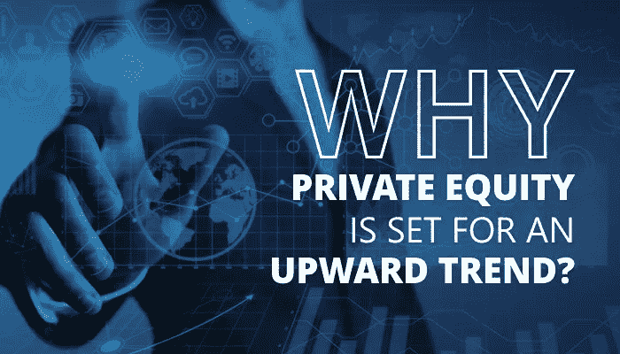

# 为什么私人股本将呈上升趋势？

> 原文：<https://medium.datadriveninvestor.com/what-is-private-equity-2a074146a4af?source=collection_archive---------9----------------------->

我们先来了解一下什么是私募股权！

私募股权(PE)是指未公开上市或交易的股权，即公司股份。它是来自高净值个人(hni)和公司的投资资本来源，这些人购买私人公司的股票或获得上市公司的控制权，计划将它们私有化并从私人证券交易所退市。

***什么样的实体参加 PE？***

 [## 风险投资家在给创业公司播种时会考虑什么标准？数据驱动的投资者

### 2017 年，风险投资资金攀升至十年来的最高水平。你的创业公司目前吸引风险投资的机会是…

www.datadriveninvestor.com](https://www.datadriveninvestor.com/2018/04/20/what-criteria-do-venture-capitalists-consider-when-seeding-a-startup/) 

PE 行业基本上由以下部分组成:

**o** 大型机构投资者:如养老基金

大型私募股权公司:由合格投资者出资

***PE 资本是用来做什么的？***

私募股权资本有多种用途:

o**进行收购**

支持资产负债表

**o** 扩大营运资本

o 为新技术提供资金

# *2019 年的 PE 有哪些关键趋势？*

许多趋势正在塑造 2019 年的 PE，并将继续发挥其长期影响。下面讨论一些重要的问题:

## 破纪录的承诺

大型基金发行将比以往任何时候都多，寻求资本和共同投资的基金数量出乎意料地多，独立管理的账户触及新高，因为私募股权基金经理们急于在全球最长经济扩张期之一结束前锁定创纪录的承诺。

## 跑赢股票

几乎没有一个公开市场指数不经历同比下降；然而，2018 年，私募股权基金平均上涨了 8.2%。私募股权资产不会受到股票市场的极端估值波动的影响，当后者经历异常高的波动性时，私募股权资产往往会跑赢公共股票。这些趋势在不久的将来也可能会继续。

## 从交易撮合者到估值专家的转变

传统上，私募股权公司主要依靠他们的交易团队进行投资估值，因为他们最接近投资的内在价值。不过，私募股权公司越来越多地聘请独立估值专家，这些专家:

> 专注于投资组合估值和另类、非流动资产，用于基金层面的分析和财务报告要求。
> 
> 管理定期投资者报告要求，例如每季度或每半年完成一次，并具有所需的透明度。

## 大型收购基金的推出

近年来，大型收购基金纷纷成立，预计今年也将继续。由于利率保持在较低水平，投资者更愿意将越来越多的资金投入到过去表现良好的私募股权基金中。大型私募股权基金已经公开宣布了它们的高筹资目标。

## 关于私募股权投资中散户投资的争论

在美国，证券交易委员会(SEC)一段时间以来一直在努力解决散户投资者获得私募股权投资的问题，尽管目前私募股权投资不符合基于财富的障碍。高质量、高回报的私募股权投资对个人来说可能很好，在不久的将来，规则可能会相应改变。

***该不该考 PE 认证？***

如果你想进入体育事业，并在竞争中保持领先，获得体育认证是一个很好的主意。考虑到顶级基金提供的工作岗位和相对较大的求职者群体，证书是让你在竞争中保持领先的一个好方法。当你获得认证后，你在私募股权投资方面的知识和技能会大幅提升，使你成为顶尖私募股权投资和风险投资公司的有吸引力的候选人。

私募股权认证的一个很好的选择是[美国私募股权委员会(USPEC)](https://www.uspec.org/private-equity-certifications/chartered-private-equity-professional?utm_source=medium&utm_medium=cc) 。USPEC 是几十年来世界上最强有力的倡议者，致力于为体育企业和专业人士建立和传播标准、规范、知识框架、学习软件、基准和证书。USPEC 提供一种认证:特许私募股权专业人士(CPEP)。

***总之……***

在有利的市场条件和许多其他支持因素的推动下，PE 市场将在今年和不久的将来继续保持过去的良好表现。密切关注市场交易，将注意力集中在投资和运营上，而不是销售上。凭借扎实的领域知识和正确的认证，踏上通往卓越的 PE 职业生涯的道路。