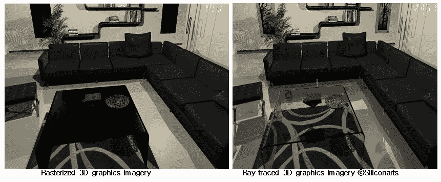

# 什么是光线追踪？？

> 原文：<https://medium.datadriveninvestor.com/what-is-ray-tracing-fd9bf8b6e16?source=collection_archive---------5----------------------->

几个月来，我们一直听到围绕 RTX 显卡的议论，这些显卡与英伟达的其他迭代有什么不同？如果这只是一个增量更新，为什么突然改变名称。要理解所有这些，首先我们必须了解什么是光线跟踪技术。

除非你坐在完全黑暗的地方，否则我希望你能帮我一个忙，*环顾一下你所在的房间，注意到墙上的一个点，然后从你的眼睛向这个点画一条线，然后沿着它指向你房间光源的角度，这就是光线跟踪的基本内容*，这是一种图形渲染技术，一直是各地技术爱好者的关注中心。Nvidia 推出的图灵系列显卡据说能够进行实时光线追踪，从而创造出更好看的游戏。那么，为什么这项技术被誉为比当前一代图形处理器更上一层楼呢？今天大多数游戏都使用一种叫做**光栅化**的技术，游戏代码会指导你的 GPU 绘制一个带有多边形的 3D 场景。这些二维形状，通常是三角形，构成了你看到的大部分视觉元素，在场景被绘制后，它被转换或光栅化为单独的像素，然后由着色器处理，着色器在每个像素的基础上影响颜色，纹理和灯光效果，给你一个完全渲染的帧，然后你每秒钟做 30 或 60 次，你就可以享受一个完全响应的视频游戏。

虽然光栅化已经很好地服务了我们很长一段时间，试图通过将 3D 形状转换到 2D 屏幕上来近似图像，然后使用着色器来近似照明应该具有的固有限制。

两者的质量差异很明显，因为光栅化渲染很难跟踪光线在特定场景中的传播和反弹。光线跟踪在这方面做得更好，我们已经看到这种技术有一段时间了，但还不知道它，几乎所有最近的皮克斯或迪士尼动画电影都广泛使用这种技术来获得环境细节。

因此，如果这项技术不是新技术，那么为什么我们没有将它用于游戏，但使电影成为可能的是，大预算制作有大量资金在大型服务器农场上渲染这些效果，这一过程可能需要几个月的时间，并且计算量更大，每个光子都有许多反弹，每个光源都有大量光线。所以光线跟踪图像非常复杂，有足够的时间与真实的东西区分开来，不相信我检查下面的图像。

你会被原谅误认为这是一个现实生活中的照片，但光线跟踪并不是计算机图形的全部，光线跟踪的主要缺点是计算成本和平均 20 多岁的人谁通常做更多的游戏没有数百万美元或渲染服务器，游戏必须以每秒 25 帧左右的速度渲染，而不是像某些皮克斯电影那样每天 1 帧，《怪物大学》的一些帧需要大约 29 小时渲染。

然而，消费级光线追踪不是追踪从每个光源发出的数百万或数万亿条光线，而是追踪从代表用户眼睛的虚拟相机通过单个像素到该像素后面的任何物体并最终回到场景内光源的路径，从而减少了计算量。

由于光照是实现 3d 渲染的一个重要方面，一旦这个过程对每个像素都完成了，你的 GPU 就可以抛出一些详细的图像。就像任何新的 GPU 功能一样，虽然现在在硬件方面它将归结为行业支持，但 AMD 的专业级光线跟踪解决方案可能会在未来看到两个团队都增加支持，至于游戏开发者……嗯，没有保证，所以我们所能做的就是希望你不会最终为一些我们从未实际使用的功能支付额外费用。

**参考文献**

 [## 英伟达 RTX 光线追踪平台简介

### 英伟达 RTX 平台包括光线跟踪技术，为内容带来实时、电影质量的渲染…

developer.nvidia.com](https://developer.nvidia.com/rtx/raytracing)  [## 光线追踪解释:超现实图形的未来

### 这实际上是电影制片厂用来使现代特效看起来非常好的技术。但是那些电影…

www.engadget.com](https://www.engadget.com/2018/04/16/the-future-of-ray-tracing-explainer/)  [## 什么是光线追踪，英伟达的 GeForce RTX 如何处理该技术？

### 什么是光线追踪？随着新的 Nvidia GeForce RTX 2080……

www.pcgamer.com](https://www.pcgamer.com/what-is-ray-tracing/)  [## 皮克斯如何让怪兽大学成为其最新的科技奇迹

### 迪士尼皮克斯部门的新动画电影《怪兽大学》将于 6 月 21 日上映，它将作为《光…

venturebeat.com](https://venturebeat.com/2013/04/24/the-making-of-pixars-latest-technological-marvel-monsters-university/)