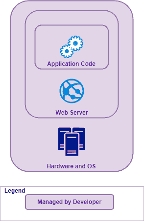
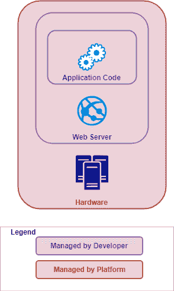
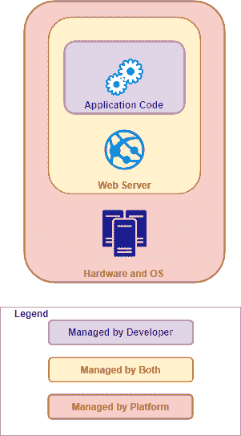
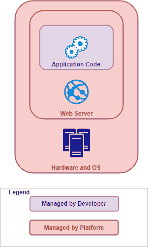

# 什么是无服务器？

> 原文：<https://medium.datadriveninvestor.com/what-is-serverless-b57506ecbf9?source=collection_archive---------3----------------------->

## 无服务器云计算概述

无服务器计算是云托管中最先进、最抽象的概念。但是到底是什么呢？与 IaaS 和 PaaS 相比如何？

它真的像一些人所说的那样是灵丹妙药吗？

 [## 信息图:云之旅|数据驱动的投资者

### 聪明的企业领导者了解利用云的价值。随着数据存储需求的增长，他们已经…

www.datadriveninvestor.com](https://www.datadriveninvestor.com/2018/09/22/infographic-journey-to-the-clouds/) 

# 基础设施和 API

首先要理解的是，无服务器计算是一种编写在非开发人员管理的上下文中执行的代码的方式。这里的想法是将尽可能多的负载转移到平台上，只将实际的业务逻辑留给编码人员。

无服务器代码的主要目的是公开 API。我们不断地构建基础设施来托管 API，但我们真的只想公开 API，并将其连接到我们的业务逻辑。

# 什么是 API？

退一步说:什么是 API？

API 只是代码的连接点。我们认为这是一个 API“表面”，希望相关的代码将存在于一个包含的区域内，通过它们的表面与其他类似的代码区域交互。

在代码中，我们称之为*封装*。

API 存在于代码的每个层次，从类到函数。这里我们最关心的是网络 API，有时统称为“web 服务”

有各种各样的样板基础设施来公开 API。我们不仅需要供应和控制网络功能和文件系统等，还需要以可管理的方式对其进行组织。

关于管理服务 API 的这一点产生了我们在 OSS 中看到的大量框架和模式:像 MVC 模式这样的设计和像 Django 或 Spring MVC 这样的框架是在尽可能让开发人员远离样板代码的同时构造 API 的方法。

# 管理复杂性

几个 REST APIs 没什么大不了的。但是，随着应用程序及其相互关系的增长，思考它们并有效管理它们的能力也在增长。

复杂性是开发者和架构师与之战斗最激烈的怪物。封装和 API 是这场战斗中的主要武器:剑鞘中的剑。

无服务器计算如何适应？

# 上下文中无服务器

这个想法是允许代码块被云平台托管在 T2。让我通过快速回顾一下 web 开发的历史来结束这个概述。您将看到 n 层、IaaS 和 PaaS 如何导致无服务器。

在云革命之前，组织应用程序的主要方式是 *n 层*:将应用程序分解成一个关注点层。这是因为应用程序本身主要被视为可部署功能的一个独立部分，其复杂性在应用程序架构中得到管理。

开发者管理的基础设施

在传统的 web 应用程序中，应用程序的硬件、操作系统、软件服务器和业务代码都掌握在构建应用程序的人员手中:参见上面的图 1。

接下来发生的是 IaaS:基础设施即服务。这实质上虚拟化了硬件和操作系统层，开发人员可以通过控制台或代码来管理它们。图 2 显示了 IaaS。

提供商管理的托管层

接下来是 PaaS:平台即服务，其中开发人员仍然处理运行应用程序代码的软件服务器，但将部署和与基础架构层的交互交给平台。图 3。

提供商管理的平台层

最后，我们实现了无服务器计算。本质上，开发人员不再关心或处理托管代码的内容。您只需编写代码并进行部署。

图 4 有无服务器。

提供者托管代码上下文(无服务器)

现在，那是高级的。这就是理想。

如果你坐下来创建一个 AWS Lambda、Google Cloud 函数或类似的东西，你会很快意识到实际实现一个无服务器应用程序需要处理 API 和托管它们的基础设施。

感觉上更像是在处理一个*不同的*筹码，而不是没有筹码。

# 建筑的破坏

在结束这个概述时，我能提出的最有趣的一点是:无服务器编码对应用程序架构产生了*的内部影响*。这是比以前更根本的改变。

PaaS 意味着应用程序的无状态架构(因为应用程序节点的复制和集群由平台处理，每个应用程序节点必须不知道其状态)，但*无服务器* *架构*将应用程序的表面分解移动到网络 API 级别。

我的意思是:应用程序分布在它的服务 API 上。这被称为*分解整体*:旧式应用程序因其包含整个应用程序的结构而被称为整体。

# 微服务风险和机遇

叫做*微服务*架构。

过去是函数和方法级别的考虑，现在是架构 API 的考虑。因此，微服务标签。

从允许开发者少考虑代码托管的角度来说，这是好的，但是，这给应用的架构带来了巨大的压力。旧的概念框架丢失了，API 的表面变得非常重要，也非常容易失去控制。

和往常一样，软件开发中强大的新概念就像电锯一样:有用但危险。

小心电锯！