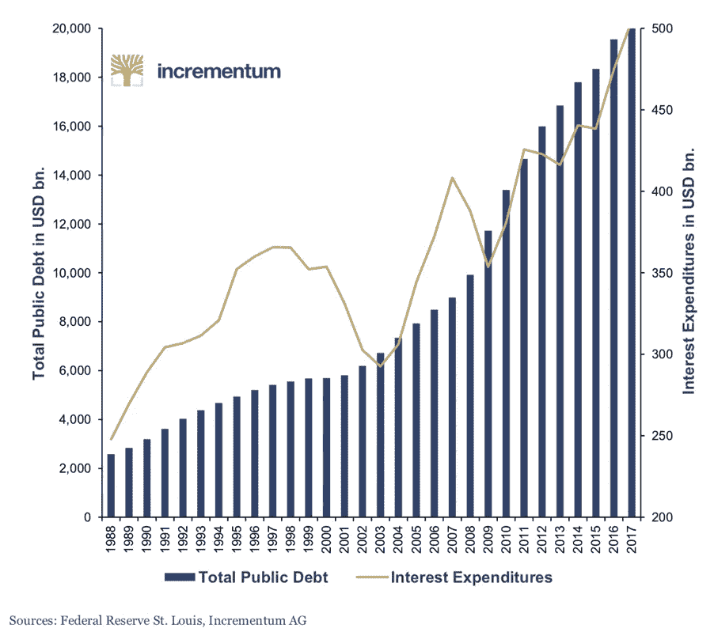
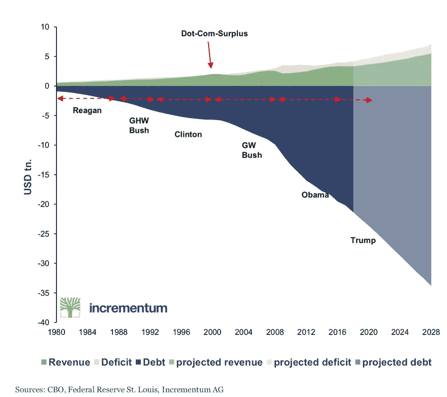

# 什么是成功？

> 原文：<https://medium.datadriveninvestor.com/what-is-success-157366cac85e?source=collection_archive---------39----------------------->

成功在于一件简单的事情，那就是你做决定的能力。不仅仅是做决定，而是快速做出决定。”托尼·罗宾斯

你做了多少真正生死攸关的决定？

你做的决定有多少是真正不可逆转的？

我猜不是很多

如果你做了一个糟糕的决定，可能发生的最糟糕的事情是什么？

现在来看看这张美国公共债务和利息支出的图表。

你能看出一个趋势吗？

这个怎么样……再次…都是债的问题。

**我想要什么？**

我希望你透过挡风玻璃而不是后视镜来看这些图表。

并做出决定。

记住，你可以随时改变主意。

在某个时候，这个债务会变得如此之大，以至于会有一个事件发生，而不是需要做出一个决定。但是如果你在那件事之前做了正确的决定，你可能会处于一个更好的境地。可能是一个比事后做决定好得多的地方。

在活动开始前你可以做好准备。事后，你做出反应。

这两者大相径庭。

让我解释一下。

我最近在看一部关于事故和紧急事件的相当恐怖的电视节目。这些医疗团队处理的事情真的令人羞愧。

在展览期间，他们采访了一位 A&E 顾问，并问道:

“A&E 有什么不同？”

我认为他的回答很精彩。

他是这样说的:

“没有人计划去 A&E”

想想吧。太真实了。

任何其他医院部门都需要某种形式的准备。你预约了治疗或手术。

你可以准备一下。

如果你要失去能力，就做好准备。预定下班时间。找个人来帮忙带孩子。

在 A & E. Bang 中没有约会—你在那里。

我的观点很简单。

我认为现在是为一项活动做准备的好时机。可能不会发生。如果不行，你可以随时改变你的决定。

但是如果真的发生了，做好准备的决定可能是你做过的最好的事情。

**我该如何准备？**

这很大程度上取决于你。我重复一遍。什么都不会发生。但如果是这样的话，那些图表表明我们可能不在最佳状态。那么至少将你投资组合的 1-5%放在实物资产上可能是明智之举。

我个人喜欢实物黄金。你可能更喜欢别的东西。

我想说的是做个决定，透过挡风玻璃看看情况。

不要等到为时已晚。

有一句谚语说“不要准备——准备失败”

选择权在你。