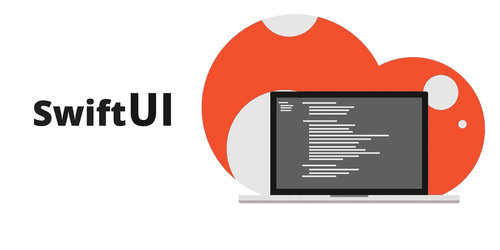
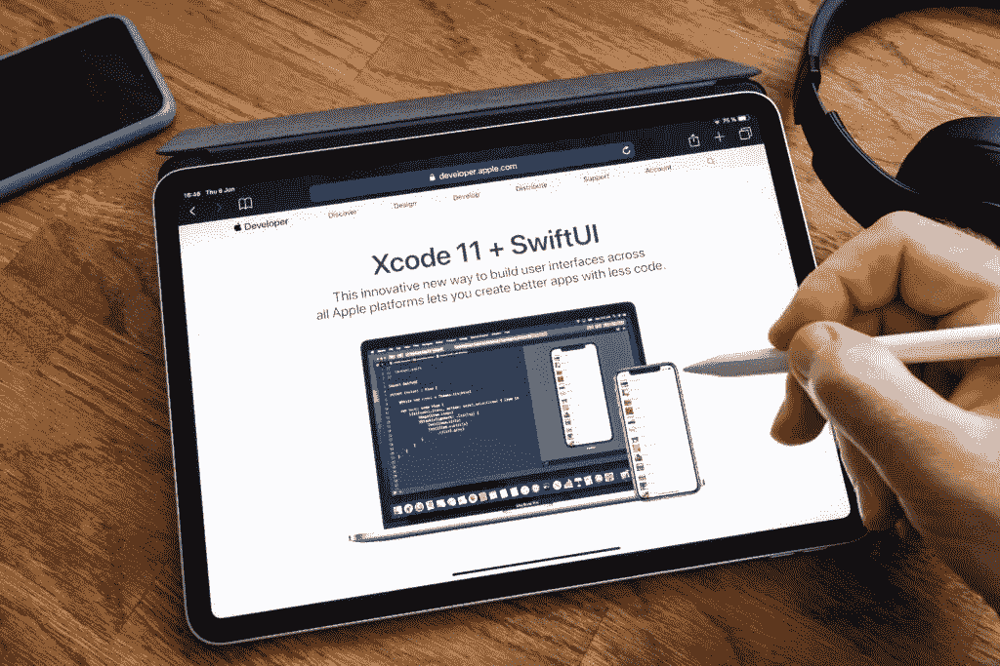
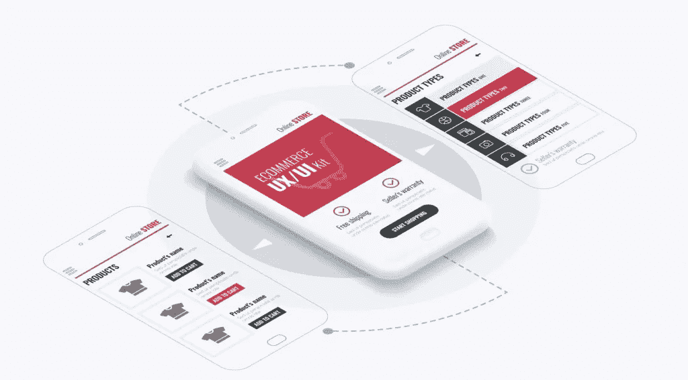

# 什么是 SwiftUI —优点、缺点和功能

> 原文：<https://medium.datadriveninvestor.com/what-is-swiftui-pros-cons-and-features-9b06f1a30d95?source=collection_archive---------6----------------------->

自从五年前 Swift 平台推出以来，wiftUI 是苹果发布的最令人兴奋的开发工具之一。IT 界对 SwiftUI 议论纷纷，因为他们终于从苹果那里得到了他们想要的东西。他们有了一个工具，可以花更多的时间为他们的用户开发很酷的新功能，而不是在界面生成器和故事板上浪费很多时间。在本文中，我们将仔细研究 SwiftUI，这样您也可以开始在您的项目中使用它。先说 SwiftUI 的定义。

 [## 2019 年移动应用开发之路|数据驱动的投资者

### 任何在移动应用程序开发行业工作的人，无论他们是专注于在伦敦开发 iOS 应用程序还是…

www.datadriveninvestor.com](https://www.datadriveninvestor.com/2019/01/15/the-path-of-mobile-app-development-in-2019/) 

# 什么是 SwiftUI？

SwiftUI 是一种在所有苹果平台上创建界面的新的建设性方法。事实上，你现在可以用一套工具和 API 为所有苹果设备创建用户界面。新的和改进的 Swift 语法允许您更轻松地编写代码，并且它将与所有 Xcode 设计工具无缝协作。具体而言，新的 SwiftUI 框架具有以下优势:

*   声明性语法——这意味着您所要做的就是告诉 UI 您希望它做什么。例如，您可以写下您需要几个文本字段，然后输入所有更详细的信息，例如每个字段的字体和对齐方式。
*   设计工具——为了使开发人员的编码过程更容易，做了大量的工作。SwiftUI 中一个有趣的组件是设计画布。在编码过程中，您所做的所有更改都会与相邻编辑器中的代码同步。此外，您输入的所有代码都将立即显示为预览。这使得[编程定制手机 app](https://skywell.software/mobile-app-development/) 变得更加简单和容易。
*   在所有苹果平台上都是原生的——苹果在创造创新产品方面有很多经验，当我们看 SwiftUI 时，这一点肯定是显而易见的。用户享受的所有苹果特有的体验都将呈现在你用 SwiftUI 创建的代码中，你的所有应用都将直接访问每个平台的技术。

SwiftUI 的缺点是:

*   它在 iOS13 中受支持——如果您的 iOS 版本较旧，而您的设备不支持最新版本，您将无法享受使用 SwiftUI 创建的应用程序。
*   没有定制视图扩展——没有定制视图扩展的原因是平台太新，开发社区没有时间创建它们。

现在我们已经了解了新的 iOS Swift 用户界面，让我们来看看它是如何与过去使用的工具相比较的。

# SwiftUI vs .界面构建器 vs .故事板

每当一种新产品出现在市场上时，人们很自然地会想，这些新工具与它应该取代的工具相比会如何。具体来说，我们正在讨论界面构建器(IB)和故事板。让我们来看看一些基本功能，看看它们是如何进行比较和对比的:

*   编辑— SwiftUI 在这里有优势，因为 Interface Builder 有很多 XML 代码，不容易阅读或编辑。故事板也不适合编辑，因为它有越来越大的趋势，很难控制任何源的改变。SwiftUI 没有这个问题，因为编辑非常直观和简单。
*   创建功能—IB 和 Storyboard 的最大问题之一是他们对 Swift 了解不多，反之亦然。例如，使用 IB，可以通过 Ctrl 拖拽的方式将代码与功能关联起来。但是，如果您后来决定删除这段代码，IB 仍然会编译它，并调用甚至不存在的代码。在创建视图控制器和其他功能时，故事板也有类似的问题。
*   与 Swift 整合——在苹果发布 Swift 之前，其产品是以 Objective-C 为中心的，然而，Swift 相比 Objective-C 有很多优势，比如值类型、协议扩展等等。新的 SwiftUI 设计旨在享受 Swift 提供的所有优势，而 IB 和故事板都是围绕 Objective-C 设计的。

考虑到所有这些，请尝试使用 SwiftUI，因为它明显优于开发人员过去习惯使用的工具。你会惊奇地发现创建复杂的功能是多么容易。

# 如何启动 SwiftUI

开始使用 SwiftUI 相当简单。事实上，当应用程序第一次启动时，ContentView 部分会有一个显示“Hello World”的文本。稍后，您将开始看到预览部分，它将显示您所做的所有更改。这将是代码旁边的一大块空白。只需点击“恢复”，你应该开始看到预览出现。如果没有反应，尝试点按“编辑器选项”，然后点按“编辑器画布”然后，您可以着手创建具有 SwiftUI 提供的所有众多功能的用户界面。

我们希望以上所有信息对您了解 SwiftUI 及其优势有所帮助。虽然从您目前正在使用的工具中切换出来可能很有挑战性，但是尝试一下，您会对它提供的所有功能感到惊讶。这只是一种更简单、更直观的方式来创建你一直想要的应用程序和用户界面。

*最初发布于*[*https://sky well . software*](https://skywell.software/blog/what-is-swiftui-pros-cons-features/)*。*