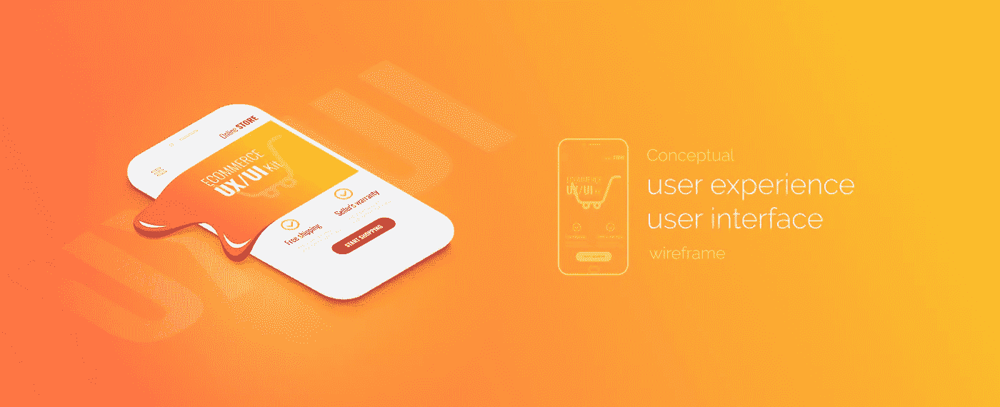

# UX 和 UI 有什么区别？

> 原文：<https://medium.datadriveninvestor.com/what-is-the-difference-between-ux-and-ui-ed163b50a13e?source=collection_archive---------10----------------------->

虽然在快节奏的 it 行业中，术语来来去去的现象很普遍，但 UI 和 UX 成功地经受住了时间的考验。然而，尽管这些术语已经存在了很长时间，但是对于它们各自指的是什么，仍然存在一些困惑。尽管 UI 和 UX 是相辅相成的，但仔细看看它们的功能是个好主意，这样我们就能知道它们之间的区别。

# 什么是 UX？

字母“UX”指的是用户体验，即一个人如何与你的产品互动。无论何时设计 UX，您本质上都是在定义产品的运行方式以及如何满足用户的需求。很明显，UX 必须以用户为导向，使用起来要舒适，而一个优秀的用户体验设计将以一种不明显的方式来阐述。这样，即使人们是第一次访问你的网站，他们也会很容易浏览你的网站。如果用户不知道如何执行某个特定的功能，比如继续结帐或登录，那么 UX 显然有问题。

 [## 准备在 2019 年改变世界的技术-数据驱动的投资者

### 很难想象一项技术会像去年的区块链一样受到如此多的关注，但是……

www.datadriveninvestor.com](https://www.datadriveninvestor.com/2019/01/17/the-technologies-poised-to-change-the-world-in-2019/) 

除了伟大的布局和正确定位的模块，还必须有一些东西作为用户和产品之间的媒介。这就是用户界面的用武之地。

# 什么是 UI？

用户界面(UI)包含所有按钮、控件和应用程序的任何其他元素，这给了它一种独特的感觉。创建一个用户界面包括选择颜色，确定公司的身份，并保持最新的设计原则。当设计师创建用户界面时，他们致力于赋予产品一种个性的感觉，并赋予它一种美学的面貌。每当有人访问你的网站，他们首先会看到的是用户界面，这也是当有人决定是否留在你的页面上的一个重要因素。优秀的[网站设计&开发](https://skywell.software/web-development/)将结合用户界面和 UX 设计。

# 你能有一个而没有另一个吗？

尽管 UI 和 UX 存在差异，但它们几乎总是一起使用是有原因的。许多专家认为你可能有一个很棒的用户界面，但是如果没有 UX 质量水平的支持，它将不会有效。例如，如果用户不断得到错误代码，那么用高质量的图像、纹理和渐变来创建一个奇妙的设计就没有多大意义。为了在今天的商业环境中保持相关性，你的网站需要用所有最新的元素和技术来设计，以便抓住和保持用户的注意力。因此，仅仅选择 UI 或 UX 并不是正确的选择。

虽然技术上 UI 和 UX 开发者是有区别的，但是很多时候一个人同时做两者。UX 开发者必须研究和理解用户需求，提出人们喜欢使用的概念和设计。如果你有一个擅长创造这种概念的 UX 设计师，但不能在现实生活中产生它们，那么你将需要一个 UI 设计师，他将有技能在 Photoshop 等程序中制作它们，然后将其转化为 HTML 代码。

# 顺序重要吗？

在大多数情况下，当创造一个产品时，UX 设计首先完成。UX 的设计师将进行大量的研究，以确认或拒绝最初的产品创意，并为整体产品开发提供一些指导。原型完成后，UI 部分可以从视觉设计和微交互开始。话虽如此，但这很大程度上取决于负责 UI 和 UX 设计的人以及他们所拥有的技能。

# 坚实的用户界面/UX 只是好生意

既然我们已经讨论了什么是 UI/UX 设计，如果你正确地做每件事，你的企业可以享受到很多好处。这些好处包括:

*   增强客户获取
*   增加客户保持率
*   降低支持成本
*   更少的开发时间

然而，当你决定采用 UI/UX 设计时，重要的是它不是一次性的。您应该将它整合到您的整体业务策略中，并持续监控用户指标，以便进行必要的更新。某一天非常现代和受欢迎的东西，第二天就可能成为古老的历史。这就是为什么你应该总是紧跟最新的趋势和发展，这样你就不会经常玩追赶游戏。

UI/UX 领域非常受欢迎，许多公司开始认识到它带来的整体价值，即理解用户和验证特定假设的能力。如今，用户有如此多的选择去获得某种产品、服务或信息，以至于你需要一些能抓住他们注意力的东西。如果你遇到高跳出率和其他负面的用户指标，考虑重新设计你的 UI/UX。这不一定是一次彻底的改革。事实上，一个简单的改变就能决定一个人是留在你的网站上还是去别的地方。

*最初发布于*[*https://sky well . software*](https://skywell.software/blog/what-is-the-difference-between-ux-and-ui/)*。*