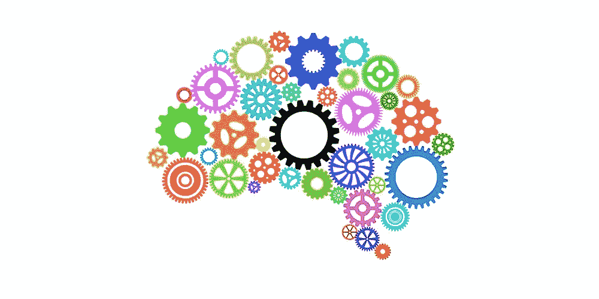
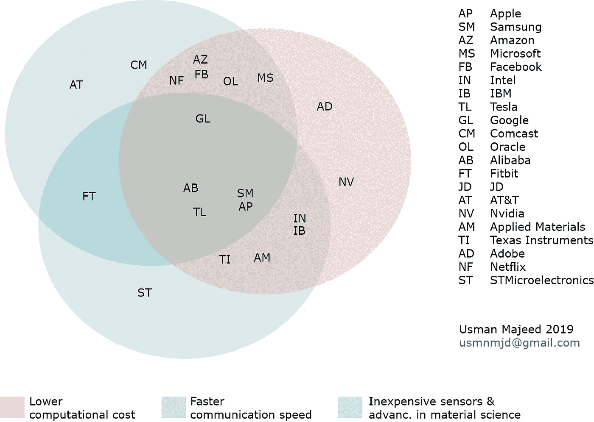
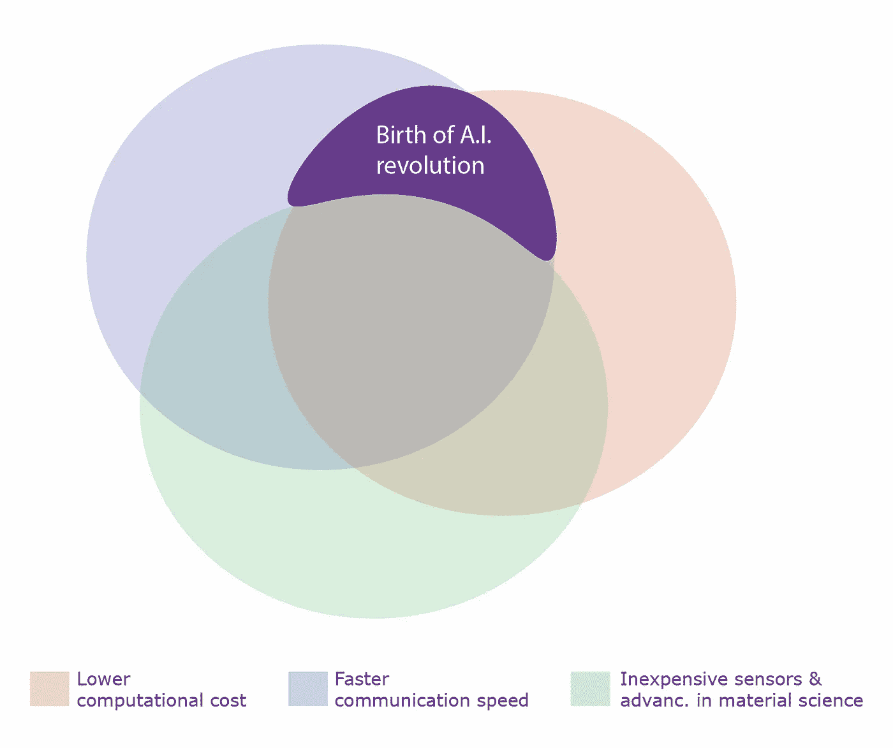

# 人工智能(A.I .)背后的驱动力是什么？

> 原文：<https://medium.datadriveninvestor.com/what-is-the-driving-force-behind-artificial-intelligence-a-i-95424a87ea49?source=collection_archive---------3----------------------->

Image courtesy: Forbes

几个世纪以来，更好地理解技术进步的真正方向的人们创造了巨大的财富和成功的故事。无论是机械引擎的发明，铁路的铺设，石油的发现还是计算机的革命性发展；对真正潜力的理解总是有回报的。意识到技术干扰的最佳方式是获得其背后驱动力的可靠知识。

在过去的三、四十年中出现的最近一波技术进步高度归功于计算机计算能力的进步和互联网在全球范围内的病毒式传播。计算机发展如此之快，以至于今天一部袖珍智能手机的计算能力超过了阿波罗 11 号宇宙飞船的计算能力总和，该飞船将第一批人类送上了月球，而且成本也只有几百美元。

 [## 今年值得关注的人工智能趋势|数据驱动的投资者

### 预计 2019 年人工智能将取得广泛的重大进展。从谷歌搜索到处理复杂的工作，如…

www.datadriveninvestor.com](https://www.datadriveninvestor.com/2019/02/19/artificial-intelligence-trends-to-watch-this-year/) 

在很短的时间内，互联网开始促进防御，然后是 80 年代的学术界，主宰了地球上数十亿人的日常生活。

**Venn diagram of top technology companies and the driving force behind**

如上所示，这一波最新的技术进步是基于三个基本驱动力。这些力量是通过计算机的极低的计算成本，以互联网形式不断增加的通信速度，以及材料科学的重大进步和廉价传感器的可用性。这三项突破共同提供了对信息的无限制访问，几乎没有成本连接，更好地理解我们周围的物理世界，以及高度自动化的基于逻辑的决策。

Automated decision making and the birth of recent A.I. revolution in the last decade

更低的计算成本和更快的通信速度是最近自动化复杂决策(通常称为人工智能)成功浪潮背后的驱动力。如上图所示，包括谷歌和脸书在内的主要人工智能公司都在突出显示的紫色区域进行大量工作。只要这些基本驱动力的进步继续发生，人工智能的进步就会不断达到新的高度。

*穆罕默德·乌斯曼·马吉德，*usmnmjd@gmail.com·T2

(2019 年 7 月 13 日)