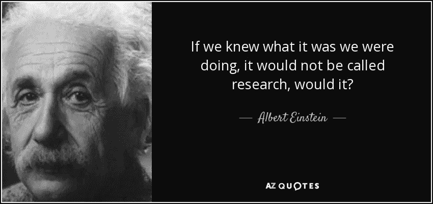

# 当你有一个产品想法的时候，你应该做的第一件事是什么！

> 原文：<https://medium.datadriveninvestor.com/what-is-the-first-thing-you-should-do-when-you-have-a-product-idea-1dc44a07929f?source=collection_archive---------13----------------------->

你有想法并为此感到自豪，这很好。这很好，但是…

## 下一步你该做什么？？

一旦有了想法，你通常认为你应该做什么？

 [## 睁大眼睛冲破多样性壁垒|数据驱动的投资者

### “科技女性”是蒂芙尼·霍兰的激情之一，最初她在 Twitter 上主持“科技女性”聊天。她也是一个…

www.datadriveninvestor.com](https://www.datadriveninvestor.com/2019/03/20/hurtle-diversity-barriers-with-eyes-wide-open/) 

*   您应该从实现开始，构建特性吗？
*   你应该开始接近投资者吗？
*   你应该开始寻找客户吗？
*   你应该开始设想一个最小可行的产品吗？

想一分钟！！

如果你正在做这些事情中的任何一件，那么你肯定没有走在正确的道路上。虽然这些是必须执行的基本活动，但它们不是建议的下一步！

## 当你有了一个想法时，你心里想的是什么！！

*   当你有一个想法时，你肯定已经经历了用户的痛点，你强烈地感觉到如果这个想法被执行，你的用户的痛点将被解决。
*   当你有一个想法时，你认为你的用户的生活会得到改善，他们会得到更多的舒适，如果这个想法被执行，这是一个很大的机会。

***本意确实不错但是这样就够了！！***

难道你不应该深入用户的生活，看看这个想法是否真的如你所想？

—如果没有这样的痛点呢？

—如果没有您的用户正在寻找的这种舒适，该怎么办？

—如果已经有了与您的想法完全相同的解决方案/产品，该怎么办？

**你想过这个吗？？如果没有，那么最好从这个开始。**

在最正式的方式中，这被称为**市场调查，这是当你有一个想法时你应该做的第一件事**！！

## 让我们深入市场调查

现在你已经对市场调查有了一些想法，你可能会提出这样的问题—

1.  如果我们花很长时间进行市场研究，这难道不会让我们在竞争中落后吗？
2.  难道不应该先从某个东西入手，平行研究吗？
3.  难道我们不应该将产品推向全球，而不局限于某些用户和市场吗？
4.  不如采用敏捷的执行方式(迭代和增量),这样我们可以继续进步并向市场发布一些东西，而不是做大量的研究和浪费时间。
5.  研究是在互联网上做谷歌搜索，对不对？这将是一两天的工作。为什么要在这上面多花时间？
6.  我们有什么固定的方法可以遵循吗？这些方法适用于所有情况吗？
7.  为什么在我强烈感觉自己的想法很独特，可以轻松占领市场，战胜一切竞争的时候，还要做竞争分析？
8.  这适用于 B2B 产品还是 B2C 类型的场景？
9.  投入多少时间做市场调研？
10.  这和 GotoMarket 策略有区别吗？

这些都是很好的问题，可以按以下类别回答:

❖什么是市场调研

❖如何做市场调查

❖做了多少市场调查

所以让我们开始吧！

## 什么是市场调查

> “没有数据，你只是另一个有观点的人。”—爱德华兹·戴明

当你热衷于创业时，你会被认为是商业领域的主题专家。

◈ **那么你应该知道这个领域的一切。**

> 市场调查是一种方法，通过它你可以获得该领域的专业知识。

◈:如果你想知道，你是否应该继续你的想法，那么市场调查可以帮助你。

> 市场调查及其结果可以帮助你做出决定。

◈:如果你想提炼你的想法，让它对目标受众来说切实可行，那么市场调查可以帮你。

> 市场研究可以帮助你在竞争中保持领先，因为它可以帮助你找到与众不同之处

◈不管商业模式是 B2B 还是 B2C，市场调查都是有益的。

◈初步市场调查会让你相信你的想法是有实质内容的，可以付诸实施，你的 [GoToMarket 战略](https://medium.com/datadriveninvestor/top-three-faq-questions-on-go-to-market-gtm-explained-with-example-3d6f4e29c25f)会定义最终产品应该如何在目标市场推出，以便创造流量。

## 如何做市场调查

最好像考虑一个项目一样考虑市场调查。*一个目标明确的项目。该计划将列出为实现目标所要进行的活动。留出一些时间来思考可交付成果，并不断完善它，直到你为你的产品想法获得足够的数据。*

> “知道和理解之间有很大的区别:你可以对某件事知道很多，但并没有真正理解它。”查尔斯·f·凯特林

✔从确定一个[角色](https://medium.com/datadriveninvestor/product-design-process-tools-and-techniques-db1b22051841)开始。你认为最有可能使用你的产品的用户。

✔为什么这个用户会使用你的产品。为什么这个用户会为你的产品付费？

✔了解该用户当前拥有的选项以及这些选项存在哪些问题。

在✔，这种类型的角色随处可见。这是你的目标市场。

✔:首先，谷歌可能是一个有用的工具。在这里搜索将为您提供一个资源列表，它可以为您提供一些见解。

✔:最后，竞争分析会让你在市场中处于更有利的位置。

[这个](http://www.swotnot.com/types-of-market-research/)是研究市场调查方法的好资源。*最好的方法是与你的目标用户产生共鸣，通过开放式对话来了解他们。*

> 在进入[产品设计](https://medium.com/datadriveninvestor/product-design-process-tools-and-techniques-db1b22051841)阶段并提出 MVP 之前，最好通过市场调查来验证你的想法！

## 做市场调查要花多少钱

如果你考虑把市场调查作为一个项目，那么它肯定应该有一个结束状态。

这里有两个想法，

第一个是“T7”，意思是在投资发展之前，做 6 个月以上的研究

**两个**，表示在这方面投入足够的时间，这样你就能确认在发展和进一步活动上花费精力是明智的。

你的市场调查活动应该会让你完全相信这个想法。

你现在应该能够提出一个*愿景、使命和价值主张，并得到市场研究结果的支持。*

> “研究就是要看到别人都看到的东西，思考别人都没有想到的东西。”
> 
> **–艾伯特·森特-杰尔吉**