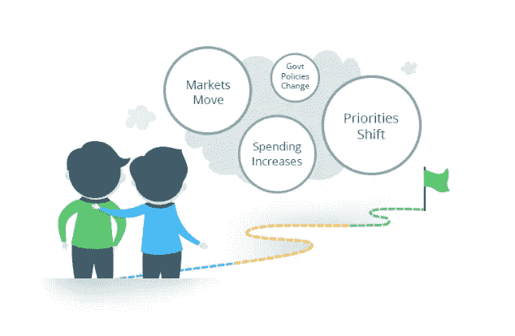

# 数字理财建议的未来如何？

> 原文：<https://medium.datadriveninvestor.com/what-is-the-future-of-digital-financial-advice-bc699cf2385d?source=collection_archive---------4----------------------->

技术正在改变我们生活的每一个领域，我们因此享受的优势是不可否认的——从通信、医药到金融等等。在许多方面，我们正处于一个过渡阶段，一些公司、机构和个人已经走在了前面，另一些人还在寻找他们的方向，还有一些人还处于否认的状态。

最近，当我们带着我最小的孩子踏上纽约市的高中招生之旅时，我亲身体验了这一点。我的儿子特别专注于去一所拥有强大的计算机科学课程的学校，从一所学校到另一所学校的课程范围是惊人的。一些学校非常重视为学生未来的职业生涯做准备，而另一些学校则像是回到了 20 世纪 50 年代。)但它们明显缺乏深度。我发现学术界的情况也反映了我们在金融机构领域看到的情况。

最近有很多关于数字金融规划平台的新闻。虽然我们很高兴 Pefin 最近经常出现在新闻中(例如，见这里的、这里的和这里的)，但还有其他标题，如:

[西北互助关停 Learnvest](http://www.investmentnews.com/article/20180507/FREE/180509935/northwestern-mutual-shutting-down-learnvest)

[高盛收购个人金融初创公司 Clarity Money](https://www.reuters.com/article/us-clarity-m-a-goldman-sachs/goldman-sachs-buys-personal-finance-start-up-clarity-money-idUSKBN1HM0Z7)

[Wealthfront 估值暴跌为 Robos 敲响了警钟](https://www.barrons.com/articles/wealthfront-valuation-plunges-in-wake-up-call-for-robos-1522075747)

这让人们对数字咨询世界的未来产生了疑问。我真的很讨厌人们说“让我们‘打开’它”——但最近的泡沫似乎是各种竞争因素的复杂组合，需要被打开。以下是一些想法:

1)一些大型银行、保险公司和其他机构认识到，他们在实施数字化解决方案方面落后了，这是解决问题的第一步。然而，在他们寻求解决问题的过程中，他们收购了数字平台，然后关闭了创新、前沿发展和差异化，而这正是收购的首要目的。在大型官僚机构中，通常很难保留收购目标的文化。

2)数字建议正在经历一场演变——这是我们正在观察的一部分。就像我们不用 MP3 播放器或随身听听音乐一样，简单的投资组合推荐正在成为数字建议的“1.0”版本。为什么？因为客户希望他们的咨询平台能够理解他们，而简单的 Robo 咨询平台只处理非常高级的信息，无论是什么问题，答案总是“这是给你的(通用)产品组合”。建议的下一步发展需要足够细致，以理解用户的独特情况，包括消费模式等。如果这是正确的答案，他们需要能够说“你不应该投资”。通过营销实现差异化——这是机器人商品化产品争夺注意力的方式——既昂贵又难以持续。下一波必须是通过提供更加细致入微和增值的服务来实现差异化。

3)混动车型是两个世界最差的。人类的优势是双重的——他们可以处理人们生活中非常复杂的情况——比如不寻常的税务情况或复杂的信任结构。人类也建立关系。基于人工智能的数字建议的优势在于，它是可扩展的，可以处理大量的数据，以提供全面的 24/7 建议-更新和适应，以提供负担得起的信托建议。当一个“机器人”顾问让人类随叫随到的混合模型被创建时会发生什么？没有关系(每次都是不同的人打电话——而且它预先假定人们知道要问什么)，没有复杂问题的答案(该平台仍然是一个简单的“机器人”)，没有整体建议，负担不起，不可扩展。总之，不可持续。

4)当大型机构拥有数字金融咨询平台时，它可能会失去提供公正建议的能力——因为它变成了分发该机构正在推广的产品的工具。有很多方法可以让产品保持真正的公正——但很少能做到。这降低了数字平台的价值。不幸的是，金融服务有一个坏名声，因为它推荐的产品最符合销售人员赚取佣金的利益，而不是客户的利益。除非建立一个平台来明确解决这些利益冲突，否则人们对银行和顾问的不信任程度将会持续下去。

所有这些问题都是可以解决的，因此数字建议有一个美好的未来——人们对公正、可信建议的需求从未像现在这样迫切。我们现在经历的是一个行业成长的阵痛。市场告诉我们所有人，哪些服务是有需求的，哪些服务会在一段时间内发挥作用，然后会被下一代产品取代。我们才刚刚开始这种转变，所以请继续关注这一领域！