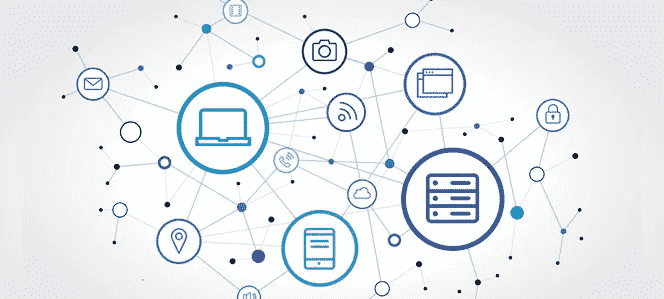

# 什么是物联网？

> 原文：<https://medium.datadriveninvestor.com/what-is-the-internet-of-things-e3458670720b?source=collection_archive---------28----------------------->

物联网，通常被称为 IoT，是一个已经存在了很长时间的概念。一般来说，物联网设备是指任何由电力驱动并连接到互联网或相互连接的设备，用于控制或交换信息。基本上任何有电源按钮的东西都可以是物联网设备。冰箱、烤面包机、照相机、汽车、早上给你煮咖啡的鲁布-戈德堡咖啡机，只要这些东西被配置为能够连接到互联网并通过互联网被控制，那么它们就是合格的。为什么电脑或智能手机不在那个名单上，尽管它们仍然是“东西”？这是一个有点令人困惑的区别，但一般来说，智能手机或平板电脑等东西不被认为是物联网设备。他们主要作为中间人将一个人连接到互联网，他们不是为了自己的目的而连接。一旦了解了物联网的历史背景和当今的应用，区分这两者就变得更加容易了。

当然，物联网的历史，就像互联网上几乎所有东西的历史一样，总是从第一个电子通信设备——电报开始。由塞缪尔·莫尔斯和其他几个人在 19 世纪 30 年代发明，为今天的远距离通信铺平了道路。然而，第一个真正的互联网连接设备是 1982 年卡内基梅隆大学计算机科学系的一个不起眼的可乐机。学生们厌倦了走到机器前却发现它是空的或者更糟，里面装满了热汽水。他们设计了一个系统来读取机器上的指示灯，然后将它连接到 ARPANET(今天互联网的前身)上，并在将其离线前维护了几年。即便如此，物联网这个词直到 1999 年才被一个当时为宝洁公司工作的人创造出来。凯文·阿什顿(Kevin Ashton)在一次关于 RFID 的演讲中创造了这个术语，他认为 RFID 将成为这个概念演变的一项重要技术。从那时起，这个领域发展到包括人类生活的几乎所有方面。家庭使用、建筑、制造、环境监测和运输只是为物联网产品和想法找到家园的少数几个行业。

互联网连接设备的应用非常广泛。几乎社会的每个方面都已经受益于或可能受益于物联网设备。智能家居是大多数人都熟悉的例子。苹果 Homepod 连接到灯、安全摄像头、恒温器和前门，是一个大的物联网系统。尽管人们可能认为物联网是小型家用设备，但许多行业都在使用它。农业可以利用互联网连接设备来监测土壤和水质，以确定种植作物的最佳时间。如果牧羊犬戴的耳标里有 GPS 追踪器，它就没有必要去嗅出丢失的羔羊。医疗应用对患者和医生来说都很重要，因为它们可以实现更多的家庭护理。患者可能需要留在医院，以便专业人员可以监控他们的仪器读数，他们可以在自己家中舒适地康复，除非他们连接互联网的监控器确定他们需要接受治疗，从而腾出医院床位和医生来治疗更有风险的患者。甚至政府也可以加入到这一行动中来，比如联网的公交车，乘客可以实时跟踪，或者停车传感器和仪表，告诉司机他们想要的目的地是否有停车位。所有这些用途都是通过不同的技术来实现的，这些技术可以一起使用来使其发挥作用。

如果你要描绘出让物联网设备工作的技术，它们通常会分为三个层次:远程、中程和短程。远程将是你所知道的互联网，以及使其工作的技术——以太网或电力线通信。如果没有远程技术，物联网将无法用于控制远程设备。中程技术是覆盖无线设备一定距离的 LTE 和蜂窝网络。短程技术举不胜举:Wifi、蓝牙、NFC、QR 码和 RFID，仅举几个最常见的例子。这些是“最后一英里”技术，这些技术多种多样，适应性强，能够将完全不同的机器连接到互联网上。尽管这些不同的技术有时会产生问题。

至少在美国，没有专门针对物联网设备的官方法规。联邦贸易委员会认为目前围绕计算机和电子设备的消费者保护已经足够。该机构确实发布了一些关于物联网设备的建议，但没有发布实际的法规。指导方针非常简单。

关于数据安全:

> “合理和适当的安全实践对于解决数据泄露问题和保护消费者免受身份盗窃和其他伤害至关重要。在违规发生后通知消费者有助于消费者保护自己免受任何可能因滥用其数据而导致的伤害。这些原则同样适用于物联网生态系统。”

关于数据同意:

> “因此，委员会工作人员再次建议国会考虑颁布广泛的(而不是特定于物联网的)隐私立法。这种立法应该是灵活的，技术中立的，同时也为公司提供明确的道路规则，如何时向消费者提供隐私声明，并为他们提供关于数据收集和使用做法的选择。”

关于数据最小化:

> “…考虑到信息收集的无处不在、物联网可能带来的广泛用途、参与收集和使用信息的众多公司以及一些争议数据的敏感性，这些担忧渗透到了物联网领域。”

除了安全和隐私问题，缺乏监管意味着许多物联网设备不能协同工作，如果不首先购买 Homekit 这样的整个生态系统，像智能家居这样的概念很难实现。如今，很难在不同的灯泡之间进行挑选，而不会遇到一些不同的兼容性问题。

联邦贸易委员会及其保护的消费者对安全和保障的担忧是正确的。在那些想卖给你这些东西的公司里有一些高调的隐私泄露事件。即使从技术上讲隐私没有被侵犯，消费者看到自己的数据及其原因仍会感到惊讶。例如，一些使用 CPAP 机器的人最近发现，不仅他们的医生对他们的夜间使用数据保密，他们的保险公司也是如此。这些机器可以帮助一个人正确呼吸，并在晚上获得更好的睡眠。其中一些保险公司利用患者的依从性数据来提高保费或完全停止支付治疗费用。

甚至从无意义的设备上收集数据的行为也很猖獗。值得注意的是，成人玩具公司 We-Vibe 在 2016 年被成功起诉，索赔 375 万美元，此前客户发现该公司正在收集有关玩具使用方式的非匿名数据。如果有恶意的一方获得了这些数据，他们就会偷窥购买这些玩具的人的性生活。

物联网设备的安全问题有时从一开始就内置在设备中。它们通常带有默认的用户名和密码，许多消费者从不更改，很容易被外部入侵者猜到。到目前为止，整个互联网都已经听说了这样一个故事，一个家伙在晚上进入一个家庭的婴儿监视器，对着孩子尖叫。你可以想出任何数量的使用物联网设备可能出错的可怕事情。你门上的智能锁是怎么回事？如果一个足够聪明的人能够知道如何进入那里，如果没有足够的安全措施，他们实际上拥有成千上万个家庭的钥匙。小偷可能不再需要知道如何通过电线发动汽车把你带出车道，他们需要的只是一部智能手机，这辆特斯拉从英国埃塞克斯的一处住宅被盗就是证明。

物联网设备因其连接性而变得更加方便，但并不总是更加安全。我期待它们能给人类带来进步，但我也非常关心生产它们的公司花时间真正思考它们带来的影响，不仅仅是产品，还有它们带来的数据收集和隐私侵犯。我有朋友因为他们的智能家居系统需要升级而无法开灯——想象一下烟雾探测器的类似故障。希望行业能在这之前解决这个问题。

# 来源

 [## 物联网简史——数据大学

### 物联网(IoT)出现的时间并不长。然而，已经出现了机器的幻象…

www.dataversity.net](http://www.dataversity.net/brief-history-internet-things/) 

https://www.cs.cmu.edu/~coke/history_long.txt

 [## 那个“物联网”的东西- 2009-06-22 -第 1 页- RFID 期刊

### 在现实世界中，事情比想法更重要。-第 1 页

www.rfidjournal.com](https://www.rfidjournal.com/articles/view?4986)  [## 你打盹，你就输了:保险公司让那句古老的格言变成了事实

### 数百万睡眠呼吸暂停患者依靠 CPAP 呼吸机来获得良好的夜间休息。健康保险公司使用…

www.propublica.org](https://www.propublica.org/article/you-snooze-you-lose-insurers-make-the-old-adage-literally-true)  [## 振动器制造商因声称秘密跟踪使用而支付数百万美元

### We-Vibe 是一种可以与应用程序配对进行远程控制的振动器，其制造商已经达到了…

www.npr.org](https://www.npr.org/sections/thetwo-way/2017/03/14/520123490/vibrator-maker-to-pay-millions-over-claims-it-secretly-tracked-use)  [## 据称，黑客被拍到盗窃特斯拉 Model S，试图拔掉充电器

### 特斯拉车主安东尼·肯尼迪声称他抓拍到一些偷车贼闯入他的特斯拉的精彩镜头…

gizmodo.com](https://gizmodo.com/hackers-allegedly-caught-on-video-stealing-tesla-model-1829905478)