# 什么是头脑

> 原文：<https://medium.datadriveninvestor.com/what-is-the-mind-b59d639b6c06?source=collection_archive---------5----------------------->

人类最重要的科学问题之一是这样一个问题:“心是什么？”。一个人如何思考，如何决策，思考是如何发生的，对各种外界刺激的分析和解释等。

Rene Descartes

反射通常被认为是对刺激物的反应，这个概念很简单。它是在公元 17 世纪由勒内·笛卡尔引进的。笛卡尔提出神经系统是一种液压结构，具有充满“动物精神”的“神经管”，当它们被应用于它们时，它们首先移动到大脑，然后，也沿着管移动，作用于肌肉，使它们像液压执行机构一样收缩。reflex 这个词来自拉丁语，意思是反射，它的本质在下面的方案中得到了很好的反映，这个方案仍然保留了它的相关性。

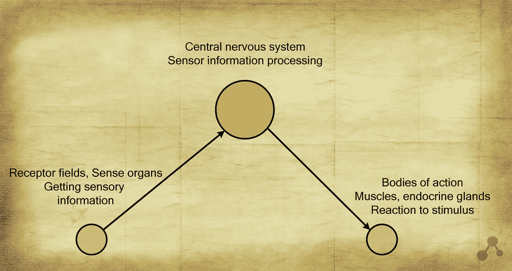

刺激物作用于感觉器官的受体，受体在神经冲动中解释这些效应，信号进入中枢神经系统，大脑，在那里它们被适当的神经元链处理(反射),然后发生相应的反射反应，肌肉收缩或腺体分泌。

但是这个方案不足以解释许多形式的目标行为。毕竟，合乎逻辑的说法是，如果我们停止发送感官信息，那么就停止了神经活动。对于神经系统相对简单的动物来说，确实如此，比如一只青蛙切断了上行神经通路，那么她的大脑就好像陷入了梦境，不会产生任何神经活动。但是如果对猫进行同样的研究，那么就有可能发现导致行走的神经活动。

在一个人身上，为了测试笛卡尔的假设而进行的部分切割脊髓的手术并不是出于伦理原因，但是美国心理学家蒂莫西·利瑞在特殊的剥夺室中进行了实验。Leary 感觉剥夺室是一个装有特殊盐溶液的浴缸，它使实验体的身体保持漂浮。该室与外部声音和光隔离，溶液的温度根据体温调节和选择。美国物理学家理查德·菲利普·费因曼在他的自传书中写道:“你在开玩笑，费曼先生！”通常理查德睡着了，但碰巧他正在经历一些灵魂出窍的经历。一般来说，在没有刺激物的情况下，不能说神经活动完全停止。

因此，笛卡尔的方案是错误的，存在着超越反射活动的东西，一种思维，或者一个思维过程。—不！是真的，只是需要补充。

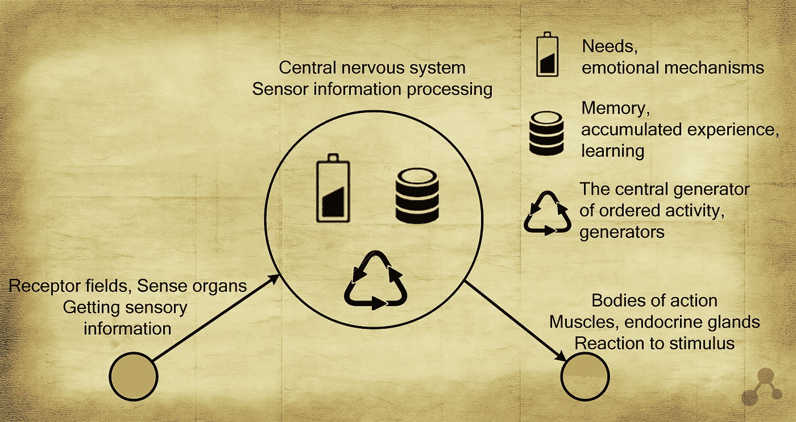

首先，笛卡尔方案没有考虑到需求和情感机制。例如，食物饥饿可以引起相应的“需求细胞”的活动，它们的活动可以导致某些反射的激活，从而导致有针对性的行动来满足对食物的需求。我们的需求是积极行动的来源，它产生于中枢神经系统本身。下丘脑中的神经细胞具有对瘦素及其缺失作出反应的受体。瘦素由脂肪细胞产生，是机体营养水平的指标。因此，如果我们将中枢神经系统与身体隔离，由于缺乏瘦素，中枢神经系统的活动也会增加。

对新奇事物的需求根本不会影响外围，相应“需求细胞”的活动水平取决于中枢神经系统本身的活动性质，中枢神经系统本身创造了一个活动源，旨在寻找新信息、学习新材料、阅读书籍或在手机和平板电脑屏幕上滑动一个手指。

未满足需求的“需求细胞”的活动可以被利用——这被称为升华。特别是，西格蒙德·弗洛伊德将升华描述为将性能量重定向到一个有用的渠道。一些有创造力的人被认为具有很高的创造力，因为他们利用神经活动来摆脱未被满足的需求或无法摆脱的痛苦。

其次，神经系统有一个独特的属性——记忆。我们知道这不仅仅是某处记录的信息，而是系统的某种重组。我们可以说，每处理一个新的外部信号，我们就在处理一个新的系统。正如赫拉克利特所说:“你不能两次踏入同一条河”。因此，在描述神经系统时，有必要考虑时间因素。反射不仅仅是对刺激物的反应，它是对刺激物的反应，考虑到接受刺激的整个历史。例如，我们有两个双胞胎，他们的神经系统，在他们的结构非常相似，但在成长过程中，他们用名字称呼其中一个——迈克尔，另一个——大卫。如果我们用同样的刺激作用于他们的神经系统，问题是:“你叫什么名字？”，我们得到各种各样的回应，答案分别是:“迈克尔”或“大卫”。从外部刺激和身体信号获得的数据的历史，以及系统的初始设置决定了在给定时间对刺激的反应将产生神经系统。

第三，发电机。发生器在思维过程中起主要作用。发生器是一个神经元链，其中发生神经兴奋的循环传递。可以说，发电机本身积累了激励，可以成为激励的来源。例如，有序活动的中枢发生器，它在没有反馈的情况下提供有节奏的有序运动信号。

神经系统模拟器中发生器的实现；

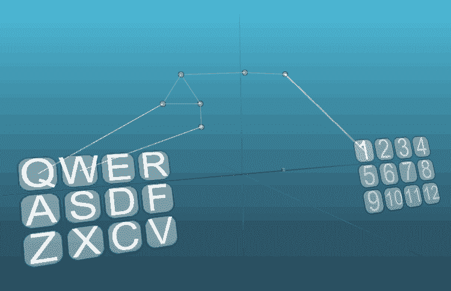

简单的发电机电路:

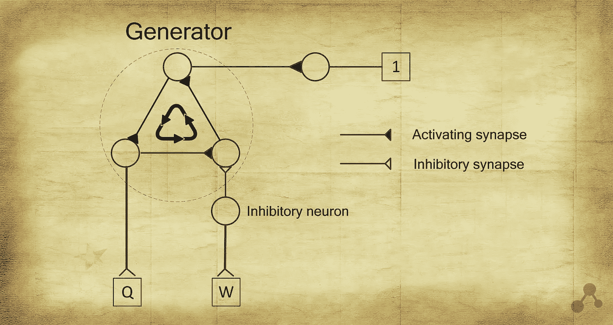

发电机是一个由一连串神经元组成的闭合电路。发生器从受体“Q”的激活开始，并通过抑制神经元由“W”受体停止，抑制链中一个神经元兴奋的开始。这种闭环可以是激励源。这个神经网络说明了一个简单的反射行为，但同时在发生器激活期间，一些行为在没有刺激的情况下发生。

这是什么，反射还是思考？一些研究人员更喜欢将与神经活动积累相关的现象称为思维，但对我来说，反射这个术语不那么抽象，它甚至意味着兴奋从神经细胞到细胞的转移。因此，我们将使用术语反射和反射行为，这意味着反射并不总是需要刺激物，发生器可以是兴奋的来源。

发生器在进化上很早就出现在神经系统中，主要用于在运动和执行某些植物功能时产生肌肉的周期性收缩。

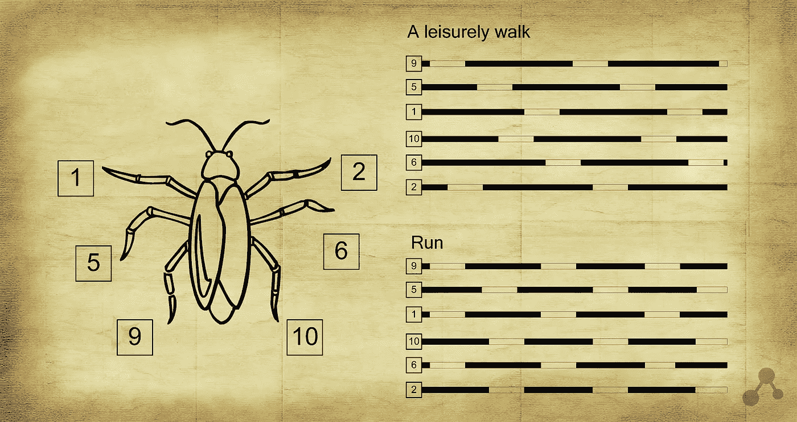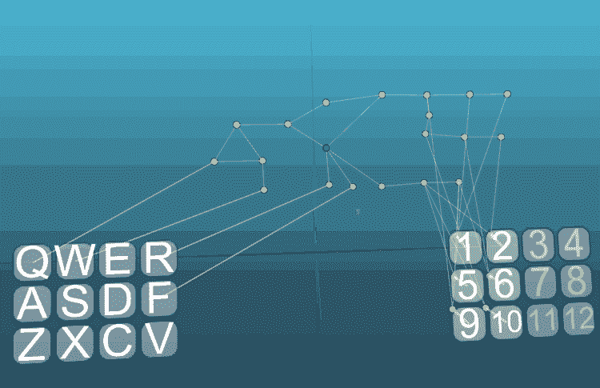

典型的蟑螂有两种运动方式(空间运动):从容不迫的行走和奔跑。当蟑螂在寻找食物和研究周围空间时，它会慢慢地一条一条地移动它的腿，一系列神经元——由负责感觉饥饿(Q)的细胞激活的发电机——可以作为这些动作的循环神经活动的来源。这条链的禁用可能是蟑螂受体分析器的抑制效应，如果受体指示食物的存在，那么就不应该再进一步(W)。遇到危险，蟑螂可以选择更快的移动方式。半夜厨房里的灯光会刺激激活 run (R)的神经元链。在上述电路中，一个调制神经元(绿色)用于开关，它的活动表明蟑螂处于恐慌或紧张状态。在调制动作结束或其它有利因素的影响之后，不均匀蟑螂系统切换回“悠闲散步”模式(F)。

当然，这个方案只是展示了生物神经网络组织的一些原理，并不是对蟑螂神经系统的解释。蟑螂的神经系统要复杂得多，它有成千上万的神经元，当然，行为也有很大的可变性。

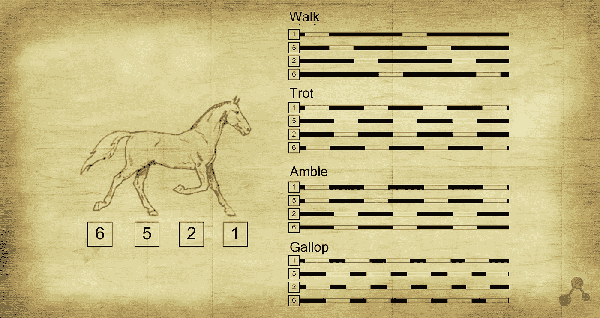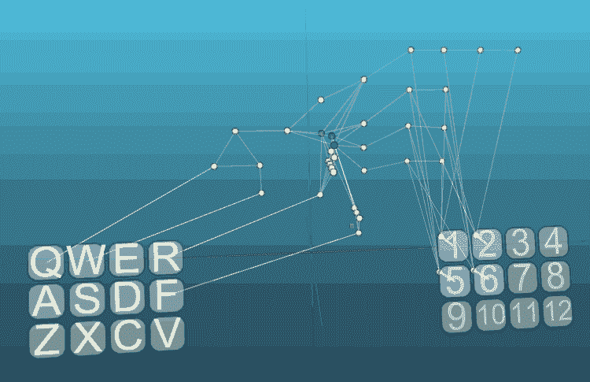

与昆虫相比，四足哺乳动物增加了步态选择的数量。在这个例子中，步态类型的变化发生在两个刺激“R”和“F”的帮助下，当刺激“R”被重新激活时，从“步行”到“小跑”、“缓行”和“疾驰”的过渡发生在“F”阶，一种传输的增加和减少。当然，像走路这样复杂的动作不能简化为发送到四肢的单向信号。每个肢体由一组伸肌和屈肌控制，反过来，每个肌肉被分成单独的运动单元，并且都需要给出它们同意的信号。还有反馈，在肌肉疲劳或受损的情况下，需要反馈来纠正命令。理论上，这个模型可以复杂到无限接近生物模拟。

除了哺乳动物神经元链中的运动程序外，还有一个独立的神经中枢可以纠正运动单位的工作——这就是小脑。

从对动物行为的观察可以清楚地得出结论，在神经系统中，包含在神经元链中的各种行为模式之间必然存在转换的可能性。例如，雄性有袋鼠(lat。交配期间(每年一次)会彻底改变它们的行为。忽视对食物和水的需求，不节省能量，寻找雌性或交配 6 至 12 小时，之后，失去所有的力量，死亡。由于神经元和突触的调节特性，这是可能的。某种激素组合的效果对小鼠神经系统中的神经元链开关有调节作用，因此小鼠对先前的刺激有不同的反应，在这种情况下，除了繁殖的需要之外，完全忽略了它的其他需要。

即使当我们改变我们的情绪，当我们管理注意力和注意力时，调节也起作用。如果你的神经系统受到腹侧被盖区多巴胺神经元活动的调节，情绪就会变得积极，能够享受生活，移动和学习新的东西，否则你甚至不想移动。

反射成为一个越来越复杂的概念:发电机、记忆、需求和开关——真的只有这样一个简单的东西才能支撑人类思维的伟大，意识能够了解周围的世界和自己以及自己在这个世界上的位置。

为了更深入地回答最重要的问题，我们考虑神经系统的机制与精神图像。

神经系统中的图像是定义明确的神经元的活动，在关于记忆的文章中我们看到了自组织是如何发生的以及神经细胞的专业化，这是基于神经组织兴奋的相互作用。神经元为自己选择的角色由它的位置和处理数据的历史决定。兴奋源相对于神经细胞的位置是重要的，它们将是“符号”概念的反映。

处理后的标志或标志组导致图像的形成或激活。该图像反过来可以产生信号，该信号将是导致另一图像发射的标志。因此，我们可以谈论图像的某种层次，我们可以识别图像或抽象的层次。每一个随后的抽象层次将越来越少地与感知器官的某些受体的活动联系在一起。作为不同复杂性的图像分析器，可以将抽象水平与皮层的不同区域的划分进行比较。

标志可以同时属于几个不同的图像，并且考虑到相似图像的相互竞争，激活特定图像的决定性条件是标志的例外组合。通常，图像的形成需要不同性质的符号的参与，例如，对于我们大脑对物体的视觉识别，我们需要使用发送到控制眼睛位置的肌肉的命令，作为符号，以及一些简单的图像。

从事绘画的人都知道，要画一幅肖像而不打乱脸部元素的位置是非常困难的。我们看到一张脸，我们把它画成一系列独立的图像:嘴唇，嘴角，眼睛，鼻子。我们画的这张脸也能被感知。因此，在绘画学校，建议最初创建一个特定的轮廓，一个由细线组成的骨架，它将决定面部元素的位置。

有些脑损伤是指人们不能完全识别物体，只能感知个别的迹象。美国神经病学家和作家奥利弗·萨克斯在《把妻子当成帽子的男人》一书中描述了类似的病理。

作为面部元素的图像的特征的组合，以及作为这些元素的距离和位置的估计的迅速扫视的大小，允许我们解释为什么我们容易识别扭曲的或漫画式的脸。

伸出你的手在你面前，竖起你的拇指，一个直径不大于你拇指的区域对应于我们的视觉系统可以非常清晰地感知的视觉区域，其余的外围区域，你可以说，清晰度很低，很模糊。但是我们觉得我们感知的视觉区域要宽得多，这不仅是由于迅速扫视，而且是由于我们大脑的能力，特别是视觉分析器，将感知的图像“粘合”起来。这种大脑功能的工作中断会使生活中的人几乎失明。

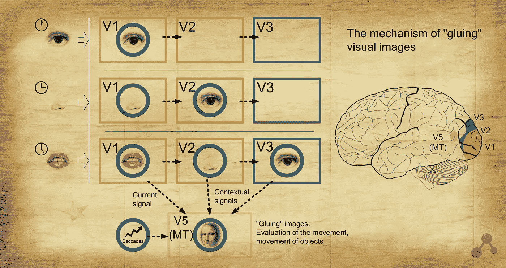

每秒 24 帧是标准电影放映的速度，因为在这个速度下，我们的视觉无法捕捉到帧偏移。我们的大脑处理信息不是分散的，而是连续的。假设对于信息处理的每个阶段都需要花费一定的时间，那么就会出现这样一种情况，即不同相关度的信息流可以被一起处理。例如，被称为中颞皮层 V5 (MT)的区域直接从初级视觉信息处理的三个区域 V1、V2 和 V3 接收一些信号形式的信息，这些信息在这些区域中被顺序处理。因此，落入中颞皮层的最相关的信息是来自 V1 区域的信息，来自 V2 和 V3 区域的信息在更早的时间是相关的。如果信息来自大脑的三个区域，它会以一定的方式不同，并且没有迅速扫视的命令，那么我们可以谈论物体的可能运动，但是如果眼球运动，那么我们可以得到物体形状的想法。还有，V5 区可以用来评价视觉信息的新颖性；如果信息在这些区域是静止的，那么是时候进行新的眼球运动了。

我们的视觉感知系统是基于几种并行工作的方法，一些方法快速但不准确，另一些方法更好，但需要时间以专注于物体细节的形式收集信号。

视觉区 V5 的例子显示了大脑如何处理环境，但这里我们谈论的只是兴奋通过皮层传播的几分之一秒。在神经系统中，有一个非常简单的机制，允许你留下一个已经处理过的信息的“轨迹”，作为上下文在后续处理中使用。

人们很容易认为神经系统中的信息处理是从一个区域到另一个区域顺序进行的，信号不会返回到它的来源，但实际上大脑的结构和结构表明了相反的情况。例如，所有的感觉路径都经过丘脑，经过丘脑核，在到达皮层之前，几乎所有向皮层发送信号的丘脑细胞(90%)都接收到反向信号。而这种倾向是整个大脑的特征，V1 视觉分析器与 V2 区成反比，依此类推。这就产生了脉冲混响作为暂时记忆机制的理论。在我看来，这只是部分真实。发电机可以是即时记忆的组成部分，这种记忆是在执行基本动作时所需要的，例如在我们听到电话时拨号。瞬间记忆持续几秒到几分钟，在前额叶皮层的回响最长，可达几分钟，丘脑和分析感觉信息的皮层区域之间的回响持续几分之一秒或几秒，在抽象水平较高的地方，这个时间会增加。总回响创造大脑节奏。

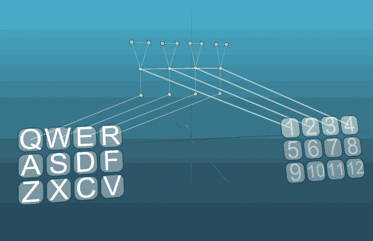

发生器作为记忆细胞工作的主要原因是存在侧抑制。侧抑制是在神经系统中广泛存在的另一种机制，从视网膜和其他感觉系统到神经节和皮质。这个系统让我们看到越来越清晰，从噪音中选择重要的声音，不混淆图像。上面的 gif 展示了四个生成器元素的示例；每个发电机的运行会抑制其他三个发电机的活动。正如你所看到的，这工作得很好，在突触和一般的网络结构中没有变化，但我们可以肯定地说四个信号中的哪一个是最后被激活的。

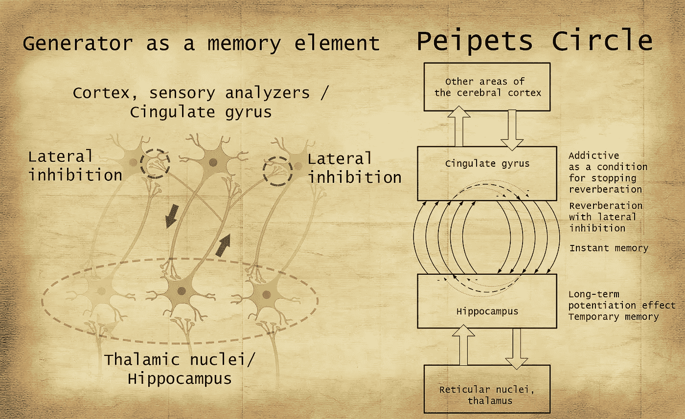

现在想象一下，在分成皮层柱的皮层上有一个传感器地图，每一个柱通过侧抑制作用于它的邻居。这种吠叫通过丘脑核从感觉器官的受体场接收复杂的活动模式，混响发生，在此期间这种模式被修改。弱的和非典型的信号被抑制，对于给定的特征组合，形成更典型形式的图像；这可以与循环网络中的计算方式进行比较，但要简单一些。

如果来自受体场的后续信号略有不同，则主动激励电路的模式将相当稳定。令人惊讶的是，神经系统中的一切都是相互联系的，一种机制与另一种机制交织在一起，一种记忆元素也可以是信息处理的元素。只有对整个系统的全面描述才能给出其单个机制的更准确的含义。

神经系统中另一个非常重要的传输回路是 Peipets 环(丘脑前核-扣带回-海马体-再次是丘脑)，这个回路与边缘系统其余部分的情绪中心密切互动。一个与众不同的特征是海马，在海马中发现了最大浓度的具有长时程增强的神经元。长时程增强是神经元之间突触传递效率的增加，持续时间从几分钟、几小时甚至几天。这种增强是由于从突触后膜上的某些受体释放镁塞而发生的，因此这种情况的发生，动作电位沿神经元膜的反复频繁通过是必要的。我们可以说，通过参与海马神经元的回响，海马神经元变得更加敏感，并且在一定时间内需要较少的冲击来激活。反过来，扣带回的神经元，像其他大部分神经元一样，受制于习惯化原则，随着长时间频繁激活，它们的敏感性在一段时间内下降。如果一个电路元件停止响应一个信号，那么混响停止。海马体负责暂时的显性记忆，这反映在其神经元的长时程增强中。我们一整天都在使用这种记忆，在睡眠过程中，以长时程增强为标志的兴奋传递回路发生了额外的“贯穿”。

佩佩茨圈与情绪中心密切合作，这些中心决定海马体对哪些信息做出反应，调节其神经元的敏感性。

显然，在进化过程中，有序活动的中枢发生器变得更加复杂，增加了越来越多的兴奋传递回路，发生器之间相互作用的条件增加了，分支增加了，周长增加了。就这样，大自然造物的皇冠形成了——人脑。像以前一样，所描述的过程可以被称为反射活动，尽管反射的结构已经变得复杂得多，但它仍然可以被系统地描述和理论建模。

人脑有一个独特的发生器——这是一个言语圈。

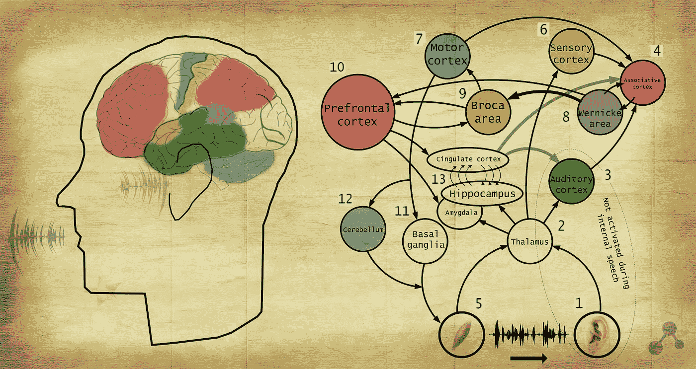

言语环是一种电路，用于将来自听觉传感器和肌内敏感度的信息传输到大脑皮层的言语分析器区域，然后传输到言语再现区域，进一步传输到言语装置的肌肉，言语装置的工作又激活了某些感觉系统，并且在信息的循环过程中存在持续的修改。

简化选项:

听力(1)、肌肉敏感度(5)>韦尼克(8)>布罗卡(9)>肌肉活动(5)

在大声发音的过程中，两个感觉系统被激活——这是听觉(1)和发音器官肌肉的肌肉敏感性(5)。此外，这两个系统实际上同步解释同一个信息。

所有的感觉信息都通过大脑中的一个区域——丘脑(2)。丘脑是神经结或丘脑核的集合，这些神经结或丘脑核是神经元的组和簇。人的丘脑是一个对称的结构，有 40 到 60 个核。丘脑不仅仅是将信息进一步传输到大脑的更高区域，而是在注意力集中方面发挥着重要作用，它就像一个看门人，站在信息流的入口处，评估哪些信息应该跳过，哪些应该忽略。神经系统是这样安排的，它只在大脑活动的某一水平上正确工作，因此丘脑核之间的相互抑制起作用，这形成了集中机制。例如，专注于听觉会抑制触觉。丘脑中的注意力以两种方式调节:“自下而上”和“自上而下”。“自下而上”的路径是动物从出生就有的，我们不可避免地会被响亮的声音、新的声音、疼痛、难闻的气味等吸引。这些信号与增加(调节)相应丘脑核敏感性的反射行为有关。“自上而下”的路径通常是一种较弱的注意力控制，从前额叶皮层开始(10)。我们可以通过我们的欲望和意志，将注意力集中在某些感官上，甚至集中在皮肤的某个部位上，但与此同时，一个响亮的声音仍然会转移我们的注意力。当然，任何事情都可以通过训练来解决，有一些实践可以让我们发展注意力管理。

已经在丘脑的水平上，可以对信息进行情绪评估，例如，一个响亮而意外的声音可以激活杏仁核，并引起恐惧的感觉。本能地，孩子的哭声让我们不愉快，孩子的笑声当然会唤起一种喜悦的感觉。

在丘脑(2)之后，信息路径分布在相应的区域(皮层的代表)之间，来自听觉器官的信息进入听觉皮层(3)，并从肌内感受器进入感觉皮层(6)。在这些区域中，形成了初级抽象水平的图像，然后这些图像的一部分合并到关联皮层(4)中，并且来自运动皮层(7)的命令图像的副本被添加到发声装置的肌肉中，所有这些图像将是转移到韦尼克区域(8)的标志。

韦尼克区(8)负责语音感知。韦尼克区受损的人可以有很好的听力，识别和区分不同的声音，但不能理解讲话，包括他自己的讲话。如前所述，两个感觉系统:听觉和肌肉敏感性同步形成解释同一信息的图像，但来自两个系统的总图像是由 Wernicke 场感知的，更准确地说，应该添加三个，并将命令从运动皮层复制到发声装置的肌肉。如果来自听觉的感觉信息被停止，只有肌肉的敏感性保留，那么韦尼克场仍然会“听到”这个语音，这些获得的图像的关联连接非常强，对于关联皮层来说，什么特征将形成图像并不重要。

一个人不断进行内心独白，他的特点是语言器官的肌肉收缩非常弱，不会导致声音的发出和一般可见的运动，但足以用肌肉感受器固定这些收缩。在 Wernicke 场(8)和关联外壳(4)之间产生回响，这提供了一些信息和关联链接的上下文。

韦尼克区(8)的图像作为信号通过弧形光束(一种神经丛)传输到布罗卡区(9)。布罗卡区(9)——大脑皮层中负责语言再现的区域。当布洛卡区受损时，一个人可以完美地理解别人的讲话，但当试图说话而不是讲话时，口齿不清的声音就会重现，或者有可能只播放一个单词。但布罗卡场对声音的感知也很重要，这体现在该区域的严重失败上。轮廓:布罗卡场(9)、运动皮层(7)、联想皮层(4)和韦尼克场(8)对形成单词的音链很重要；反过来，单词链形成短语和句子。

说话时，布罗卡场(9)与前额叶皮层(10)的反射有关。旋转前皮层是大脑皮层的一个非常广泛的区域，是她负责理解在给定的时间点正在发生的事情。额叶前部皮层参与的回响和它本身决定了瞬间记忆，当我们将它们保持在我们的注意力范围内时，在执行特定动作的过程中必要的信息记忆，持续大约几分钟。此外，我们的前额叶皮层(10)可以对情绪中心产生抑制作用，从而减少它们对我们行为的影响。

前额叶皮层的损伤会使一个人更加冲动，变得容易犯罪，行动变得不那么深思熟虑和理性。可以说，只是由于前额叶皮层的持续活动，我们才不服从我们需求的第一个召唤，例如，在重要会议中排空膀胱的愿望，但允许我们看透它，并在正确的地方做任何事情。情绪中心的管理允许你决定在宠物圈里储存和处理什么信息。请注意，来自丘脑(2)的信息不仅落入分析器区域，而且有趣和有用的信息也在这里的带状脑回中储存更长时间。

内部言语中言语圆的主要轮廓开始于言语器的肌肉(5)，然后是丘脑(2)，感觉皮层(6)，联想皮层(4)，韦尼克氏场(8)，然后是布罗卡氏场(9)。反过来，布洛卡与前额叶皮层(10)进行“交流”，并向运动皮层(7)发送命令。运动皮层(7)向基底神经节(11)发送命令，并向小脑发送这些命令的副本(12)。小脑(12)纠正运动皮层的命令，在时间上更加和谐和协调地划分运动单元的工作。小脑的损伤会导致说话速度变慢，因为运动动作的形成变得更加困难。基底神经节形成了发声器官肌肉的最终指令形式(5)。

非常复杂的发电机。

重要的是要注意，在内部言语的言语圈中有一个“物理基础”——肌肉活动。这使得内部语音受到控制，例如，在睡眠期间，所有肌肉的音调水平降低，这通过肌肉敏感性剥夺了内部独白的反馈，因此只有小轮廓是可能的(8，9，7，4，8)。前额叶皮层(10)不知道的是，在睡眠过程中，当情绪中心的抑制作用下降时，佩佩茨圈(13)被激活，并触发可能导致白天情绪评估增加的图像，这就是梦的产生。在他的著作《梦的解析》中，西格蒙德·弗洛伊德非常成功而准确地描述了梦的原理。可见的梦的基础是一个简单的短语或句子，它在入睡的时候对我们来说具有显著的价值，但我们听不到它，而只看到在它的基础上解释的视觉图像。如果没有“物质基础”的帮助来进行额外的控制，一个短语很可能会变成一句废话。

言语是一种工具，它让我们能够传递和积累信息，宣布和计划行动和事件，多亏了这种工具，人类才能够创造文明。我们思维的主要形式是内心演讲、内心独白，在这种独白中，我们大部分时间都用于社会互动，通过即将到来的对话或想象的对话进行工作，例如，我们下班回家，可以预测我们会在会议上对我们的妻子(配偶、母亲、兄弟、朋友)说什么，她(他)会回答我们会回答什么。如果你不是一个翱翔在云端的哲学家-思想家，这些平庸和世俗的事情会不断地被我们的头脑占据。言语让我们可以用某种符号和意义系统来表达生活的方方面面。发达的语言是人类区别于动物的显著特征。

现在，有了大脑如何工作以及语言是如何在大脑中形成的概念，我们就可以回答这个问题:“什么是思维，它定位在哪里？”。

我们的神经系统是一个单一的整体机制，可以分为独立的功能部分。选择单个的神经元链，执行特定任务的神经网络，例如，你可以选择感觉分析器，或者像上面的例子一样，轮廓链负责语音。我称这些功能性神经网络为“个性”，因为这表明它们具有一定的独立性。通常情况下，健康神经系统中的这些人格会交换信息，他们互相告知对方此刻正在做什么，此刻正在发生什么。这是因为大脑各区域之间有大量的联系。个性在合作中行动，好像这是一个协调的团队，没有人试图与团队作对。原因就是简单的联想学习，同时发生的事件会联合起来。

人类神经系统中神经元形成的方案和它们之间连接的配置可以分为非常小和简单的方案，但我们将只选择几个基本的方案。首先，可以区分感觉分析器，对于不同类型的感觉信号，定义它们的结构。对于视觉信息，这些是丘脑视觉核和大脑皮层的枕叶部分。谣言——颞叶中的区域，感觉信息——这些是皮层的顶叶区域，味觉是岛叶中的一小块区域，嗅觉是嗅球和颞区中的一小块区域。这些神经网络的任务是对感觉信息进行初步处理，作为工作的结果，形成特定的图像并将其传输到皮层的关联区域。联想皮层连接各种图像，从分析器形成基于它们的图像，这个区域负责对周围世界的感知，正是这个区域形成了我们周围世界画面的完整性。也有神经元链能够描述、声明由关联皮层形成的图像，它们位于 Broca 和 Wernicke 区，但语音机制可能延伸到这些区域之外。负责做决定的区域是前额叶皮层，我们内心语言形式的想法是前额叶皮层和布洛卡区域之间的回响。此外，可以分离出负责运动动作的区域，这些区域服从一定的等级，在运动皮层的头部，然后是基底神经节和小脑，基本运动的形成在网状结构和脊髓中是可能的。但同时，如果没有来自上面的命令，这些编队中的神经网络可以完全独立。

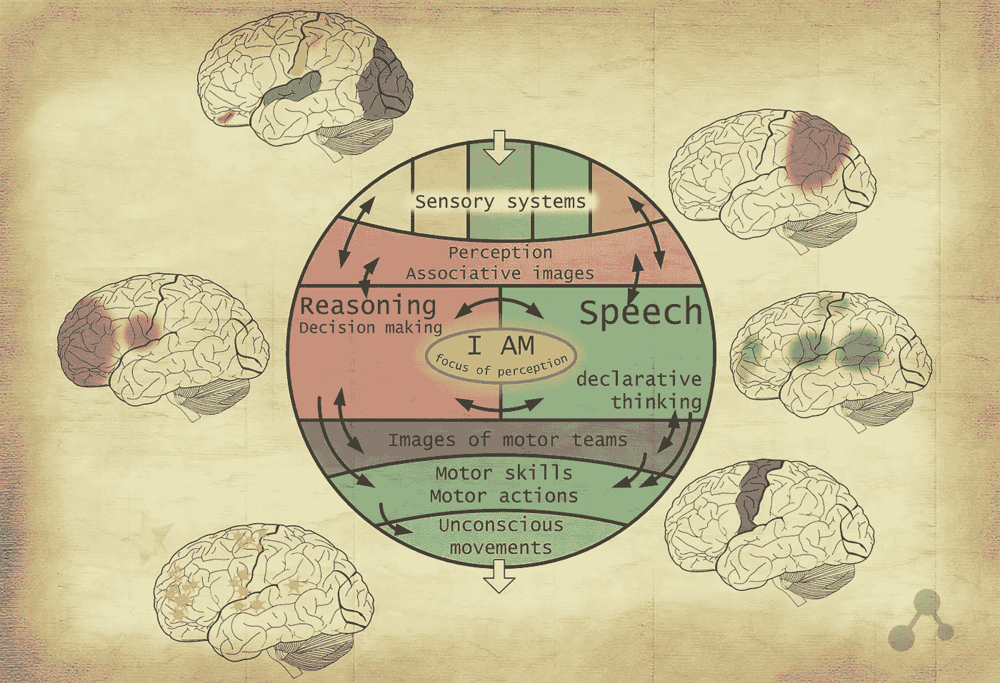

就像只有在有电的情况下才能执行其功能的电路一样，生物神经网络只有在神经兴奋的情况下才能运行。而这里是最有趣的！这种神经兴奋仅限于神经回路。碰巧的是，只有当神经组织的活动保持在一定水平时，大脑才能正常工作，增加的活动会导致癫痫发作，减少的活动会使大脑陷入睡眠。活动水平由丘脑通过对传入信号的过滤以及由皮质中的侧向抑制/诱导机制来调节，并维持在某一水平(范围相当宽)。因此，大脑中的神经活动是一种分布在神经回路中的资源。当然，这种分布是不均匀的，取决于功能特征，例如，视觉分析器需要很大一部分神经兴奋作为处理来自受体的大量数据的资源。在前额叶皮层、联想皮层和负责说话的区域之间分配神经兴奋——这就是我们的“我”,我们的意识，我们的思想。

勒内·笛卡尔一直在寻找至少一个不成对的大脑结构，结果认定它是脑干后面的一个小松果体(骨骺)——是灵魂的容器，因为他认为灵魂是不可分割的东西。自古以来，许多心理学家和哲学家都认为意识是完整的、不可分割的、永恒的。毕竟，我们的大脑极其令人信服地创造了这种错觉。但结果是骨骺由对称的两半组成，几乎相互成镜像关系。

思维是难以置信的分裂的本质，取决于单个神经元的活动。在某些情况下，神经活动可以集中在大脑的某些区域，例如，在解决复杂的逻辑问题时，需要强调前额叶皮层，而在放松不作为时，兴奋则分散在整个皮层。当我们去描述我们的主观感觉时，感知的焦点“转移”到言语区域，因此我们只能完美地描述“陈述自我”。当感知的焦点强烈转移到前额叶皮层时，意识就离开了言语描述的区域。可以算出来，心灵是服从一个内心独白的东西，但是我们做很多决定都没有内心言语的参与。

心灵的本质是什么有助于理解大脑中的各种病理学。

胼胝体切开术是一种解剖胼胝体的手术，胼胝体是大脑的一个区域，是连接大脑两个半球的神经路径的聚集，允许它们交换信息。进行这种手术是为了减少癫痫发作的影响。手术的副作用之一就是别人手的综合症。在人体内，就好像有两种人格控制着身体的不同部分。由于主要的语言中枢位于左半球(在大多数情况下)，控制右手的人将回答问题。这个人可能会抱怨左手的不一致的动作，左手可以拿东西，或者执行没有包括在左半球计划中的动作。这是由于“人格”停止相互倾听，导致神经网络工作不匹配。

再比如。失用症是一种神经病学疾病，其特征是不能进行有针对性的运动，尽管事实上一个人知道对他的要求是什么，想要去做并且拥有必要的身体数据。失用症可能是由于负责形成运动命令的区域和负责做出决定的区域(前额叶皮层)之间的通信中断而发生的。

中断视觉分析器和前额皮质之间的连接会导致视盲或皮质盲，在这种情况下，人是盲人，但同时能够绕过障碍物，或者很有可能在实验中猜测目标点向哪个方向移动。

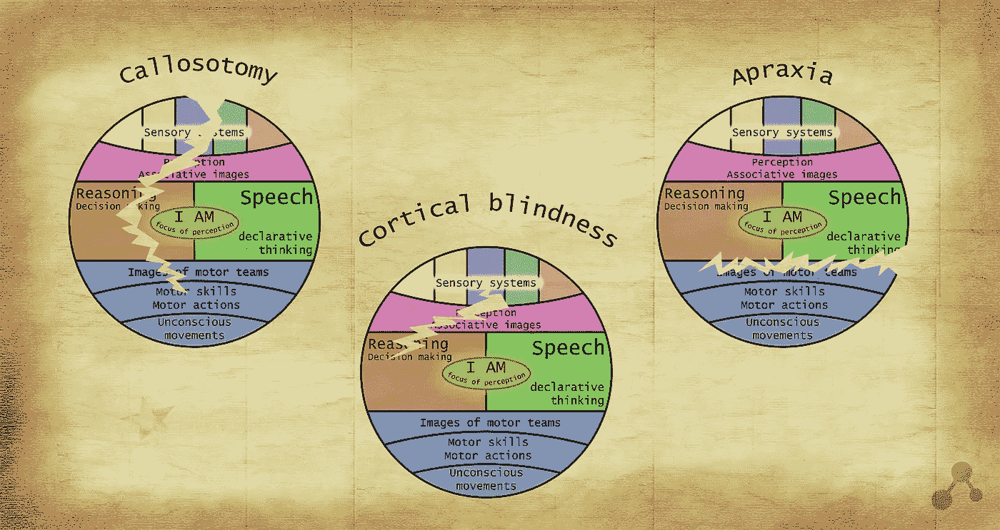

我推荐观看吉尔·博尔特·泰勒在 TED 大会上的演讲。在上述背景下，向她描述的情况变得更清楚了。

综上所述，我们可以说，关于心灵问题的答案早已揭晓，它只剩下接受它了。反射活动、言语圈、回响和神经兴奋的循环早已是众所周知的现象，但在心灵的概念周围创造一种神秘的气氛并无休止地寻找它的一些奇迹般的解释是非常诱人的。