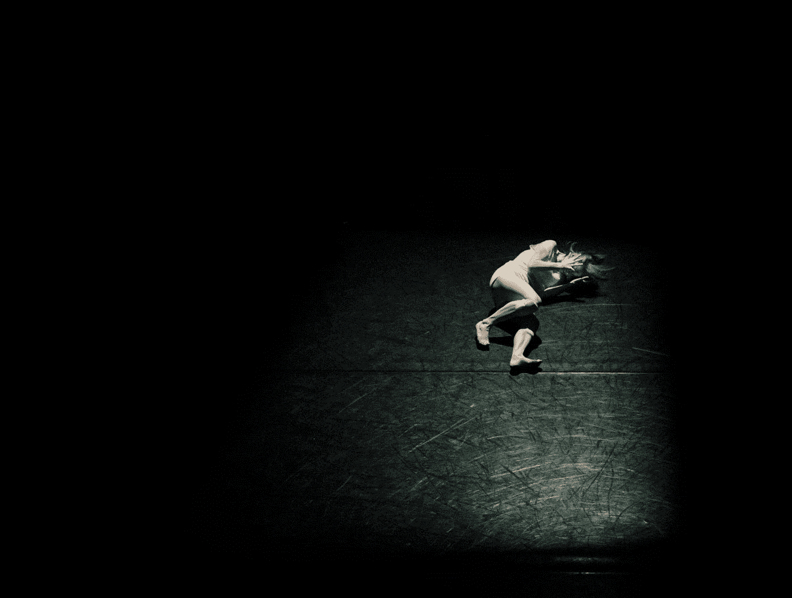

# 付出的痛苦是什么？

> 原文：<https://medium.datadriveninvestor.com/what-is-the-pain-of-paying-2fe3dbc7f192?source=collection_archive---------3----------------------->

你如何利用它来为自己谋利？

Photo by [Hailey Kean](https://unsplash.com/@keaneyefoto?utm_source=medium&utm_medium=referral) on [Unsplash](https://unsplash.com?utm_source=medium&utm_medium=referral)

我有分离焦虑症。每次钱离开我的手，我都觉得我需要坐下来重新思考我的人生选择。我感到痛苦，有一种失落感，最终我为我失去的钱感到悲伤。

也许我是一个略带戏剧性的人，也许你也有同感。不管怎样，我描述的场景是真实的。付出很伤人。与其接受这一事实，继续我们的生活，不如让我们探索一下支付痛苦的概念。

 [## 外汇投资如何帮助偿还债务|数据驱动的投资者

### 外汇是对外汇市场的投资，不同国家的货币在外汇市场上进行兑换

www.datadriveninvestor.com](https://www.datadriveninvestor.com/2019/02/13/how-forex-investment-helps-to-repay-your-debts/) 

1996 年，Zellermayer 称与花钱相关的负面感觉为“支付的痛苦”。他研究了支付痛苦可能带来的不同影响。他主要关注时间和支付方式的影响。

## *计时*

关于付款的时间，Zellermayer 预计会发现人们更倾向于消费前付款，而不是消费后付款。

为了验证这一点，Zellermayer 向 120 名成人博物馆游客出售了一张价值 1 美元的州彩票，最高奖金为 5000 美元。一半的受试者必须在刮彩票前付款，而另一半在刮彩票后付款，同时已经知道彩票的价值。参与者会得到一张表格，并被要求表明他们是否希望获得彩票报销，并被要求使用-5(痛苦)到+5(愉快)的等级来评估他们购买彩票的痛苦程度。为已经消费的商品付款被认为比为尚未消费的商品付款要稍微痛苦一些。此外，“先付款”条件下的参与者更有可能要求退款。

这些发现与 Loewenstein 和 Prelec (1993)的结果一致。参与者可以选择预先支付度假费用，或者回国后开始支付。63%的参与者表示倾向于提前还款。然后，同样的参与者会得到一份工作描述，并被问及他们更愿意在工作之前还是之后得到报酬。66%的参与者倾向于在完成工作后获得报酬。

Loewenstein 和 Prelec (1993)认为，与未来成本相比，人们更倾向于未来收益。参与者更喜欢免费享受带薪假期，而不是在度假回来后面对源源不断的付款。他们同样更愿意面对一系列的付款，因为他们已经完成了工作，而不是欠别人的工作，将来不会收到付款。

## *付款方式*

Zellermayer 提出痛苦最小的支付方式将是最受欢迎的。他的调查显示，与现金相比，绝大多数参与者更喜欢用信用卡支付。这些偏好表明，信用卡没有现金那么痛苦。这是有道理的，因为 Zellermayer (1996)认为支付痛苦的一个重要因素是与现金的物理相似性。

Raghubir 和 Srivastava (2008)使用支付耦合水平(并发性)来确定不同支付方式引起的痛苦程度。在用现金购买的情况下，购买和支付之间存在紧密的耦合，因为购买之后紧接着是支付。这加重了支付的痛苦。对于信用卡购物，虽然付款也是在购物后立即进行，但实际的付款时间比购物时间晚得多，从而减少了购物时的付款痛苦。与现金相比，使用信用卡时观察到的支出增加可以简单地用不同程度的疼痛来解释。经历的(直接)痛苦越多，花费就越少。这个简单的说法似乎得到了许多研究的支持，因为他们发现使用信用卡比使用现金更容易消费，也更愿意消费。

Raghubir 和 Srivastava (2008)提出了信用卡使用中消费增加的第二个理由。他们认为，这也可能是低估未来支付痛苦的结果。他们认为，这种低估是对疼痛的估计被购买的即时满足所减轻的结果。这一推理提供了另一个论点，即为什么信用卡被认为不那么痛苦，而且似乎会导致更高的费用。

## *个体差异*

Knutson 等人(2007)的研究表明，支付的痛苦甚至会在大脑中显现出来。当经历过高的价格时，脑岛在做出购买决定之前表现出增强的活性。脑岛与负面情绪和身体疼痛的体验有关。脑岛的活动水平被发现可以指示人们是否进行了购买。

每个人付出的痛苦是不一样的。你可能认识一个对每一笔开销都争论不休的人(吝啬鬼)，也可能认识一个花钱如流水的人(挥霍者)。不同类型的人经历不同程度的支付痛苦，这反过来会影响消费决策。吝啬鬼比挥霍者经历更多的痛苦，因此花费更少(Rick 等人，2008)。付出的痛苦是一种冲动抑制剂。如果这种痛苦减少，冲动就会更加自由，在这种特定的情况下，支出就会增加。支付的痛苦被认为是在信用卡购物中减少的，因为塑料不如现金有形，资源的消耗不太明显，并且支付与购买不同时进行。

总之，付款的痛苦，与赔钱有关的负面感觉，取决于付款与购买的同时性。因此，支付方式能够影响所经历的疼痛。经历的痛苦程度与花费的金钱直接相关。使用现金时痛苦最大，导致支出最低。使用信用卡时，痛苦最少，因此支出增加。

无论你是吝啬鬼还是挥霍者，挑战自己。如果你真的想存更多的钱，换回现金。把卡留在家里，看看你是否注意到了变化！

*这篇文章中的参考文献，以及许多其他伟大的文章都可以在* [*金钱上的头脑*](https://www.moneyonthemind.org/blog) 上找到