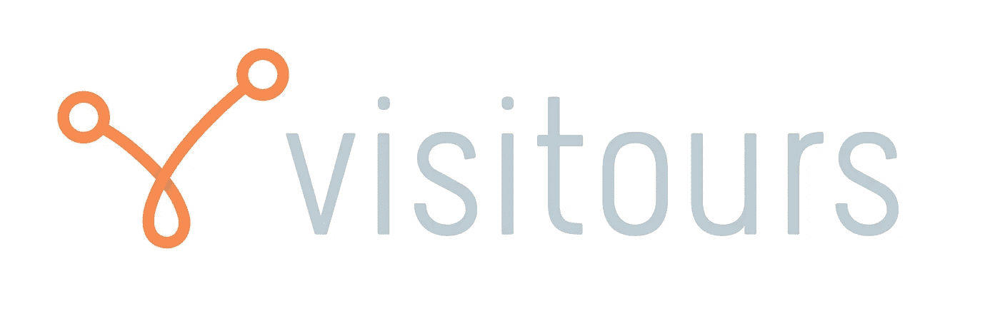

# 什么是共享经济？

> 原文：<https://medium.datadriveninvestor.com/what-is-the-sharing-economy-6ace3090a358?source=collection_archive---------5----------------------->

> 这比你想象的要多

Searching?

# 第一个共享经济

在 Airbnb 和优步出现之前，许多汽车闲置不用，许多房间空置或堆满了遗忘的物品。由于它们闲置在那里，它们的成本并未得到承认。一栋三居室的房子比一栋四居室的房子便宜，所以不使用第四个卧室就要多花那么多钱。实质上，这些未使用的资产被浪费了。

它们被浪费了，因为普遍的想法是，出租车是在你没有车的时候用的；不是别人的车，酒店是你在外国城市寻求住宿的地方；不是某人的备用房间。进入 Airbnb 和优步，剩下的就是历史了。

这种类型的共享经济受到了相当多的压力，因为它正在产生破坏。媒体的大量报道确保了“共享经济”一词现在开始代表这些大公司的活动。然而，实际上这些服务根本没有真正共享。

# 真正的共享经济

这个定义对企业来说并不是一个问题。不管叫什么名字，优步和 Airbnb 都将继续运营。但是，如果要正确理解这个术语对许多行业的影响，它的定义是相当重要的。

在 Visitours，分享的概念与金融或市场没有什么关系。共享是在纯粹的意义上使用的。分享体现了*‘与他人拥有或给予(某物)’*从字面上来看，这意味着与其他旅行者一起进行或给予(创造)一个与旅行相关的活动。这不同于 Airbnb 和优步。

使用优步共享的东西是使用别人的车，但乘坐，也就是人们想要的，不是共享，而是付费的。司机和骑手之间根本没有分享。只有租用才能让司机在车里四处走动。这是一种交易，就像出租车一样。

这概括了优步和 Airbnb 作为共享经济的想法是如何用词不当。

> *当“分享”是以市场为媒介时——当一家公司成为互不相识的消费者之间的中介时——它就不再是分享了。相反，消费者付费是为了获得其他人的商品或服务。——*[哈佛商业评论。](https://hbr.org/2015/01/the-sharing-economy-isnt-about-sharing-at-all)

对该行业的影响明显不同。租用通道创造经济活动，并使用休眠资产。共享旅游减少了经济活动，反而更有效地利用它，减少浪费。因为浪费少，也能少花钱。

# 我们的分享类型

在 [Visitours](http://visitours.io) 中，体现的分享类型归结为彼此不认识的人走到一起，共同分担旅行活动的“固定”成本。假设一项五人活动的固定成本为 1000 美元。越多的人可以分享这 1000 美元的费用，就越便宜，因为额外的容量(如优步座位或 Airbnb 房间)可以平均分配，而不是浪费或出租。如果两个人分享，则减少一半，如果三个人分享，则减少三分之一，以此类推，直到剩余容量被完全使用。这就是我们的分享方式，有很多这样的例子和方法:

*   公路旅行，
*   热门区域的 Airbnb 房屋，
*   当地城市的一日游/观光，
*   团体折扣，
*   出租车往返机场。

# 非常适合旅行

旅行的一大好处是它通常是一项合作活动；旅游团是一种受欢迎的消遣方式。然而，就像酒店是获得住宿的地方一样，旅游是大多数人旅行时去的地方。同样，这不是问题，但也不是唯一的方法。

旅行者可以免费获得许多旅游资源。许多徒步旅行和受欢迎的一日游不需要找导游。一个问题是，不使用旅游巴士、公共交通或其他慢的交通工具就能到达这些地方，这是非常昂贵的。租车往往比游览车多。但是，它们很贵，因为多余的座位被浪费了！但是如果可以和别人分享，它们就不贵。

这就是 Visitours 的用武之地。它可以让你找到想去相同地方或做相同活动的人，把他们联系起来，给他们所需的工具，这样他们就能以更便宜的方式获得相同的体验。这种体验的固定成本可以分摊，这样可以降低个人的总成本。是分享。

有了合适的技术栈或平台，这种安排可以变得比旅行更容易、更便宜。

# 新机遇

这种安排的另一个好处是，它是非歧视性的，创造了获得以前没有的东西的机会。任何人都可以与任何人分享任何有多余容量的东西，唯一的限制因素将是价格。因为昂贵活动的成本可以分摊，所以更多的人可以获得这些机会。例如，在瑞士租一栋阿尔卑斯山的豪宅玩一周滑雪板。通过分享，你可以从你的旅费中获得更多的价值。

# 挑战

虽然这个概念对旅行者来说很棒，但它也有挑战，我们确实需要你的帮助。大多数人希望他们的旅行由别人组织，但我们不能组织每个人的旅行。不过，这也不全是坏事。

旅游经营者和旅行社收取高额费用来组织和安排你的旅行和游览。通过 Visitours，我们为您提供了从您的资金中获得更多价值的机会，并且您不必支付这些费用，但您需要事先做一些微小但有趣的工作。

你所要做的就是想出一个你想去的好玩的地方或者你想做的事情，想出到达那里的最佳交通方式，然后把它推销给社区。从那里开始，这个平台将为你提供最好的工具，不仅能找到最好的交易，还能找到最好的人来分担成本。这样做你会节省很多钱，就是这样。

简而言之:想出一个很酷的主意，并与你的新朋友分享。

对我们来说，这是为了在人们旅行时为他们创造更多的价值。我们希望这非常简单，不会给你的旅行增加压力。事实上，我们希望你的钱得到更多的价值，这就是我们创建 [Visitours](http://visitours.io) 的原因。

所以下次你觉得共享经济。请记住，有多种不同的类型，你可以利用和使用多种不同的有益方式。

# 有关所有最新新闻和更新，请点击此处关注我们:

**网站:**[https://visi tours . io](https://visitours.io)
**推特:**[https://twitter.com/The_Visitours](https://twitter.com/The_Visitours)
**脸书:**[https://www.facebook.com/thevisitourscommunity](https://www.facebook.com/thevisitourscommunity)
**中:**[https://medium.com/visitours](https://medium.com/visitours/community/home)
**insta gram:**[https://www.instagram.com/the_visitours_community/](https://www.instagram.com/the_visitours_community/)
**LinkedIn:**[https://www.linkedin.com/company/thevisitourscommunity](https://www.linkedin.com/company/thevisitourscommunity)