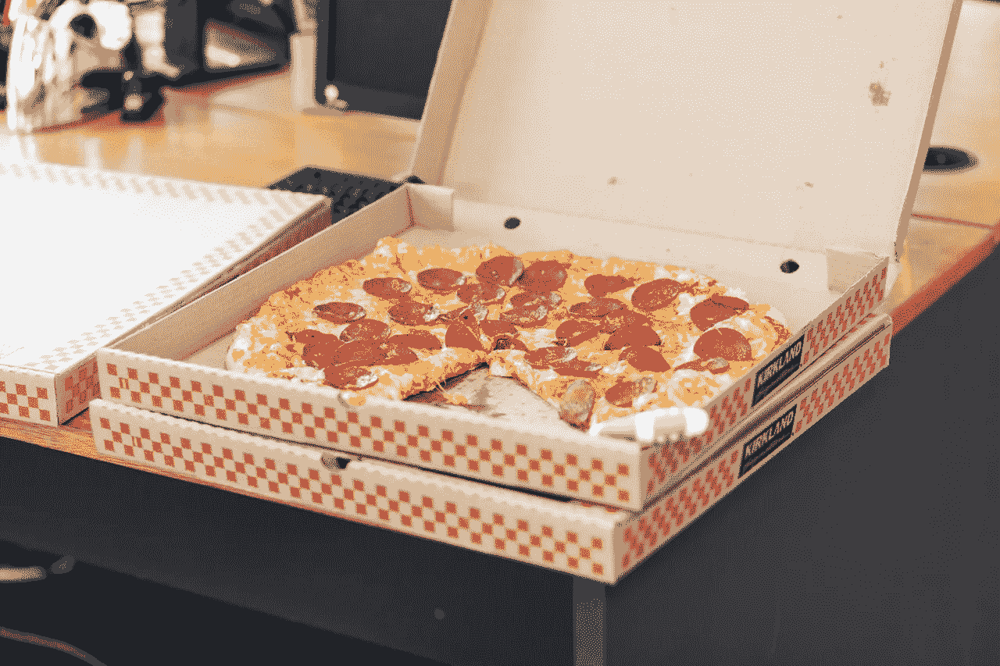
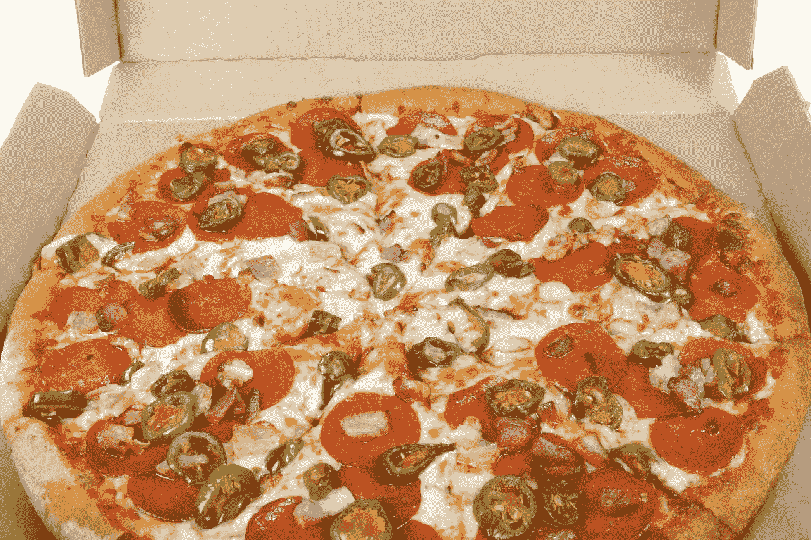
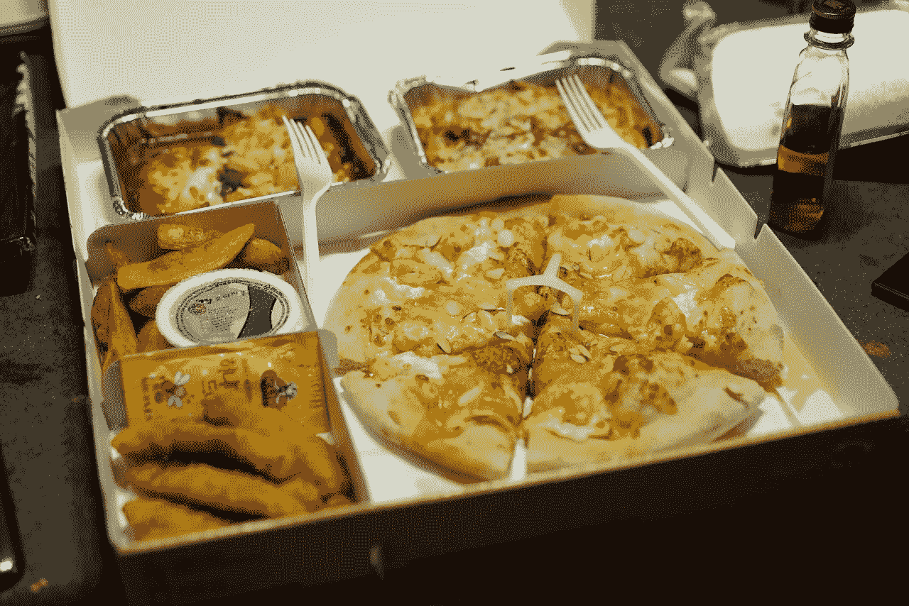

# GrubHub (GRUB)的价值是什么？

> 原文：<https://medium.datadriveninvestor.com/what-is-the-value-of-grubhub-grub-45201f2f3806?source=collection_archive---------7----------------------->

评估任何平台的价值都是困难的，但确定 GrubHub (GRUB)的价值可能要困难得多。

解释一下 GrubHub Inc .(纽约证券交易所代码:GRUB) 是几样东西，包括一个应用程序、一个想法、一个平台、一个餐馆网络和一群司机。GrubHub 背后的想法很简单；一个应用程序，提供一个从各种各样的餐馆快速订购外卖的地方。

然而，GrubHub 的现实很复杂，因为该公司在 2018 年 7 月提供了来自 1700 个城市的 95000 家餐厅的饭菜，扩展了漫谈[估计](https://expandedramblings.com/index.php/grubhub-facts-statistics/)。为了增加复杂性，GrubHub 报告称，2019 年 1 月为 1640 万名活跃食客提供服务。

令人印象深刻的是，GrubHub 估计其司机在 2019 年 1 月每天提供 416，000 份饭菜。因此，GrubHub 建立了一个令人难以置信的送餐平台。

# **GrubHub(蛴螬)值多少钱？**

GrubHub 应该从所有这些餐食中赚钱，因为它对每个订单收取 4 至 8 美元的送货费。此外，每个 GrubHub at Work 订单都有 9.99 美元的送货费。

事实上，GrubHub 在 2018 年第三季度的收入为 2.4723 亿美元，毛利润为 1.3571 亿美元。值得注意的是，GrubHub 在 2018 年第三季度实现了 54.89%的毛利率。

因此，尽管 2018 年第三季度的营业收入为 2185 万美元，净收入为 2275 万美元，但 GrubHub 似乎是一项利润丰厚的业务。此外，GrubHub 报告第三季度自由现金流为 2840 万美元，运营现金流为 4945 万美元。

事实上，GrubHub 的大部分现金，1.6775 亿美元，来自 2018 年第三季度的融资。此外，GrubHub 在 2018 年 9 月 30 日在银行有 2.9455 亿美元的现金和等价物以及 1，669 万美元的短期投资。

# **GrubHub 的值**

因此，GrubHub 的商业模式利润丰厚，且不断增长。值得注意的是，GrubHub 在 2018 年第三季度的收入增长率为 51.63%。

这些数字令人印象深刻，但不足以证明 2018 年 1 月 25 日报告的 80.77 美元的股价。不过，当天报道的 73.44 亿美元市值似乎是有效的。

因此，市场公平地给公司定价，而不是给股票定价。事实上，我认为 GrubHub 可能是另一家公司的价值投资。例如，收购 GrubHub 对于 Sysco (NYSE: SYS) 这样的食品服务公司或者 Kroger (NYSE: KR) 这样的杂货商来说是明智之举。

特别是，Sysco 以食物和供应的形式向餐馆提供基础设施。GrubHub 为餐厅提供数字和交付基础设施。

# 克罗格对 GrubHub(蛴螬)是个威胁吗？

克罗格出售包括套餐在内的食品，并在食品杂货配送方面投入巨资。事实上，Kroger 计划从其 1600 家商店提供 Instacart 送货服务，并将送货规模扩大一倍，*超级市场新闻* [报道](https://www.supermarketnews.com/online-retail/kroger-plans-major-expansion-instacart)。此外，克罗格正在建立自己的直接面向客户的电子商务平台，名为[克罗格船](https://www.supermarketnews.com/online-retail/kroger-unveils-its-own-online-grocery-delivery-service)。

值得注意的是，Kroger-GrubHub 或 GrubHub Instacart 混合动力车既可以送餐，也可以送杂货。例如，一个 GrubHub 司机可以放下你的比萨饼和你的杂货袋。

显然，克罗格对 GrubHub 是一个直接威胁，因为它可以提供在其超市烹制的热餐。特别是，Kroger 可以在餐饮和杂货上提供大幅折扣，以吸引顾客远离 GrubHub。

# **亚马逊对 GrubHub (GRUB)是威胁吗？**

除了克罗格，还有亚马逊(NASDAQ: AMZN) ，它拥有全食超市和亚马逊餐厅。有趣的是，全食超市比传统超市更靠近餐馆。例如，大多数全食超市都有厨房，供应各种各样的热餐。

显然，亚马逊可以利用这一点，让亚马逊餐厅从全食超市向 Prime 会员提供热餐。值得注意的是，亚马逊在洛杉矶推出了“同一天优先”杂货递送服务。

亚马逊和克罗格威胁 GrubHub，因为他们的资源大得多。例如，两家公司都有在市场上烹饪外卖的优势。因此，两家公司都可以以很低的折扣出售热餐。

值得注意的是，克罗格经营着 2782 家店铺，其中许多都有厨房设施。此外，全食超市经营着 479 家门店，其中许多都有厨房设施。

# **GrubHub 能活下来吗？**

为了生存，GrubHub 要么与餐馆经营者发展更密切的关系，要么自己做饭。对于 GrubHub 来说，建造厨房或给予餐馆特殊待遇的成本可能太高了。

在这种情况下，GrubHub 不支付股息的股票价格过高。因此，在当前情况下，投资者应该避免 GrubHub (GRUB)。尽管 GrubHub 的增长令人印象深刻，但它目前的风险太大，不适合做价值投资。

因此，GrubHub 作为收购目标是一种价值投资，而不是作为股票。因此，我不指望 GrubHub 作为一个独立的公司生存下来。

这个故事最早出现在 [*市场疯人院*](https://marketmadhouse.com/) 上。