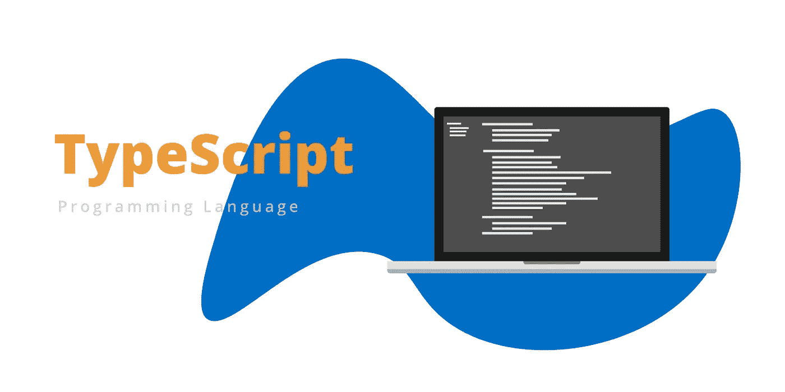

# 什么是 TypeScript 以及何时使用它

> 原文：<https://medium.datadriveninvestor.com/what-is-typescript-and-when-to-use-it-6a5ad9062f3e?source=collection_archive---------1----------------------->

如今，打字稿编程语言在开发人员中很流行。事实上，根据分析公司 Redmonk 的一份报告，TypeScript 在半年度语言排名中上升了四位，从第 22 位上升到第 16 位。鉴于 TypeScript 越来越受欢迎，了解所有关于。让我们更仔细地看看在开发界引起轰动的编程语言。

# 打字稿语言的背景

TypeScript 是由微软在 2012 年创建的，尽管开发人员可以使用各种编程语言，但它已经变得非常突出。虽然它的崛起速度没有 Swift 快，Swift 保持着自 Redmonk 开始跟踪排名以来的总体增长记录，但它仍设法击败了许多竞争语言。证据就在布丁里。使用 TypeScript 的应用数量正在上升。谷歌发布的最受欢迎的工具之一 Angular 是用 TypeScript 编写的，阿里巴巴等大公司使用的 Vue 也是如此。

 [## 2019 年最值得学习的编码语言|数据驱动的投资者

### 在我读大学的那几年，我跳过了很多次夜游去学习 Java，希望有一天它能帮助我在…

www.datadriveninvestor.com](https://www.datadriveninvestor.com/2019/02/21/best-coding-languages-to-learn-in-2019/) 

人们对 TypeScript 表现出的兴趣并不是基于有多少开发人员职位，甚至不是基于实际使用它的公司数量。Redmonk 公布的排名是基于 GitHub 上目前使用 TypeScript 的项目数量和 Stack Overflow 上关于它的问题数量。目标是了解开发人员职业在未来几年的发展方向。

# 类型脚本与 JavaScript

TypeScript 基本上是 JavaScript 的变体，JavaScript 也是 Redmonk 排名中的长期热门。几乎所有的 web 应用程序都在用户端使用 JavaScript，同时许多应用程序也开始在后端使用 JavaScript。尽管 JavaScript 用于创建移动和桌面应用程序，但它并不是一种可用于开发复杂应用程序的语言。这就是微软 TypeScript 的用武之地。它增加了一些特性，使得[定制 web 开发服务](https://skywell.software/web-development/)能够构建大型项目。这些特性包括 VS 代码，它允许将 TypeScript 代码翻译成 JavaScript，这样它就可以在任何能够运行 JavaScript 的浏览器上工作。除上述之外，您还可以获得以下好处:

*   对其他 JavaScript 库的支持——TypeScript JavaScript 能够重用所有当前的 JS 工具、框架和库。
*   可兑换性——任何。js 文件可以重命名为. ts 文件
*   可移植性——TypeScript 可以跨所有浏览器、操作系统和设备在几乎任何环境中运行。In 可以处理任何运行 JavaScript 的东西。此外，与 Dart 和 CoffeeScript 不同，它不需要自己的虚拟机或运行时环境来执行代码。

# TypeScript 是做什么用的？

TypeScript 用于创建大型应用程序。事实上，在创建 TypeScript 时，微软有一句格言“可伸缩的 JavaScript”。用 TypeScript 维护大型代码库要容易得多，因为它简化了 JavaScript 代码，它包含了提高开发人员效率的工具，并且有一个非常强大的类型系统。

TypeScript 对于调试工作非常有用。对于普通的旧 JavaScript，你必须浪费更多的时间来寻找错误，因为它是一种解释型语言。这意味着您必须运行代码来检查错误，这需要大量的时间。TypeScript 有一个 transpiler，可以自动检查代码中的任何问题。如果它注意到任何语法错误，它将生成编译错误，这有助于在代码实际运行之前发现错误。

# 尽管有借口，还是开始使用 TypeScript

人们不使用 TypeScript 的最大借口之一是学习曲线太陡。然而，重要的是要记住 TypeScript 并不是全新的。它所做的只是获取常规 JavaScript 并在其上添加一个类型系统。所以从 JavaScript 切换到 TypeScript 应该是这么大的一个飞跃。

下一个最大的借口是 TypeScript 宣传不会持续很久，也就是说，它不是未来的开发语言。尽管现在有各种排名和衡量标准，但没有人真正知道从现在起五年后或任何其他更长的时间内会有什么需求。此外，IT 行业是非常动态和快节奏的，所以如果你今天能够从采用某种技术中受益，你就必须这样做。即使你在接下来的一两年内改变了，你从使用它中获得的好处也是值得的。

最后，有一种观点认为将当前项目转换成 TypeScript 太难了。然而，微软构建 TypeScript 时考虑到了 JavaScript 生态系统，他们使得采用 TypeScript 变得非常容易。事实上，只需通过 TypeScript 编译器运行现有的 JavaScript 代码，就可以获得一些早期的好处。它将捕捉一些小错误，然后您可以开始重命名。您可以按照自己的速度采用 TypeScript，因为您将能够在项目的各个部分设置编译选项。

我们希望所有关于 TypeScript 及其与 JavaScript 的关系的信息对于确定这种编程语言是否适合您是有用的。如果您习惯于使用 JavaScript，那么采用 TypeScript 应该很容易，而且非常有益。

*最初发布于*[*https://sky well . software*](https://skywell.software/blog/what-is-typescript-and-when-to-use-it/)*。*