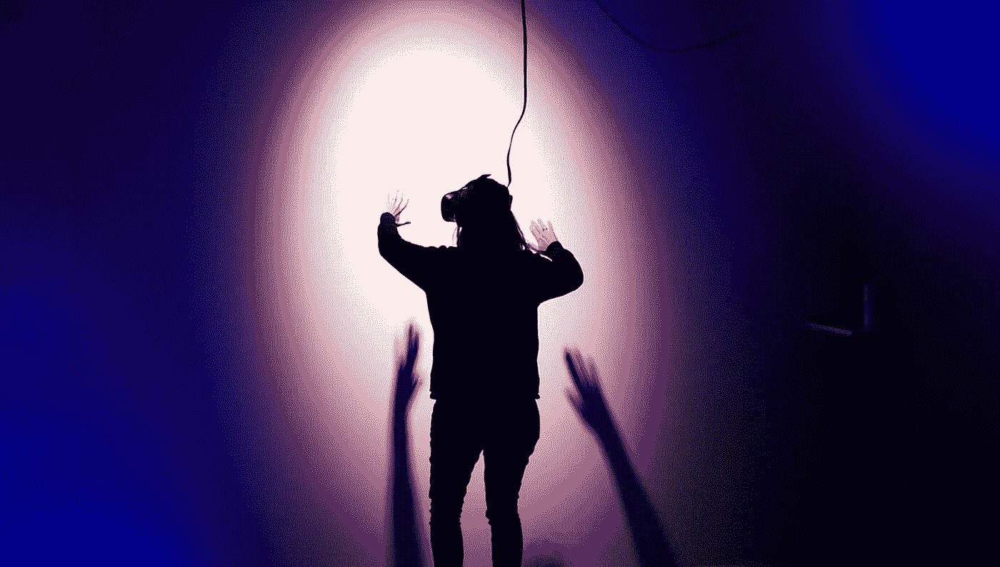
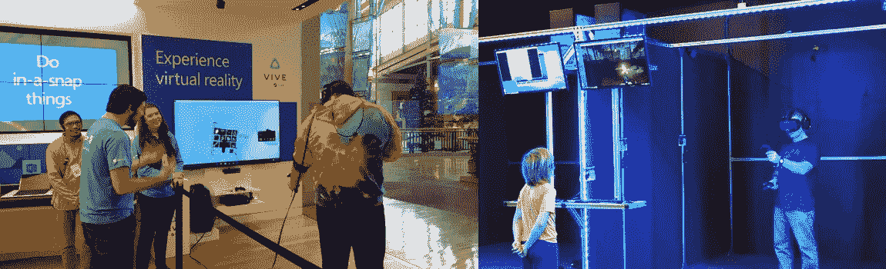

# 虚拟现实减去游戏算什么？

> 原文：<https://medium.datadriveninvestor.com/what-is-virtual-reality-minus-gaming-40d2a1fb675e?source=collection_archive---------7----------------------->

**简单明了的消费级 VR 解决方案。**

# 我们都吃，但不是每个人都是美食家

我们都玩游戏。在修剪整齐的场地，桌子，屏幕上，现在，虚拟现实。我们智人的大脑享受克服模拟挑战的征服。与试图赢得一场真正的部落战争相比，这是小风险。

但只有少数人是真正的游戏迷。美食家会等上 60 分钟来品尝颜色或形状有趣的冰淇淋。只有大游戏迷才会等待几个月来预购游戏续集，购买限量版角色皮肤，并购买需要吉他英雄或跳舞革命等配件的噱头游戏设置。

 [## 人工智能和虚拟现实的融合-你能期待什么|数据驱动的投资者

### 在技术领域，融合是合乎逻辑的一步。就在几十年前，你可能需要一个专门的…

www.datadriveninvestor.com](https://www.datadriveninvestor.com/2018/08/30/the-convergence-of-ai-rv-what-you-can-expect/) 

这和 VR 有什么关系？

People wait close to an hour for this Ah-Boong Ice Cream at Cupertino, CA

# 丢掉玩家镜头

如果你在互联网上走了这么远，你可能是 a)技术相关的工作者，或者 b)铁杆游戏迷。

你对专业技术或铁杆游戏迷生活方式的选择让你陷入了选择支持的偏见。人是自己人生选择的发声捍卫者，不一定是结果。

因此，你对虚拟现实有更强的(好的和坏的)偏见。如果你已经投资了一个 VR 头戴设备，就更是如此。

因此，让我们从失去我们的游戏者镜头开始。

# 虚拟现实，新的激光标签

相信我。我不希望看到虚拟现实成为另一个游戏配件。但是看起来**确实是以这种方式为消费者营销的。**不仅仅是电视或互联网上的广告。我指的是普通简第一次遇到消费级 VR 的真实生活场景。

考虑第一次虚拟现实体验最有可能的地方:微软商店，虚拟现实拱廊，或早期采用者朋友乔的家。

甚至在尝试之前，简就感觉到了一些怪异的氛围。

微软商店充斥着各种小玩意，而绿衫机器人对此毫无帮助。VR 街机灯光昏暗，蓝色霓虹灯。简想知道她是否会被晒黑。乔？他是个怪人。

她尝试了一些游戏。这肯定很有趣。她甚至会在 VR 中冲锋僵尸后尖叫。但是，她会花钱买这个吗？那鸿对她来说，这只是又一次激光追踪的经历。不经常的，一次就够的，笨拙的体验。

VR 是以社会可以接受的方式呈现的，但不是时尚的方式。

Microsoft Store VR demo (Left) and typical VR Arcade (Right)

# 关注新闻。不是老人。

游戏迷们还是说“VR 才是未来。”他们真正想说的是“虚拟现实是游戏的未来**无论如何，玩家都会玩游戏。所以，让我们暂时把游戏排除在虚拟现实之外。**

**好吧，你懂了。那么没有游戏的 VR 有什么好处呢？简单。 **360 视频**。**

***嘘嘘。你是指那种无法讲述引人入胜的故事的低分辨率视频吗？***

**是的。如果 VR 可以不仅仅是一个游戏噱头，那么 360 视频就是我们改变 Jane 想法的唯一希望。**

**让我再重申一次。“360 视频是 VR 领域唯一值得注意的新事物。”尽管有很好的理由，例如 VR 设备的高渗透率，大量的潜在创作者，以及 360 相机不断下降的价格。**

**让我们再深入一点。**

## **2019 年共售出 2.5 亿台虚拟现实设备**

**许多智能手机的硬件与普通销售的 VR 头戴设备一样好，甚至更好。大约 2.5 亿，给你一个大概的数字。这些智能手机符合大多数 360 相机捕捉的所需性能。60 fps、分辨率等。**

**在我们因为细节失去另一个简之前，我有更好的主意。**

# **一步退四步进。**

**让我们摆脱谷歌纸板、白日梦或 GearVRs。只需拖动手指，移动手机，即可观看 360°视频。**

**我听到有人尖叫说这不是真正的虚拟现实，但想想这将解决的四大问题。**

## **1.脚进门:普克 vs 奇拉希**

**午餐你想吃碗扑克还是奇拉希？两者都是生鱼拌米饭。前者通常是和同事一起吃一份即拿即走的快速休闲式午餐菜单。也没有人会因为你用叉子而不是筷子来评判你。后者往往更贵，而且是在你第一次约会或潜在的商业伙伴面前，在一个非常禅的环境中提供的。敏感的灵魂会大声说出海鲜、调味料或其他东西的质量差异。但说到底，他们只是米饭上的生鱼。**

**对我们一般的简来说，360 视频和 VR 是一回事，就像 poke 和 chirashi。一种新的视频格式，你可以到处移动。360 视频不需要任何钱或特殊设置。没有。但是，虚拟现实爱好者所谓的“真正的虚拟现实体验”在价格和精力上都过于昂贵，以至于无法观看一个该死的视频。VR 粉丝需要放下这种纯粹主义的心态。**

**如果能让 Jane 习惯看 360 的视频，她尝试 VR 也没问题。鉴于你的智能手机很少离你 20 英尺远，促进在智能手机上不带耳机观看 360°视频的行为将降低虚拟现实的身体和精神障碍。**

****

**Hawaiian-origin Poke (Left) and Japanese-origin Chirashi (Right)**

## **2.社会成分**

**我们聊天，发短信，发图片，发短视频来社交。因此，评论和评分功能是社交成分的神奇调料。不要想太多。**

**用虚拟现实控制器输入文本是低效的。这感觉就像用一根牙签在键盘上打字，而牙签几乎没有挂在你的小手指上。在网上和陌生人进行语音聊天是很尴尬的。语音转文本是，嗯……问 Siri 这是怎么回事，但是"*对不起，简。这是我在网上找到的“结核病疫苗”"***

**移除耳机可以让用户用拇指来评论，这比任何其他选项都要自然得多。请记住，评论和评论是许多消费者互联网产品成功的重要特征(例如 Yelp、亚马逊)。试试著名足球运动员兹拉坦·伊布拉希莫维奇在吉米·基梅尔直播上的评论部分，了解评论功能的重要性。**

## **3.解决方案:4K 不正常**

**用 VR 头戴设备观看在 4K 拍摄的 360°视频，分辨率非常低。在最好的情况下，你可以用超高速互联网获得大约 1080 便士，但在现实生活中用普通互联网连接更像是 480 便士。为什么？**

**有技术上的原因，比如分屏、每只眼睛的像素、拼接显示 90 度 FOV 的等矩形视频*等等等等* …**

**简而言之，不戴眼镜观看 360°视频将提高同一视频的感知分辨率。尝试全屏模式，或者只是移动默认流就可以了。会清晰很多。仍然需要工作，但没有戴上虚拟现实耳机那么糟糕。**

## **4.价格**

**$ 0**

# **真实的黑仔内容**

**接下来的论点是。360 视频内容烂。我同意。**

**但从统计数据来看，常规的 2D 视频也很糟糕。来自 Youtube 或 Instagram 的乐趣让人感觉无穷无尽，但它们是从一堆只有 6 次浏览的垃圾中筛选出来的。算法和你的个人数据在为你寻找一个吸引人的视频(为了广告收入)。**

**好的 360 视频是存在的。只是很难找到。试一试来自 [So Krispy Media](https://www.youtube.com/channel/UCKo61AAaRD00ibCWJZ321MQ) 或[Hong Kong time-lage 的视频，想象一下这个](https://www.youtube.com/watch?v=gYxG9e8ylR4)等等。只是不要看过山车或小丑 360 视频。**

## **在黑暗中射击(几个)。**

**5%的好视频可以弥补 95%的垃圾。如果绝对数量超过某个阈值，生态系统就会起作用。然而，大数字也不是必要的。**

**假设每月**上传 5000 个视频**。按照保守的值得观看的比率 5%，你会得到 250 个好视频和 4750 个骰子。平均每天可以看 8 个视频。假设平均持续时间为 3 分钟，那么一天就是 24 分钟！**

**当营销人员花费数百万美元来吸引你几秒钟的注意力时，我认为 24 分钟的一半还是很不错的。我们只需要找到一种 360 度的合适的讲故事方式。**

**对于 perspectives，每分钟有 400 个小时的视频被上传到 YouTube。而约 30%的 Youtube 视频负责 99%的观看量。而 95%的流行视频都是音乐视频，也就是说只有 5%的流行视频是非音乐视频。**

# **虚拟现实解决方案**

**不过，找到那个利基市场真的很难。幸运的是，有一些已知的技术。**

## **1.在黑暗中拍摄更多**

**买 360 摄像机，不买 VR 头戴设备。关注普通简和乔的用户生成内容。它们是视频内容的“精简”版本。快速失败，收集反馈，反复改进。ugc 拥有昂贵的工作室无法尝试的内容类别，如视频博客或产品评论。**

**工作室和影响者的内容一般来说是好的，但是它们需要时间、精力和金钱。更不用说他们的专家偏见让 2D 满足一生。即使尝试 360 种格式，他们也会面临巨大的机会成本。与此同时，对他们来说，在 2D 视频上投入的精力和金钱将是一个更有利可图的赌注。**

**就创作者而言，360 视频影响者真正的原生专家的位子是空缺的。《权力的游戏》即将上映。**

## **2.青少年**

**具体来说，给你十几岁的兄弟姐妹、表兄弟姐妹、侄女和侄子买 360 相机。**

**青少年是新潮流的风和火花。准备燃烧，青少年只是需要有趣的燃料燃烧。许多移动应用的成功是建立在高中生和大学生做他们的事情上的(例如 Snapchat，脸书)。**

**别问了。给青少年 360 相机。让他们做他们的事。谁知道他们会不会成为 360 视频的下一个凯西·奈斯塔特，是你启发了他们？**

## **3.政教分离**

**360 视频应该生活在不同的平台远离 2D 视频。**

**如果让你选择在同一家商店以同样的价格 0 美元吃一份多汁的牛排或泡菜(一种后天养成的口味)，大多数人会选择牛排。对于免费产品，人们默认为有保障的乐趣。如果 2D 视频和 360 视频生活在同一个平台上，360 视频永远会输。**

**360 视频可以用更多的信仰。2D 的视频平台可以担心把征收的税款花在哪里，以征收更多的税款。我们需要把两者分开。**

## **4.特洛伊木马**

**把 360 视频里的“VR”两个字一起丢掉。这避免了由过去几年对虚拟现实的过度承诺而形成的先入之见。VR 挂了足够长的时间，形成了一种(大多是负面的)偏见，但没有长到足以看到它的辉煌。**

***电影*这个词来源于“移动”这个词，用来描述移动的画面。或许可以称之为*触摸*或*旋转*来描述与视频的触摸和旋转互动？只是(暂时)不要称之为 VR。**

# **最先进但可接受的(和时尚的)**

**当 VR 爱好者已经在那个小盒子里看到了如此多的奇迹时，后退一步感觉是违反直觉的。我承认我是他们中的一员。然而，虚拟现实目前需要的不是另一项技术突破，而是重新打扮将赢得简的心的时尚元素。**

**我相信走这条弯路会让我们更快到达 VR 绿洲的应许之地。走在 VR 头戴设备的未铺砌道路上，伴随着昂贵的通行费和没有路灯，我们到达了最后一站游戏站。**

## **结算:应得的费用**

**请注意，我忽略了虚拟现实的商业应用，如建筑、房地产、艺术、治疗、职业培训以及更多已经改变我们生活的应用，而是关注消费者。**

**最后，我想感谢所有虚拟现实工作者和投资者，他们投入了时间、金钱、精力和热情来建设一个我每天都期待醒来的明天。**

**我很乐意在评论区或通过私信听到你的想法！**

****TL；博士****

**当今 VR 行业的可行解决方案是专注于不带 VR 眼镜的智能手机上的 360°视频。**