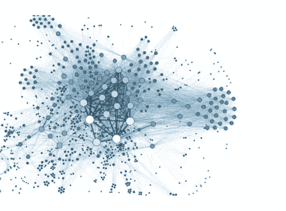

# 你对大数据的定义是什么？

> 原文：<https://medium.datadriveninvestor.com/what-is-your-definition-of-big-data-55e987d5d64b?source=collection_archive---------15----------------------->

[https://erpinnews.com/leverage-big-data](https://erpinnews.com/leverage-big-data)

> 我个人认为大数据是一个术语，它定义了各种各样的新的海量数据类型，各种各样的专家正在通过创新来收集、翻译和理解这些数据。其中我主要关注数据在类型、来源、数量和复杂性方面的差异。

尽管如此，与持续收集的数据量相比，已分析数据的百分比相对较小。公司确实在收集数据的方式上有所创新，他们正在释放他们的创造力，寻找越来越多的数据来源，这些来源将提供关于他们的客户、内部组织和市场本身的新的、有趣的和创新的观点。从互联网，我们周围的摄像头，我们的手机，小机器人，在银行欢迎我们，我们的物理探索不同的物体和屏幕，我们，广泛的人们，正在试图获得一个 360 度的图片，探索，兴趣，轮廓，和行为，在寻求找到一个模式，以便我们可以做得更好。

因此，考虑到大数据确实围绕着我们，并且有许多形状和形式，我们是否可以说数据就像水一样——它没有形状，由数百万个不断运动的分子组成。简单地借用我们倒入的物体的形状。细说这一点，我们可以发现许多共同的特点，如包装、质量、管理等等。

> 正确的包装可以把瓶装自来水卖到 3 美元。数据也一样。数据可视化解决方案可以帮助您打包数据，以增强说服力和影响力。然而，数据可视化必须在干净的数据上操作；否则就是垃圾进，垃圾出。每花一个小时在数据可视化上，你就要花四到九个小时来收集、清理和准备数据(Adobe，2018)。

如果您搜索大数据的解释和定义，我们可能会发现它是用数据科学、化学甚至哲学的术语来定义的。事实是，不同的读者会使用不同的定义，但仍然指的是同一件事。挑战是我们如何翻译我们的解释。

因此，数据可以以多种方式进行分类、定义和解释。现在科技给我们的是切割比萨饼图像的能力，对它进行分类，并把它与电塔上的铁锈联系起来。嗯，这可能是一个牵强的例子，这是供应商如何试图向专注于质量控制的业务分析师解释大数据。

问题是谁，什么和为什么描述，以及他们将如何呈现它。

来源:

土坯。(2018).数据如水的 10 种方式。从[https://www.slideshare.net/adobe/10-ways-data-is-like-water](https://www.slideshare.net/adobe/10-ways-data-is-like-water)取回