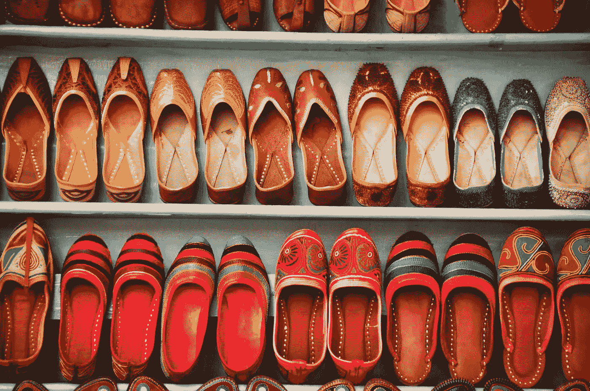
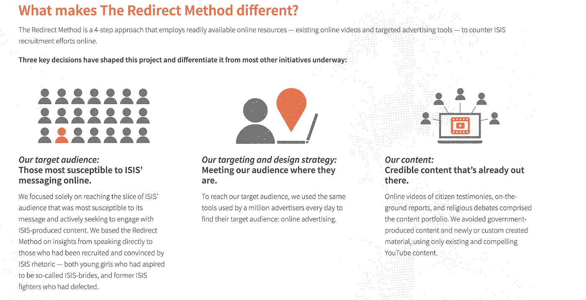

# 你下一次最有可能的点击是什么？

> 原文：<https://medium.datadriveninvestor.com/what-is-your-next-most-likely-click-41cf4ecca46f?source=collection_archive---------4----------------------->

*推荐算法控制一切*

Method in madness, Bombay 2011

一年多以前，我决定尝试一个月的纯素食，或者尽可能长的时间。我和一个朋友一起看了一部纪录片，这部纪录片对我产生了影响，这位朋友已经吃素五年多了，除了对个人健康的益处之外，还有明显的环境益处。所以在做决定之前，我开始做一些研究，看看什么能帮助我成功。Instagram、Youtube 和我的网飞账户(我在那里看了这部纪录片)都把我贴上了素食主义者的标签。我觉得我把去年成功改变饮食归功于这些平台。推荐算法主宰了我的世界。

我去年参加了一个冲浪课程，并开始在 Instagram 上关注冲浪教练以获得一些灵感，当然他也很可爱。我在 youtube 上看了几个“初学者冲浪”的视频，以免完全失败，在课堂上出丑——不用说，这是我做过的最难的事情之一。当一个只有一英尺高的浪推着你的长板时，你很难让自己站起来。我绝对想做更多的事情。我现在开始关注一个冷水冲浪者，在 gram 上有超过 10 个这样的账户。我的社交媒体屏幕时间是由一种算法定义的，这种算法将我标记为某种冲浪爱好者，我没有抱怨。总有一天我会努力不辜负这个标签。

 [## 算法诱人的商业逻辑——数据驱动的投资者

### 某些机器行为总是让我感到惊讶。我对他们从自己的成就中学习的能力感到惊讶…

www.datadriveninvestor.com](https://www.datadriveninvestor.com/2019/03/22/the-seductive-business-logic-of-algorithms/) 

不断提醒我素食的好处，以及我周围供应一些最好的素食的餐馆，在帮助我做出这种改变并坚持下去方面发挥了强大的作用，即使这很难做到。这些都是来自我周围的推荐系统的积极影响，但同样，我们可能会被洗脑，相信那些对我们和你周围的人产生负面影响的事情。推荐算法背后的技术是人工智能和机器学习的基础，我们都已经很好地了解了邪恶的大技术和人工智能可以带入这个世界。让一个效率更高的人工智能机器人丢掉工作是一回事，但影响一个人对选举、移民和枪支暴力的想法和决定是需要考虑的因素。

《连线》杂志的一篇文章将人工智能比作人类文化的一面镜子，人类文化由我们的偏见、种族主义和性别歧视定义，“使我们社会中发现的其他结构性不平等永久化”。不幸的是，算法并不关心你是否成为素食主义者或冷水冲浪者，它们只关心让你在 Youtube 上停留更长的时间。《连线》主编尼古拉斯·汤普森对尤瓦尔·诺亚·哈拉里和特里斯坦·哈里斯的采访揭示了 YouTube 的推荐算法是如何真正工作的。他们说，这就像试图侵入人类的大脑——这就是算法不断试图对他们提出的每一个建议做的事情。YouTube 上有一种强烈的系统性偏见，会把你推向任何辩论的极端——一个关于节食的视频会建议你下一次点击一个关于厌食症的视频；一个关于 911 的视频，接下来给你一个关于这是一个阴谋论的视频。该算法知道，最能让你在 youtube 上停留更长时间的是这些极端主义内容，并将利用它引导你进入那个兔子洞。那么社交媒体真的是关于自由意志的吗？或者是你在这些平台的大部分时间里，人类的大脑被黑客攻击和影响。

是 Youtube、脸书和 Instagram 比我自己更了解我，还是我就那么容易受到攻击？毕竟，根据“像我这样的人”过去的数十亿次点击，算法知道我最有可能点击什么。它也知道我有成为素食主义者的潜力，因为在我知道这些选择之前，我周围有很多选择。哈拉里谈到，在他自己意识到这个事实之前，一种算法告诉他，他是同性恋，只是基于他在电视或电脑上看到的东西。三人组开始描述这种动态的复杂关系——其中“你”是中心。知道我们是可以被黑客攻击和脆弱的是不被影响的第一步，但是这真的有用吗？对于我们大多数人来说，我们知道 Youtube 在为我们推荐/自动播放下一个视频时在做什么。把自己抽离出来，不再看下一个 youtube 视频有多难？现在，自我意识变得比历史上任何时候都更加重要——我们与技术竞争来更好地了解自己。

如果你在亚马逊上购物，你会知道他们在推荐你应该购买的产品以及你购物车里已经有的东西方面做得很好。我不得不说，选择一种能和我的保湿霜很好搭配的洁面乳是很方便的，或者选择一种能正好放进我要去买的新垃圾箱的垃圾袋。这些建议有理由吗？公平的算法到底是什么样的？亚马逊没有告诉我为什么向我推荐某种产品，但告诉我这是“像我一样的人”浏览或购买过的。这可能意味着许多不同的事情——是基于我的种族和性别还是其他一些关于我的人口统计信息？或者只是对“像我这样的人”通常购买的东西的刻板印象？一种更好更人性化的说法是，亚马逊或 Spotify 告诉我，以下推荐是“受你最近活动的启发”。

说真的，一个对我们负有信托责任的算法到底会是什么样子呢？它能警告我们警惕 youtube 上的极端主义内容，或者保护我们免受思想攻击或阅读假新闻吗？其中一些努力正在进行中——由谷歌支持的项目 Redirect 使用 Adwords 工具和 youtube 视频来解决“在线激进化”问题。它专注于最容易受其信息影响的 ISIS 受众，并将他们导向揭露 ISIS 招募主题的 YouTube 精选视频。这种开放的方法是从对 ISIS 叛逃者的采访中开发出来的，尊重用户的隐私，可以用来处理其他类型的在线暴力招募话语。'

迷人吧？

这让我想到，如果我们有技术来保护我们——这将推翻推荐算法的基本前提，而是承担比让我在 youtube 上呆更长时间更大的责任。我们才刚刚开始理解科技对我们的影响和力量，我们花钱保护自己只是时间问题。这类似于在脸书支付额外费用——你的数据会得到完全保护，不会与广告商共享。我们已经在 Spotify 账户上这样做了，可以听不间断的音乐，所以这不是不合理的。