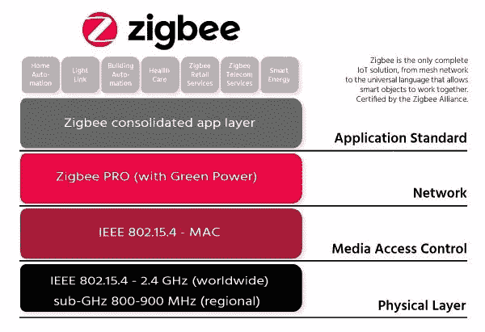
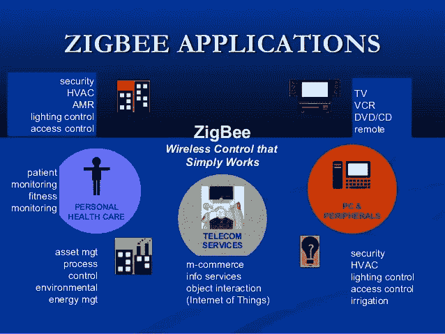

# Zigbee 是什么，能做什么？

> 原文：<https://medium.datadriveninvestor.com/what-is-zigbee-and-what-it-can-do-37d2ea0f0223?source=collection_archive---------4----------------------->

ZigBee 可能是一种无线技术，作为开放世界的一种常见技术，用于处理负担得起的低功耗无线物联网网络的独特需求。ZigBee 在 IEEE 802.15.4 物理无线电规范上运行，并且在未许可的频带以及 two.4 GHz、900 兆周期和 868 兆周期上运行。ZigBee 堆栈操作所基于的 802.15.4 规范在 2003 年获得了电气和物理工程师协会(IEEE)的同意。该规范可以是基于分组的无线电协议，用于负担得起的电池供电设备。该协议允许设备在一种非常风格的网络拓扑中说话，并且可能具有持续多年的电池寿命。

ZigBee 通信是专门为 IEEE 802.15.4 上的管理和传感元件网络而设计的，通常用于无线个人空间网络(WPANs)，它是 ZigBee 联盟的产品。这种通信方式定义了物理和媒体访问管理(MAC)层，以低数据速率处理多个设备。这些 ZigBee 的 WPANs 以 868 速率、902–928 MHz 和几个. 4 千兆周期频率运行。250 kbps 的数据速率最适合于在传感器和控制器之间进行周期性的信息传输。

ZigBee 是一种廉价的弱网状网络，适用于主导和观察应用，它以不同的间隔覆盖 10-100 米。与蓝牙和 Wi-Fi 等相对专有的短程无线传感元件网络相比，这种通信系统成本更低，也更简单。

 [## 物联网解决方案如何改变供应链中的机遇——数据驱动型投资者

### 物联网(IoT)可能开始时规模很小，但它正在成为世界经济中的一个重要因素。事实上…

www.datadriveninvestor.com](https://www.datadriveninvestor.com/2018/11/14/how-iot-solutions-are-shifting-opportunities-in-the-supply-chain/) 

**ZigBee 优势**

ZigBee 协议旨在通过商业和工业应用中常见的嘈杂射频环境来交流知识。版本 3.0 建立在流行的 ZigBee 基础上，但统一了特定市场的应用配置文件，允许所有设备在同一网络内无线连接，无论其市场名称和性能如何。此外，ZigBee 3.0 认证主题确保了来自完全不同制造商的产品的能力。将 ZigBee 网络连接到信息处理领域，从局域网或广域网上的智能手机和平板电脑等设备以及 web 发布观察和管理，并实现真实的物联网。

ZigBee 协议选项包括:

*   支持多种网络拓扑，如点对点，
*   点到多点和网状网络
*   低占空比—提供更长的电池寿命
*   低延迟
*   直接序列展开频谱(DSSS)
*   每个网络多达 65，000 个节点
*   用于安全知识连接的 128 位 AES 秘密写入
*   冲突回避、重试和确认

**Zigbee3 栈**

ZigBee 代码堆栈包含一个“基本设备”，它具有一致的行为，用于将节点授权到网络中。提供了一套典型的赋权策略，以及一种近距离赋权方式 Touch link。ZigBee 3.0 提高了网络安全性。有两种安全策略适用于两种类型的网络:

1.  **集中式安全:**这种技术采用协调器/信任中心来形成网络，并管理网络和链路安全密钥的分配，以改变完整性节点。
2.  **分布式安全:**这种技术没有协调器/信任中心，由路由器完成。稍后，任何 ZigBee 路由器节点将向完整性节点的改变提供网络密钥。

节点采用它们所属的网络所采用的任何安全技术。ZigBee 3.0 支持无线网络不断增长的规模和质量，并处理超过 250 个节点的巨型本地网络。ZigBee 还处理这些网络的动态行为(节点在网络中出现、消失和重新出现),并允许因失去父节点而产生的孤儿节点通过特殊的父节点重新加入网络。ZigBee 网状网络的自愈特性还允许节点退出网络，而不中断内部路由。

# ZigBee 应用

ZigBee 允许以负担得起的低功率解决方案广泛准备无线网络。它为一系列观察和管理应用提供了使用廉价电池持续数年的电力。良好的能源/智能电网、AMR(自动抄表)、照明控制、楼宇自动化系统、储罐观测、HVAC 管理、医疗设备和车队应用是 ZigBee 技术取得重大进步的众多领域中的一部分。

1.  **工业自动化:**在生产和生产行业中，通信链路定期监控众多参数和重要设备。因此，ZigBee 大大降低了这种通信价格，同时优化了对较大不负责任的管理方法。
2.  **家庭自动化:** ZigBee 完全适合远程控制家用电器，作为照明系统管理、电器管理、加热和冷却系统管理、安全仪器操作和管理、警察工作等等。
3.  **智能计量:** ZigBee 远程操作在良好的计量中体现了能耗响应、评估支持、安全防窃电等。
4.  **智能电网观察:**良好电网期间的 ZigBee 操作包括远程温度监控、故障定位、无功功率管理等。

这是对 ZigBee 技术的设计、操作模式、配置和应用的一些简要描述。我们倾向于希望我们已经给了你足够的关于这个标题的内容，让你更好地了解它。我们倾向于成为开发 ZigBee 技术的先锋。如需任何便利和技术帮助，您可以在下面留言联系北美国家。

**结论:**

ZigBee 网络将被设计和操作在许多可选择的和有时改进的方法中。一般来说，网络的给定端可以操作的精确方式取决于 ZigBee 芯片组的制造商。更重要的是，自然地，ZigBee 网络将是非常通用的，可以让设备休眠和唤醒，连接和断开，消毒网状网络的布局，切换频道或 PAN ID。为了稳固地部署这些网络，或者作为安全测试人员或科学家来研究这样的网络，有必要了解这些核心思想。