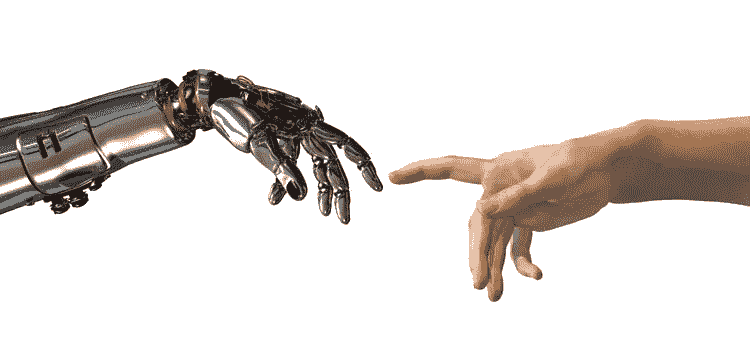
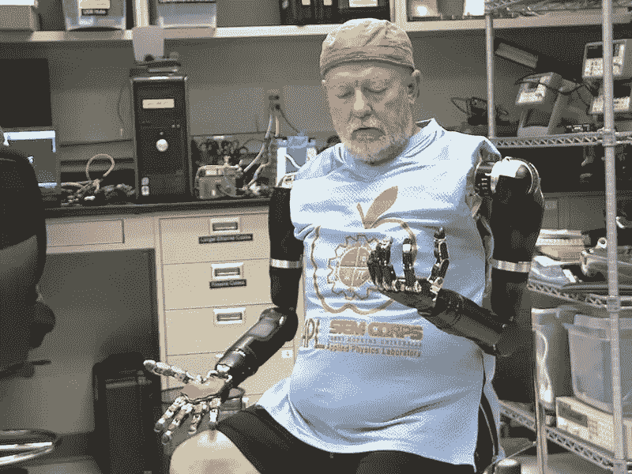

# 第四次工业革命对人类意味着什么

> 原文：<https://medium.datadriveninvestor.com/what-it-means-to-be-human-in-the-4th-industrial-revolution-a5edb57030c7?source=collection_archive---------5----------------------->

作为人类意味着什么？

从生物学的角度来看，成为人类意味着编码*智人*的 DNA。当我们用纯科学术语谈论时，这是一个显而易见的答案。当我们问心理学家和哲学家时，答案变得更加复杂，增加了社会行为，创造能力等等。

然而，我们作为*智人*和*新智人*(新人类)，或者*高级智人*(高级人类)的身份相隔多少年？人工智能、机器人和基因工程的进步让我们得以一瞥人类如何通过设计进化成新的东西。

现在，我们的科学家和工程师正在创造非常先进的人造肢体，可以用我们的思想来控制。我们的大脑与我们的生物手臂相连。我们思考，我们的生物手臂会动。病人的大脑也与这些新的原型人造手臂和手相连。病人思考，人造手臂移动。

更换合成肢体的病人还是人吗？我们大多数人会说是的。他的遗传密码没有改变。这些肢体在设计和功能上仍然很原始，所以我们仍然认为这个人有残疾。不需要大的伦理讨论。病人失去了“好的”生物手臂，得到了质量较低的替代物。

当我们展望未来，比如说 20 年后，那些同样的机械手臂比生物手臂更强、更快、更精确、更灵敏，会发生什么？残疾人会不会变得比那些还留着原来生物套的人优越？完全正常的人可能会去找外科医生，用仿生超级肢体替换他们功能完美的肢体。那么，失去一条肢体可能也没那么糟糕。这不仅是可能的，而且是不可避免的。可能需要 20 多年才能实现，但我们可能不会太离谱。“改良”人类的创造会改变我们对人类的定义，并在我们的社会中创造出一个细分的人类吗？

定义“人”的含义可能需要更多的思考。也许人类不仅仅是我们的遗传密码。

让我们从另一个角度来看这个问题。

在过去的五年里，我们已经在基因工程方面取得了惊人的进步。使用 CRISPR 系统进行基因编辑是最受关注的。CRISPR-Cas9 分子复合物允许我们将基因从其原始代码序列改变为我们喜欢的任何东西。此外，使用其他成熟的技术，我们可以插入新的基因，化学抑制现有的基因，并以惊人的精度移除不想要的基因。在 2018 年底，我们见证了第一个基因编辑胚胎，这要感谢中国科学家何建奎。他改变了胚胎中的一种特定基因，这种基因可以使婴儿对艾滋病病毒产生抵抗力。最重要的是，这种类型的基因改造会传递给婴儿的后代。这是令人惊讶的第一次，将被载入史册，尽管科学界和监管机构并没有高兴地接受这个消息。

[在北美人口中进行的调查](https://www.theverge.com/2017/8/30/16198594/crispr-gene-editing-survey-public-opinion)显示，人们强烈支持基因编辑来治疗疾病，但很少有人支持使用基因编辑来增强人类。我们可以使用完全相同的技术和技巧来实现这两个目标。我们可以通过引入新的基因来增强我们的生物身体，使我们更强壮，更抗病，更高，再生四肢，长出额外的器官等等。我们还没有做到这一点，但是 Jiankui 博士的临床实验为更多的未来打开了大门。如果我接受了增强人类能力的基因，我还是人类还是别的什么？增强是生物的还是机械的有关系吗？如果我收到一个人造肾脏(见[实验室培育的肾脏](https://www.asscr.org/news/researchers-are-one-step-closer-to-growing-a-kidney-in-the-lab/)研究)来替换一个患病的或表现不佳的肾脏，该怎么办？由于我们制造肾脏，医生可以增强它，给我更好的血液过滤，也许在我运动时需要时产生更多的肾上腺素。用一个全新的优质肾脏替换一个表现不佳但健康的肾脏，会让我变得不同于人类吗？如果这种增强是遗传的，是用一个增强的身体部位交换的，是机械的还是生物的，这有关系吗？

这些问题我都没有答案。这些都是我们将在未来一两代人的时间内讨论的选项。我认为我们应该鼓励这样的选择，避免将一类人与其他人隔离开来。纵观我们自己的历史，我们用几乎相同的遗传密码将人类分为优等或劣等。99.9%的人类遗传密码是相同的，然而我们对其他人做了可怕的事情，当唯一的区别是性别，肤色，骨骼结构。我不认为我们希望在未来重新点燃我们物种的分化。

我认为尽管我们需要用更广阔的视角来看待人性。我们很快就会有非凡的手段来使用生物和人造材料来增强我们自己。我认为现在谈比以后谈好。

**进入人工智能**

在我的许多文章中，我描绘了人工智能(AI)变得和人类一样有能力做任何工作的画面。我写道，根据人工智能专家的说法，人工通用智能(AGI)将在未来 20 年内出现。[本文](https://medium.com/datadriveninvestor/the-job-market-in-year-2040-d17f7743c0fd)展示了 2040 年 AGI 出现后，当人工智能拥有人类水平的机器智能，从而能够取代任何职业中的任何人时，就业市场应该是什么样子。

想象一下，如果我们有更好的机器人肢体和 AGI，我们就可以制造出看起来像我们、行为像我们的机器人，拥有地球上任何人类的集体能力和智慧。工程师可以设计一些成为我们的朋友和伙伴。在科幻小说系列*星际迷航:下一代*中，科幻小说作家们发挥了这样一种生物具有超强能力和感知能力的概念。人物数据与《星际迷航》宇宙中的*企业号*船员融合得如此之好，以至于他的同伴将他视为一个平等的人。不是人类，因为他被认为是机器人，但仍然是一个人。

在整个系列中，Data 是剧组的正式成员，也是一名授勋军官，被剧中所有主要角色视为朋友和同事。众所周知，这个角色渴望变得更有人情味，但他还是被欣赏和喜爱。

在“[男人的尺度](https://en.wikipedia.org/wiki/The_Measure_of_a_Man_(Star_Trek:_The_Next_Generation))”一集中，数据和他的队长经历了一场审判，法官授予数据完全的法律地位，与任何其他人一样的权利和特权。如果他在法庭上输了，他就没有权利，会被当作机器一样对待。在这部戏里，据说他只不过是一个奴隶。如果法官的裁决会走上不同的道路，那将开创一个可怕的先例，将任何机械构造定义为“物”而不是人，无论机械存在有多聪明或有多自我意识。它将有机的、基于 DNA 的智能定义为比同等智能的机械人更应该享有基本权利。

我们很快就会讨论这些差异，我们必须尽快创造同样的法律先例。也许讨论将在机器人上进行，比如 Data。也许我们会讨论一个人，他/她身体的很多部分都被机械部分取代了，他/她大部分是金属。我认为制造我们的材料并不重要。每个人都应该根据他们的意识水平拥有适当的权利，对吗？

**生物编程**

新的电影动作片“*阿丽塔战斗天使*”展示了人类天才在机器人学和控制论中所能取得的成就。阿丽塔是一个正常的人类女孩，但在她生命的早期，一个机器人身体取代了她的生物身体。她仍然有人类的大脑，但她不记得她的过去。这是一个熟悉的故事，在另一个日本原创故事《蛋壳里的幽灵》和经典故事《机械战警》中都有讲述。在这三个案例中，人类的大脑都被重新编程了，记忆被抹去了，角色的机器人身体赋予了他们只有机械部件才有的惊人能力。然而，它们都是有机和机器人的混合体。最后，他们都曾经完全是人类。他们的创造者改造了他们的生物大脑，创造出具有人类智能的机器人奴隶。他们的智力和 AGI 人的智力之间的唯一区别是，他们最初是人类。如果身体唯一有人类 DNA 的部分是大脑，其余部分都是机械的，那这个生物还是人类，还是别的什么？

我认为这取决于重新编程，因为编程决定行为。所以，拥有机器人身体的人脑还是人类的权利吗？一个能够模仿人类行为的 AGI 操纵一个克隆的人体怎么样？那是人还是别的什么东西？

在未来，我们可以利用克隆技术和基因工程相结合来创造人类 DNA 体，并对其进行重新编程，使其也能以非人类的方式运作。我们可以将这些克隆人改造成增强型人类或生物机器人。这些人中的一个和一个有意识的正常人之间的基因差异可能也是 99.9%。但是因为工程师们已经修改了克隆人的基因构成，以完成一个具有不同程序的大脑，它将以非人类的方式表现。为特定目的而编程的生物机器人还会是人吗？还是会输掉一场试图判定它是否还是人的官司？我们很快就会处理这些问题。

智力有限的工程生物身体可能在娱乐产业中有用，并可能拥有与现代机器人相同的权利，Alexa 运行他们的人工智能界面。这取决于他们的能力和设计。拥有几乎完全人类的 DNA 是否赋予了这种生物完全的法律权利？

**“人类”一词的含义**

鉴于这篇文章中提到的所有不同的可能性，所有这些在 21 世纪都是可能的，我想知道把我们自己作为人的重要性。我们为我们的人类遗产感到自豪；然而，我们很快就能利用生物和机械手段设计出多种多样的人类。

我们可能会努力对这些不同的人类形态进行分类，我们的社会将努力理解哪种变异应该拥有人权。我们也会纠结于超人的概念，但是人类的增强是不可避免的。

我相信我们必须停止以昆虫学家的身份看待生活，对每个方面进行分类，这样我们就可以把每个奇妙的变化放进正确的小盒子里。也许“人”这个词应该是指“未经修饰的人”，用一个更宽泛的词，比如“存在”。我们不应该使用会分裂我们前进的词语。

谁知道呢，也许有一天我们会遇到比我们在科幻电影中见过的任何东西都更有趣的外星生物。如果我们试图将他们划分为优于我们或不如我们，我会很讨厌。如果他们那样对我们，我会更讨厌的。精神食粮。