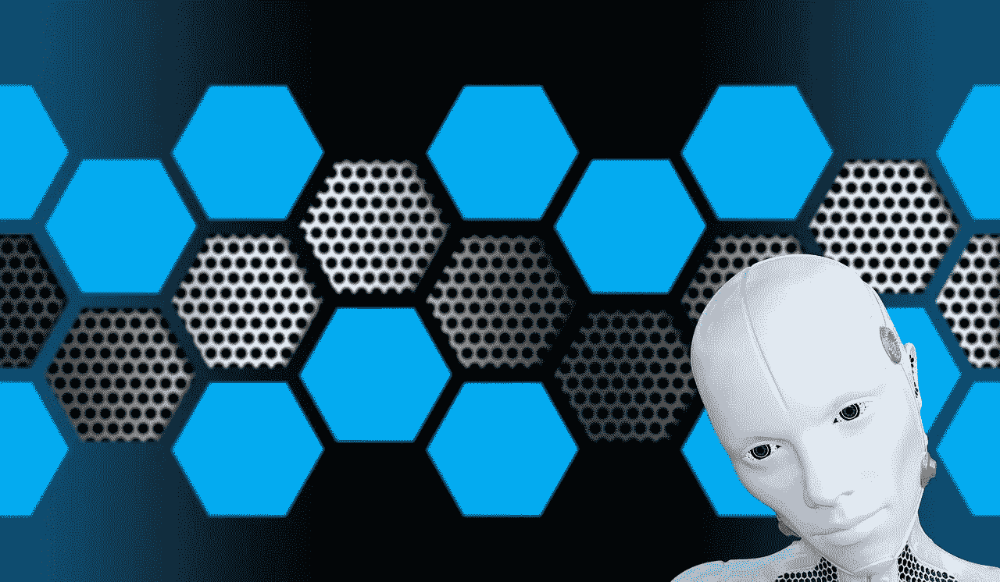

# 成为半机械人意味着什么

> 原文：<https://medium.datadriveninvestor.com/what-it-means-to-become-a-cyborg-abe68e58552?source=collection_archive---------31----------------------->

在过去的 100 年里，与之前的一千年相比，人类已经见证了进化的剧烈步伐。虽然我们还没有预测到 20 世纪 50 年代所有家庭都拥有私人机器人管家的未来，但技术已经成为我们生活中重要的一部分。今天，你已经使用手机、登录电脑、访问互联网来查找信息、与他人交流并完成一些工作。尽管一些社会阶层害怕技术对他们工作的影响以及它的“黑箱”性质，但它的普遍性是一个不可回避的事实。有鉴于此，我们如何主动利用技术来改善我们的生活，而不是简单地对它做出反应？

# 你已经是半机械人了

你可能没有想到，但事实上你是一个机器人。虽然我们没有植入，但我们确实随身携带了一部手机，它可以让我们与 1000 公里外的人通话，并找到我们可能有的任何问题的答案。因此，事实是，尽管你可能认为你是一个简单的人，但你实际上已经成为一个半机械人，一个通过技术超越了先天生理限制的人。

因此，你与技术的关系必须需要一种更有意识的方式来看待它在你生活中的作用，因为数据现在是你扩展思维的一部分。正如罗宾·夏尔马所说，“头脑是一个极好的仆人，但也是一个可怕的主人”

我们非常容易与技术产生不健康的关系。我们可能会落入精心设计和工程产品的廉价多巴胺陷阱，让我们不断回来，浪费时间和精力，但不会帮助我们在人类生活中前进。一项针对美国 13-18 岁青少年的[研究](https://journals.sagepub.com/doi/10.1177/2167702617723376)显示，48%每天花 5 个小时或以上打电话的人曾想过自杀或为此制定计划，相比之下，28%的人每天花 1 个小时打电话。其中一个关键因素是社交媒体，它受到光环效应的影响，人们倾向于只展示他们生活中的“精彩片段”，让我们将自己的现实与他人虚构的完美进行比较

# 让技术为您服务

在专业领域，有很多关于电子邮件超载以及技术带来的不断来电和干扰的讨论。克服这一点需要文化上的转变，只有在真正必要的时候才征求别人的意见，并且在我们自己的生活中，学会避免陷入这样一个陷阱，即认为我们遇到的大多数事情都是紧急或重要的。

然而，有一条前进的道路。让我们来看看能让我们成为超人的一些关键技术:

-在任何地方获取知识的能力，使我们能够专注于获取信息和技能，而不是纯粹的事实

-与任何人沟通的能力，提供了保持远距离社会联系的机会，并以很少的开销建立了商业联系

-自动化的机会，从而将我们从大量的忙碌工作中解脱出来，并能够专注于真正推动前进的工作

利用这些机会需要与技术建立更健康的关系，积极主动地设计我们的生活，并从根本上了解我们要去哪里，以及什么是实现目标的真正关键

我们不必害怕与机器融合。看看今天的自己，我们已经和手机有了共生关系。这些提供了近乎即时的获取知识的途径，让我们超越身体的限制，与世界上的任何人交流。要克服的关键问题是让技术为我们服务，而不是简单地接受廉价的多巴胺注射。为了实现这一目标，我们需要采用更主动的工具，并在设计我们的生活时考虑到技术可以发挥的作用

*原载于*[*www . spirit labs . fr*](https://www.spiritlabs.fr/blog/what-it-means-to-become-a-cyborg)*。*