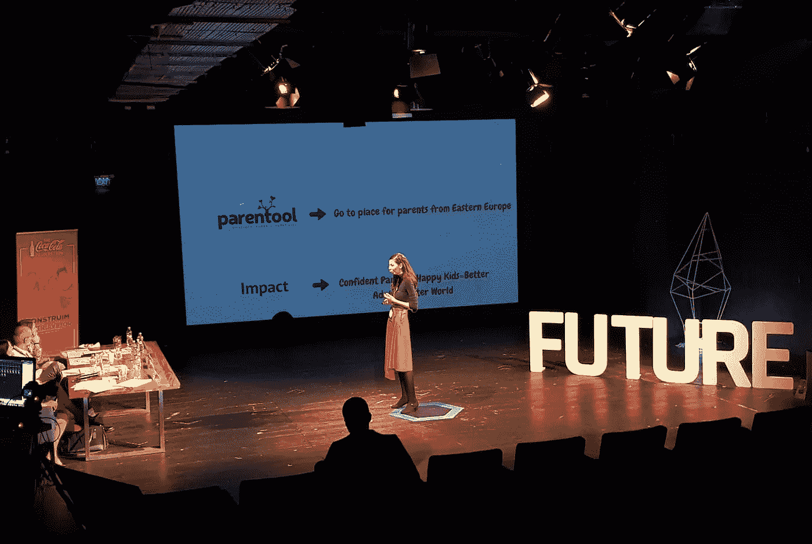
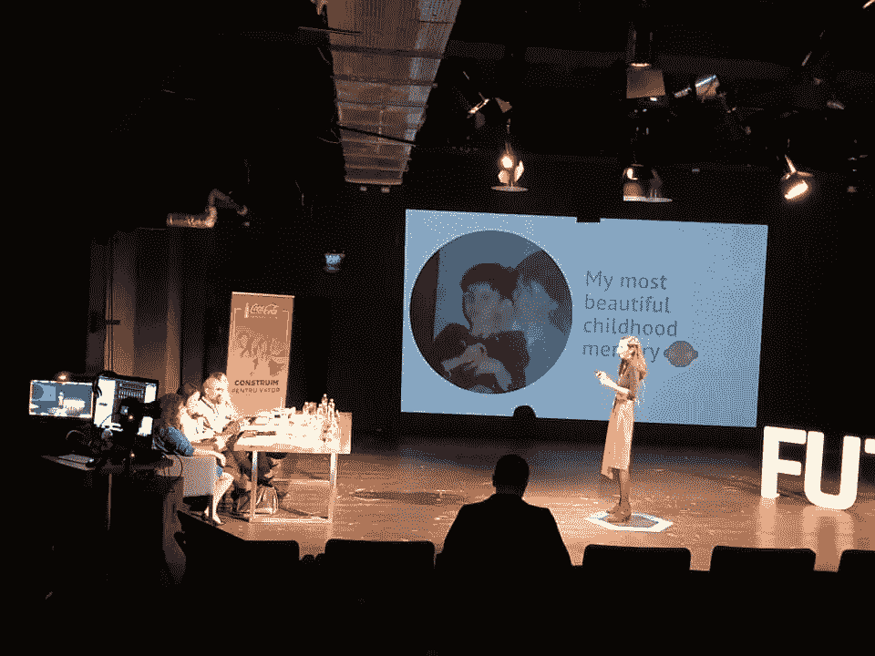
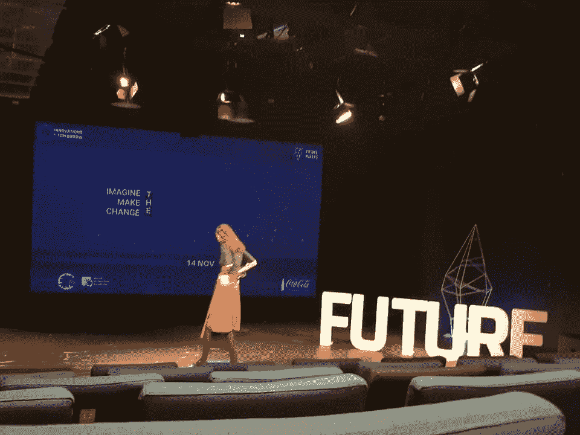

# 我从第一次投球经验中学到的是

> 原文：<https://medium.datadriveninvestor.com/what-ive-learned-from-my-first-pitching-experience-39c4fe789636?source=collection_archive---------19----------------------->

大家好，

我最近发现，表达自己的最好方式之一是写下我的感受/故事/经历。

我刚从那次你必须分享的经历中回来，我想就此写几句话。

好的。现在说得够多了。

我不知道你们中有多少人知道我以前的文章，但在过去的 4 个月里，我一直是一个名为[未来创造者](https://futuremakers.ro)的孵化项目的一部分(绝对喜欢这个名字)，在那里我已经为我的梦想工作了很多很多小时:Parentool。

昨天我们进行了决赛，这是我第一次在陪审团面前提出我的想法。我有一些学习要点想和你分享。

我们开始吧:

1.  **成为你！**

我是那种相信真实的人，相信我做的每件事都带有个人色彩。球场也不例外。我拥抱了我所有的情感和恐惧，我完全以我自己的身份去了那里:带着 rom-english 单词、鬼脸和我糟糕的背部姿势。但这完全没问题，因为每一秒钟我都是我自己。看下面我在说什么。:D

**2** 。故事很重要！

与上面的观点相联系，故事是那些让人们与你联系的故事。所以不要害怕分享你的个人故事:最初的那个。你为什么要做你想做的事？你的行为背后是什么？你的动机是什么？作为一个人，它与你有什么联系？

**3** 。**重复。重复重复**

我必须承认一些事情:我喜欢公开演讲，以前我不能重复很多次，因为我有这种信念和恐惧，同时，我的演讲听起来像是机器人说的，而不是人。但这一次，我尝试了一些不同的东西，我已经重复了很多很多次。在我男朋友面前，在其他队伍面前，在我脑子里。我必须告诉你，这是最好的决定，因为在一个音高时钟滴答作响，你必须确切地知道你想传送什么。

**4。** **3 分钟足够了**

我们有 3 分钟的推介时间和 12 分钟的问答时间。虽然这听起来很难做到，但如果你能抓住你想说的每件事的本质，3 分钟就足够了。

**5** 。胜利并不代表一切！

当谈到胜利时，我认为一切都是观点的问题。因为获奖只是最终的目的地，但最重要的其实是旅程。因此，尽管你可能不会赢得奖金，但花几分钟时间反思一下你的经历，意识到你已经走了多远。不，这不是胡说。这是一个选择的问题。:)

**6。** **记住你是在和人说话。不是机器人！**

虽然陪审团的成员一开始可能看起来很吓人，但是请记住他们实际上也是人。所有人对你所展示的东西都有不同的观点、心态和过滤器。所以和他们说话，就像和真实的人说话一样，没有隐藏的议程。我们都能感受到真实的意图。他们也不例外。:)

## 就“技术”提示和技巧而言:

*   *吃。喝水。多喝水。吃*

尽管你肚子里充满了蝴蝶，但不要忘记吃东西和补充水分。

*   *保持你的演示简单*

用图片，图形和较少的文字。少即是多…至少在投球方面。

*   *准备一份问题清单*

列出他们可能会问我的问题:从动机，到技术，促销和财务方面。

*   *习惯设置*

我们在一个剧院的舞台上表演，所有的灯光都很华丽，很多人都盯着你看。所以为了适应它，利用休息时间去那里，把你自己展现在光中。

*   *寻求反馈*

不管结果如何，去陪审团那里寻求反馈，这样可以改善你未来的经历。

*   *心怀感激*

因为我在那里，因为我有机会，因为我做了一些对你来说很重要的事情。

就是这样，伙计们！希望对你有帮助！

页（page 的缩写）斯:还有一点:不要忘记，最终，人是重要的。

页（page 的缩写）附注:我完全推荐未来创客计划:与罗马尼亚一些最聪明的人一起的最佳体验。这种经历让你对更好的自己和更好的世界充满信心和信任。