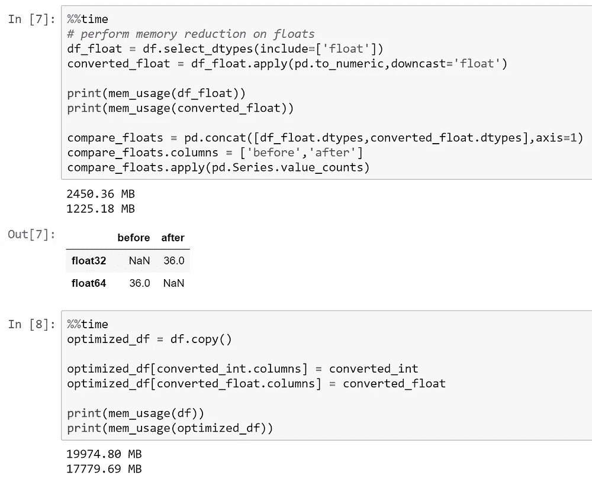
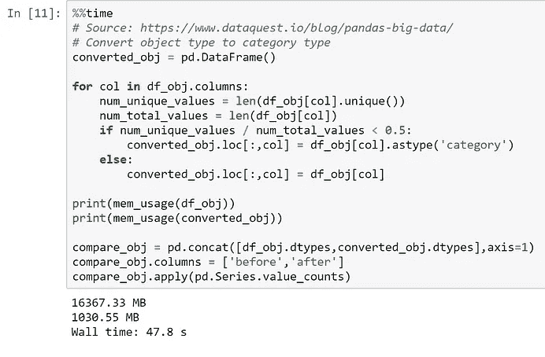
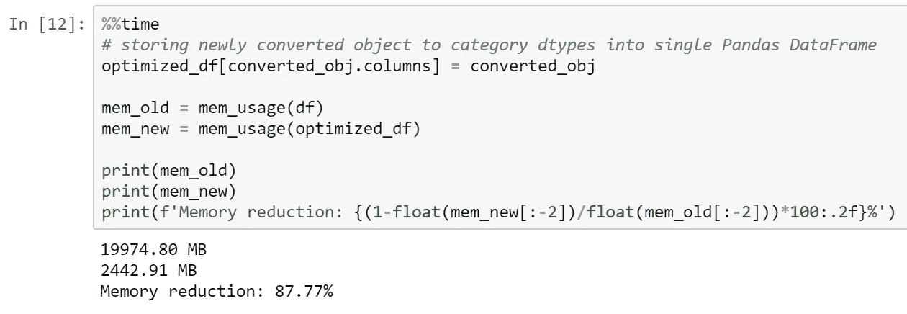
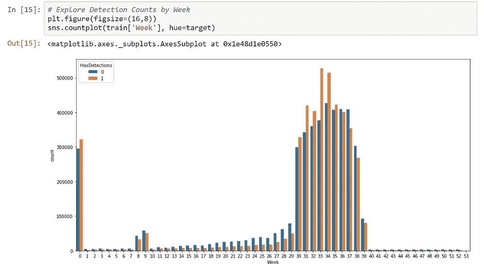
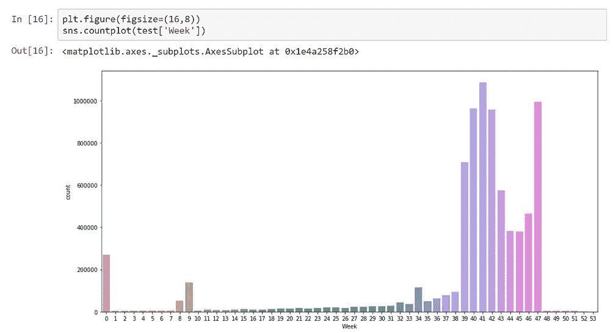
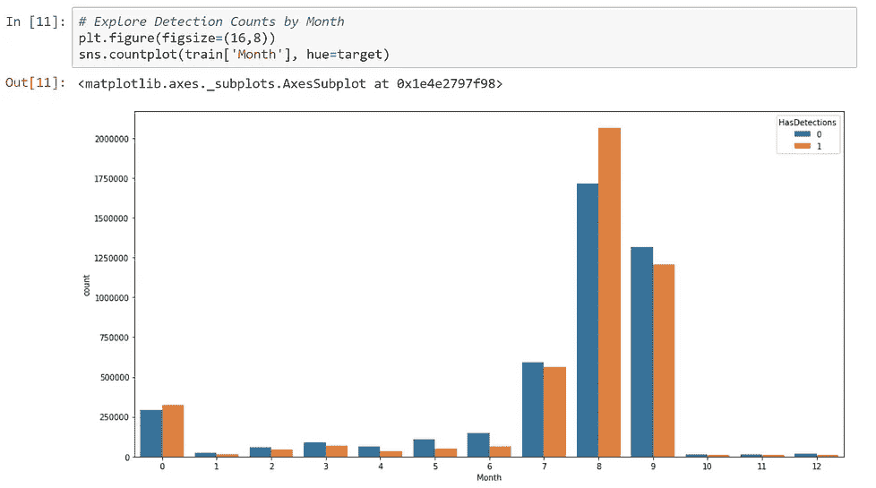
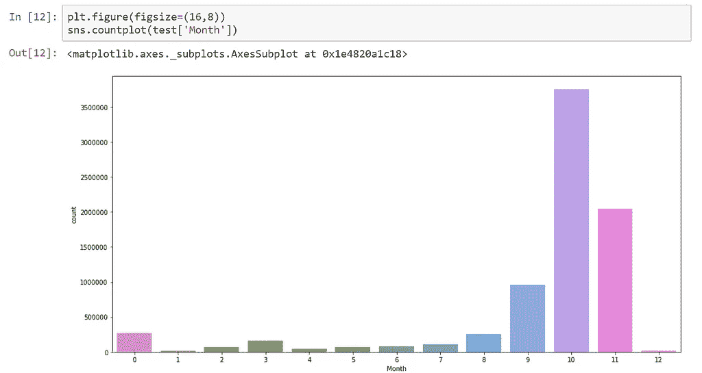

# 我所学到的:Kaggle 上的微软恶意软件预测竞赛

> 原文：<https://medium.datadriveninvestor.com/what-ive-learned-microsoft-malware-prediction-competition-on-kaggle-3c8189dcc850?source=collection_archive---------0----------------------->

[](http://www.track.datadriveninvestor.com/1B9E)

作为我使用应用人工智能课程的机器学习之旅的一部分，我决定尝试解决 Kaggle 主持的一个现实世界的问题，并写一篇关于一些挑战的详细博客。


source: google images

我表现如何？我很幸运地在 2426 支参赛队伍中获得了银牌或前 4%的成绩。这不是我通常会吹嘘的事情，因为我并不追求外部奖励，而是在获得应用机器学习的经验后。但是，一枚银牌显示了我在这个项目上倾注的努力。

[](https://www.datadriveninvestor.com/2019/03/03/editors-pick-5-machine-learning-books/) [## DDI 编辑推荐:5 本机器学习书籍，让你从新手变成数据驱动专家…

### 机器学习行业的蓬勃发展重新引起了人们对人工智能的兴趣

www.datadriveninvestor.com](https://www.datadriveninvestor.com/2019/03/03/editors-pick-5-machine-learning-books/) 

# 序

我将在下面的 Jupyter 笔记本中展示的解决方案不会详细介绍我为获得最终提交分数而提交的确切解决方案，因为它将包括一个过于复杂和不切实际的模型集合，与笔记本中展示的单个模型相比，它只增加了微小的改进。此外，本笔记本不会讨论 Kaggle 公共/私人排行榜差异的复杂性，这些差异导致许多公共 LB 排名靠前的参与者在私人 LB 中大幅下降。我将主要讨论方法论，以及理解如何有效地解决诸如微软恶意软件预测挑战这样的问题。

# 问题概述—


[https://www.kaggle.com/c/microsoft-malware-prediction](https://www.kaggle.com/c/microsoft-malware-prediction)

https://www.kaggle.com/c/microsoft-malware-prediction/data

> 该竞赛的目标是根据计算机的不同属性，预测 Windows 计算机被各种恶意软件感染的概率。包含这些属性和机器感染的遥测数据是通过结合由微软的端点保护解决方案 Windows Defender 收集的心跳和威胁报告而生成的。

# Jupyter 笔记本

[链接到 GitHub 上的笔记本](https://github.com/timyee90/Microsoft-Malware-Prediction/blob/master/Case%20Study%20-%20Microsoft%20Malware%20Prediction.ipynb)

# 挑战

1.  大型数据集
2.  缺少值
3.  分类特征编码
4.  特征工程
5.  非固定特征—对抗性验证
6.  测试指标:曲线下面积(AUC)
7.  初级 ML 模型

## 大型数据集

训练和测试数据的大小分别为 900 万和 800 万行。总共有 81 个特征，其中 52 个是分类的，其中 23 个是数字编码的，以保护信息的隐私。考虑到大型数据集，有几个因素有助于减轻处理大型数据集的负担。

了解数据类型(dtypes)。当训练数据完全加载到工作内存(DRAM)中时，Pandas 在不使用最佳数据类型的情况下大约需要 17–20GB。在 [dataquest.io](https://www.dataquest.io/blog/pandas-big-data/) 的帮助下，我能够将它一直降低到 2.4GB。

下面的代码快照演示了如何快速地将 Pandas 数据帧优化为减少内存占用的数据类型。



A quick and dirty way to convert un-optimized dtypes to more optimal ones

因为许多整数/浮点数可以进一步转换成无符号整数(uint)，所以内存占用可以进一步减少。(无符号整数可以保存两倍于有符号整数的正值，即-128 到 127，而 int8 和 uint8 分别为 0 到 255。)但是，出于功能工程的考虑，一些数字功能保留了浮点 32(float32)数据类型，因为大多数硬件和软件本身不支持低于 float32。在几乎所有的场景中，都避免使用 float64/int64，因为这些特性本身并不大，也没有必要进行科学计算。所有二进制特征(0，1)都被转换为 int8 或 uint8。从这个角度来看，如果一个数据单元的数据类型为 int8，那么它需要 8 位或 1 字节的存储容量。如果我们加载一个包含 9，000，000 行的训练数据集，并假设整个数据库使用 int8 dtype 存储，则每个功能将占用 9 MB (9，000，000 * 1 字节)，或 RAM 中的 729 MB 内存。然而，这个计算是绝对的最小值。

下一个挑战是导出优化的 Pandas dataframe 对象以便快速检索。Pickle 不在选项之内，因为它不能处理大文件。所以我做了一些研究，发现了[羽毛](https://blog.rstudio.com/2016/03/29/feather/):

> Feather 是一种快速、轻量且易于使用的二进制文件格式，用于存储数据帧。它有几个具体的设计目标:
> 
> 轻量级、最小化的 API:尽可能简单地将数据帧推入和推出内存
> 
> 与语言无关:无论是用 Python 还是 R 代码编写，Feather 文件都是一样的。其他语言也可以读写羽毛文件。
> 
> 高读写性能。如果可能，羽化操作应该受本地磁盘性能的限制。

与使用熊猫读取数据帧相比，Feather 的速度有多快？通过使用固态硬盘(SSD ),我将每个训练/测试数据集的加载时间从大约 1 分钟减少到平均每个训练/测试数据集不到 2-3 秒。我现在可以将大型数据集加载到工作内存中，并在最短的停机时间内执行代码。这就是使用 Pandas 读取. csv 文件和使用 feather 读取. ft 文件的区别。不相信我？你自己试试吧。

```
# Loading the dataframe object using feather
train = feather.read_dataframe('train.ft')# Saving the dataframe object using feather
train.to_feather('train.ft')
```

## 缺少值

由于各种原因，数据集经常包含缺失值。一个例子是——一家公司并没有积极收集信息，直到某个业务部门指出这可能是一条很好的信息，可以收集、研究并使用它来改进或建立一个 ML 模型。也可能是——特定数据点的信息不存在。一个例子可能是不在可填写表单中填写可选信息。

首先，我们如何弄清楚如何确定哪些行丢失了？汇总所有缺失值的简单方法是使用。熊猫图书馆内的 isnull()。

```
# a simple way to summarize all missing values along the column
train[train.isnull().any(axis=1)]# summarize all missing values along the row/index
train[train.isnull().any(axis=0)]
```

现在我们知道了哪些值丢失了，我们的工具箱中有几个选项来处理丢失的值。

1.  删除缺失值-根据要素(列)中缺失的数据点的百分比，我们可能希望也可能不希望删除整个列。
2.  估算缺失值-这是用系统方法替换缺失值的时候。选项包括:平均值、中值、模式或基于模型。

*   均值插补-如果是数值特征，则用特征中非缺失值的均值替换缺失值。
*   中位数插补-如果是数值特征，则用该特征中非缺失值的中位数替换缺失值。
*   模式插补-用数值和分类特征的非缺失值模式替换缺失值。
*   基于模型的插补-构建模型来预测(分类/回归)缺失值。

我应该提到，除了熊猫内部通过将缺失值表示为 np.nan 来处理缺失值这一事实之外，表示缺失值的一些常见方法是，您可能有一个在内部标识缺失值的功能。对于分类，它们可以是“未知”或“无”，对于数值，它们可以是-1。每个数据集都是不同的，了解缺失值的不同表示方式会有所帮助。在现实世界中，您可能与一位数据库工程师一起工作，他可能知道数据是如何存储的内部工作方式，并且理解其中的复杂性。对于这个数据集，我必须自己去发现一切。

当然，任何时候你估算一个缺失值时，也指出你是否通过一个额外的二进制特征[0，1]估算该值可能是一个好主意。有时这是有益的，可以帮助改进机器学习模型一点点。

## 分类特征

下一个主要障碍是将数据集插入任何机器学习模型。然而，范畴特征是一个需要克服的主要问题，因为我在 ML 课程中还没有研究过范畴特征。我最初的反应只是对所有的分类特征进行热编码。我很快意识到这将带来更多的问题，也就是说，我正在处理具有高基数的分类特性。高基数是指分类要素包含高度唯一的值。例如，“AvSigVersion”是表示反病毒定义版本的特征，其可以每天更新。这样的分类特征包含成千上万的独特特征。所有 O **ne-Hot-Encoding** 要做的就是创建 10k 或更多以二进制格式编码的虚拟特征——仅仅是为了那个特征。这不是一个小问题。想象 900 万行乘以 10k 个特征再乘以 1 个字节。也就是说，仅在这一项功能上执行一次热编码，就会将 9MB 的数据变成 90GB。当然，有一种方法可以使用稀疏编码特征的密集表示，即使用稀疏矩阵。稀疏矩阵只将非零值存储到三个数组中。一个存储非零数据值，另一个存储行索引，另一个存储列索引。因此，虽然我们可以对整个训练序列进行一次热编码，并测试成稀疏 int8 dtypes，但并不是所有的 ML 模型都表现良好。此外，尽管用稀疏格式解决了空间复杂性，时间复杂性可能很难管理。事实上，唯一的选择是*平均目标编码*、*序数编码*或*频率编码*。

利弊如下:

*   **频率编码**:用唯一值在整个训练数据中出现的频率替换唯一类别。
*   **序数编码**:用整数编码替换唯一的类别，即 1、2、3……缺点是，类别之间没有序数关系，例如，SSD 与 HDD 没有序数关系，因此我们告诉机器学习算法，这两个类别之间存在自然关系。
*   **平均目标编码**:用特定类别的平均响应替换唯一类别。特定反病毒签名版本的平均响应可以是 0.50，其中 0 是最小值，1 是最大值。在这种情况下，如果检测数量(1)与无检测数量(0)相等，分别为 500 和 500，则平均响应将为 500/1000 或 0.5。这就是*的意思反应或目标。*使用这种编码方法的主要缺点是，虽然它可以很好地工作，但它会使模型过度适应训练数据，并且在样本外数据中表现较差。可以采取预防措施，通过使用样本外数据或类似交叉验证 k-fold 的方法计算类别的平均响应来防止过度拟合训练数据。换句话说，在平均响应/目标的情况下，我们仅使用训练数据的一部分来计算训练数据的不同部分。

```
# source: [https://www.kaggle.com/artgor/is-this-malware-eda-fe-and-lgb-updated](https://www.kaggle.com/artgor/is-this-malware-eda-fe-and-lgb-updated)def frequency_encoding(variable):
    t = pd.concat([train[variable], test[variable]]).value_counts().reset_index()
    t = t.reset_index()
    t.loc[t[variable] == 1, 'level_0'] = np.nan
    t.set_index('index', inplace=True)
    max_label = t['level_0'].max() + 1
    t.fillna(max_label, inplace=True)
    return t.to_dict()['level_0']for col in tqdm(categorical):
    freq_enc_dict = frequency_encoding(col)
    train[col] = train[col].map(lambda x: freq_enc_dict.get(x, np.nan)).astype('float32')
    test[col] = test[col].map(lambda x: freq_enc_dict.get(x, np.nan)).astype('float32')
```

*重要提示*:我上面分享的代码结合了训练和测试，仅出于比赛目的利用数据泄露。在现实世界中，不能也不应该使用这种方法。数据泄露是每个机器学习工程师和数据科学家真正关心的问题。它是指来自测试集的尚未被看到的信息在训练时变得可用。对于训练数据在建立模型时不应该知道的信息的预见，可能会导致偏见，或者更糟的是，导致从业者认为他们的机器学习模型泛化比实际情况要好。这种做法可能很危险，在实际应用中应该避免。

幸运的是， [LightGBM](https://lightgbm.readthedocs.io/en/latest/) 通过整数(序数)编码来处理分类特征 i [，这对于基于树的模型来说不是一个主要问题。](https://lightgbm.readthedocs.io/en/latest/Advanced-Topics.html)[另一方面，CatBoost](https://catboost.ai/docs/concepts/about.html) 也在内部处理分类特征，除了使用上述具有平滑常数的平均目标编码方法的变体。

在 Jupyter 笔记本中，显示执行了频率编码，然后按降序对每个类别的频率进行排序。在排序的频率之上，执行标签编码。首先，频率编码有什么好处？如果盲目/不正确地使用，没有任何效果，或者可能会产生负面效果。如果使用正确，排序频率编码可以提供改善模型性能的好处。

排序频率编码如何提供改进模型性能的好处？如果排序频率与我们试图预测的目标(恶意软件检测率)相关，那么排序频率编码将是一种更智能的编码形式。

*注*:基于我刚刚提到的单热编码的问题，在比赛期间，一个竞争对手 **Vladislav Bogorod** 发布了一个 Kaggle 内核，展示了如何使用单热编码来执行 LightGBM。他优雅的解决方案完全在 Kaggle 内核中运行，仅使用 17GB 内存。如果你想看他出色的解决方案，请点击下面的链接。[https://www . ka ggle . com/bogorodvo/light GBM-baseline-model-using-sparse-matrix # L209](https://www.kaggle.com/bogorodvo/lightgbm-baseline-model-using-sparse-matrix#L209)

## 特征工程

一旦我们考虑到缺失值(NaN ),理论上我们可以将整个训练数据插入 LightGBM。然而，提高模型性能的一个主要因素是手工制作机器学习模型可以从中提取意义的新特征。为了让您对新制作的特性有所了解，我采用了一些数字特性，比如 CPU 内核数，并除以 RAM 容量。

```
# create a new feature that combines the interaction between RAM and CPU
train['cpu_ram_ratio'] = train['Census_TotalPhysicalRAM'] / train['Census_ProcessorCoreCount']
```

另一个数字特征显示纵横比。

```
# Horizontal Resolution/ Vertical Resolution
train['aspect_ratio'] = train['Census_InternalPrimaryDisplayResolutionHorizontal'] / train['Census_InternalPrimaryDisplayResolutionVertical']
```

最后，分类特性的特性工程示例是将包含版本:AvSigVersion—‘1 . 273 . 1144 . 0’的字符串拆分为四个独立的特性。因为小数分隔了数字，所以我们可以使用。split()方法。

```
# this extracts the numerical value before the first decimal place train['AvSigVersion1'] = train['AvSigVersion].apply(lambda x: x.split('.')[0] 
```

特征工程是一个很难详细讨论的话题，因为它既是艺术形式又是科学。为了充分理解特征工程以及如何最好地执行特征工程，需要对具体特征进行详细分析，包括分解特征-特征相互作用的图表，以及关于工程特征是否为模型提供额外益处的试错测量。我选择跳过这一步的讨论，因为我绝不是这方面的专家，我的经验也不允许详细讨论。

因为我还在学习，不明白如何在比赛中恰当地创建功能之间的交互，所以我将链接到一个顶级竞争对手，在赛后讨论他们的解决方案。因为他们最能解释我不能解释的复杂细节。[全写](https://www.kaggle.com/c/microsoft-malware-prediction/discussion/84069)和[代码块](https://www.kaggle.com/c/microsoft-malware-prediction/discussion/84069#490893)

## 非固定(不稳定)特征

这场竞赛中最重要的考虑因素之一可能是，数据集至少包含 5 个随时间推移而具有不稳定或不稳定值的要素。AvSigVersion(防病毒签名版本)、EngineVersion、AppVersion、Census_OSVersion(操作系统版本)和 Census_OSBuildRevision 包含在训练数据中看不到的测试值。以至于一个简单的对抗性验证可以在单独使用这 5 个特征的训练和测试数据之间找到强有力的分离。**对抗性验证**是一种将训练和测试数据集合并成单个数据集，并应用伪标签 0 进行训练和 1 进行测试的技术。例如，如果简单的分类器可以实现高 AUC，那么可以说训练和测试数据集不是来自相同的分布。为了实现可靠的交叉验证(CV ),可以很好地概括看不见的(测试)数据的性能，训练和测试数据集不应该被简单的机器学习分类器分离。

```
# Create Pseudo-Label
train['label'] = 1
test['label'] = 0
train['label'] = train['label'].astype('uint8')
test['label'] = test['label'].astype('uint8')# combine train and test 
total = pd.concat([train, test], axis=0)
psuedo_label = total['label']
total.drop(['label'], inplace=True, axis=1)
total.reset_index(drop=True, inplace=True)
```

通过在训练和测试之间的所有 1700 万个数据点上使用 LightGBM，LightGBM 能够实现远超过 0.9 的 AUC，这表明一些或所有特征导致了训练和测试数据之间的差异。为了研究哪些特征有助于高 AUC 度量所指示的高度训练/测试可分性，我通过按重要性丢弃顶部特征并使用默认参数重新运行 LightGBM 来执行正向特征选择。

基于我的对抗性验证，结合转发特征选择，进一步 EDA 上的事。我认为有五个不稳定的特征。理论上，模型不可能利用包含看不见的值的特性。

现实生活中的问题很少没有这些非平稳问题。通过在我的 ML 武器库中添加对抗验证来学习检测不稳定特征给了我信心，我将知道如何处理未来的非平稳性问题。

然而，单独的对抗性验证不足以揭示训练和测试(样本外)数据之间的差异的本质。为了说明这一点，我们来看看从微软[网站](https://www.microsoft.com/en-us/wdsi/definitions/antimalware-definition-release-notes?RequestVersion=1.289.460.0&Release=Released&Package=AM)上刮下的 [AvSigVersion 日期](https://www.kaggle.com/c/microsoft-malware-prediction/discussion/74593#483795)。



AvSigVersion Weekly Dates



AvSigVerion Monthly Dates

这里我们可以看到火车中的 AvSigVersion 日期在第 30–39 周(7 月-9 月)被高度采样。然而，测试中的 AvSigVersion 日期在第 39-49 周(9 月-11 月)被高度采样。因为这些日期不是微软提供的原始数据集的一部分，所以很难(但不是不可能)确定非平稳性的程度。

我应该指出一个事实，我们不知道微软是如何采样训练和测试数据的。来自微软恶意软件[数据集描述](https://www.kaggle.com/c/microsoft-malware-prediction/data):

> 用于创建此数据集的采样方法旨在满足某些业务约束，包括用户隐私以及机器运行的时间段。恶意软件检测本质上是一个时间序列问题，但随着新机器、在线和离线机器、接收补丁的机器、接收新操作系统的机器等的引入，问题变得更加复杂。虽然这里提供的数据集已经大致按时间划分，但上面提到的复杂性和采样要求可能意味着您可能会看到您的交叉验证、公共和私人得分之间的不完美一致！此外，该数据集并不代表微软客户在野外的机器；它已被取样，包括更大比例的恶意软件机器。

除了微软没有详细解释其采样方法这一事实之外，建立一个可以跨时间进行概括的模型是极其困难的。从训练数据中可以清楚地看出，与训练数据集中高密度采样聚类之外的月份相比，7 月至 9 月的高密度采样中的 has 检测率更高。

我试着在我自己的 LGBM 模型中包括不稳定的特性。由于其他竞争对手没有删除这些功能，而是想出技巧和独创性来保留这些不稳定的功能，我决定设计一些我自己的功能，这里是。

## 曲线下面积

在这场特别的 Kaggle 竞赛中，我想我理解了 AUC 指标。然而，我震惊地发现我的理解是非常基础和无知的。我认为 AUC 只是一个结合 TPR 和 FPR 的指标，对类别不平衡不敏感，是区分类别标签的良好指标。

我现在对 AUC 的理解是，AUC 下的预测概率并不重要。AUC 中唯一重要的是预测相对于彼此的排序或定位。这意味着，您可以将预测的概率乘以一个常数，如 5，预测的顺序不会改变总的 AUC 分数。例如:

```
# the following predicted probabilities produce an AUC as below 
[0.5, 0.6, 0.1, 0.9, 0.8]# this has the same relative position and thus same AUC score above
[0.3, 0.45, 0.1, 0.88, 0.79]
```

为什么微软、研究人员和 Kaggle 使用 AUC metric？为什么不是 F1 成绩？为什么不精确和召回？首先，为了促进公平竞争，必须使用单一指标来确定哪个模型或模型集合产生最佳性能。也就是说，AUC 更适合于微软和研究人员聚集所有 Kaggle 竞争对手的预测文件，以确定可能具有低/高检测率的特定机器，因为预测的*顺序*同样重要，如果不是比预测的概率更重要的话。关于诸如恶意软件检测率随时间变化之类的时间序列问题，微软和安全研究人员可能能够具体地看到哪些计算机随着时间的推移保持被感染，哪些计算机的恶意软件检测状态随着时间的推移发生了变化。微软的反病毒 Microsoft Defender 和高级威胁保护(ATP)的检测率很可能会随着时间的推移而下降，但是，为了了解其安全改进的有效性，他们还需要了解以前检测到恶意软件的同一台计算机是否也在定期进行反病毒定义更新。考虑检测概率随时间减少的情况。由于时间序列是一个关键因素，因此拥有一个可以衡量预测排序的指标将是谨慎的。

关于 AUC 预测概率方面的一个注释。没有必要为这次比赛进行校准，因为我们没有直接解释模型的概率输出。

## 初级 ML 模型

鉴于高基数的分类特征的困难，有限的硬件资源(CPU、RAM、GPU)。能够处理缺失值，以最小的内存占用处理分类特征的最佳 ML 模型快速产生模型，并且具有高性能的是基于树的集成模型，即 LightGBM，该模型已由微软在 2017 年开源。使用 Scikit-Learn 等流行库来构建支持向量机(SVM)等模型的一些问题是，它们不在内部处理分类特征，需要用户手动编码特征，这非常耗时。哪种方法是正确的很大程度上取决于您使用哪种 ML 模型。此外，许多 Scikit-Learn 库不支持 GPU，并且不能利用所有的 CPU 资源。当大多数 ML 实践者没有花费几天，也许几周的奢侈来超参数调整高度时间复杂的模型，如 SVM 时，这造成了限制。

# 商业考虑

1.  恶意软件预测—防病毒定义更新、操作系统版本更新
2.  延迟考虑—预测/推理速度
3.  权衡取舍

## 恶意软件预测

恶意软件预测本质上是一个时间序列问题。还有很多其他的考虑。某些硬件配置是否更容易受到特定类型恶意软件的攻击？一系列防病毒定义更新是否降低了检测率，因为它们使用高级安全技术阻止了威胁？Microsoft Windows 的一项功能是否降低了对各种恶意软件的检测？(即 SmartScreen、PUA 模式)某些网络浏览器(包括 Internet Explorer)比其他浏览器更能降低恶意软件检测率吗？这些是重要的考虑因素。

其中一个解决方案 post competition 讨论了他们如何能够通过使用 SKU _ Edition Pro/Home 比率和(企业+服务器)/Home 比率来创建财富代理，此处。

作为一名数据科学家或机器学习工程师，就在原型制作期间从 ML 模型中榨取最后一点性能而言，询问这类关于数据的问题对于从数据集中提取最多信息至关重要。

## 运行时资源利用率，客户烦恼


source: google images

在为微软视窗开发与软件相关的功能时，用户是否拥有最先进的硬件和网络能力来处理微软所提供的最佳功能？例如，微软只向企业客户提供某些高级功能。即使微软开发了基于 AI 的保护，如“针对 apex 级别病毒和恶意软件威胁的高级云机器学习和基于 AI 的保护”，硬件和网络也可能是次优的。一个更普遍的“机器学习和基于人工智能的病毒和恶意软件威胁防护”解决方案可能会允许即使是低端硬件也能运行。

如果微软开发的安全功能不够轻量级，笔记本电脑、平板电脑和运行旧硬件的机器都无法处理，那么用户的反馈很可能会很差。想象一下，例如，反病毒定义文件很大，下载时间很长，安装(更新)时间很长，并且占用大量资源(处理器、内存)。这当然会引起微软 Windows 用户的抱怨。对于任何用户来说，在所有内核和线程上运行防病毒软件来扫描文件中的恶意软件都是不理想的。如果每次从互联网下载文件时都有一个弹出窗口，要求用户允许下载和安装，许多用户可能会感到恼火。然而，这是微软选择的安全特性。想象一下，如果您的计算机必须在每 12 小时推送一次防病毒更新后重新启动。

如果你是一名机器学习工程师，必须训练一个模型数小时或数周，而机器自动重启以进行功能/安全更新，你肯定会对浪费的时间和金钱感到沮丧。可变成本包括电费或云服务时薪。

在开发安全功能和防病毒更新时，硬件限制、网络带宽、运行时的资源利用率和用户体验是非常重要的考虑因素。普通用户更愿意在后台进行反病毒扫描文件，而不是耗尽他们所有的计算机资源。大多数用户不愿意被提示用户许可的安全特性所困扰。

## 权衡取舍

这让我想到了无处不在的需求，而不是绝对前沿的人工智能保护和基于 ML 的模型。在拥有微软最新和最强大的保护包之间必须有所取舍。这就是**产品细分**发挥作用的地方。想想网飞高清(1080p)对网飞 UHD (4K 内容)。企业客户完全有能力为微软提供的最新、最好的安全功能/更新支付高价，而大多数消费者(家庭版和专业版)却没有这种能力。企业客户甚至可以负担得起多种安全解决方案。通过向软件产品添加不同的功能，它使企业能够扩展其业务并迎合不同的客户群，从而可以获取最大的利润，而不会牺牲那些可能没有必要资金的客户的核心功能。

# 关闭

最后，这是我第一次参加 Kaggle 比赛，我尽力向其他人学习。我还尽最大努力应用我从[应用人工智能课程](https://www.appliedaicourse.com/)中学到的一切，这些课程给了我理解如何处理类似的人工智能问题的基本工具，以及在现实世界中部署人工智能模型的实用方法。我觉得这次比赛磨练了我获取真实世界数据并将 ML 模型应用到下一个水平的 ML 技能。然而，仍然有太多的东西需要学习，太多的东西需要改进。我希望我的读者喜欢阅读这个博客，并学到一两件事！

# 参考

1.  [https://light GBM . readthedocs . io/en/latest/Advanced-topics . html](https://lightgbm.readthedocs.io/en/latest/Advanced-Topics.html)
2.  [https://arxiv.org/pdf/1706.09516.pdf](https://arxiv.org/pdf/1706.09516.pdf)
3.  [https://wincom . blob . core . windows . net/documents/windows 10 _ Commercial _ comparison . pdf](https://wincom.blob.core.windows.net/documents/Windows10_Commercial_Comparison.pdf)