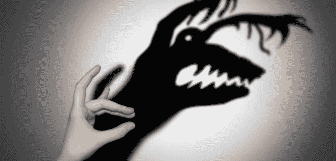
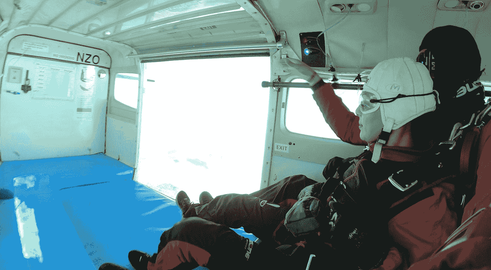
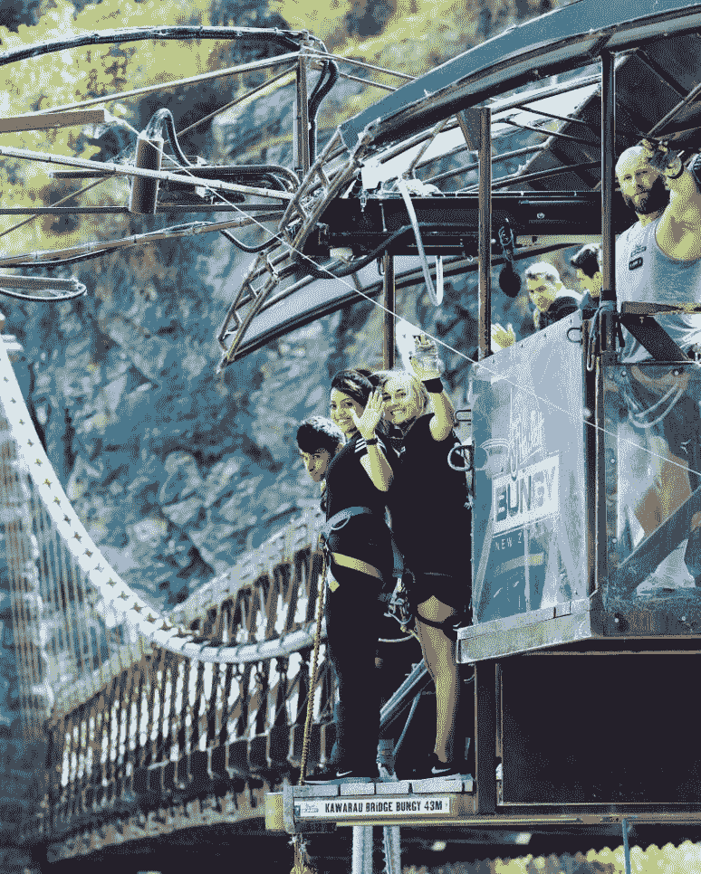

# 从飞机上跳下来教会了我什么是生活？

> 原文：<https://medium.datadriveninvestor.com/what-jumping-off-a-plane-taught-me-about-life-669f998d0f8b?source=collection_archive---------13----------------------->

“你想要的一切都在恐惧的另一边”

我相信你们中的许多人以前听说过这个，但是让我告诉你我是如何亲身经历的，以及我从这次经历中学到了什么。

# **准备就绪**

三月很特别，有两个原因——一是这是我的生日，二是我尝试了以前从未做过的事情。让我告诉你更多。

上个月，我的家人从印度和芝加哥来看我们。鉴于这是他们第一次来新西兰，我们决定给他们一些真正的新西兰式的款待。还有什么地方比皇后镇更适合做这个呢？一开始是在客厅喝着酒的随意交谈，很快就变成了我浏览 NZOne 跳伞网站，几下点击我就预订了不是 1 张，不是 2 张，不是 3 张，而是 5 张跳伞票。是的，你是对的，我们全家决定去潜水。这包括我，我的丈夫，我的姐夫，我的嫂子，还有我 70 岁的岳父。我的岳母是我们中最聪明的。她决定成为地勤人员，从地面为我们提供支持和鼓励。这个家庭流传的笑话是，如果出现问题，必须有人留下来享受我们将留下的数十亿美元:-)

 [## 面向 Noobs |数据驱动型投资者的数字身份

### 聪明人如何在增强现实中创造身份价值？我最近刚满 40 岁。作为一个生物…

www.datadriveninvestor.com](https://www.datadriveninvestor.com/2019/02/28/digital-identity-for-noobs/) 

# **期待中的**

潜水的前一天晚上，我的脑海中闪过各种情绪——焦虑、恐惧、体验新事物的喜悦，还有这可能是我在地球上的最后一个晚上的想法(正如你所知，在我活着告诉你这个故事时，没有发生这种事情)，但最重要的是，我有这种巨大的好奇心，也许在我从天空下来的路上，我可能会有这种惊天动地、突破性的经历，也许，只是也许我会找到我人生的真正目标。

# **体验**

反正这一天到了。这是你能想象到的最适合跳伞的一天——没有一丝云彩，阳光直射我的眼睛，没有风，没有戏剧。在一次简报会和一次采访之后，我看到自己穿好衣服，和我的五位家人坐在一架飞机上，当然还有我们的双人跳水教练。然后我们一直往上走。

很快我意识到 15，000 英尺不是开玩笑——我们在湖泊、草原、山脉和云层之上。然后有人打开了门，在那一刻我意识到我从来没有坐过开着门的飞机。然后我看到我的丈夫，我的弟妹，我的岳父像装满石头的麻袋一样从飞机上掉下来。下一个轮到我了，我正俯视着死亡。

我的教练让我对着镜头微笑，然后我们开始 60 秒的自由落体。在那一刻，我是自由的，我在飞翔，我活着。这是我一生中最幸福的经历。没有恐惧。我意识到最大的危险就是最小的恐惧。

好消息。舒特打开了，我们都安全着陆，讲述这个故事和一次我们将终生难忘的经历。

带着我对自由落体的新欢，我决定第二天去做 bungy。这是另一个博客的故事，但概念是相同的。这一次，只有我站在恐惧的边缘——等待冒险。

**外卖**

这件事发生一周后，当肾上腺素激增时，我开始思考。我从中学到了什么？

为什么前一天晚上我在床上会害怕？我为什么需要那种恐惧？一切都达到了临界点，没有理由害怕。它只会毁了你的一天。

***生活中最美好的事情都在恐惧的另一边，在你最大的恐惧的另一边，都是生活中最美好的事情。***

我们一生中有多少次站在恐惧的边缘。有多少次我们会因为感觉不舒服而犹豫要不要答应？

*   我们想问人们的问题？
*   我们想答应的新机会，但又担心自己不够好
*   我们想打招呼的那个人
*   我们想学的东西
*   我们想开始的那个项目

我不骗你，就在那个星期，我接到一个活动组织者的电话，问我是否愿意在大会上发言。现在，公开演讲不是我喜欢的，而是我希望喜欢的。我的梦想是在满是观众的体育场前发表主题演讲，这只是一个垫脚石。

在那一刻，我闭上眼睛，想象自己站在飞机的窗台上，答应了，没有让恐惧吞噬我。

所以，我的朋友们，你最大的恐惧是什么？你愿意迈出信仰的一大步是因为

“你想要的一切都在恐惧的另一边”