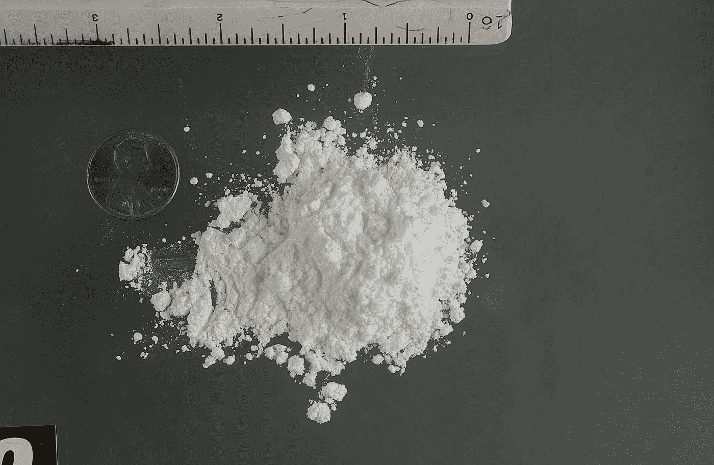

# 是什么阻止了可卡因的“美国制造”？

> 原文：<https://medium.datadriveninvestor.com/what-keeps-cocaine-from-being-made-in-usa-aed6c273101b?source=collection_archive---------0----------------------->

Image: Wikimedia

答案更多的是与新的国际分工有关，而不是毒品战争。

近年来，我们看到了对各种现有法律背后的假设进行彻底的、公开的重新审查，包括(与本文最相关的)那些监管药品和国际贸易的法律。这一重新审查为围绕前者的监禁判决和潜在非刑罪化以及后者的国内生产和进口之间的平衡——特别是因为这些与就业有关——的辩论注入了新的活力。这幅全景图引出了这样一个问题，**如果将可卡因生产引入美国可以为美国农民和工人创造就业机会并提高收入，为什么这种情况没有发生？**

自然的答案是可卡因是非法的；然而，非法并不像它看起来那么具有威慑力(我们稍后将回到这一点)。可卡因臭名昭著的血腥和破坏生态的供应和分销链也与普通美国人消费的大多数其他产品没有太大区别。甚至认为古柯(加工成可卡因的叶子植物)是不容易适应美国的热带植物的观点也站不住脚，原因有几个。这种植物有不同的种类，其中至少有一种与安第斯山高地的另一种本土作物马铃薯生长在相似的环境中，马铃薯在北美广受欢迎；这还不包括现代植物基因改造技术的进步和气候变化对我们所认为的北美降雨量和气温的影响。

除了地理上的联系，马铃薯也可以作为一个有用的例子来指出自然产品及其衍生物的国际贸易背后的一些动态。在整篇文章中，我们将把哥伦比亚作为土豆和可卡因的生产国，与美国进行比较。

根据最新的统计数据，爱达荷州(美国主要的马铃薯种植州)[的一个农民每磅马铃薯得到](https://www.ams.usda.gov/mnreports/fvdidnop.pdf) 10.5 美分，而[的零售价格](https://www.statista.com/statistics/236901/retail-price-of-potatoes-in-the-united-states/)是每磅 72 美分——686%的涨幅。昆迪纳马卡(哥伦比亚主要的马铃薯种植部门)[的一位农民每磅马铃薯获得](http://fedepapa.com/wp-content/uploads/2017/01/Cundinamarca-pagina-web-2018.pdf) 9.5 美分，而在美国仍以同样的 72 美分销售——现在是 758%的加价，而没有改变最终销售价格(加价没有考虑将马铃薯从农民手中运送到商店的物流成本，后者并不代表增加的距离或贸易壁垒，但它们确实说明了所涉及的利润)。虽然原材料价格的差异可能看起来并不大，但美国仍然对这些种类的进口加以限制，以保护国内的种植和加工——通常是为了回应利益集团的关注——就土豆而言，进口仅占该国消费的总产品的 10%左右。

**土豆和可卡因也有一些关键的区别。**首先，除了安第斯部落人民的传统用途之外，古柯叶不是最终消费产品，而是一种用于通过化学过程制造可卡因的原材料(与马铃薯不同，马铃薯以其原始形式和加工成薯片或薯条等食品而被广泛消费)。因此，在这个过程中增加了一些步骤和参与者，而这些步骤和参与者在土豆的情况下并不一定存在。其次，几乎普遍禁止可卡因对供应有不同的影响(就缉获而言),对贩运者的可获得性和风险有持续的影响；在生产的每一个阶段，所有这些都会抬高价格，通常达到夸大的程度。第三，因为可卡因是非法的，它不受任何贸易限制或政府对质量或农业做法的管制，也不受任何形式的补贴。

哥伦比亚的一个农民每磅古柯叶得到 32 美分，而 T2 一磅可卡因的零售价格是 27，000 美元(保守估计，稀释后可能会翻一番)，这是 8，437，500%的提价。这里值得注意的是，即使在供应链的最底端，非法作物也比传统作物为农民提供了更好的体面生活水平的机会(选择种植古柯而不是土豆的农民每生产一磅可以赚三倍以上的钱)。利润自然会下降，类似于我们在美国而不是哥伦比亚种植古柯时看到的土豆的利润下降(再次强调，这是一个不稳定的类比);除了为原材料支付更多费用外，将古柯叶加工成可卡因的供应品、设备和工时的价格也会上涨。这是生产成本开始经历重大变化的地方。

**虽然原材料的价格不会在不同的地方大幅波动，但人力资本的价格会。**美国[工人的最低工资](https://smallbiztrends.com/2019/01/minimum-wage-2019.html)是每小时 7.25 美元，而哥伦比亚[工人](http://www.eluniversal.com/internacional/29343/colombia-sube-a-251-dolares-el-salario-minimo-para-2019)的最低工资是每小时 1.66 美元(假设每周工作 40 小时乘以四周，因为哥伦比亚的最低工资是按月薪计算的；然而，在哥伦比亚，一个典型的工作周是六天，这使得小时工资率进一步下降。最低工资在很大程度上只是一个指标，原因有二:1)鉴于毒品生产者和贩运者在法律之外工作，他们不受最低工资要求的约束，2)毒品贸易的大部分(如果不是全部的话)劳动力可能来自失业者，这改变了人们在任何情况下都愿意为之工作的报酬逻辑。无论如何，即使是毒贩也不是在真空中工作，最低工资指标也清楚地显示了在国外生产可以节省的成本。反过来，这一工资差距的主要驱动力之一是穷国和中等收入国家保持“竞争力”的巨大压力，主要是在富国眼中。

话虽如此，美国毒贩难道不能通过在当地种植高山古柯来弥补运输成本降低的差额吗？另一种著名的非法作物大麻在许多情况下就是这种情况(正如本文开头提到的，大麻的种植并没有因为非法而受到遏制)；然而，大麻更大的体积，更低的利润，以及不断扩大的合法化是决定在当地种植的其他独特因素。此外，大麻可以以其原始的、未加工的形式被最终消费者消费——与土豆没有什么不同。

诚然，毒贩不缴纳进口税或关税，也没有边境官僚的负担；另一方面，走私也带来了自身的成本和挑战。尽管如此，来自可卡因毋庸置疑的非法地位和相对容易的运输的高收入保证让低成本的海外生产和随后走私到美国成为值得的努力，不管是通过船只、飞机还是隧道。罂粟是鸦片和海洛因的基料，在这方面与古柯有更密切的对比。由于同样的现实，罂粟种植实验在很大程度上是[孤立的失败](https://www.nbcnews.com/storyline/americas-heroin-epidemic/500-million-opium-poppy-field-discovered-north-carolina-n764801)，在海外种植仍然是更好的商业决定——不是因为国内的某种法律打击，而是为了盈利。这一现实甚至推动了甲基苯丙胺和其他合成药物从本地生产到 T4，并增加了向其他国家的外包。

在没有地理或气候障碍或贸易壁垒或补贴等人为激励的情况下，经济现实似乎是唯一重要的因素。美国再次出现更严格的关税和进口限制(或至少是围绕它们的言论)是对几十年来自由贸易政策的回应，这一政策除了进出口之外，还向金融资本开放了边境。通过这一过程，将许多产品的生产(包括 it 和客户支持等“无形资产”的生产)转移到成本更低的拉丁美洲和亚洲国家，同时继续在美国以“第一世界”的价格销售，变得更加有利可图。虽然人们一直在努力扭转这种现象，并利用法律和税收“恢复就业”，但潜在的逻辑仍然存在，未受影响的产品继续来自美国境外。就可卡因而言，改变现状的唯一可能性似乎是 1)对目前允许非法资金跨境流动的金融法规进行大规模改革， 2)将可卡因完全非刑罪化，以粉碎进口商夸大的利润率，并允许当局进行监控和监管，或者，如果对贴有“美国制造”标签的可卡因不感兴趣，3)针对鼓励吸毒的社会经济条件的看似无关的解决方案。