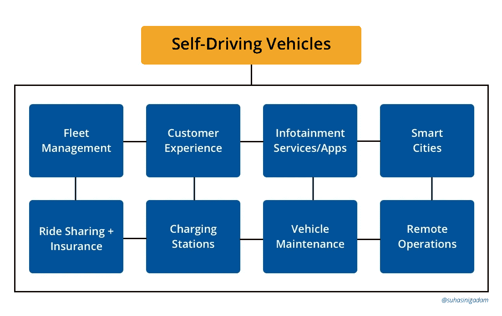

# 自动驾驶汽车将创造什么样的工作岗位？

> 原文：<https://medium.datadriveninvestor.com/what-kind-of-jobs-are-self-driving-cars-going-to-create-412a11d820a6?source=collection_archive---------0----------------------->

自动驾驶汽车即将出现，人们对[危及约 400 万份工作](http://www.businessinsider.com/driverless-cars-to-wipe-out-4-million-jobs-2016-9)的担忧正在增加。拼车公司以兼职司机起家，但如今除此之外，还有成千上万的人辞去工作全职开车。然而，这些公司正致力于用自动驾驶汽车取代人类司机。为什么？消除人力资源成本，获得更高的利润。到那时，这些人类司机的工作会发生什么变化？他们会消失。然而，[全自动驾驶汽车将创造一个价值 7 万亿美元的产业](https://www.technologyreview.com/the-download/609747/self-driving-cars-endanger-nearly-four-million-jobs-but-could-create-a-7/)。怎么会？让我们找出答案。

**新的汽车生态系统**

除了与汽车制造相关的工作之外，传统汽车向软件定义的汽车的发展还推动了对软件工程师、数据科学家和人工智能专家的需求。但是工作不仅仅止于汽车。围绕他们建立了一个完整的生态系统，从而产生了更广泛的就业机会。那个生态系统是什么样子的？下图给了我们一个简单的概念。

我们不仅要制造和扩展自动驾驶汽车，我们还必须确保它们正常运行，并为客户提供出色的用户体验。为此，我们需要资源来管理车队，设计出色的用户体验，开发新的服务和应用程序，整合现有的应用程序和服务，建设连接道路基础设施的智能城市，创建和维护拼车服务以及按需保险服务，为车辆加油或充电，根据需要维护和修理车辆，并通过远程运营商和紧急服务关注安全。这些只是全自动驾驶汽车上路时创造的一小部分工作岗位。这些车的里里外外都要清洗。如果它们带着显示屏，出了问题，就必须修理。营销人员将有一个额外的渠道来推销广告。机会的清单很长。所有这些职能和工作将创造数万亿美元的收入。

**涟漪效应**

自动驾驶汽车不仅会拯救生命，还会促进经济增长。以下是如何…自动驾驶汽车的兴起将使长途驾驶通勤变得更加容易。为了避免城市房地产价格飙升，人们将开始搬到郊区。在这些地区，建造新房子、学校、餐馆和购物中心的需求将很快开始涌现，为建筑、零售和管理行业带来新的就业机会。人们将在周末和假期开始更多的旅行，促进旅游业的发展。如果汽车自动驾驶，我们不必注意路况，我们可以利用旅行时间来提高效率或小睡一会儿。麦肯锡估计，全球无人驾驶汽车每天节省的时间总计可达 10 亿小时。停车问题要么消失，要么变得更加系统化，为我们节省时间和金钱。当我们有更多的空闲时间时，我们就有更多的机会去做我们喜欢做的事情，无论是爱好还是与家人共度时光。想象一下，如果你可以在无人驾驶汽车上虚拟绘画课，花一个小时的通勤时间画画布，或者你可以在回家的路上走进移动商店，购买新鞋，那该有多酷？

交通运输的前景将演变成一个数字化的数据衍生平台，可以通过智能手机访问和控制。随着消费者对完全自动驾驶汽车的信任不断增强，人们将开始使用将在旅途中向他们提供的各种服务和公用事业，这不仅让生活变得更加轻松，也为许多垂直行业带来了潜在的收入机会。

