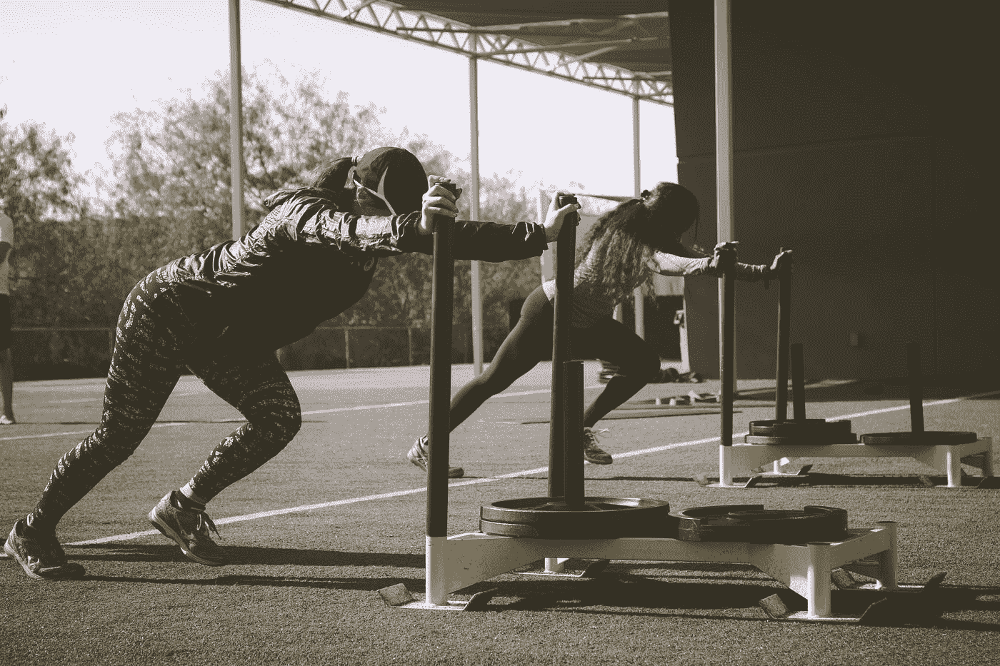
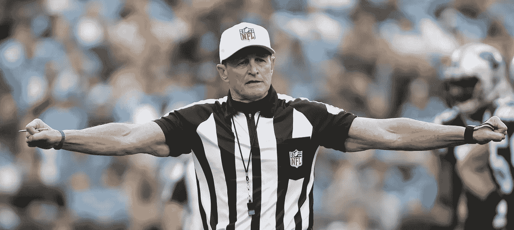
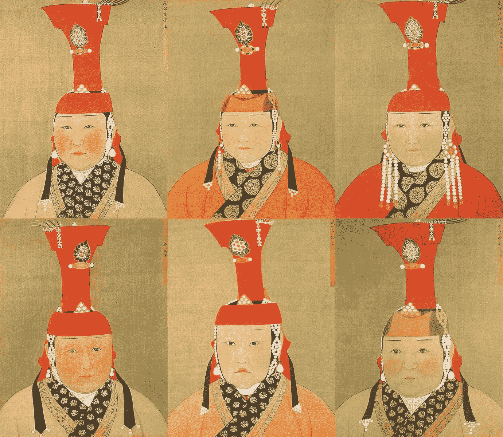

# 领导力是什么样子的

> 原文：<https://medium.datadriveninvestor.com/what-leadership-looks-like-b0c41abece98?source=collection_archive---------0----------------------->

Photo by [rawpixel](https://unsplash.com/@rawpixel?utm_source=medium&utm_medium=referral) on [Unsplash](https://unsplash.com?utm_source=medium&utm_medium=referral)

斯科特每周日早上穿着他的消防员掩体出现在圆形剧场。当太阳从东部平原升起时，我和他在散步/跑台阶时擦肩而过。他是几名西部地铁消防员之一，他们在数百级台阶上进行训练，这些台阶构成了这个自然美景的南北边界，许多国家乐队都喜欢在这里演奏。

经常在周末，当我开车出去消磨时间时，一辆大消防车停在楼梯的底部。掩体中的家伙(消防员用来描述他们在灭火时穿的全身防护装备)跑了无数圈，其中一些是为一年一度的 9-11 筹款活动做准备。那一天，他们跑的步数与消防队员在那灾难性的一天跑的步数相同。现在已经退休的斯科特为了健康仍然这样做，因为这会引发很多话题。

在父亲节那天，我遇到了另一个消防员，他把软管的额外重量加到了他的掩体里。现在我们来讨论一下这个。掩体本身重约 45 磅。满载时，工作时接近 70 英里。

如果你加上软管，根据作品的长度，它会重很多。例如，一个 100 英尺长的部分重 110 磅。你可以算一下。那东西很重。然后，当太阳升起的时候，天气也非常非常热。就像在火中一样。

上周日我问斯科特关于那个拿水管的人。

“他是酋长，”他说。“他总是在这里训练。”他总是被他的队员们包围着，和他一起训练，还有他十几岁的女儿。

## 与船员一起训练

我最好的男性朋友是科罗拉多州杜兰戈附近的荒地管理员。57 岁的他每个新赛季都和他的队员们一起踏上征程，刻苦训练。他总是减掉大约 15 磅，这给他带来很多快乐。他从未放弃救火，即使他已经升到了监督和管理的职位。他承诺的一部分是在他们训练的时候和他们在一起。他们为此钦佩他。有充分的理由。

对我来说，这是领导力的重要组成部分。

Photo by [Justyn Warner](https://unsplash.com/@justynwarner?utm_source=medium&utm_medium=referral) on [Unsplash](https://unsplash.com?utm_source=medium&utm_medium=referral)

作为一个足球迷，我总是对那些上了年纪的运动员的故事印象深刻，他们训练如此刻苦，以至于把新手从地图上抹去。杰里赖斯，名人堂的接收器，是众所周知的训练纪律，因为沃尔特佩顿。仍然沉浸在巨大的训练奖金中的新秀经常出现在训练营中，充满自信，决心把“老家伙们”从神坛上打下来。真正的团队领导会把他们远远甩在身后，结果是向这些有才华的年轻人发出挑战。关于杰里·赖斯的伟大之处以及我们可以从他的习惯中学到什么，请看 https://www . life hack . org/274044/masters-habit-the-describe-practice-and-training-Jerry-Rice

没有什么比看到那些“老家伙”中的一个离开那些在山路上跑得气喘吁吁的新手更让我发痒的了。

这对新手来说也是巨大的激励，让他们看到这种职业道德为他们的游戏做了什么。这就是为什么聪明的人会向团队领导寻求建议和指导。这种尊重是应得的。

Photo by [rawpixel](https://unsplash.com/@rawpixel?utm_source=medium&utm_medium=referral) on [Unsplash](https://unsplash.com?utm_source=medium&utm_medium=referral)

## **卷起我们的集体袖子**

虽然领导力有很多很多方面，我也曾在军队中呆过，但最能打动人们的一个特点是，领导者不仅愿意尽一切努力完成工作，还会在必要时卷起袖子投入工作。当事情出错时，那个人不是坐在角落的办公室里，而是在混乱中，在必要的地方做最卑微的工作，以确保最好的结果。一个好的领导者需要授权，这样才能培养出新的领导者。同样，也需要一个好的领导者在必要的时候参与进来，并向我们所有人表明，在实现目标方面，没有什么任务是低于他们的。

关于如何成为一名伟大的领导者，有很多著述。当我在军队的时候，两年多的服役经历帮助我成为了一名更好的军官。在战壕里的时间给了我新的“黄油棒”所不具备的洞察力。愿意同样努力地工作，有时做一些不愉快的事情，因为他们需要这样做，这些都是展示性格和树立榜样的一部分。

memegenerator.com

现年 67 岁的埃德·霍古利今年将从 NFL 足球比赛中退休，他因其锻炼道德而受到球员们的高度尊重。他不仅是一个优秀的裁判，而且他花时间去健身房塑造令人印象深刻的手臂，并保持良好的状态。在某些圈子里，这需要尊重。这完全取决于你工作的环境。领导力是什么样子的？树立一个鼓舞人心的榜样需要什么？

70 多岁的戴安娜·尼亚德(Diana Nyad)是另一位非凡的领导者，她每天早上都要打一千个嗝(一想到这个我就崩溃)。作为游泳教练性虐待的幸存者，这个女人定义了领导力的样子——树立榜样，邀请我们更加努力【https://www.outsideonline.com/2171236/superhero-diana-nyad。她是一个真正的神奇女侠。

这将是你的工作场所和处境所独有的。一个问题是考虑那些你曾经钦佩过的人。谁给了你灵感，为什么？他们表现出的哪些特征让你想要更加努力，学习更多，发展自己的技能？你是否愿意不仅发展出色的授权技巧，这样你自己就能得到提升，而且如果你落后一个人或当最后期限迫近时，还愿意尽一切努力支持你的团队？

Photo by [John-Paul Henry](https://unsplash.com/@jphnry?utm_source=medium&utm_medium=referral) on [Unsplash](https://unsplash.com?utm_source=medium&utm_medium=referral)

那些我最尊敬的领导人承受了损失，被失败羞辱，承受了巨大的痛苦，并付出了非常高的代价，才成为我们钦佩的人。比如说，我想到了纳尔逊·曼德拉。他们的人性、真实性和易接近性结合在一起，使他们成为我们不仅尊敬，而且想要效仿的人。最好的领导者会犯错误，承认错误，从中吸取教训，并对自己有幽默感。通过这样的方式，我们学会了不要把自己看得太重，不完美是领导的一部分，失败是领导过程的一个重要部分。

为了避免你指责我只认为男性是世界领导人，这里列出了历史上最具影响力的女性领导人——有些确实令人惊讶，但这些女孩都是令人敬畏的 T2。

Among others, Borte Ujin, Ghengis Khans wife, who ruled in his absence

成千上万的书籍提供了他们认为的伟大领袖的特质。大量文章概述了 21 个最佳特征。我认为这篇福布斯文章很好地总结了八个特质:[https://www . Forbes . com/sites/Kimberly fries/2018/02/08/8-定义伟大领导力的基本品质/#7fe26ed63b63](https://www.forbes.com/sites/kimberlyfries/2018/02/08/8-essential-qualities-that-define-great-leadership/#7fe26ed63b63) 。作为一个在军队中呆过的人，我看到了所有那些滥用职权的人，以及那些利用自己的领导角色取得良好效果的人。归根结底，领导者是雕塑出来的。他们永远不会停止学习，这样他们就树立了榜样。

对领导的严峻考验是检查是否有人在跟踪你。请不要在社交媒体上。真正跟随你:以身作则，寻求建议和指导，听从你的指示，热情地完成任务——换句话说，表现出对你领导的尊重和关心。

在你的世界里，怎样才能成为一个好的领导者？大概看情况吧。我能提供的是:愿意放下和弄脏，愿意教导，愿意发展，愿意授权，愿意做真正的情感成熟的艰苦工作，这些都有助于把我们定义为值得追随的人。