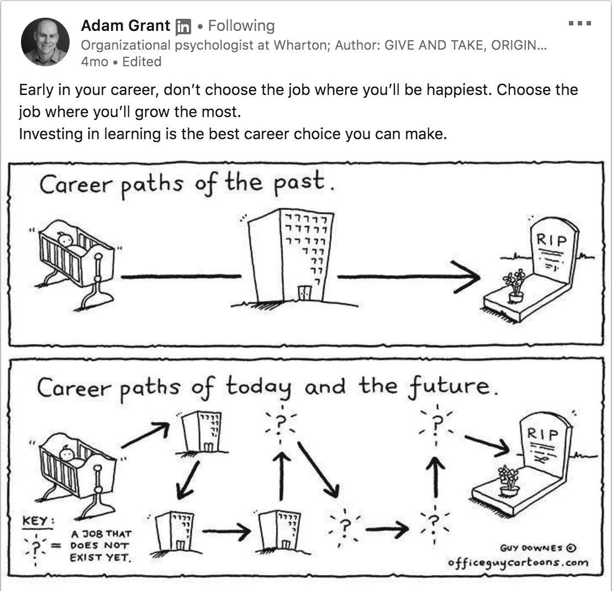
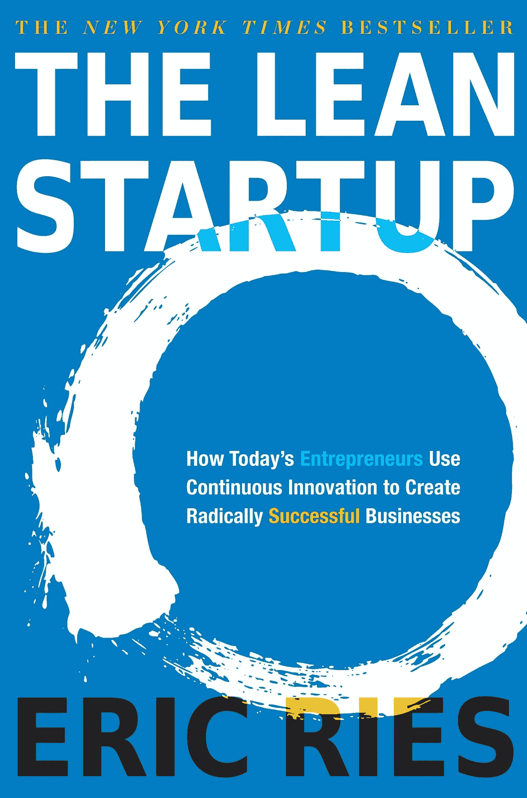
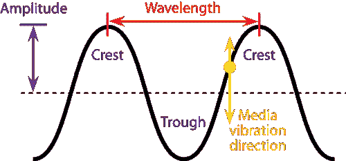

# 关于职业选择，“精益创业”能教会我们什么

> 原文：<https://medium.datadriveninvestor.com/what-lean-startup-can-teach-us-to-make-career-choices-9c18c9a06c2f?source=collection_archive---------9----------------------->

## “构建、测量、学习”不仅仅是构建产品的建议

> “你似乎找到了你的激情”
> 
> “你真是个 HR”
> 
> “你怎么能如此确定你这辈子想做什么？”

在过去的几个月里，这些陈述被抛给了我几次。每次听到这些，我都会笑。微笑背后的原因是因为我热爱我的工作，但这并不意味着我 100%确定这是我下半辈子想做的事情。关于这个世界，我知道的太少了。对某事过于肯定只会限制我的可能性。心理学家和畅销书作家亚当·格兰特(Adam Grant)发表的一篇关于当今和未来职业道路的帖子引起了我的极大兴趣。

如果今天和未来的职业道路是这样的，那么当务之急是

# **“我们应该如何看待自己的职业道路？”**

有趣的是，我关于职业道路的哲学是从一本有些不相关的书上学来的。这本书是

等等，什么？

是的，你没听错。这是一本关于如何开发引人注目的产品的书。这本书建议我们**制造**原型，**测量**性能，**从中学习**，而不是制造完美的产品并出售。从这种学习中，我们可以决定我们是要转向(建立其他东西)还是坚持(继续在它的基础上建立)

现在，让我们将上下文从产品开发切换到职业发展

# **构建**

首先对你想做什么工作/工作有一个假设，并围绕它建立职业生涯。选择可以基于你的教育背景、兴趣、使命、社会期望、经济或任何其他因素。从高中开始，我就一直对解决人们的问题感兴趣。为了测试这个假设(我真的喜欢解决人们的问题)，我正在建立一个人发展领域的职业生涯。

为了有时间验证/否定我们的假设，需要时间。我在工作中看到的时间就像我在以前的工程时代研究的横波一样。

有时候，我来上班时会说“这是我梦想的工作”，但也有一天，我会觉得“该死，我想辞职”。因此，建议你在一份工作上呆上一段时间，以便对自己是否在正确的轨道上有一个平衡的看法。

# **测量**

我们需要不断地衡量我们的职业和生活。为了做到这一点，我们需要从确定对我们生活至关重要的指标开始，收集信息，并从中得出结论。我们可以使用的一些常用指标有:

**专业(基于自我决定理论)**

*   在我们的领域里，我们的能力建设进展如何？
*   我们对自己的工作有多少自主权？
*   我们的**与同事的关系**如何？

**个人**

*   我们能节省多少钱？
*   我们的身体健康状况如何？
*   我们的心理健康如何？

**关系**

*   我们与生活中最重要的人的关系质量如何？
*   我们在专业网络方面的投资看起来如何？
*   我们与更高存在的精神关系如何？

了解度量标准后，我们可以从多种资源中收集信息。他们中的一些人正在进行自我反思，寻求反馈，与我们圈子以外的人交谈，阅读书籍/文章等。之后，您可以对您所衡量的指标得出结论。它不会像我们如何做产品分析那样超级精确(嗯，我们有数百万的数据)，但它应该能够给我们一些关于我们在哪里的感觉。

# **学习**

从我们得到的数据中，我们决定是否要改变或坚持下去。如果你喜欢你做的事情，那就太棒了！目前没有多少人喜欢自己的工作，所以如果你是其中之一，你应该心存感激。所以坚持不懈才是正道。

当我们谈到 pivot 时，事情并不那么简单。最简单(但不容易)的方法是改变我们面对挑战的心态。如果面对难缠的老板被视为“学习管理的机会”而不是“悲惨的工作生活”，我们将有更大的概率享受我们的工作。

我承认有时候改变我们的心态是不够的。如果你在办公室里有足够的影响力，你也许可以做手工。工作精心制作是在满足团队目标的同时，根据你的个人喜好来剪裁你的工作。例如，你是销售人员，但你实际上喜欢教书。你可以和你的主管协商，以获得更多的时间来教而不是卖。如果你有更大的影响力，你可能会要求跳槽到你梦想的其他团队。

如果这些都不奏效，也许你应该开始考虑搬家。慢慢来！的确，跳槽是现在的趋势，但不应该掉以轻心。我们越小心，就越不可能选错目的地。然而，总有可能我们是错的，这没关系。这就是我们再次开始构建、测量、学习循环的地方。

希望这篇文章有用。如果你喜欢这篇文章，分享给你的朋友。这可能有助于更好地了解他们的职业生涯。如果你想阅读类似的文章，请访问我的网站[www.vicarioreinaldo.com](http://www.vicarioreinaldo.com)

**来源:**

[http://theleanstartup.com/](http://theleanstartup.com/)

[https://positivepsychologyprogram . com/self-determination-theory/](https://positivepsychologyprogram.com/self-determination-theory/)

[https://marmelab . com/blog/2016/02/12/build-measure-learn . html](https://marmelab.com/blog/2016/02/12/build-measure-learn.html)

[https://www.linkedin.com/in/adammgrant/](https://www.linkedin.com/in/adammgrant/)