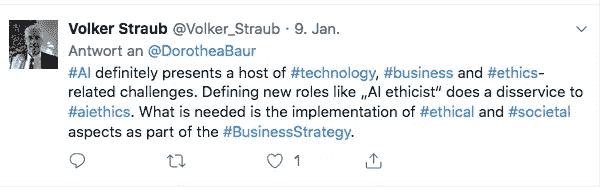
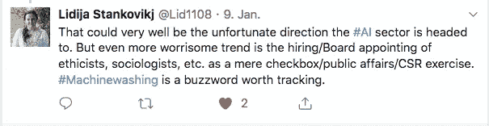

# 是什么让人工智能伦理学家成为“顶级雇佣公司取得成功的必备条件”？

> 原文：<https://medium.datadriveninvestor.com/what-makes-ai-ethicists-the-top-hire-companies-need-to-succeed-6d743b14a393?source=collection_archive---------8----------------------->

Photo by rawpixel on Unsplash

[Source: KPMG.info.us](https://bit.ly/2AUSq2Q)

年初，[毕马威](https://info.kpmg.us/news-perspectives/technology-innovation/top-5-ai-hires-companies-need-to-succeed-in-2019.html)公布了一份“2019 年成功所需的 5 大 AI 雇佣公司”名单，“AI 伦理学家”位列其中。毕马威表示:

> “随着**人工智能**的道德和社会影响继续展现，公司可能需要创造新的工作岗位，承担建立人工智能框架的关键责任，以维护公司标准和道德规范。最初，这些角色可以由组织中现有的领导者来履行，但随着人工智能的效果完全形成，它**可能需要由一个人**负责，以确保这些指导方针得到坚持。”

对于我这样的“老商业伦理学家”来说，这无疑是个好消息。这样的清单无疑强化了我的“存在理由”。然而，当我在推特上发了一些关于这个的东西时，反应显示并不是每个人都同意这个观点。显然，对于我们是否首先需要人工智能伦理学家，以及创建这样的档案是否不可避免地导致“机器清洗”，没有达成共识。让我在下面解决这些问题，并讨论如何才能真正让人工智能伦理学家成为“顶级雇员”。

## **1。我们需要与众不同的人工智能伦理学家吗？**

似乎不是每个人都这么认为。正如一位追随者所说:

这是真的吗？**道德是否应该被列为塑造商业战略的众多同等重要的考虑因素之一**(如财务、营销、人力资源、技术或法律)？我不同意。人工智能伦理学家的**角色和工作需要是可见的**。伦理学通常被认为是“抽象的”、“理论的”和“不切实际的”。如果我们想让人工智能伦理可信，就需要让它变得有形。公司需要能够概述其业务中具体的道德考量。

人工智能的一个关键伦理问题是算法缺乏透明度和问责制。算法通常被视为黑盒——对于那些受其决策影响的人来说，有时甚至对于为其编程的数据科学家来说。因此，将伦理考虑隐藏在一个巨大的总体黑箱中，在这个黑箱中，金融、技术、法律和营销考虑交织在一起，这将是对#AIethics 的特别伤害。这肯定会破坏新兴领域# ai 伦理的可信度，其核心应该是给迄今为止不透明的事情带来透明度。

当然，人们总是可以选择是否将问题框定为道德问题。你可以将多样性定义为一个经济问题或一个道德问题，问责制可以是一个法律问题或一个道德问题，可访问性可以是一个技术术语或一个道德术语——这些例子中的每一个都可以同时是两者。重要的是**要意识到框架对我们的感知有影响**:

> 道德语言的使用引发反思，而避免道德术语导致“道德沉默”。

使用道德语言(像正义或正直这样的正面词汇，或者像撒谎或欺骗这样的负面词汇)往往会引发道德思考，因为这些术语与包含道德内容的现有认知类别相关联。**避免使用道德词汇的原因是害怕对抗**(道德言论可能引发对抗)**效率考虑**(道德言论可能掩盖问题)和**坚持权力和效率的形象**——当使用道德语言时，害怕给人留下理想主义和乌托邦的印象。

> 为了可信和有效，需要明确道德考虑，必须将它们与单纯的商业考虑区分开来。

当然，在许多情况下(或者:理想情况下)，伦理和商业考虑是一致的，也就是说，它们会导致相同的结论。**最受公司和公关专家欢迎的是所谓的“双赢”局面，在这种局面下，合乎道德是值得的。**在这种情况下，这一点应该很明显。如果道德考虑碰巧促进了商业发展，它不会“贬低”道德考虑的“严肃性”。(我在学术界工作期间发现，有些人在限制业务时，倾向于*只*承认道德方面的问题)。

> 承认道德在某些情况下增加利润是可以的。但是，把伦理局限于它确实存在的那些情况是不合适的。

那就是:需要承认的是**伦理与利益的双赢**并不总是如此，或者更好一点，**必须** **而不是** **才是伦理被重视的条件**。道德的试金石是当一家公司拒绝做某件事，即使它是合法的并且“有商业意义”。这种行为无可争议的案例在现实中很难证明。每当一家公司声称他们的业务是建立在道德责任的基础上，批评者就会想方设法争辩说[背后的基本原理](https://techcrunch.com/2018/10/27/big-tech-must-not-reframe-digital-ethics-in-its-image/)是一种“商业”原理。深入探讨这个问题超出了本文的范围——它指向了一个古老的问题，即真正的利他主义是否存在——但它将我们带到了下一个问题，即:人工智能伦理学家是否一定总是被公司利用，仅仅作为推广业务的遮羞布？

# 2.人工智能伦理学家只是“机器清洗”计划的一部分吗？

这个问题是由我的推文的第二个反应提出的，它指出了“机洗”的“令人担忧的趋势”:

这样的反应并不奇怪。**试图在任何一种企业环境中建立道德规范总是不可避免地会遭到各种利益相关方的“x-washing”指控**。在我满是商业伦理文章和文件的个人硬盘上搜索“绿色清洗”一词，得到 467 条匹配结果。

根据牛津词典博客:

> *-wash* 典型地批评一家企业欺骗性地挪用一项流行事业或潮流，以提升其公众形象或从随之而来的积极联想中获益。

洗涤有多种色调和周期。因此，人工智能的伦理也进入了它自己的清洗周期，这是唯一合乎逻辑的，被恰当地称为“机器清洗”。正如《波士顿环球报》所说，“机器清洗”表示科技巨头试图“向我们保证他们围绕人工智能的良好意图”。但是，他们的一些公关活动正在制造积极变化的表面假象，而没有可核实的现实”。

是什么让人工智能伦理学家的聘用或任命变成了一场机器清洗运动？又该如何避免？任何被公司雇佣的伦理学家都会遭到怀疑。

> 我们永远不能指望某个公司职员绝对独立。但这是公司不雇佣伦理学家的理由吗？如果他们雇佣伦理学家，他们会被指责为公关活动；如果他们不这样做，他们会被指责忽视问题。

在我看来，**人工智能伦理需要从公司内部开始**，使用道德语言(见上文)，反映他们的价值观，预测和监控他们的产品/算法等的伦理影响。一个**内部的人工智能伦理学家应该被给予最大限度的信任和自由** **来调查所有的过程并挑战每个人**——类似于 20 世纪 90 年代英国航空公司(British Airways)的保罗·伯奇(Paul Birch)作为一个企业小丑[的角色](https://www.fastcompany.com/35777/hes-no-fool-he-plays-one-inside-companies)“他会质疑权威，促进诚实，并以创造性的方式处理问题”，但稍微更严肃一些，并特别关注伦理。人工智能伦理学家确保在公司的整体战略和日常事务中识别和考虑关键的伦理方面，并且不将她的论点限制在那些增加利润的方面。

这无疑是一个相当宽泛的工作描述，当然需要加以完善，以便变得切实可行。人工智能伦理学家也只有在公司与#人工智能伦理的各种利益相关者(例如，员工、非政府组织、监管机构、学术界、媒体、股东等)接触时，才能真正展现她的潜力。).我在这里的意图是概述一下，人工智能公司不应该让“机器清洗”的先验指控阻止他们——或者不应该用它们作为不任命人工智能伦理学家的借口。相反，

> 人工智能公司应该站出来迎接挑战，并表明他们认真对待道德规范。

因此，简而言之，毕马威在他们的“人工智能公司成功所需的前 5 名雇员”名单中确定了一个**非常相关但也非常具有挑战性的工作简介**。为了不辜负这种期望，人工智能伦理学家成为具有切实影响的公司的可见代表至关重要。其他任何事情，比如在一群标准的企业专业人士中保持低调，通过避免道德语言来掩盖他们独特的关注点，只会对那些每当公司使用道德这个词时就感觉“洗脑”的人有利。