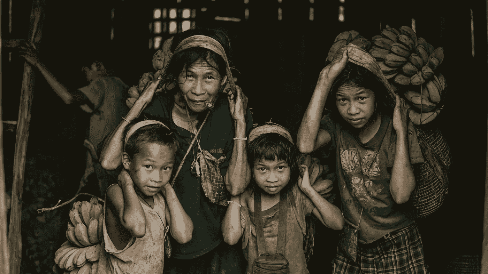

# 是什么让一些国家富裕而另一些国家贫穷？

> 原文：<https://medium.datadriveninvestor.com/what-makes-some-countries-rich-and-others-poor-4802d30284d?source=collection_archive---------0----------------------->

***是什么让一些国家富裕而另一些国家贫穷？为什么大部分欧洲国家如此发达，大部分非洲却无法摆脱贫困？都是地理决定的吗？如果是这样的话，为什么一些气候良好、自然资源丰富的国家仍然如此贫穷？是什么阻止了国家迈向更美好的未来？***

学过经济学的人都知道，任何国家的增长都是由劳动力、资本和生产率构成的。因此，国家可以通过增加(或延长工作时间)人口而变得更加富裕(即更多的人手来生产商品和服务)，吸引资本和投资(例如，我们有更多的设备)或通过更有效地生产东西(例如，通过技术进步)。这一理论很好地解释了中期和短期的增长。然而，它没有回答最根本的问题——为什么纵观历史，一些国家变得成功和富有，而另一些国家总是在挣扎和失败。

## 机构，傻逼！

有许多研究着眼于国家在很长时期内的发展，结论通常非常相似。决定一个国家长期前景的最重要的事情取决于其机构的实力和质量。还有其他重要因素与制度框架交叉，如意识形态、文化、个人、地理和运气。所有这些因素都有一定的作用，但是没有一个因素可以完全归因于长期的成功。

## 法治越强，收入水平越高。

在任何一个国家，决定推动何种活动的都是制度:支持多数人长期增长的活动，或者只让少数个人或团体受益的寻租活动。

强大而稳定的制度通过创造合适的“环境”来促进增长。他们执行财产权，因此个人和企业不怕工作和投资。他们为所有人创造平等的游戏规则(鼓励竞争)。确保每个人都遵守规则(可预测且稳定的法律体系)。它们降低了市场交易的成本(开放经济)。他们还通过提供教育和社会支持来建立正确的框架，因此社会中的大多数人都有或多或少平等的成功机会。它还取决于如何促进和采用技术变革和创新的制度。技术和创新直接影响生产率增长。

## 如果这一点如此明确，为什么不是所有国家都采取了建立良好制度的政策？

> 改革如此艰难并非偶然——费尔南多·卡多佐(巴西前总统)

各国在决定机构设置时通常面临两个问题:

1.  好的制度往往违背掌握权力的群体的利益(想想威权体制及其对民主选举和言论自由的抵制)，或者更容易获得资源的群体的利益(为什么任何国家的寡头会寻求开放的市场和激烈的竞争？).

> 后者最好的例子是共产主义垮台后波兰和乌克兰的对比。1989 年，两国都是从类似的立场出发的。改革计划略有不同。然而，主要的对比是财富私有化导致寡头产生的程度。在乌克兰的例子中，狭隘的精英攫取了如此多的财富和权力，以至于他们成功地在接下来的二十年里阻止了进一步的改革。

2.即使建立了好的机构，维持它们也是一个挑战。每个机构的好坏取决于管理它们的人。社会规范和文化在这里起了很大的作用。这就是为什么外国引进的机构如果不适应当地情况，往往无法经受住时间的考验。我们在前殖民地找到了这样的例子，在那里，当创建机构的当局离开后，这些机构就不复存在了。

## 那么，是什么让一些国家成功建立了强大的制度，而另一些国家却失败了呢？

按照世界银行的标准，有 40 个国家可以被列为高收入国家。他们和世界其他地方有两个显著的特征(被 M. Piatkowski 在《欧洲增长冠军》中捕捉到了):

1.  都是民主国家(新加坡周围打个问号)，而且；
2.  它们的不平等程度较低或中等(以基尼系数衡量)。这一群体中唯一的例外是智利。考虑到这个国家现在发生的事情，这可能只是一个证明。

这两个特性有什么特别之处？

前者显示政治权力的分配，而后者显示收入和财富的分配。民主鼓励人们参与政治生活，参与和表达。这让人们觉得他们能掌控自己的生活。但最重要的是，它给予每个人相似的权利和权力。它让社会变得包容。

当政治制度是民主的，权力被广泛分配时，经济发展的利益很可能被许多人分享，这并不是巧合。

## 从排外到包容

非常有趣的是社会如何从排外转向包容——这是建立高质量制度的前提。Marcin Piatkowski 在《欧洲增长冠军》一书中指出，这种转变从来都不是自然的，也不是由内部因素推动的。它总是由外部冲击或外部压力触发。对西欧来说，这种转变是由 14 世纪的黑死病引发的。三分之一社会的死亡增加了农民和商人在社会中的作用。后来是拿破仑统治下的法国占领，才最终摆脱了残存的封建制度。以波兰为例，这也是本书的主题，社会凝聚力的采用是在第二次世界大战后伴随着共产主义而来的。1945 年后的德国，是美国的占领最终让社会变得包容和民主。

类似的结论也可以在亚洲找到。乔·史塔威尔在他的《亚洲是如何运作的》一书中指出，亚洲富国(如日本、台湾、韩国)与穷国(如菲律宾、印尼、马来西亚)的主要区别之一是实行了全面的土地改革。将土地分配给绝大多数农民，使他们能够提高作物的效率，并分享伴随增长而来的好处。大量较富裕的农民可以在其他商品上花更多的钱，支持城市地区制造业的发展。

还有另一个有趣的方面。好的制度创造增长，但增长也鼓励建立更好的制度。有充分的证据表明，收入较高的人对政治家和政府的要求更多，这进一步加强了经济发展。因此，毫不奇怪，日益壮大的中产阶级往往是专制政权的威胁。

现在，让我们看看影响这些国家繁荣的其他环境:

*   **地理**。首先想到的是自然资源。然而，拥有大量资源并不能保证繁荣。这通常是一种诅咒(委内瑞拉或一些非洲国家就是很好的例子)。有利的地理位置意味着拥有安全的环境(没有自然灾害)、肥沃的土地和获取资源的途径。但这些因素本身都不是决定性的。
*   **文化**。只有更广泛的文化是有利的，并且人们支持它，机构才能很好地工作。就想想意大利吧，机构一样，但是南北繁荣程度差距巨大。另一种在这种背景下想象文化的方式是，想想如果整个国家——比如说荷兰——有一天被转移到一个不太有利的自然环境中会发生什么。我想他们会再次做得很好。
*   **运气和个人**。有时，个人的事件或决定会影响后代。16 世纪，伊丽莎白一世女王允许英国商人在公海自由贸易，并将利润留给自己。这一决定让他们得以发展壮大，建立大英帝国的海外势力。与此同时，西班牙君主做出了相反的决定，拿走了他们商人的一大块利润。结果，西班牙丧失了对海洋的统治权，落入英国人手中。
*   **意识形态**。它们在短期内没那么重要，但从长期来看，我们可以观察其影响。自由主义引发了工业革命。它还带来了自由市场、所有权或企业家精神的概念。所有这些都是包容性机构的完美范例。另一方面，共产主义也有包容性的社会制度。然而，政治和经济机构是完全排外的。从长远来看，它失败了。

那么是什么让一些国家富裕而另一些国家贫穷呢？事实证明，答案相对简单。成功的国家建立了促进长期增长的制度。然而，这是一个更加复杂的问题，即如何建立一个稳定、可靠、能够长期存在的制度框架。在富裕国家，人们积极参与政治机构。许多人分享经济繁荣。他们有包容性的社会，在那里人们决定自己，分享发展的好处。

如果这个国家想要保留其制度和机构，财富的广泛分配也是必不可少的。财富和权力的过度集中可能是动摇民主并威胁其存在的捷径。经济不平等经常会刺激民粹主义。它冒着走向独裁统治和制造更多经济失衡的风险。这就是为什么现在人们越来越担心。越来越多的声音呼吁解决全球巨大的收入和财富差距。值得记住的是，巨大的不平等很少以和平的方式得到扭转。

*这篇文章最初发表在 www.fintaste.com***上，在那里你可以找到更多关于金融市场和经济发展的内容。**