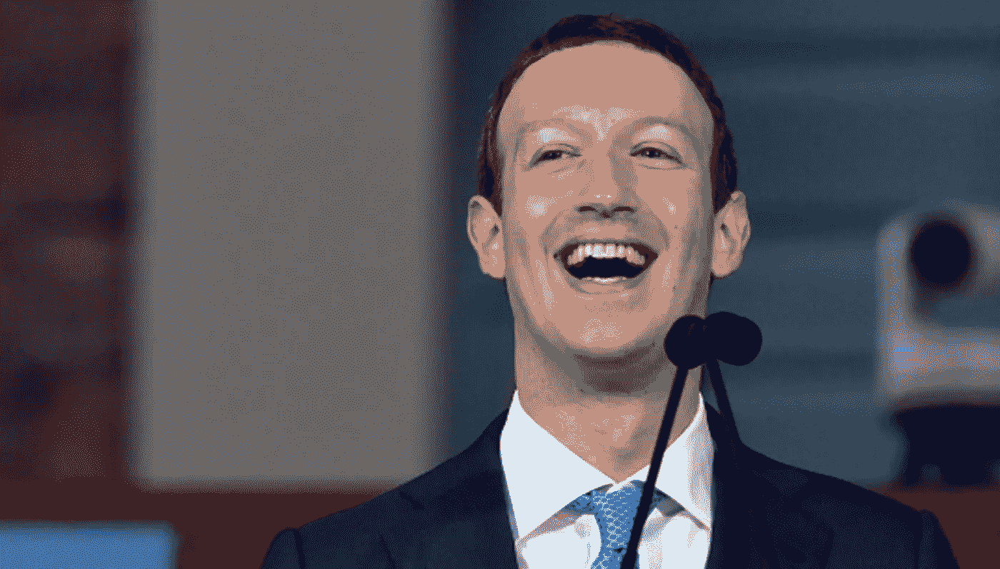

# 马克·扎克伯格的约会技巧教会我如何成为一名优秀的推销员

> 原文：<https://medium.datadriveninvestor.com/what-mark-zuckerbergs-dating-skills-taught-me-about-being-a-good-salesman-f57a5a8bb0a8?source=collection_archive---------10----------------------->

[Getty Images](https://www.cnbc.com/2018/01/12/mark-zuckerberg-heres-how-to-use-facebook-to-feel-happier.html)

马克·扎克伯格被指控了很多事情——比如滥用职权和窃取人们的信息。

哦，还有成为一个机器人。

不管这些是否属实，对他的所有指控似乎都有一个共同的主题:

> 他不是一个特别情绪化的人。

我的意思是，拜托:如果你想窃取和出售人们的私人信息，你必须对他们的感受漠不关心。而且机器人没有感情，所以…

但是真的。

# 马克·扎克伯格是左脑主导型。

也就是说，他是一个逻辑思维极强的人，这让他很难在情感层面上与人交流。

在一个由[情感生物](https://web.cn.edu/kwheeler/documents/Pathos_Handout01.pdf)(我们)管理的世界里，这是一个问题。

尽管扎克为自己做得很好，但他从来不擅长与人建立情感联系(至少在《T4》*《社交网络》**——*2010 年一部关于脸书开端的电影*中是这样描述的)。*

以前，他有女孩问题——她们不太喜欢他。为什么？

因为他无法在情感上与他们*。在电影的开场，他实际上试图用逻辑推理说服某人和他约会。*

*想象一下，有人对你说，*“这是你和我约会会有好处的几个原因，”*然后，在他们完成了他们逻辑根深蒂固的论证后，他们告诉你，“*不客气。”**

*很可笑，对吧？这其实很可笑。*

*但事实是，扎克伯格在和女孩调情方面并不差。*

# *他自己在销售方面遇到了问题。*

*让我解释一下。*

*我最近破解了迈克尔·博斯沃思(Michael Bosworth)和本·佐尔丹(Ben Zoldan)写的《伟大的销售人员都做些什么》 ，该书重点讲述了逻辑销售的历史方法与情感销售相比是多么的无效。*

*整本书证明了我们的购买习惯是基于情感，而不是逻辑推理。也就是说，如果某人信任你，他更有可能购买你的产品，即使他并不需要你的产品。如果不信任你，需要你卖的东西的人可能会选择*而不是*购买。*

*除此之外，任何形式的人类互动，无论是否发生任何形式的“交换”,都是建立在情感之上的——特别是信任。*

# *即使你不是销售人员，这也是至关重要的信息。*

*每个人都需要知道如何销售。*

*你永远无法通过逻辑推理向潜在雇主或你所爱的人的父母推销自己。如果你不知道如何在情感上与人联系，销售就变得不可能。*

*正如博斯沃思和佐尔丹所指出的，扎克伯格在《社交网络》中的角色试图通过逻辑来追求一位年轻女性——从字面上解释了与他约会的所有理由。她最后骂他是个混蛋，然后走开了。*

*但是博斯沃思和佐尔丹想说的是——也是他们加入扎克伯格那篇文章的原因——逻辑上销售任何种类的*都是行不通的。不建立情感联系，你什么都卖不出去。**

*所以下次你戴上销售的帽子，记住:*

> *情感获胜。*

## *感谢阅读:)*