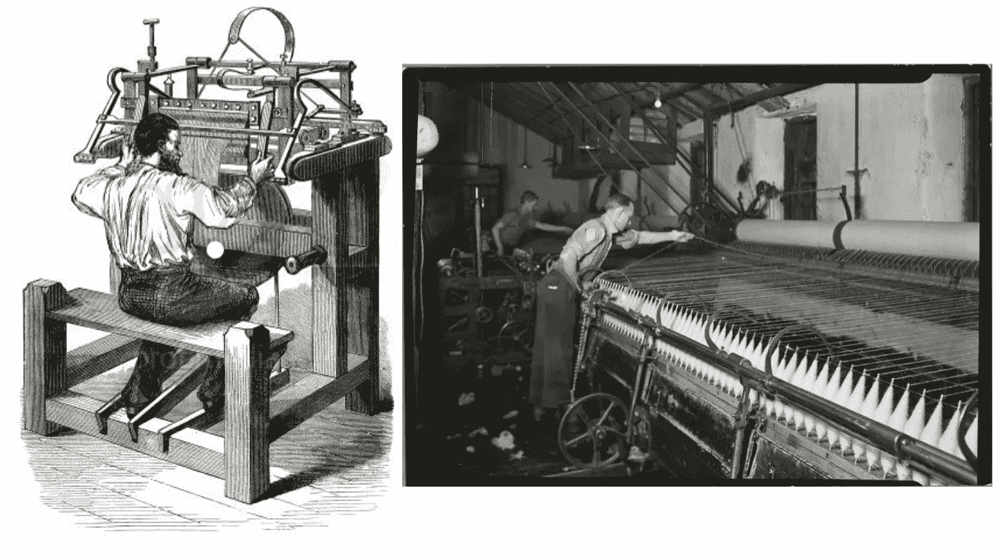
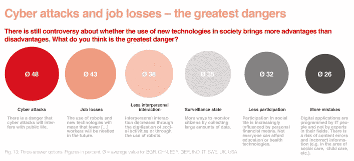
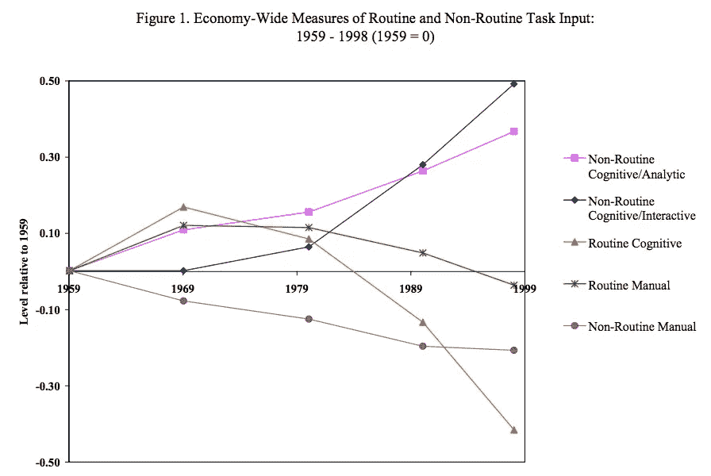
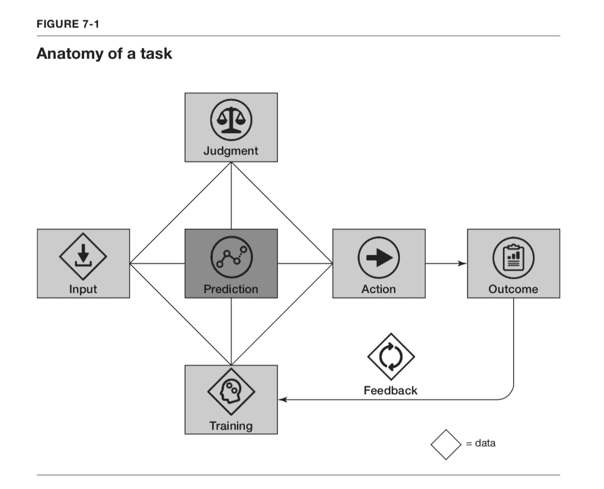
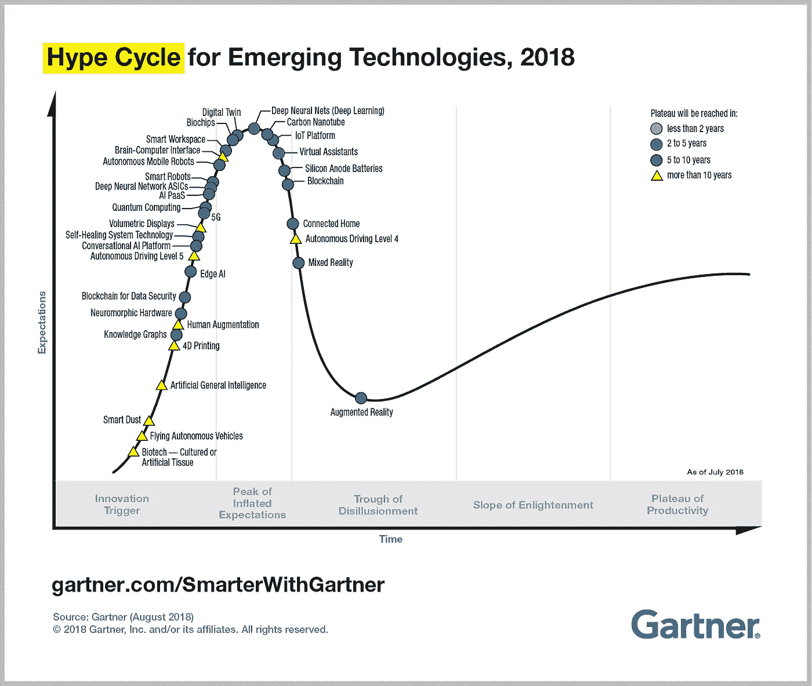

# 人工智能对我们的工作意味着什么？

> 原文：<https://medium.datadriveninvestor.com/what-means-artificial-intelligence-for-our-jobs-5b3e448458e3?source=collection_archive---------11----------------------->

# 纵观历史，技术创新造成了文化焦虑，但什么样的恐惧是合理的呢？— 7 种不同的观点劳动力市场将会发生什么。

**Source**: Photo by [Franck V.](https://unsplash.com/photos/jIBMSMs4_kA?utm_source=unsplash&utm_medium=referral&utm_content=creditCopyText) on [Unsplash](https://unsplash.com/search/photos/artificial?utm_source=unsplash&utm_medium=referral&utm_content=creditCopyText).

跟踪技术发展的速度和范围是极其困难的。我们当今时代的特点是辉煌和突破性的技术创新。然而，不同“流行语”之间的界限很模糊，最重要的是:

机器人、人工智能(AI)，包括机器学习(ML)和深度学习(DL) 的[子类别，大数据，紧随其后的是分布式账本技术、区块链和智能合同、金融和保险技术、云计算和物联网(IoT)，这些技术实现了智能家居、智能制造和潜在的](https://medium.com/mmc-writes/the-fourth-industrial-revolution-a-primer-on-artificial-intelligence-ai-ff5e7fffcae1)[智能社会](https://www.japan.go.jp/abenomics/_userdata/abenomics/pdf/society_5.0.pdf?fbclid=IwAR0_mCSG2A4JVtbH_x_odq-ulG1W3Q-Ux11-ep572wHQx3asZ4dkwMkLkJs)、3D 打印、可再生能源以及清洁技术、生物技术和纳米科学。由于很多人不了解每一项创新的技术知识，这是完全可以理解的，因此公众辩论是由对潜在积极和消极影响的猜测形成的。高估或低估是常有的事。

正如诺贝尔奖得主、经济学家乔尔·莫基尔(Joel Mokyr)所言，总的来说，技术“在历史上产生了文化焦虑”。想象一下，你会问一个 19 世纪的农民，如果有机器收割庄稼，他或她会怎么做？想象一下，你会问第一次工业革命期间的棉纺工人，当他们的工作变得丰富时，他们关注什么？在商业发展的意义上，引用了亨利·福特的名言，

> 如果我问人们想要什么，他们会说是更快的马。

这正是技术发展的问题所在。纯粹是为了未来。因此，很少得出合理和有益的建议，这使得决策者和商人难以采取正确的措施和手段。此外，向选民和员工传达可理解的决定变得棘手。

**简短的历史评估和凯恩斯的“技术失业”概念**

公众对自动化导致大范围失业的最普遍担忧并不一定是新的。从历史上看，它可以追溯到 1589 年李浩发明的“织袜机”。李试图获得专利保护，但女王伊丽莎白一世并不高兴，因为她担心对就业的负面影响。结果，李被迫离开英国。更进一步，在 19 世纪中期的英国纺织业，勒德分子的抗议是对“自动骡子”发明的一种反应，这种骡子解决了棉纺工人的就业问题。

**Left:** Stocking frame knitting machine (1589) by [profimedia.si on Pinterest](https://pin.it/exappdw7vnykb3). / **Right:** Self-acting mule (around 1900) by [New York Public Libraries](https://digitalcollections.nypl.org/items/510d47d9-a9c0-a3d9-e040-e00a18064a99).

1930 年，现代经济学教父约翰·梅纳德·凯恩斯创造了“技术失业”一词。在他关于“我们子孙的经济可能性”的文章中，凯恩斯试图预测下一个 100 年的经济发展——直到 2030 年。他认为，“由于我们发现节约使用劳动力的方法的速度超过了我们发现劳动力新用途的速度”，人们将在短期内失业。

因此，新凯恩斯主义经济政策经常在以国家投资和补贴为特征的衰退时期使用。其中的逻辑是:当国家比平时投资更多或向公众提供(财政)激励时，需求更有可能保持稳定——即使经济正在经历危机也是如此。因此，大范围失业的灾难性后果减少了，政治上试图保持“充分”或“以前的水平”的就业。一个很好的例子是德国政府在 2009 年上一次经济危机中推出的所谓“报废汽车奖金”(abwrackprmie)。在这里，向愿意在购买新车时报废旧车的消费者提供高达 2.500 欧元的补贴。当然，从环境角度来看，背后的基本原理可能会受到质疑，但从经济角度来看，这是有道理的。

失业合理吗？

回到这篇文章的主题，公众对技术引发的失业的担忧在今天仍然存在。来自九个国家——保加利亚、中国、德国、印度、意大利、西班牙、瑞典、英国和美国——的研究表明，当谈到技术时，人们最担心的是网络攻击(48%)和失业(43%)。

**Source**: [Vodafone Institute for Society and Communications (2018)](https://www.vodafone-institut.de/wp-content/uploads/2018/10/The-Tech-Divide-People-and-Society.pdf). P. 35.

如今，“自动化焦虑”与担心劳动力被资本取代有关。在这里，资本意味着对新兴技术的投资。因此，工人可能随后被有形的机器和机器人以及无形的软件系统取代，其中一些使用人工智能机制。

这些担忧主要是由劳动力市场评估驱动的，如牛津学者弗雷和奥斯本在 2013 年提出的评估。他们的研究是第一次尝试提供一种系统的方法来预测总共 702 种职业的“易感性”。他们推测，在接下来的二十年里，47%的美国工作面临自动化带来的高风险。从他们的角度来看，在物流、管理和制造行业工作的员工将会受到向资本密集型工作流程转变的最大影响。当使用相同的研究方法进行研究时，在德国发现了类似的结果，即所有工作中有 42%面临风险。

如果你现在担心，请继续阅读。大多数时候，答案并不那么简单。

首先，测量很重要。奥斯本和弗雷将他们的分析建立在“任务模型”的基础上，该模型是由经济学家大卫·奥特、弗兰克·利维和理查德·默南开创的。在这里，它被区分为常规和非常规以及手工和认知任务。在 1959 年至 1998 年期间，非常规认知任务显示出比任何常规任务都大的比较优势。背后的直觉是，常规任务比那些意味着灵活性的任务更容易自动化。换句话说，自动化整个装配线比教师的工作更容易，教师需要做行政工作和研究，准备课程和考试，监督和指导以及给学生评分，做一个倾听者和问题解决者，解释事情并表现出同理心，关闭教室，等等。

**Source**: [Autor, David H.; Levy, Frank; Murnane, Richard J. (2001).](https://www.nber.org/papers/w8337.pdf) P.46.

与任务模型显示的证据相反，弗雷和奥斯本假设非常规认知任务在不久的将来将倾向于自动化。他们认为，人工智能机制在以前仅由人类主导的领域变得越来越好。例子包括在图像、文本和语音识别方面达到或超过人类水平的机器学习算法，以及快速改进的传感器技术。当综合考虑所有这些技术进步时，无人驾驶汽车似乎并不遥远。

然而，即使“任务模型”被用作基线，牛津的研究也受到了批评，因为作者将职业类别作为一个整体来看。因此，得出的结论是，“娱乐治疗师”或“舞蹈指导”不太可能成为自动化的，而“模特”和“厨师”则可能。这是为什么呢？可能是因为他们使用了错误的测量方法，导致了不好的结果。从这个意义上说，其他考虑到工作异质性的研究发现，在 21 个经合组织国家中，只有 9%的工作是自动化的。

记住，每项工作都意味着许多不同的任务，其中一些很难自动化。此外，自动化并不总是意味着失业。这有不同的原因。我会给你 6 个额外的论点，除了失业，劳动力市场还会发生什么。

**1。决策和重新设计工作的补充投入**

首先，正如我在最近的书评《T2 预测机器——人工智能的简单经济学》中试图阐明的那样，计算机的出现让算术变得便宜了。因此，以前的职业是“计算机”(是的，这个头衔的确存在！)失去了魅力。今天，有人认为，由于人工智能系统，预测也会发生同样的情况。因此，当预测变得更便宜时，人类将更少地用于预测任务。

Source: [Agrawal, A., Goldfarb, A., & Gans, J. (2018).](https://www.predictionmachines.ai/figures-from-the-book/rgmm41368hb63hzz1vy81fzaodnaaj)

然而，当预测变得更便宜时，数据或人类才能和经验(如解释、判断和行动)等决策的补充输入将变得更有价值。从这个意义上来说，许多工作以及整个公司结构都很有可能被重新设计。

在我之前的[文章](https://medium.com/datadriveninvestor/cutting-through-the-ai-hype-db2c849329a0?fbclid=IwAR2aixJEcQPKfKvWpQSMIkUQ2pap8EiJ5BVUTy0RinFKLza8TS3wkE8gxxQ)中，我已经解释了自动取款机(ATM)的发明并没有导致银行出纳员失业，而是导致更多的人被雇佣。我还解释了为什么即使自动驾驶汽车进入我们的道路，校车司机可能也不会失业。两者都是工作重新设计的好例子。

**2。“生产率稳定期”和调整的时滞**

当一项新技术呈现在公众面前时，它被大肆宣传，但在第一次媒体吸引流下之后，第二次动态发生了。我们正在进入一个重要的批评序列:对未来大规模采用的各种挑战被表达出来——经济的、政治的、社会的、法律的、道德的以及关于环境影响的。这对该领域的发明者和研究人员来说是痛苦的，但为了发现什么是可能的、有价值的、可持续的，什么是不可能的，这是必要的。因此，企业家必须调整他们的商业模式，致力于解决核心问题。在成为商业和日常生活的主流之前，各种各样的批评都需要得到解决。

**Source**: [Gartner (2018).](https://www.gartner.com/smarterwithgartner/5-trends-emerge-in-gartner-hype-cycle-for-emerging-technologies-2018/)

随着时间的推移，特定的技术向“生产力平台”推进。与此同时，上面解释的工作和公司结构的重新设计(见 1。)发生。在这个意义上，凯恩斯还写道:“我们遭受的不是老年风湿病，而是过快变化带来的成长之痛，是一个经济时期和另一个经济时期之间调整的痛苦。”

**3。创造就业、技能调整和终身学习**

第三，技术变革不仅破坏就业，而且通过更高水平的生产力以及通过新的或额外类型的需求，产生新的职业类型。汽车发明后，马车夫失去了工作，但汽车修理工、加油站服务员或出租车司机等职业被创造出来。今天，情况也是如此。三十年前，谁能预测到许多人会以程序员、社交媒体经理、搜索引擎优化师或网页设计师为生？公平地说，奥斯本和弗雷关注的是对就业的潜在破坏，而不是创造就业——因此，这一因素没有包括在研究中。

除了创造新的工作类型，许多人对劳动力市场的新需求做出反应。他们适应不断变化的环境。他们通过交换任务来防止技术失业。他们明白他们的技能在几年后将不再需要，并通过终身学习来调整。顺便说一句，我想这是最好的方法，以免受自动化的影响。

**4。一些工作将会增加，质量也会提高**

第四，一些工作岗位会增加，但不会减少。例如，当人工智能系统被用于医院时，它们不仅有可能拯救生命，而且满足了甚至对人类专家都具有挑战性的标准。在这里，一个系统比较过去的大量数据——包括不同的患者、治疗方法和成功概率。因此，它的目的是生成信息，帮助医生提供一个单一的最佳诊断，并找出成功的治疗方案。

但是，医生仍然需要仔细检查，做出决定，并向患者传达原因。从这个意义上来说，技术不是接管，而是实现它的最终目标:支持和帮助人类。因此，一些工作在质量上会变得更好。

**5。社会不平等和自动化的政治意愿**

第五，技术的大规模采用取决于我们对自动化的社会和政治意愿。最容易解释的是，一些企业和企业家对自动化没有兴趣。例如，许多病人或客户不会乐于接受机器人服务，这就是为什么全自动化会导致劣势。

由于现有的权利、财务要求和法律标准，商业是一个具有挑战性的过程。但也许，更重要的是，它具有挑战性，因为道德标准和规范受到某些社会群体的保护。如前所述，1589 年，由于担心大范围失业，女王忽略了李浩的“织袜机”的专利。因此，她保护了现状。今天，工会、非政府组织和媒体以及公众舆论都将发挥作用。当工会工人规定总罢工时，技术发展将受到损害。当公众表现出反对某事时，它不太可能发生。另一方面，工人们需要在民主中拥有自己的声音，这在社会不平等严重扩大的时代尤其如此。从这个意义上说，麻省理工学院的埃里克·布林约尔松教授和安德鲁·迈克菲教授预测劳动力市场将出现以技能为导向的技术两极分化。

因此，我们的社会意愿、我们的技能、给定的社会权力结构和重要的财富分配问题将影响技术进化的速度和范围。将需要明智的工业、教育和社会政策。

**6。许多工作不会自动化，因为需要进一步的技术发展**

最后但同样重要的是，问题“哪个任务将被自动化，哪个不被自动化？”当然，很大程度上取决于未来的技术进步。如今的 AI 正在走向几道技术墙。

一个例子是所谓的“符号基础问题”，它说明了算法获取意义的困难。机器可能比任何人都能够更好地识别模式，特别是在接受大量数据训练的情况下。然而，机器缺乏提供解释的能力。机器人无法解释它的结果。

另一个例子是“框架问题”，这意味着机器人只能在已知的环境中行动。每当出现未经历过的情况时，机器就变得无法运行。当交通信号不起作用时，自动驾驶汽车很难找到解决方案。从这个意义上说，吸尘器不能割草或去超市。

这里提供了一个关于人工智能当前挑战的很好的总结[。](https://medium.com/inventing-intelligent-machines/is-strong-ai-inevitable-f4ed58c05293)

综上所述，短期失业只是技术推动的一个因素。此外，许多任务将得到补充和扩充。技术发展意味着时间滞后，最好通过明智的政策进行产业调整。在这个过程中，工作可能会被取代，但其他工作也会被创造出来，整个公司的结构和工作流程可能会被重新设计。劳动力市场两极分化和社会不平等仍然是主要问题，并直接反映了社会中既定的权力结构和适应这种结构的政治意愿。最后，不用担心！许多技术问题仍未解决，硬件和软件都需要进一步的技术改进，在不久的将来，我们大多数人不会失业。对个人来说，最好的策略是不断调整技能和终身学习。

我很高兴你坚持到最后，希望你喜欢我的文章。由于我目前正在人工智能和经济学的联系上撰写硕士论文，我期待任何类型的反馈:对媒体的欢呼、批评、我遗漏的重要观点以及其他作者的链接或信息、进一步的阅读和新的文献。非常感谢！

## **进一步阅读:**

Agrawal，a .，Goldfarb，a .，& Gans，J. (2018)。人工智能的简单经济学。哈佛商学院出版社书籍。

阿恩茨，m；格雷戈里，t。Zierahn，U.(2016 年)。经合组织国家工作自动化的风险:比较分析。经合组织社会、就业和移民工作文件，第 189 号，经合组织出版社，巴黎。检索自[http://www . ifuturo . org/sites/default/files/docs/automation . pdf](http://www.ifuturo.org/sites/default/files/docs/automation.pdf)

戴维·奥特尔；莱维，女；Murnane，R. J. (2001 年)。新技术变革的技能内容:一项实证研究。NBER 工作文件 8337。检索自:【https://www.nber.org/papers/w8337.pdf 

h .博宁；格雷戈里，t。Zierahn，U. (2015 年)。übertra gung de study von Frey/Osborne(2013)auf Deutschland。联邦劳工和社会事务部(BMAS)欧洲经济委员会(ZEW)。曼海姆。检索自:[https://www . zew . de/publication en/uebertgung-der-studie-von-freyosborne-2013-auf-Deutschland/](https://www.zew.de/publikationen/uebertragung-der-studie-von-freyosborne-2013-auf-deutschland/)

布林约尔松；McAfee，A. (2016)。第二个机器时代。辉煌科技时代的工作、进步和繁荣。纽约伦敦。诺顿公司。

弗雷，剑桥大学，奥斯本，文学硕士(2013)。就业的未来。牛津大学。检索自:[https://www . Oxford Martin . ox . AC . uk/downloads/academic/The _ Future _ of _ employment . pdf](https://www.oxfordmartin.ox.ac.uk/downloads/academic/The_Future_of_Employment.pdf)

Gartner (2018)。2018 年 Gartner 新兴技术炒作周期出现 5 个趋势。检索自:[https://www . Gartner . com/smarterwithgartner/5-trends-emerge-in-Gartner-hype-cycle-for-emerging-technologies-2018/](https://www.gartner.com/smarterwithgartner/5-trends-emerge-in-gartner-hype-cycle-for-emerging-technologies-2018/)

日本政府(2018)。实现社会 5.0。检索自:[https://www . Japan . go . jp/aben omics/_ user data/aben omics/pdf/society _ 5.0 . pdf？FB clid = iwar 0 _ MC SG 2 a 4 jvt BH _ x _ odq-ul G1 w3q-Ux11-EP 572 wh qx 3 as Z4 dkwmklkjs](https://www.japan.go.jp/abenomics/_userdata/abenomics/pdf/society_5.0.pdf?fbclid=IwAR0_mCSG2A4JVtbH_x_odq-ulG1W3Q-Ux11-ep572wHQx3asZ4dkwMkLkJs)

凯尔纳博士(2016)。第四次工业革命:人工智能入门。中等。检索自:[https://medium . com/MMC-writes/the-fourth-industrial-revolution-a-primer-on-artificial-intelligence-ai-ff 5 e 7 fff CAE 1](https://medium.com/mmc-writes/the-fourth-industrial-revolution-a-primer-on-artificial-intelligence-ai-ff5e7fffcae1)

凯恩斯，J.M. (1930)。我们子孙后代的经济可能性。约翰·梅纳德·凯恩斯，《劝说随笔》，纽约:诺顿公司，1963 年，第 358-373 页。来自:[http://www.econ.yale.edu/smith/econ116a/keynes1.pdf](http://www.econ.yale.edu/smith/econ116a/keynes1.pdf)

Mokyr，j .，Vickers，c .，& Ziebarth，N. L. (2015 年)。技术焦虑的历史和经济增长的未来:这次不同吗？经济展望杂志，第 29 卷第 3 期，第 31-50 页。

斯威尼，P. (2018)。强 AI 是必然的吗？中等。检索自:[https://medium . com/inventing-intelligent-machines/is-strong-ai-accessible-f 4 ed 58 c 05293](https://medium.com/inventing-intelligent-machines/is-strong-ai-inevitable-f4ed58c05293)

沃达丰社会与传播研究所(2018)。科技鸿沟。欧洲、亚洲和美国对数字化的截然不同的态度。检索自:[https://www . Vodafone-Institut . de/WP-content/uploads/2018/10/The-Tech-Divide-People-and-society . pdf](https://www.vodafone-institut.de/wp-content/uploads/2018/10/The-Tech-Divide-People-and-Society.pdf)