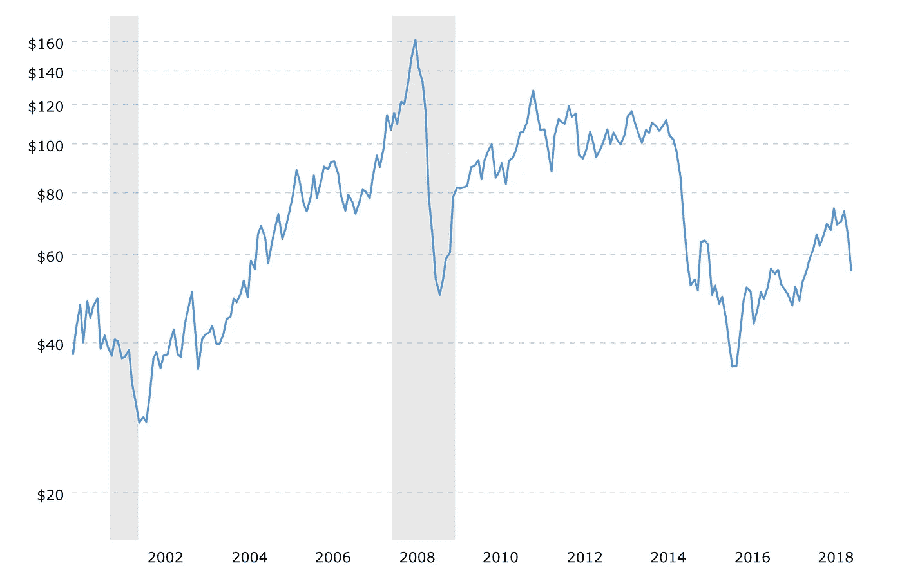

# 在过去的两年里，我的第一次石油危机教会了我什么

> 原文：<https://medium.datadriveninvestor.com/what-my-first-oil-downturn-had-taught-me-in-the-past-two-years-b20cc763e04c?source=collection_archive---------43----------------------->

Photo by [Zbynek Burival](https://unsplash.com/@zburival?utm_source=medium&utm_medium=referral) on [Unsplash](https://unsplash.com?utm_source=medium&utm_medium=referral)

教室里挤满了学生。在那里，它旨在传授知识，也许是智慧，在未来帮助那些新学员处理他们的第一份工作，并确保他们在专业展示中的位置。事实上，在教室里的那些日子和几年肯定会让他们的头脑充满概念、技术和实践，这样这些学生就可以最终获得一个学位，证明他们是工程师、律师或医生。然而，生活呢？当这是生死攸关的问题时，课堂怎么能和经验教给我们的东西相比呢？

早在 2013 年，我在一家石油服务公司兼职时，正在写我的本科论文。我花了(我称之为:投入)五年时间努力学习，完成每一件事，尽可能多地参与学术活动。我知道我属于一个依赖于不断波动的大宗商品的行业:石油。我几乎不知道，当某种“危机”爆发时，这种大宗商品会在全球范围内引发涨跌。

在 2015 年的后几个月，在经历了两年半不可思议的艰难岁月后，所谓的石油衰退终于降临到我的工作岗位上，动摇了办公室每个人的地位，最终导致合同终止(至少不是因为不当行为或缺乏表现)。石油价格从 100 多美元跌到不到 40 美元。

[https://www.macrotrends.net/1369/crude-oil-price-history-chart](https://www.macrotrends.net/1369/crude-oil-price-history-chart)

对我来说，2016 年初是“休假年”(我以为只有几个月)的开始。我通过与朋友联系来面对它，因为我的工作，我不能看到，与家人深入接触，享受一些“我自己的时间”只是觉得这是必要的。

日子一天天过去，飞蛾扑火，终于，第一年失业了。这是一种奇怪的感觉；我不得不说。我在一百万个新的小企业中思考，教这个，买和卖那个，我的头脑充满了想法。那些日子我靠积蓄生活(感谢上帝我有积蓄)，不知道该采取什么步骤。2017 年初，我决定去留学这是在这里说比住容易。我不得不抛下一切，这样我才能集中精力重新开始。

2018 年终于到来了，我结束了硕士学位的演讲部分，目前，我正在写我的硕士论文。今年 11 月，我将失业三年。然而，当我回想起来，我可以说我学到了很多东西，我想与你分享:

**1。比你能看到的多得多**

你还记得我一开始提到的那个教室吗？嗯，没有人教我生活会如何打击你，当然会试图打倒你。我的意思是，我们都知道生活是艰难的，但只有当你经历这种压倒性的经历时，它才会变得真实。简而言之:我没有准备好。

当生活打击你时，你必须反击。在开始的时候，一切都是黑暗和混乱，但是你会找到路的。危机时刻是成长的最佳时机。在此期间，我经历了一场谦卑的洗礼，这帮助我学到了更多。我已经建立了自学的习惯，并以此学习了编程语言和一些其他专业使用的软件。我从来不知道我可以从 MOOC 这样的免费资源中学到这么多。现在，我每个月至少读三本书。

在这段时间里，你会感到“被迫”去发展想法或将一些项目付诸行动。当你开始看到你以前不知道自己拥有的技能和优势时。

**2。你会真诚地重新见到你真正的朋友和家人**

这个在这里很难讲。当危机来临时，一些朋友会逃跑。但是，有一点是真实的。朋友会和你保持亲密关系，最后你会感到更快乐，因为你知道在困难时期你可以依靠谁。甚至更多，新朋友会出现。我可以打赌。另一方面，还有家庭。没有他们，我不会找到我的位置。

**3。你的成功之路是接受**

世界上每天都有很多事情发生，这些事情远比我的故事更具戏剧性，这些事情无法改变，但当你决定接受你是谁、你拥有什么和你的价值时，通往成功的正确道路就变得真实了。停止强迫事情去改变你的现实。接受它，拥抱它们，并发挥出最好的一面。

**4。学习永远不会让你失望**

这一点是我最后也是最重要的一课:学习。是的，又是课堂，但不再像大学时代那样了。知识已经成为我生活中重要的一部分。我与石油工程领域的专业网络保持联系，但我开始涉足不同的领域，如数据科学、管理和商业。数据科学领域我要感谢我正在完成的硕士学位。这学期的第一周，我出现在一间教室里，教授说。这个软件是 R:一个数据分析编程软件。嗯，从那以后，我就开始了这方面的学习之路。我已经完成了几门 R 课程、统计学课程和 SQL 课程，现在我正计划用于石油工程(这不是一个新领域)领域，我也希望用于其他一些行业。我找到了新的激情。生活的这一部分是一个“重新发明自己”的过程。

在这件事上，我最后的想法是，如果你正面临石油衰退的影响或任何其他生活挫折，你正处在成为你一直想成为的人的正确位置上。第一步是更难迈出的一步，当你看不到舒适区的彼岸时，你会发现这是好是坏。正如我最喜欢的古罗马人物之一所说:

“通过怀疑，我们实现了”——马库斯·图留斯·西塞罗

永远不要在同一个地方停留太长时间，你的肌肉，当然还有你的大脑会萎缩，只是因为它们习惯了处于一个特定的状态。

我是土生土长的厄瓜多尔人，但我认为自己是世界公民，相信总有时间通过合作和知识变得更好。 [LinkedIn](https://www.linkedin.com/in/marco-brito-f/) ， [Instagram](https://www.instagram.com/marcobf30/) ， [Twitter](https://twitter.com/marcobfec) 。

