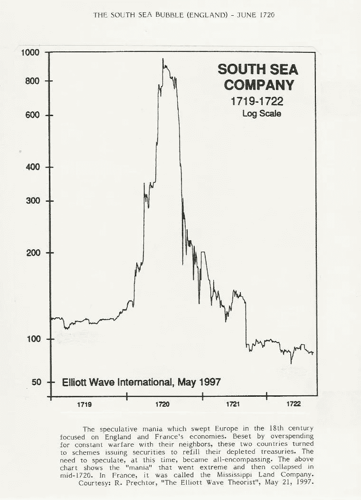
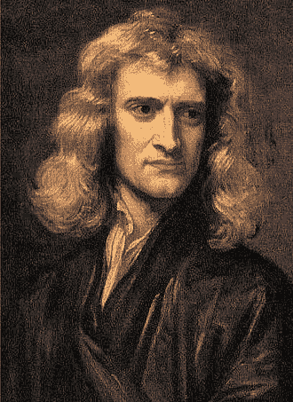
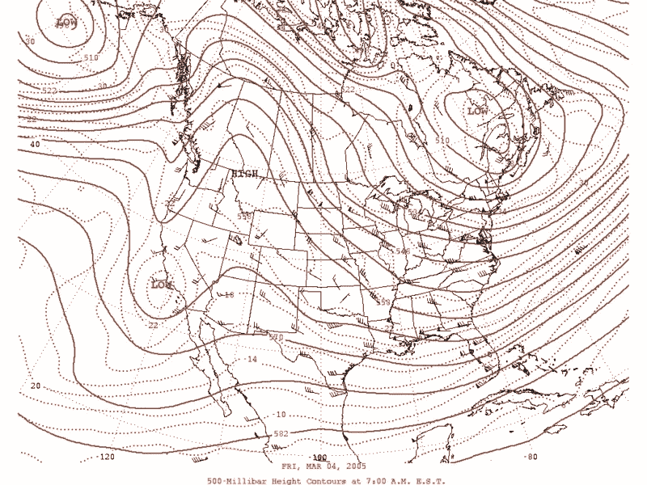
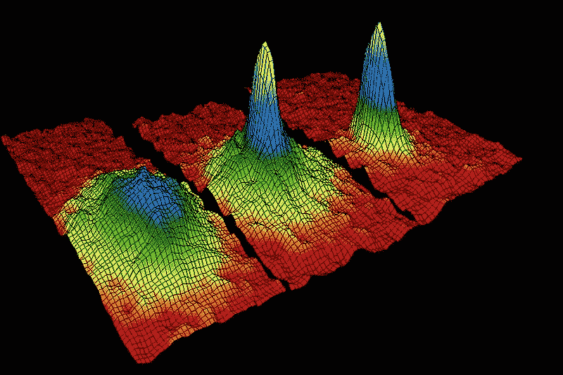

# 牛顿和量子力学能教会你如何战胜股市:

> 原文：<https://medium.datadriveninvestor.com/what-newton-and-quantum-mechanics-can-teach-you-about-beating-the-stock-market-3a0d6d3d6188?source=collection_archive---------1----------------------->

> “我可以计算天体的运动，但不能计算人的疯狂”——艾萨克·牛顿爵士在 1721 年南海公司泡沫破裂后说。

Price of the South Seas Company shares from the 1719 to 1722.

艾萨克·牛顿爵士可以说是科学史上最伟大的偶像，奠定了微分学和力学的基础(以及其他不可估量的贡献)。他作为皇家铸币局局长和铸币局局长**的一面鲜为人知，这反映出他生命的最后几年部分致力于更世俗的事务。在这些货币努力之后，他陷入了他那个时代最具破坏性的**投机狂潮。****

[南海公司](https://en.wikipedia.org/wiki/South_Sea_Company)是一家成立于 1711 年的英国[股份制](https://en.wikipedia.org/wiki/Joint-stock_company)公司。由于它是作为减轻国家债务的措施而创立的，它被授予了与南美新发现的领土进行贸易的垄断权。然而，在十八世纪早期，西班牙和葡萄牙控制了欧洲大陆的绝大部分，英国参与了西班牙王位继承战争。因此，**没有预测**企业会盈利。

 [## 2019 年即将改变世界的技术|数据驱动的投资者

### 很难想象一项技术会像去年的区块链一样受到如此多的关注，但是……

www.datadriveninvestor.com](https://www.datadriveninvestor.com/2019/01/17/the-technologies-poised-to-change-the-world-in-2019/) 

然后，该公司开始**膨胀其股票**，利用了这样一个事实，即没有公民愿意错过投资于承诺的新世界财富的机会。最疯狂的谣言传播开来，在不到四个月的时间里，股价从 1720 年 1 月的 128 T21 涨到了 5 月的 550。股东范围从国王乔治一世到最富有的政治家，这使得公司享有很高的声誉并吸引了潜在的买家。

在最终意识到股票价格与公司未来的业绩毫无关系后，董事和官员于 1720 年 6 月卖掉了。消息传到利益相关者那里，很快价格暴跌，警报拉响。许多投资者倾家荡产，T2 下议院下令进行调查以确定和清除责任。据披露，至少有三名部长收受贿赂并进行投机，这将作为史无前例的内幕交易案载入史册。为了防止这一幕再次发生，1720 年颁布了[泡沫法案，禁止成立任何其他股份公司，除非得到皇家特许。](https://en.wikipedia.org/wiki/Bubble_Act)

Portrait of Newton by [Godfrey Kneller](https://en.wikipedia.org/wiki/Godfrey_Kneller), 1689

我们故事的主角艾萨克·牛顿爵士损失了 2 万，这将相当于今天的**300 万美元**。在那之后，他为历史提供了一段著名的引言，并禁止任何人在他面前说“南海”这个词。现在，我们将在大约两个世纪后的时间旅行，了解物理学史上的另一个辉煌突破对股票市场的启示。

## 一个关于为什么预测股票市场是徒劳的量子理论争论:

预测股票市场的走势通常被比作天气预报。预测天气的主要困难是大气现象在本质上是混沌的，需要大量的计算能力。从数学的角度来看，如果初始条件的**微小变化导致完全不同的结果**，那么系统就是混沌的。蝴蝶效应中的隐喻准确地描述了这一点(“一只蝴蝶在亚马逊丛林中扇动翅膀，随后一场风暴蹂躏了半个欧洲”)。

原则上，这意味着更强的计算能力，测量不确定性的降低，以及发展更精确的数学模型将意味着天气预报的提高。我们可能会想当然地认为这就是价格预测的情况，然而，这两种类型的预测有一个主要的区别。在股票市场，预测本身会改变其结果。**也就是说，参与者通过参与金融市场直接影响资产价格**。

在这种情况下，一个更好的类比是与量子物理学的比较。**量子理论是描述最小能量尺度下自然行为的基础理论，**包括原子和亚原子粒子之间的相互作用。在这个尺度上，我们熟悉的物理直觉定律并不适用。特别是，我们对一个自量子力学诞生以来就一直困扰着它的主要难题感兴趣，即**测量问题**。

定性来说，一个量子系统同时存在于一个状态集合中(*态的叠加*)，这些状态集合包含了关于系统位置和速度的信息(从物理角度描述一个物体所需的信息)。**在现实中，系统只能处于这些状态之一**(每个人都会同意，根据他们的经验，一个物体只在一个地方)。仅获得一个状态的最终结果是通过由观测器测量系统来完成的。

测量后，系统“*将*折叠成一种状态，重复测量会得到相同的结果。但重要的是要注意，在观察者与系统互动之前，系统处于状态的**叠加状态，每个状态都有指定的概率，因此这种崩溃不是确定性的过程(结果是随机的)。**

正是在这一点上，与股市的类比开始变得有意义。**相当于购买**。股票的价格在被有效购买之前是不确定的。因此，股票市场可以被视为一个量子系统。在这种情况下，股票价格的变动只有在由**观察者**(投资者)进行**测量**(买入)后才能确定。

总之，我们在量子物理领域的旅程提供了一个坚实的论据来描述**预测预测者影响其结果的过程的困难**。你可能会奇怪这跟南海公司和牛顿那一节有什么关系，但还是有必要先介绍一个金融经济学中的概念。

## 有效市场假说:

有效市场假说(EMH)是一种投资理论，根据这种理论，所有关于投资证券的已知信息都已经反映在市场上了。这一理论意味着，跑赢市场是不可能的，如果参与者去了拉斯维加斯的赌场，他们跑赢市场的几率是一样的。

即使有证据支持[有效市场假说](https://www.investopedia.com/ask/answers/032015/has-efficient-market-hypothesis-been-proven-correct-or-incorrect.asp)背后的推理，前提也是不可证伪的。这意味着没有实验可以证明或反驳 EMH，根据科学哲学家[卡尔·波普尔](https://en.wikipedia.org/wiki/Karl_Popper)的说法，它不能被认为是一种科学理论(它不遵循科学方法)。

正是在这种背景下，我们与南海公司的轶事变得有用。根据 EMH 的观点，泡沫是不会存在的，尽管历史上反复出现过这样的例子:[郁金香狂热](https://en.wikipedia.org/wiki/Tulip_mania)，[1929 年华尔街崩盘](https://en.wikipedia.org/wiki/Wall_Street_Crash_of_1929)或者南海泡沫本身。EMH 不承认泡沫的存在，原因很简单。该假说的一个关键假设是，市场上有足够数量的资金充足、理性、追求利润的交易者，以确保没有套利机会。在现实世界中，我们有理由认为**不对称信息**会对预期资产回报产生重大影响。参与者可以利用市场的这些低效率进行有利可图的投资。

## **故事寓意:**

总之，金融市场呈现出**低效率**的特点，可以为投资者所利用。然而，即使我们反驳了有效市场假说，预测资产价格的方向仍然是一项不确定的努力。借用量子力学的一致性有助于理解市场的潜在随机性，这种随机性源于投资者自身的活动。这个类比直接描述了这种预测的内在局限性。

使用牛顿的例子作为人类理性的象征，我们可以了解到股票市场最终是由其参与者模拟的。任何明智的投资策略都容易受到人类有时武断决定的影响。用牛顿的话来说，就是无法计算人的**疯狂**。