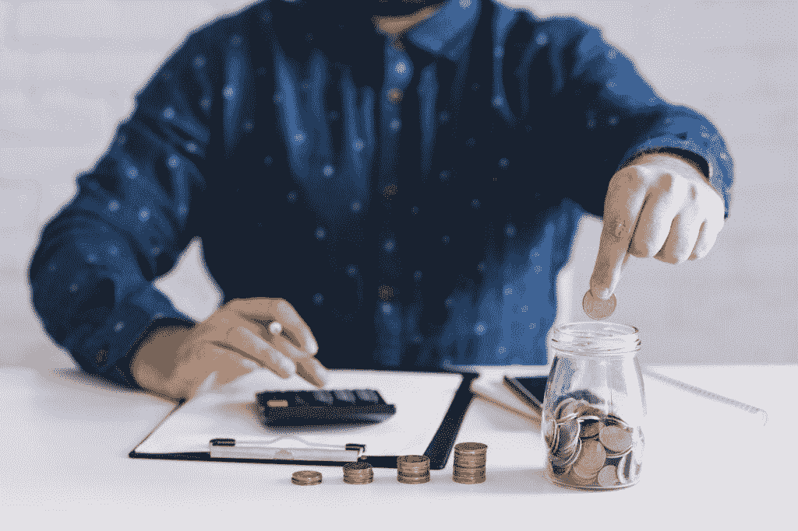

# 不要用你的钱做什么

> 原文：<https://medium.datadriveninvestor.com/what-not-to-do-with-your-money-d805fd85500a?source=collection_archive---------7----------------------->

Photo from [Freepik](https://www.freepik.com/free-photo/businessman-putting-coins-jar-using-calculator-workplace_2941722.htm#page=1&query=money&position=30)

今天，我想谈谈一些你永远不应该用你的钱做的事情。比如，烧了它？嗯。好吧，除了我要说的你永远不应该用你的钱做的三件事，还有一些常识性的事情你不应该做，比如烧掉你的现金，埋掉你的现金，或者吃掉你的现金。

希望这些都是常识，因为接下来我要告诉你的三个并不明显。

## 像对待金子一样对待它

你千万不要把钱当成黄金来对待。黄金是一种有形资产——它有内在价值——你可以触摸它，看它，甚至吃它。你知道，用金箔。黄金有真正的内在价值，而你的现金没有。我们的现金只有虚拟价值。你那张写着 100 美元的绿色纸能给你买一双鞋的唯一原因，是因为政府说你的百元钞票有价值。你的现金不是由黄金、白银、石油或类似的东西支持的。这只是垄断货币，政府承诺说它有价值。如果政府说它足够好，我就接受它。

 [## 更好的预算，打造更大的|数据驱动型投资者

### 即使是专家也承认它们并不完美。从 1 到 10 的范围内，安东尼·科普曼和德尔…

www.datadriveninvestor.com](https://www.datadriveninvestor.com/2018/11/08/budget-better-to-build-bigger/) 

当你明白你的纸币到底是什么的时候，这就成了一个问题。世界上的黄金供应是有限的。就像，如果我们想要更多的黄金，我们必须亲自去开采黄金，这就是为什么它有内在价值，因为你不能只是打印黄金，即使你有一台 3d 打印机。另一方面，纸币有一点不同。如果政府想要更多的钱，美联储就会印更多的钱，而制造一张 100 美元钞票的成本大约是 12 美分。这就是为什么如果你像囤积黄金一样囤积现金，你会变得更穷。

由于每天都有越来越多的钱被印出来，你存起来的钱每年都会贬值 2%到 3%。如果你在银行存了 100 万美元，平均利率为 0.1%，仅仅一年你就会失去价值 2 万美元的购买力，因为你认为你存钱是明智的。

你应该做的是拿出你的额外现金，用它来购买真正有价值的东西，比如黄金，或者更好的是，你可以通过股票市场用你的额外现金投资你喜欢的公司，或者你可以通过特许经营的方式收购企业，或者你可以开始自己的房地产投资组合。这些东西会给你带来额外的收入，所以现在你在用你的现金变得更富有，而不是囤积现金变得更贫穷。

## 为你不需要的东西融资

第二，你永远不应该用不属于你的钱去资助那些你不需要的、你负担不起的、没有回报的东西。听着，这个世界是这样运作的:每个人都想把手伸进你的口袋，从你的口袋里拿走一些钱，然后放进他们的口袋。

花钱买你喜欢或想要的东西没有错，我的意思是，这是赚钱的全部意义，但问题是我们花了多少钱。2019 年，纽约美联储银行进行了一项研究，他们发现现在的家庭消费者债务总额比 2008 年峰值时多了 1 万亿美元。美国人在花钱，好像这是他们的工作，但我们真正的工作并没有支付足够的钱来支持所有的支出。

这显然有很多原因，但我要说的是，大多数人很难控制自己的支出的首要原因是，你不能像炫耀你的新苹果 airpods 那样炫耀你的新苹果股票。推迟一些满足感可能会让你在一段时间内看起来像一个失败者，但它会让你远离消费者债务，这将让你口袋里有更多的钱，你可以用来投资你的未来，积累你的财富。这意味着你有足够的钱在未来买得起所有你想要的苹果 airpods，无息，现金无任何压力。

所以你能做的最简单的事情就是，从现在开始，什么都不要融资，只买你买得起的。而且，你怎么知道自己买得起什么？好吧，你可以遵循我们的五个法则，它说:如果你买不到五个，你就买不起一个。

## 把它托付给一个从未赚过钱的人

最后，关于你的钱，你永远不应该做的第三件事是，把钱托付给一个从未赚过钱的人。让我问你一个问题:如果 NBA 历史上最好的篮球运动员之一勒布朗·詹姆斯向你提出如何提高投篮命中率的建议，你会听他的，还是更愿意听你那从未踏上球场的胖叔叔的？这似乎是显而易见的，但大多数人宁愿听胖叔叔的建议，而不是詹姆斯叔叔的建议，因为你胖叔叔的建议更容易接受。

每个人，你的父母，你的银行家，送披萨的人都会对你应该如何花钱有强烈的意见。他们听起来会非常自信，他们会让你觉得不听他们的话像个傻瓜，但你应该听极少数人的建议。

知道如何使用你的钱并谈论它和实际去做是非常不同的，所以听听那些实际去做的人，而不是那些只是谈论它的人。

*原载于 2019 年 12 月 15 日*[*【https://opinined.com】*](https://opinined.com/what-not-to-do-with-your-money/)*。*