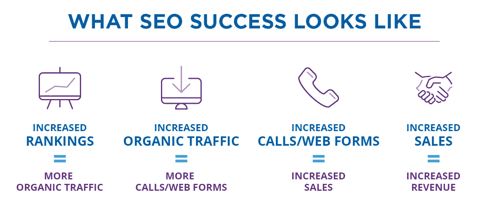
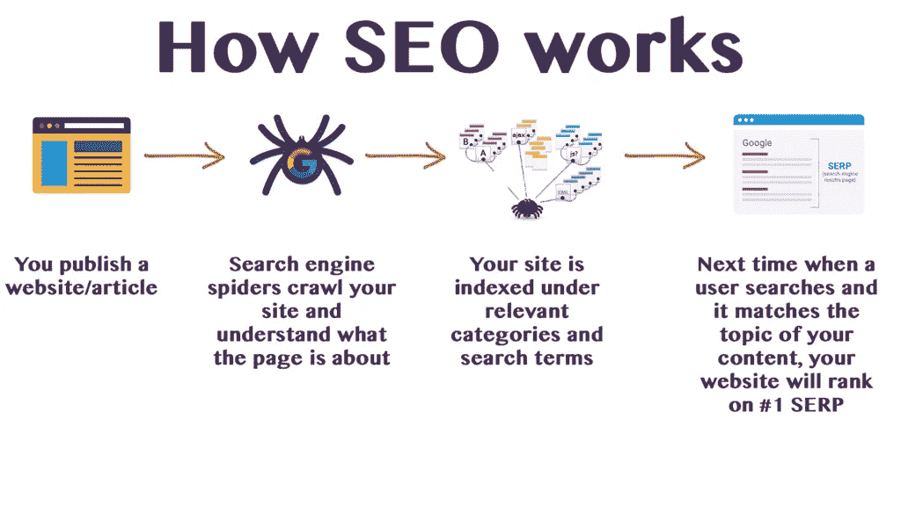

# 招聘前应该问 SEO 公司哪些问题？

> 原文：<https://medium.datadriveninvestor.com/what-questions-should-i-ask-an-seo-company-before-hiring-bd5342ea773b?source=collection_archive---------7----------------------->

你的生意是你的宝宝，所以你需要尽最大努力照顾它，让它变得健康。无论你有自己的公司，或者你是一名营销人员，负责增加来自谷歌和线索的业务有机流量，你都需要与正确的 SEO 公司合作来实现既定目标。

雇佣一家搜索引擎优化公司是你必须做出的最重要的决定之一。如果你找到正确的，超时，它会弹射你的网站到谷歌的第一页，并帮助你获得合格的线索。另一方面，错误的 SEO 公司对你的数字营销工作弊大于利。

在过去，我已经聘请了几家搜索引擎优化公司为我的客户做具体的项目。今天，我向你揭示在雇佣你名单中的任何 SEO 服务提供商之前，你需要问的最关键的问题。

# 1.在谷歌上排名要多久？

这是帮助你决定是否应该继续讨论的第一个棘手问题之一。如果一家搜索引擎优化公司回答这个问题时说，“我们能够在头 1-2 个月内让你的业务排名，”赶紧逃之夭夭。

这些类型的搜索引擎优化公司是为了快速赚钱，将使用任何必要的手段，包括黑帽搜索引擎优化策略，给他们的客户积极的结果。嗯，有一些调整，可以在一个网站上已经有一个良好的反向链接配置文件和坚实的领域权威，将其移动到谷歌的第一页。然而，没有保证，没有搜索引擎优化服务提供商可以给你一个坚实的答案，这个问题没有做一些[的背景研究，你的公司第一。](https://mediaonemarketing.com.sg/seo-audit-guide-singapore-marketers/)

[最佳搜索引擎优化公司](https://mediaonemarketing.com.sg/seo-singapore/)将对你的公司进行广泛的研究，并根据战略和竞争力给你一个估计，但它不会保证在特定时间内的首页结果。

# 2.你会用什么策略来获得反向链接？

令人难以置信的是，这么多企业没有一个坚实的反向链接战略。首先，反向链接是谷歌用于网站排名的主要因素之一。它是谷歌算法的基础，所以如果你的商业网站没有高质量的反向链接，它将很难在谷歌上排名。

将你的域名权威与你的竞争对手进行比较，以了解你在谷歌上的排名。你也可以使用其他高级工具，比如 Moz，来查看最近发现的指向你的网站的链接。

回到这个问题，搜索引擎优化公司应该给你明确的策略细节，让其他网站指向你的网站。要求看到反向链接配置文件，以确保所有的链接是合法的。

# 3.你会做任何现场优化吗？

除了反向链接，用户体验是谷歌衡量网站的另一个重要因素。网站访客在你的网站停留多长时间，体验好吗？高跳出率表明你的网站没有提供最好的用户体验。

正确的搜索引擎优化公司应该做一个全面的网站审计，以确定跳出率，最受欢迎的页面，以及需要改进的页面。请记住 [SEO 是一个持续的过程](https://www.searchenginejournal.com/seo-guide/)，因此 [SEO 服务提供商](https://mediaonemarketing.com.sg/seo-services-singapore/)应该能够调整有问题的页面并监控它们，以确定改进是否如预期那样工作。

# 4.你会使用哪种本地 SEO 策略？

如果你在一个特定的地方提供服务，那么你需要一个强大的本地 SEO 策略来帮助你的品牌获得更高的优势。询问搜索引擎优化代理，他们将对你的网站进行哪些具体的改进，以帮助你从当地市场获得更多的客户。

这里有一些你需要问的问题。

我的 NAP(姓名、地址和电话号码)在网站的所有部分和本地目录中是否一致？

我的标题标签是否针对当地市场进行了优化？

我的业务是否被提交到任何本地目录？

您是否被列入当地市场或您经营的当地地区的“最佳”名录之一？

# 5.如何生成报告，频率如何？

[Moz](https://moz.com/) 是迄今为止经验丰富的 SEO 专家和企业最好的软件之一。你可以毫不费力地在谷歌上追踪你所有的目标关键词排名。

在你开始与搜索引擎优化公司合作之前，列出你希望你的网站进行排名的所有相关关键词。这个初始关键词列表将是 SEO 公司随着时间的推移所取得的进展的基准。

例如，如果你在谷歌上搜索一个关键词，比如“新加坡数字营销商”，很明显，随着时间的推移，你希望在搜索引擎优化公司开始在你的网站上工作后看到一些进展。

然而，关键字列表不应该过于复杂，因为这将使进入谷歌首页的过程更加困难。新加坡领先的 SEO 公司 MediaOne Marketing 编制了一份与品牌最相关的 20 个关键词的列表，以供监控，这极大地有助于确保网站对特定激光关键词的排名。这种策略也有助于向目标受众展示网站，并节省试图对不相关的关键词进行排名的费用。

# 6.你会做关键词研究吗？

关键词研究是任何 SEO 策略的基础。如果 SEO 公司不打算做任何关键词研究，那么肯定不值得你花时间和金钱。与过去不同的是，现在有了比谷歌分析更先进的关键词工具，尽管后者仍然很有用。

理想情况下，你首选的新加坡 SEO 机构应该为你的主页和其他目标页面提供一个流行的关键字变化列表，以增加流量和线索。

额外提示:如果你在谷歌上搜索一个与你的领域相关的术语，在第一页的底部，你会找到一个谷歌会在网上找到的“相关搜索术语”的列表。考虑在你的站内和站外使用这些关键词来增强公司提出的搜索引擎优化策略。多走一英里，问搜索引擎优化服务提供商，如果他们使用这个免费的方法来找到各种关键字或使用其他工具，如 SEM Rush 来找到相关的关键字。

# 7.博客策略是什么？

虽然许多 SEO 公司会提供大量的通用博客，但你需要问问自己这些博客是否与你的业务相关。

博客对于 SEO 来说是很棒的，谷歌喜欢为观众提供相关信息的高质量博客。经验法则是，只有当博客内容为你的业务带来相关流量时，博客才值得大肆宣传。

目前，基于问题的博客比一般博客表现更好。例如，许多搜索引擎优化公司竞争关键词，如“新加坡的搜索引擎优化公司”，但竞争较少，如“你应该问你的新加坡搜索引擎优化公司的问题。”关注这类术语的一个好处是，你不仅可以对本地市场进行排名，还可以对全球搜索术语进行排名。看到这篇文章的读者有更高的意向，他们有可能会改变主意。

# 8.你有推荐人吗？我可以联系他们来更多地了解你的公司。

最好的搜索引擎优化服务提供商，如总部设在新加坡的 MediaOne Marketing 有数百个推荐人，你可以联系他们来更多地了解这家公司。询问他们的联系方式，并与他们取得联系，以便更清楚地了解公司提供的服务。

不要忘记在谷歌上做一些研究，看看你要与之做生意的搜索引擎优化公司在当地市场的排名。如果不是，问问它为什么不实践它所宣扬的。不用说，它应该在当地市场排名很好，以帮助你也在你的目标地理位置排名。

# 搜索引擎优化是一个巨大的难题

搜索引擎优化是一个巨大的难题，很难理解，尤其是如果你刚刚开始。像 [MediaOne Marketing](https://mediaonemarketing.com.sg/seo-services-singapore/) 这样的专业搜索引擎优化公司将帮助你了解能对你的网站在谷歌上的排名产生重大影响的所有方面。该团队还会让你了解 [SEO 战略](https://mediaonemarketing.com.sg/seo-singapore-smes-quick-guide/)的进展，以避免任何困惑。