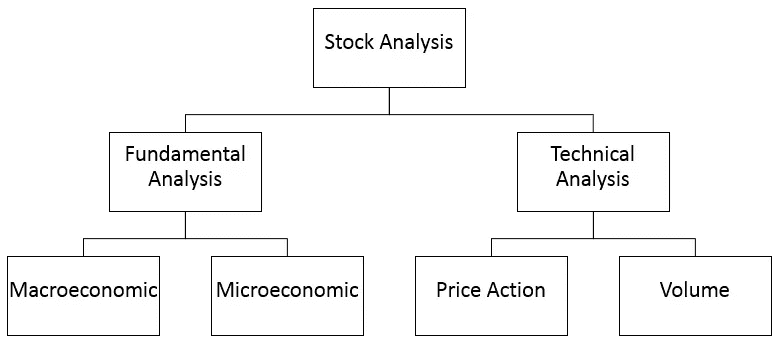
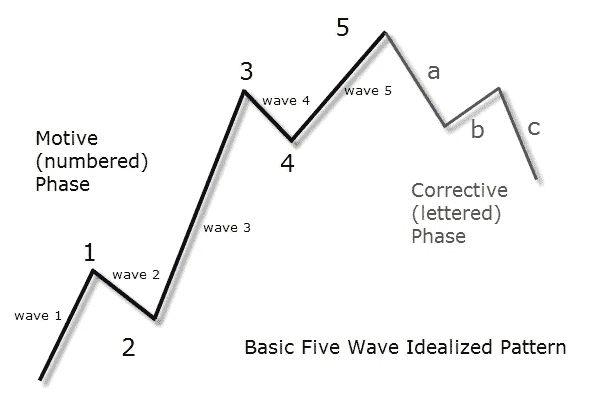

# 真正驱动市场的是什么？

> 原文：<https://medium.datadriveninvestor.com/what-really-drives-the-market-1da433e7ed57?source=collection_archive---------7----------------------->

*驱动市场的是技术分析吗？*

关于金融市场中最佳方法的观点一直存在分歧。有人认为技术分析是成为成功交易者的最好方法，反之亦然。

然而，一个有趣的事实是，大多数人认为只有技术方法(这是更容易的方法)才能成功交易。

You can apply this method to Fx, commodities markets as well

那么…如果这就是为什么摇摆交易者如此纠结于他们的摇摆头寸的原因？他们开始认为市场总是和他们作对。

你有没有想过是什么真正驱动着市场，哪种方法最适合你？

无论是基本面分析还是技术分析…

这可能是交易方法中最大的误解之一。许多人(大多数是散户)认为技术分析是市场的驱动力。他们为什么这么说…？

这很容易理解，因为教授技术分析比基本面分析要容易得多——你可以用非常不同的方式运用技术分析的基本设置，这可能会奏效，即使你训练有素也会成功。

让我告诉你一个坏消息…真正起作用的是基本面分析，而不是技术分析！

**正确的方法大概是:**

**80%基本面**

**20%技术含量**

然而，如果你只使用技术分析，你可以成为一个盈利的交易者，但是方法必须是聪明的，你不能长期预测市场，即使你使用高时间框架，也只能在短时间内预测市场。

基本方法>技术方法

如果你看看伟大的投资者，你应该已经注意到，大多数投资者不谈论技术分析，他们总是在寻找经济，收支平衡，政治问题，以及其他方面。

也许，最好的方法是结合两种分析，因为基本面驱动市场，但它不会告诉你进入市场的好时机，而技术分析会告诉你。

Elliott Waves Theory

很少有投资者谈论技术方法，更少的投资者在使用技术分析的业务中获得成功。但是罗伯特·R·普雷希特的情况却不一样，他以艾略特波浪理论而闻名，至今仍在使用！

因此，从这些角度来看这些话题，你必须选择你的市场方法…

你已经知道，如果你将重点放在技术方法上，你不应该冒险预测超过你可能知道的方法。

最好的方法是当你结合这两种方法，以最大限度地提高你的利润和降低你的风险！

注意，这只是我的看法！