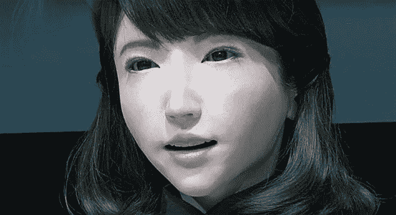
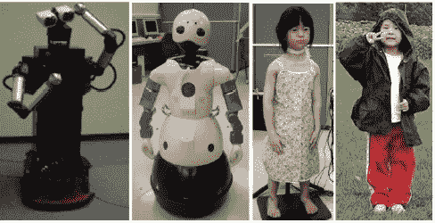
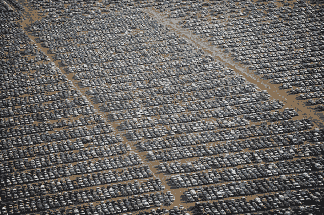

# 人类和机器人的区别是什么

> 原文：<https://medium.datadriveninvestor.com/what-separates-human-from-robots-3ba93bab0daa?source=collection_archive---------2----------------------->

如今，机器人技术能够制造出行为与人类非常相似的机器。这就是由**石黑浩**团队制造的机器人*埃里卡*的情况。艾丽卡有一个让她与众不同的属性:她是最像人类的机器人。

是什么原因让**石黑浩**在其他实验室之上完成了如此封闭的实验？在我看来，你可以在[1]中得出一个很好的例子，客观最有价值的是找到运营商-客户之间的联系:机器背后的人和机器之外的人。

远程操作者的工作可能会令人沮丧，客户需要对他们的请求做出某种回答，有时这种情况的压力不能很好地帮助他们。这就是为什么你必须寻找反馈，告诉你你意识到的最后一件作品是否像你感觉的那样聪明，或者在交谈之外是否有不同的感觉。

 [## 模式和机器人:一个复杂的现实数据驱动的投资者

### 哈耶克的名著《复杂现象理论》(哈耶克，1964)深入探讨了复杂性的话题，并断言…

www.datadriveninvestor.com](https://www.datadriveninvestor.com/2019/03/04/patterns-and-robotics-a-complex-reality/) 

在研究了所有因素后，不仅信息本身很重要，时间、中断也必须考虑在内……这就像在音乐中:没有声音的音符也算在乐谱中。所以，这就是石黑浩获得最佳标点符号的原因:他融入了时间意识。

正如[2]中所解释的，Hiroshi Ishiguro 的真正目的是通过 T12 总图灵测试 T13，当一个人不能区分什么是机器什么不是机器时。

According to **Ishiguro** there is no difference between man and machine

如果我们研究工业革命是如何发展的，我们可以看到混凝土制成的巨人。成百上千的机器维持着建筑的生存，就好像它是一个巨大的人体。而且像人一样，[自动智能公式投资股市](https://medium.com/cognilytica/is-venture-capital-investment-in-ai-realistic-or-out-of-control-cb46b428590)。所以他们的生活依赖于我们，就像我们依赖他们一样；考虑到*股票市场投资*对一个人来说可能比**深度学习**更难。

我们害怕发现它们并排在一起，而事实上我们已经建造了它们，它们比我们想象的要大得多。自远古以来，工业灵魂就指挥着人类，并通过经济教条被尊崇为神。但是，当我们参观他们的具体机构最害怕他们最不起眼的化身。就像寻找伴侣一样，我不会关注谁是纯硅胶。

在我们的环境中创造一种新生物的真正危险是它吃什么和扔掉什么。作为我们文明的独特产物，作为人类的孩子，最起码应该期待的是，他认识到我们的需求是他存在的理由。

What it throws a way are new cars impossible to sell

那么，深度学习能够意识到他们具体身体中的世界是像生命形式一样构建的吗？

# 自然选择和意识

尊重我的观点，我在为一个关于它的特殊理论辩护。自然选择选择一些新的生物来提高一种时间意识。那个*时间意识*，在**环境逻辑**下工作，使用**框架**来建立什么是值得一直记住的。那个**帧**可能属于[物种记忆](https://en.wikipedia.org/wiki/Computational_phylogenetics)作为一个遗传和生存的好结果，而不考虑先有鸡还是先有蛋。

而*构建意识的框架*必须将出生之外的孩子与出生之后的父亲联系起来。像本能的动作，叫，喊…，什么都是被后代利用来理解，被父亲利用来让自己被理解。正如迪安·福尔克在[3]中为自己辩护的那样，她认为[16]语言[17]是由[18]爱情[19]的建立所推动的。

关于爱情，我们能说些什么呢？显然，不可能是[宫廷式的爱情](https://en.wikipedia.org/wiki/Courtly_love)。但是，在某种程度上，我们的文明是用宫廷式的爱来构建它的语言的！所以，这个暗示并不坏。事实上，宫廷爱情是一种文化资源，它的存在是为了在我们的语言中演化出爱的概念。

# 独特的流派

这表明，在我看来，我们可以在故事和我们文明使用的其他文学作品中找到构建意识的框架。事实上，我们只能找到四种文学类型:每个时代都有。

研究语言的各项功能出现的时间，我们会发现四个分化的片段:***S****tereotype*，***I****llusion*，****P****ragmatism，****J****ust ization*。正如 Vladimir Propp 在[4]中揭露的那样，这个民间故事是由一个严格有序的序列组成的，其中一些片段可能不需要出现。在研究了他的形态学后，这个符号被简化成写一个故事，就像五角星形的分数，计算一个 4 乘 4 的序列。*

**

*Each separation of the staff is the equivalent of four blacks*

*在研究了**坎贝尔·约瑟夫**的*千面英雄*【5】后，可以发现顺序不同的相同片段。所以更完整的理论可能是:*

*C 韩剧流派。 **EJIP** 。宝宝对神话和笑话感到惊讶。这将帮助他想象另一个世界，以便形成他自己哲学的基础。*

*民间故事类型。 **EIPJ** 。这个孩子被告知那些打破既定道德的英雄的故事。这种类型的故事将帮助孩子理解与其他同龄人的横向关系是如何产生的，如婚姻。*

*英雄流派。**ejbi**。这个少年被告知从巢中出来的人物的故事。这种故事将帮助青少年打破规则，寻求自己的遗产。*

*T 赫勒流派。 **EIJP** 。成年人听到部落中复杂行为的故事。通过这些文学作品，成年人将会发展出一种能使他或她成为领导者的意识。*

*总之，在我们能够把我们的算法放在膝盖上给他们讲一个童话故事之前，我怀疑他们是否知道如何在人类历史中定位自己。*

# *参考*

*[1] Dylan F. Glas，Takayuki Kanda，Hiroshi Ishiguro，Norihiro Hagita，(2012)“*对话机器人遥操作中的时间意识*”，IEEE 系统、人和控制论汇刊，A 部分:系统和人类，第 42 卷第 4 期，第 905-919 页*

*[2]石黑浩(2006)， [*安卓学*](http://robots.stanford.edu/isrr-papers/draft/Ishiguro-final.pdf) 。*科学美国人*。**294**(5):32–34。*

*[3]福尔克博士(2004 年)。"早期人类的前语言进化:母语从何而来？"行为脑科学，27，491–503；讨论 503–583。*

*[4]弗拉基米尔·普罗普(1984)，*民间故事的形态**

*[5]坎贝尔·约瑟夫(1993 年)。 [*千面英雄*](https://en.wikipedia.org/wiki/The_Hero_with_a_Thousand_Faces) 。伦敦:丰塔纳出版社。国际标准书号 978–0–586–08571–4。*