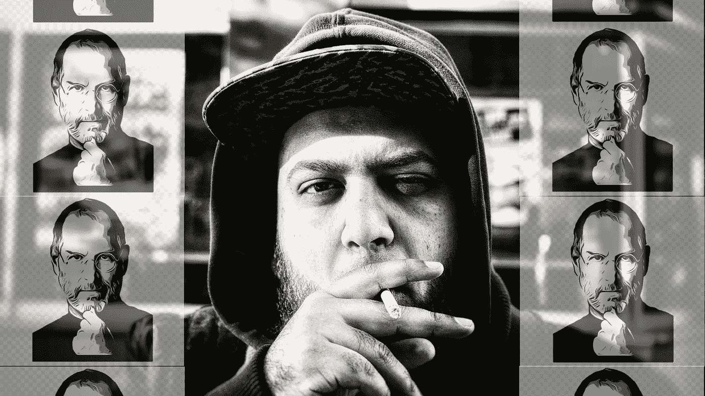

# 关于激励的霍乱，史蒂夫·乔布斯没有告诉我们什么？

> 原文：<https://medium.datadriveninvestor.com/what-steve-jobs-hasnt-told-us-about-the-cholera-of-motivation-1b0f331a34a1?source=collection_archive---------18----------------------->

## 动机演讲者和他们的风险…新的全球变暖！

你告诉我:

> 努力工作

你想让我着火。像马一样刺痛我的屁股，让我疯狂的奔跑！我才 17 岁。我是生活新手！

如果我毁了我的生活呢？如果我有一次糟糕的经历，导致我总是恐惧和崩溃，怎么办？你知道我年轻柔弱，我的心理脆弱到可以被摧毁。

> 别跟我说要做史蒂夫·乔布斯。

是的，我知道，你没有明确地告诉他，但是你把他当成了偶像。让我追随他的东西。

> 戴上他的眼镜，黑色高领毛衣，蓝色牛仔裤，新百伦运动鞋，去加入或者发现一些你称之为:创业！

是的，我知道！你没有要求我打扮成他的样子但是你含蓄地要求我跟随他的脚步！

如果我撞车了怎么办？成功的机会有多大？

## 10%

如果我撞车了怎么办？坠毁的几率有多大？

## 90%

如果我撞车了，我会怎么样？

我只有 17 岁，在这个年龄撞车可不好玩。

是的，我知道:我听起来很害怕！你想让我鲁莽行事。

好吧，让我告诉你你疯狂动机多年后的消息:

我的“创业”伙伴是粗心的，而不是鲁莽的。我有很多关于失败者生活的事情要告诉你。但首先让我告诉你:

> 去你的动力！

是的，我知道，你总是告诉我年轻的时候失败更好。但是，你关心是什么让我成功的吗？

是的，我记得，你告诉我:努力工作，专注，你能做到…

但是你有没有想过在一场没有人设定开始和结束时间的比赛结束时，把我点着，让我筋疲力尽？没有人为疯狂的成功游戏设定规则。

你的规则很清楚:

> 登录，观看我的视频，购买我的课程，保持动力…

哈哈哈哈！多么有趣的时光。

是的，我说好笑。但是你有多假让我很受伤！你有多不在乎把我当导师，当大哥，当父亲来辅导！

在过去，学生们和他们的导师住在一起，并得到了关于生活如何进行以及什么可行什么不可行的严肃的初级指导！是的非常初级！回到哲学家、领袖、武术的开发者…你明白我的意思了！

不，对不起！不要回到那么远的过去，只要回到几年前你的偶像，看看他在他父亲的车库里玩了多少！

你取得了一些成功？也许吧。但是你想过我吗？

你考虑过我的背景和情绪状态吗？我怀疑。

你想知道我为什么怀疑吗？

因为你们都觉得很多人都能做到。你忽略了一点，许多人在 30 岁后成功了…但你们中没有人真的在乎。没人关心或告诉我们:

> 你需要时间，事情需要时间！

没人告诉我们:“[史蒂夫不是规则](https://medium.com/datadriveninvestor/life-hacks-to-let-great-things-happen-to-you-a78e37632aea)”。没有人告诉我们:“是的，他是一个真实的故事，但你不需要复制它”

请真实一点，请支持我不要反对！

史蒂夫还没告诉我们你对我们有多坏！

## 这篇文章是 90%失败的创业公司的联合创始人写的！