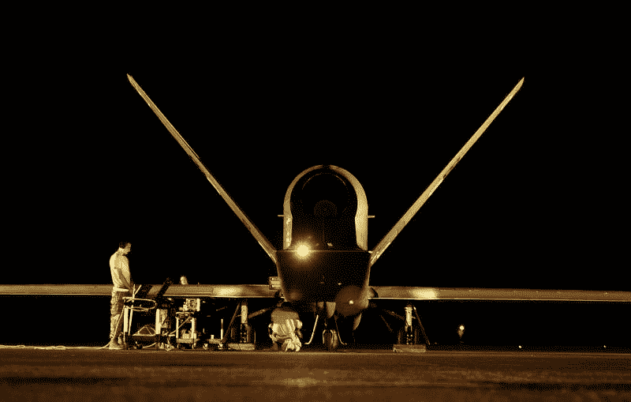
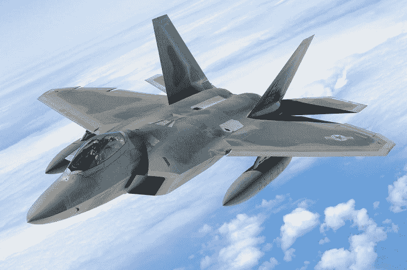
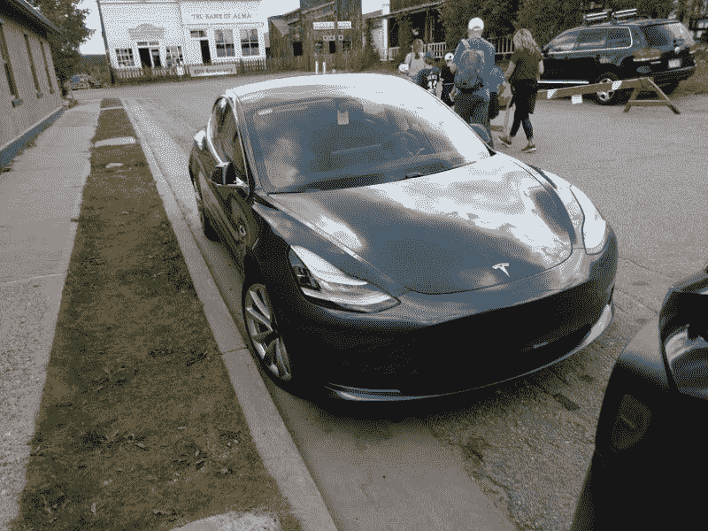
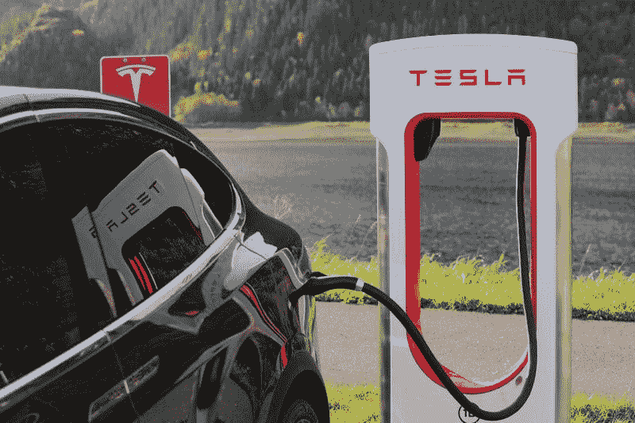
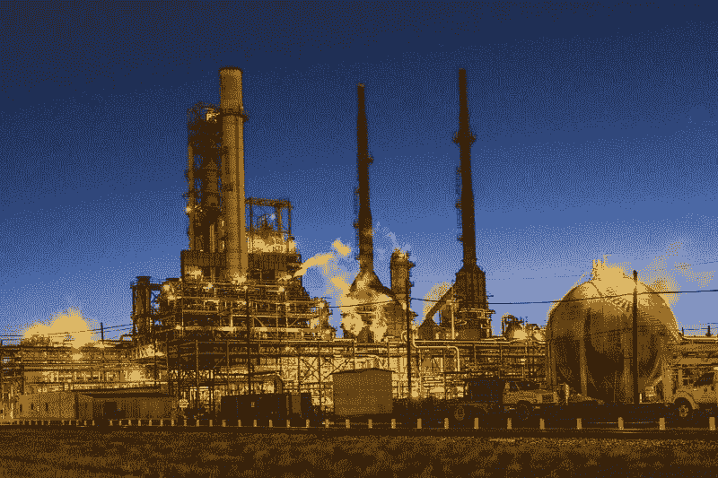

# 沙特无人机袭击会提振哪些股票——市场疯人院

> 原文：<https://medium.datadriveninvestor.com/what-stocks-could-the-saudi-drone-attack-boost-market-mad-house-f6557e2008b4?source=collection_archive---------11----------------------->

对沙特两处石油设施的简单无人机袭击对许多股票都有深远的影响。

解释一下，在也门胡塞叛军摧毁了生产沙特阿拉伯大部分出口石油的加工厂后，油价遭遇了有史以来最严重的混乱。袭击发生在 2019 年 9 月 14 日星期六，当市场在 2019 年 9 月 16 日星期一重新开放时，价格上涨了 10%，*《纽约时报》* [报道](https://www.nytimes.com/2019/09/15/business/saudi-arabia-oil-energy-prices.html)。然而，油价在 2019 年 9 月 18 日周三再次下跌。

因此，多达 5%的全球石油供应可能会在一段未知的时期内退出市场。严重的石油危机不太可能发生，因为石油供应过剩，全球库存高于往常。此外，石油产量正在增加，美国石油产量是 2012 年的两倍，《纽约时报》估计。

 [## 算法交易的机器学习|数据驱动的投资者

### 当你的一个朋友在脸书上传你的新海滩照，平台建议给你的脸加上标签，这是…

www.datadriveninvestor.com](https://www.datadriveninvestor.com/2019/01/30/machine-learning-for-stock-market-investing/) 

# 会有更多的无人机袭击吗？

最大的威胁更多[无人机袭击](https://marketmadhouse.com/is-america-defenseless-against-drone-attacks/)针对沙特没有明显防御。然而，沙特可以通过停止在也门的战争和撤回对也门军队的支持来迅速结束这一威胁。

解释一下，沙特通过在也门内战中向胡塞武装的敌人提供大量军事援助，挑起了胡塞武装的袭击。也门是沙特阿拉伯旁边的一个小国，卷入了一场复杂的内战。也门内战是危险的，因为伊朗支持胡塞叛军，而沙特阿拉伯及其盟友美国支持也门政府。

我怀疑 9 月 14 日的破坏程度会激发更多的无人机袭击，因为这是以低成本实现的。此外，石油供应的中断可能会迫使美国和中国向沙特施压，要求其与胡塞人和解。

单位美国总统唐纳德·j·特朗普(纽约州共和党)有强烈的和解动机。特朗普明年面临连任，美国人民坚决反对另一场中东战争。我认为战争不太可能，因为特朗普明白另一场战争将注定他的连任。

# 无人机大战会伤及哪些股票？

自然，投资者和投机者会问，由于沙特阿拉伯的“无人机战争”，哪些股票可能下跌或上涨？

以下是一些可能因无人机战争而下跌的股票:

洛克希德-马丁公司(纽约证券交易所代码:LMT)-这个巨大的国防承包商会有很大损失，因为胡塞人刚刚表明其标志性产品，如战斗机和攻击直升机可能会过时。

解释一下，胡塞武装让沙特阿拉伯屈服了，他们的无人机价格只有 1.5 万美元。这使得像洛克希德-马丁公司价值 1.2 万亿美元的 T2 F-35 闪电 II 联合攻击战斗机 T3 这样的战斗机的存在受到质疑。值得注意的是，沙特的 [313 喷气式战斗机](https://www.defensenews.com/global/mideast-africa/2015/03/26/saudi-arabia-the-gulf-s-best-equipped-military/)无法阻止炼油厂的攻击。

我认为市场先生在 2019 年 9 月 18 日将洛克希德·马丁的股票定价过高，达到每股 394.71 美元。我的预测是，洛克希德正在走向衰落，因为它的许多产品包括直升机和战斗机都像骑兵一样过时了。

那些想做空股票的人需要注意了。如果无人机袭击导致中东和平以及美国从该地区撤军，洛克希德可能会彻底崩溃。澄清一下，我怀疑美国从中东撤军后，美国军队和开支将会大幅削减。

# 为什么通用动力公司陷入困境

通用动力公司(NYSE: GD) 另一家大型国防承包商与洛克希德·马丁公司处境相似。很明显，市场先生在 2019 年 9 月 18 日将通用动力公司的股票定价为 188.65 美元。

值得注意的是，阿拉伯周刊 [估计](https://thearabweekly.com/saudi-arabia-ups-defence-spending-face-iranian-threats)沙特阿拉伯在国防上的花费超过任何其他国家。2018 年沙特在国防上花费的 680 亿美元中的大部分都流向了通用动力公司等公司。

然而，沙特阿拉伯对相当简单的无人机袭击毫无防备。我的预测是，像通用动力公司这样的公司很快将很难推销他们的产品。然而，通用动力公司可以从其无人系统技术子公司为无人机找到更多的客户。

因此，我建议寻求做空的投机者研究一下通用动力和所有国防类股。我认为，由于战争歇斯底里，国防股票将短暂上涨，但随着时间的推移，随着投资者意识到国防巨头的大部分武器已经过时，国防股票将下跌。

# 无人机大战能提振哪些股票？

还有几只我认为无人机大战会提振的股票。

首先，电动汽车制造商。Houthis 证明了一些公司在电动汽车技术上的巨额投资是合理的。说得详细一点，电动汽车不需要油来驱动。因此，任何提高油价的因素都会增加对电动汽车和卡车的需求。

# 大众汽车

最大的电动汽车生产商是 [**大众**](https://marketmadhouse.com/volkswagen-plans-to-build-50-million-electric-cars/) **AG (VWAPY)** ，据报道，该公司计划在未来十年生产 5000 万辆电动汽车。

特别是，大众汽车正计划为中国和欧洲市场生产一款€20，000 英镑(23，000 美元)的电动轿车。我认为市场先生在 2019 年 9 月 18 日低估了大众汽车 17.20 美元的价格。

# 特斯拉汽车公司

最高调的电动汽车公司是埃隆马斯克的 [**特斯拉汽车**](https://marketmadhouse.com/tesla-more-than-just-a-car-company/) **(纳斯达克代码:TSLA)** 。特斯拉在电气方面经验最丰富，技术最好。另外，我认为市场先生低估了特斯拉的 [Gigafactory](https://www.tesla.com/gigafactory) 电池厂和[电动半挂牵引车](https://marketmadhouse.com/food-service-giant-sysco-orders-50-tesla-semis/)。

具体来说，超级工厂可以向其他公司出售电池。与此同时，电动半挂车有着巨大的潜在市场。例如，美国高速公路上有近 200 万辆半挂牵引车。

最后，特斯拉有销售大量电动汽车的经验。没有其他汽车制造商有这样的经历。

然而，市场先生在 2019 年 9 月 18 日将**特斯拉(纳斯达克:TSLA)** 的价格严重高估至每股 243.53 美元。因此，我认为特斯拉的股价将会大幅下跌。所以这可能是一只值得做空的股票。然而，我认为，如果特斯拉的股票能够获得合理的价格，它可能是一项价值投资。

我认为特斯拉将下跌，因为它在 2019 年 6 月 30 日报告了 4.0833 亿美元的净亏损。因此，尽管特斯拉在 2019 年 6 月 30 日报告了 9.2105 亿美元的毛利，但它还是亏损了。

# 定价过低的电动汽车股票

**福特(纽约证券交易所代码:F)** 这家历史悠久的汽车制造商赚钱了，它最早可能在 2021 年销售一款[电动皮卡](https://marketmadhouse.com/ford-could-dominate-electric-trucks-and-lose-money/)，*汽车&司机* [声称](https://www.caranddriver.com/news/a28947992/electric-ford-f-150-2021-planned/)。福特对其电动汽车非常有信心。它在网上发布了电动 F-150 皮卡表演特技的视频，如[拉动](https://www.theverge.com/2019/7/23/20706515/ford-electric-f150-pickup-truck-pull-million-pound-train)货运列车。

与特斯拉相反，福特在 2019 年 6 月 30 日报告的净收入为 1.48 亿美元，季度毛利为 28.15 亿美元，现金和短期投资为 380.48 亿美元。我认为市场先生在 2019 年 9 月 18 日低估了福特 9.26 美元的价格。

**塔塔汽车有限公司(纽约证券交易所:TTM)** 英印公司的电动[捷豹 I-Pace](https://www.jaguarusa.com/all-models/i-pace/index.html) 获得世界汽车大奖 2019 年度世界汽车大奖。塔塔现在正在向公众出售 I-pace。与福特一样，市场先生在 2019 年 9 月 18 日将塔塔的股价低估至每股 8.66 美元。

[**PACCAR Inc .(纳斯达克代码:PCAR)**](https://marketmadhouse.com/are-trucks-making-money-at-paccar/) 这家商用卡车制造商正在计划几款电动汽车，包括一款电动垃圾车和一款小型电动半挂卡车。我认为市场先生在 2019 年 9 月 18 日公平地将 PACCAR 定价为 70.07 美元。

在电动车竞赛中，我认为福特是最划算的。然而，塔塔和 PACCAR 都没有明显的市场升值。

# 避开石油股

我建议人们现在回避的一类股票是石油股。我认为石油股票很危险，因为没有人知道石油市场会发生什么。

特别是，我认为市场先生在 2019 年 9 月 18 日以 72.46 美元的价格高估了最大的石油公司**埃克森美孚(纽约证券交易所:XOM)** 。我认为他们高估了埃克森美孚，因为它依赖于高油价的商业模式在当今供应过剩和产量飙升的世界已经过时了。

此外，由于无人机袭击，XOM 是许多面临崩溃危险的石油股票之一。危险在于，沙特石油生产的中断可能会造成短暂的油价泡沫。具体来说，油价将一直保持高位，直到沙特恢复生产，或者其他产油国增加出口以获利。那么油价和石油股票将会快速下跌。

就个人而言，我认为沙特拥有迅速重启生产的技术专长。然而，胡塞武装及其伊朗盟友可能拥有大量无人机。然而，沙特可以通过撤出也门来立即结束胡塞武装的威胁。

因此，我认为任何油价和石油库存的增加都将是短暂的泡沫。对于聪明的投资者来说，现在是远离石油的好时机。相反，在今天的市场上，电动汽车似乎是能源和交通领域的最佳长期价值。

*原载于 2019 年 9 月 18 日*[*【https://marketmadhouse.com】*](https://marketmadhouse.com/what-stocks-could-the-saudi-drone-attack-boost/)*。*