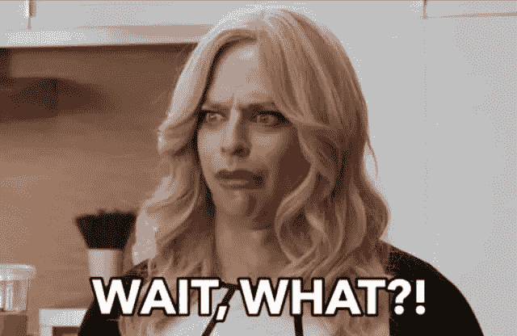

# 讲故事对你的大脑有什么影响

> 原文：<https://medium.datadriveninvestor.com/what-storytelling-does-to-your-mind-4c4c8242a24b?source=collection_archive---------45----------------------->

在他去世前不久，**汉斯·罗斯林与他的儿子和儿媳一起写了一本名为 [**真实**](https://www.amazon.com/Factfulness-Reasons-World-Things-Better/dp/1250107814) 的美丽的书，在书中，他告诉我们这个世界正显示出一种强大、坚定的改善趋势。换句话说，罗斯林在近 300 页的篇幅中一次又一次地证明，世界每天都在变得更好、更安全、更繁荣，不管大众传播媒体如何努力展示完全相反的情况，讲述一个完全不同的故事。**

**罗斯林的假设非常重要，因为它证明了**人类是故事驱动的生物**:不管数据显示事情在改善多少，或者数据有多可靠，以及数据来自何方；我们只需要看 3 分钟新闻上的悲惨画面，就能相信一切都失去了，世界正变得越来越危险。**

****换句话说**:不管有多少数据告诉我们事情正在变好，一张图片足以让我们相信一切都在变坏。为什么？**

****

*****因为一个形象能够讲述一个故事。*****

**在上图中，尽管没有上下文，我们可以知道一些事情。我们知道**有一个主角**，我们肯定知道那个主角是谁。我们知道有一场对抗，主角正面临一个障碍，一个敌人，一个对手，我们也非常清楚对手是谁。我们知道**上下文是加载的**，所以我们知道对抗不是微不足道的。从这一点上，我们知道主角是一个英雄:他独自一人，但这并没有让他退缩:我们知道他没有，至少看不到，一个包含和支持他的团体，但尽管如此，他面临着自己的问题。**

**所有这些我们只需看一张图片就能知道。没有上下文，就有很多上下文。那个没有给出，但最终存在的背景，是你(和我，还有我们)头脑的产物。人类的思维在故事中活动，当它没有足够的元素来“阅读”一个故事时，它转向想象来“写”这个故事。正是通过故事，人类了解了我们周围的世界，了解了内在发生的事情，以及(我们认为)他人正在发生的事情。毫无疑问，我们是有故事的人。**

**信不信由你，人类非常擅长节约资源([除了包装，显然是](https://i.pinimg.com/originals/10/5a/ac/105aacaafd580bfab1636bbfc0e15055.jpg))，这让我们非常非常擅长寻找模式。为什么？因为每当我们发现一系列看起来可以放在同一个小盒子里的东西时，我们的大脑就会把它们放在同一个小盒子里，每当它再次找到其中的一个时，它就会准确地知道如何处理它们以及把它们放在哪里。这有助于节省资源，因为没有必要每次都重新考虑在给定的情况下该做什么:我们可以打开自动驾驶仪，专注于脱离模式的事情，相关的事情，需要我们注意的事情。**

****

**当然，这是在[《黑客帝国》](https://www.imdb.com/title/tt0133093/)中穿红衣服的女人发生的事情:在一个每个人都穿黑色西装和白色衬衫的世界里，也就是说，在一个模式化的世界里，穿红衣服的女人脱离了模式，她脱颖而出，**她变得相关**。**

**我们大脑的这种机制可能是巨大的财富，也可能是巨大的劣势。当它允许我们快速找到我们周围的相关信息时，它是一个巨大的资产，它使我们避免在“只是一堆东西中的另一个”的事情上浪费时间和精力。当我们阅读像这篇文章这样的故事时，这可能是一个很大的缺点，这篇文章最近发表在 2018 年 12 月 18 日(是的，就是最近)，在英国医学杂志(BMJ)的圣诞版上，题为“ [**降落伞用于防止从飞机上跳下时的死亡和重大创伤:随机对照试验**](https://www.bmj.com/content/363/bmj.k5094) ”，并假定-得到这个-: ***降落伞是无用的*** 。**

**非常简单地说，这篇文章详细描述了如何进行一项[双盲研究](https://es.wikipedia.org/wiki/Doble_ciego)，其中两组受试者接受了相同的测试:他们从飞机上跳下，例外情况是其中一组使用普通降落伞跳下，而另一组使用普通背包跳下，*没有使用降落伞。实验进行 30 天后，研究人员对两组进行了随访，并证实各组之间的存活率或创伤率没有差异，降落伞对这些结果没有任何影响。***

****

**肯定有什么不对劲。但是，什么？在这里，我们人类经历了两件事:一方面，我们被一种巨大的好奇心所占据，这种好奇心希望我们揭开神秘的面纱，窥视幕后，看看有什么诀窍，因为像这样的肯定与我们相信的关于世界运行方式的一切强烈矛盾。但是，另一方面，我们感到一种巨大的惰性战胜了我们……阅读科学论文是一项繁琐、艰难和复杂的任务，我们开始觉得不值得付出如此大的努力去发现一些东西，老实说，这些东西不会真正改变我们的生活(或者你真的*T1]考虑过不用降落伞从飞机上跳下来吗？)***

**亲爱的朋友们，这就是这个故事赢得的地方**。这个故事赢了，因为它有意义。这个故事建立了一个可行的，合理的，可能的感觉，在那里我们只能看到不连贯，神秘，混乱。这个故事填补了疑问的漏洞，突出了动机，阐述了人物的个性。就这篇文章而言，首先我只想向你保证这是真的。我发誓。其次，我想邀请你到幕后，这样我就可以告诉你这个技巧是如何运作的:我不会深入到**空能指**的整个概念中(你可以请[雅克·拉康](http://www.lacanianworks.net/?p=657)解释什么是能指，或者[厄尼斯特·拉克劳](https://www.monografias.com/trabajos907/laclau-analisis-discurso/laclau-analisis-discurso2.shtml)详细解释什么是空能指的简单易懂的术语)，但是我会告诉你这个技巧在于一个单词(单词就是能指): ***飞机*** 。****

**单词 ***飞机*** 所做的是在你的脑海中打开一个有着相关含义的世界(在你没有注意到的情况下):你会自动想象高度、速度、机舱、飞行员、一排排座位、危险。你绝对想象不到的是，飞机可以在地面上。如果你能想象到这一点，那就没有窍门了，你马上就会意识到降落伞对研究对象安全离开甚至走出实验的能力没有任何影响。**

**这项研究正是为了提醒人们注意误导性标题的危险，我们可能在没有阅读其内容的情况下就接受了这种危险。不知何故，这就是汉斯·罗斯林在我已经推荐过的那本可爱的书中反复警告我们的:世界就是这样，尽管大众传播媒体一直在努力讲述一个完全不同的故事。那么，似乎不管我们愿不愿意，我们最终都同意弗兰克·扎帕的观点，他说" ***"头脑就像降落伞；它只在*** 开启时才起作用。**