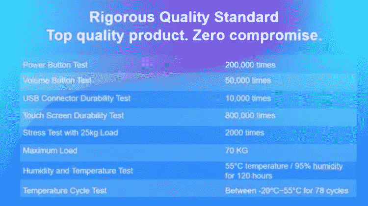
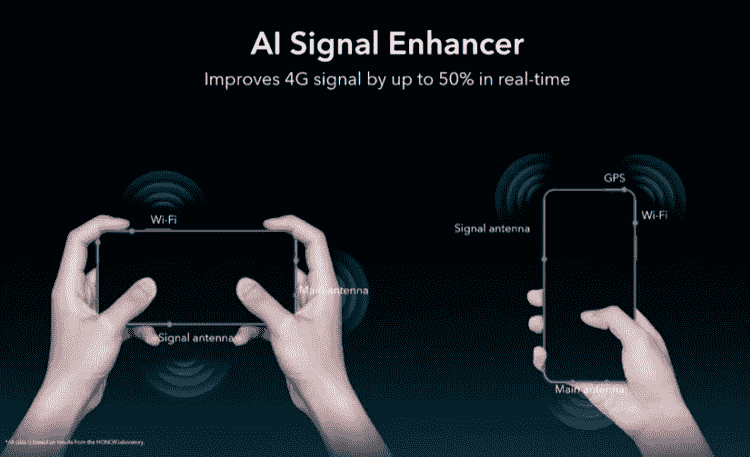

# 什么技术让智能手机变得现代

> 原文：<https://medium.datadriveninvestor.com/what-technologies-make-a-smartphone-modern-c7d156782725?source=collection_archive---------13----------------------->

## 现代智能手机早已不再仅仅是一个呼叫者。现在，它是最强大的设备，不仅能取代电话，还能取代许多其他设备。

Photo by [Quino Al](https://unsplash.com/@quinoal?utm_source=unsplash&utm_medium=referral&utm_content=creditCopyText) on [Unsplash](https://unsplash.com/s/photos/phone?utm_source=unsplash&utm_medium=referral&utm_content=creditCopyText)

我个人知道有些人已经忘记了什么是家用电脑，只在工作中使用。在正常生活中，这些人不仅仅缺少一部现代智能手机。但是是什么让智能手机变得现代呢？答案很简单——技术。以及什么样的技术，我们会在本文中了解。

除了以上所述，人们可以回忆起以前的观察，即现代智能手机的性能高于美国宇航局在将一个人送上月球时的整个计算能力。同时，这不仅适用于旗帜，也适用于相对便宜的设备。

现在，生产力已经达到了一定的上限，每年都要在演示会上说它已经翻了一番，这已经不再可能，有必要提出其他解决方案，今天我们将以最近展示的 Honor 9X 为例来讨论这一点。

# 无边框显示

在过去的一年里，无边框显示屏已经成为智能手机发展的真正趋势。起初，他们只能吹嘘旗手，然后，正如通常发生的那样，技术变得更容易获得，现在被用于中产阶级的智能手机。

无边框显示技术的问题是，你必须将扬声器和前置摄像头藏在某个地方。如果用第一种更简单，而且可以移到身体的末端，那相机就真的有困难了。有人做“梭子”，有人在屏幕上打洞，但在 Honor 9X 等智能手机中，应用了离开相机的系统。正因为如此，智能手机才可能真正实现无边框。

> 当然，也有小框架，但即使在 10-15 年内也不太可能摆脱它们。船体必须抓住一些东西。

记住屏幕顶部和底部有缩进的智能手机。然后，我们谈到了 5-5.5 英寸的对角线是个好东西。现在，您可以将 6 英寸或更大的屏幕放入相同大小的外壳中。例如，Honor 9X 使用 6.59 英寸显示屏，覆盖了 91%的前面板面积。就在几年前，这样的数字还只能在平板电脑中找到。智能手机用户现在也可以使用这一功能。

 [## 幸福的算法？数据驱动的投资者

### 从一开始，我们就认为技术正在使我们的生活变得更好、更快、更容易和更实用。社交媒体…

www.datadriveninvestor.com](https://www.datadriveninvestor.com/2019/03/08/an-algorithm-for-happiness/) 

除了将显示器对角线几乎增加到外壳对角线的值，现代屏幕，特别是 Honor 9X 屏幕，还提供了一种称为 HiACE 的对比度增加系统。它通过从太暗或太亮的区域拉出部分来使内容更加丰富多彩。同时，一切都完成了，这是在飞行中调用和任何内容，无论是录制在 128 GB 的内置内存(或 512 GB 的存储卡)系列或与 YouTube 的视频。

在晚上，减少蓝光对眼睛晶状体影响的技术将是有用的。这种暴露是非常有害的，并可能导致视觉损伤。许多智能手机都配备了夜间显示模式，但并不是每个人都声称符合德国莱茵公司的光生物安全标准。这样的遵从是昂贵的，再次证明了技术不是一成不变的，可以让熟悉的东西变得方便和安全。

# 离开摄像机

很可能，值得单独停止的不是对离开的相机(无帧屏幕)的研究，而是它到底代表了什么。尤其是因为这种机制比乍看起来更复杂。

如果你还记得 Honor Magic 2 型号，你可以说你知道第一款实现前面板摄像头豁免的智能手机。这款智能手机是世界上第一款带有滑动机制的全屏手机。此外，大约五年前，该公司申请了两种相机开启机制的专利。这是一个翻转机制，就像在 Honor 7i 中一样，一个通勤者在 Honor 9X 中找到了自己的位置。

使用的驱动器是高可靠性的步进电机。在测试过程中，该装置经受住了超过 100，000 次升降循环。

> 如果你用 5 年的时间，每天甚至 40 次使用前置摄像头，机制还是能承受的。考虑到在这种模式下根本不可能使用前部件，可以认为该机构的资源几乎是永恒的。

此外，它可以承受高达 15 公斤的重物。这将是那些认为“留下的塑料片非常容易脱落”的人的一个论点不太容易，比如在智能手机上市前反复进行的测试。

负载测试并不是相机进行的唯一测试。此外，智能手机被反复摔落，并调整了相机机制，以便当摔落被记录下来时，它只是留在外壳内，排除了坚硬表面上的冲击造成的损坏。

顺便说一下，在检查方面，许多人没有考虑它们是如何进行的，以及有多少智能手机在试图使它们更强大、更可靠时发生故障。以下是每个智能手机组件通过多少测试才被认为值得上架的例子。

10,000 charging connections, 200,000 Power button presses, overheating, supercooling and that ‘s not all the new smartphone is exposed to.

正如我们所看到的，许多人严重关注的离开相机实际上比它看起来要可靠得多。与此同时，it(也只有 it)在这个技术发展阶段允许让智能手机真正无边框。我们在等待摄像机出现在屏幕上，但迄今为止，他们的时间还没有到来。

# 智能手机电池

自主很重要不用多说——大家都已经明白了。但你有没有想过，要提高电池物理尺寸的使用效率，需要多少功率？在这个例子之后，没有必要走很远，因为 15-20 年前重几百克甚至几公斤的东西现在可以装进智能手机。

在 Honor 9X 外壳中，只有 8.8 毫米厚，有 4000 毫安时的电池，可以让你长时间使用智能手机。很难说出具体的数字，因为它们在很大程度上取决于使用场景，但这并不重要。更重要的是想象一下，在 iPhone 3G 中，电池的容量只有 1,150 mAh，而现在它在保持尺寸的情况下几乎翻了两番。我印象深刻，你呢？

# 现代设计的智能手机

智能手机的外观似乎与设计关系不大，但这是一种误解。这个设备的外观不仅是由设计师设计的，也是由那些思考如何实现他们愿望的人设计的。正是他们提出了新技术，不仅可以实现一吨重的身体颜色，还可以实现美丽的光泽或渐变。

一个很好的例子就是新 Honor 9X 后墙的渐进式 3D 设计。其覆盖范围的核心是成千上万个以特殊方式反射光线的棱镜。这不仅给表面带来了很深的光泽，而且由于纹理的不同，还可以在后壁上突出显示拉丁字母“X”的图案，这是统治者的象征。

> 有时候，并不是所有的潜在买家都会做出这样的决定。许多人想要更简约和经典的东西。为他们提供了“全黑”的颜色。

对于所有的极简主义，他看起来也很时尚，因为他有很深的闪光。有必要在创作中应用新的着色技术。因此，设计可以大胆地归功于技术。

# 智能手机还采用了哪些其他技术

首先，智能手机是一种通讯工具，它必须执行其主要任务。如果你断开他的手机网络，他就不够好。这就是为什么这方面的工作也在进行中。

很久以前，对便携式通信设备的发射器的功率进行了限制。这很好，因为它减少了对我们身体的影响，并鼓励运营商建立更多的塔。但这并不意味着所有智能手机在网络上的工作方式都是一样的。

# 当你拦截智能手机时，这就是天线的工作原理。

That ‘s how antennas work when you intercept a smartphone.

比如 Honor 9X 可以让你不丢失一个信号，即使用户拦截了智能手机，用手关闭了天线。为此，几个天线沿着它的外壳放置，智能系统负责它们的操作，始终保持尽可能高的接收水平。如果这是你感兴趣的智能手机。

你可以举出其他技术的例子，但很明显，现代智能手机是一件与时俱进的艺术品，总是提供先进的解决方案。

它们以前只出现在旗舰里，几年后就没落了。这种转变的时间现在已经大大缩短了。另外，很多技术开始出现在中段。这是非常令人愉快的，并给人信心，在未来的品牌，如荣誉和其他将提供新的和新的先进的解决方案，使我们使用智能手机的体验更有趣。同意吗？