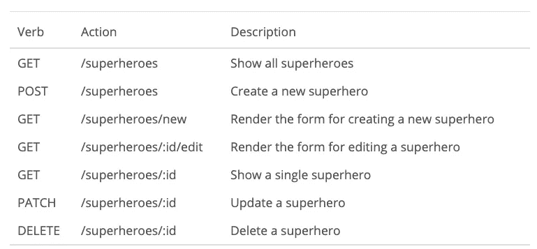

# 什么是 API，JSON，REST，AJAX

> 原文：<https://medium.datadriveninvestor.com/what-the-crud-is-api-json-rest-ajax-6281c75af167?source=collection_archive---------2----------------------->


API Doing Butlery Things

本文是“[JavaScript](https://medium.com/better-programming/whats-next-after-javascript-fundamentals-16431b88d0a3)之后的下一步是什么”系列文章的继续，在该系列文章中，我描述了我的自学软件开发之旅，以及我的目标是与有类似追求的其他人分享这个路线图。正如我在上一篇文章中所描述的，在完成一门基础课程后，我经常会问自己，“那么接下来是什么？”我经常开始一些过于高深的课程，因为我认为我懂 JavaScript。一个反复出现的主题是，我一直在开始一些课程，要么太基础，要么太高级。下一个正确的步骤在哪里？让我们直接跳到我们停下的地方。

回顾一下 web 应用的核心，web 编程的核心可以归纳为三个阶段。在本帖中，我们将讨论关于如何与服务器通信的最后一步的定义。关于 web 编程的前两个短语的详细解释。你可以在这里查看我以前的文章。

[](https://www.datadriveninvestor.com/2019/02/21/best-coding-languages-to-learn-in-2019/) [## 2019 年最值得学习的编码语言|数据驱动的投资者

### 在我读大学的那几年，我跳过了很多次夜游去学习 Java，希望有一天它能帮助我在…

www.datadriveninvestor.com](https://www.datadriveninvestor.com/2019/02/21/best-coding-languages-to-learn-in-2019/) 

# Web 编程的核心

> 关联 JavaScript 事件
> 
> 操纵 DOM
> 
> 与服务器通信

# 什么是 API

应用程序编程接口或 API 返回数据以响应客户端的请求。API 本质上是一个允许您访问服务器数据库的访问点或端点。你可以把它想象成一个看门人或管家站在门口，你走近去问问题。那个管家然后会回到庄园去取回你需要的信息。这不是一个完美的比喻，但你明白了。

# JSON 是什么

进一步扩展我们的比喻，我们的管家花了一些时间查看整个庄园，几微秒后有了响应。如果搜索成功，他会返回代码 200 并提交 JSON。JSON 代表**J**ava**S**script**O**Object**N**rotation，它代表 JavaScript 对象中的数据。JavaScript 对象存储为键/值对。然后，这些数据可以用来完成 web 应用程序中创建、读取、更新和删除的所有 CRUD 功能。有关状态的更多信息，请查看 MDN 文档[此处](https://developer.mozilla.org/en-US/docs/Web/HTTP/Status)。当返回 JSON 响应时，您将会看到以下内容。

```
{
	"name": "Luke Skywalker",
	"height": "172",
	"mass": "77",
	"hair_color": "blond",
	"skin_color": "fair",
	"eye_color": "blue",
	"birth_year": "19BBY",
	"gender": "male",
	"homeworld": "https://swapi.co/api/planets/1/",
	"films": [
		"https://swapi.co/api/films/2/",
		"https://swapi.co/api/films/6/",
		"https://swapi.co/api/films/3/",
		"https://swapi.co/api/films/1/",
		"https://swapi.co/api/films/7/"
	],
	"species": [
		"https://swapi.co/api/species/1/"
	],
	"vehicles": [
		"https://swapi.co/api/vehicles/14/",
		"https://swapi.co/api/vehicles/30/"
	],
	"starships": [
		"https://swapi.co/api/starships/12/",
		"https://swapi.co/api/starships/22/"
	],
	"created": "2014-12-09T13:50:51.644000Z",
	"edited": "2014-12-20T21:17:56.891000Z",
	"url": "https://swapi.co/api/people/1/"
}
```

# 什么是休息

回到我们与管家的互动，你作为客户接近管家，你的要求必须以他理解的特定方式构建。我们通过一组 URL 与 API 进行交互。每个 URL 定义一个我们请求或采取行动的资源。**RE**presentational**S**tate**T**transfer 或 REST 本质上是一种构造 URL 的架构设计模式。例如，如果你联系遵循 REST 惯例的管家，他可以访问超级英雄的数据库，他可以理解 5 个动词。



# 什么是 AJAX

在 AJAX 出现之前，曾经有人向管家提出过请求。需要刷新页面以检索信息。AJAX 提供了一种从数据库中检索内容并显示它的方法，而不必刷新整个页面。AJAX 或者说同步的 Ja vaScript 和 ML 是单页面应用程序的重要组成部分。

异步请求最好被描述为从餐馆订餐。服务员/管家从顾客/客户那里接受订单。服务员然后把订单带回厨房。数据库/厨师花他或她的甜蜜时间准备一顿美味的饭菜。在异步订单中，服务员不会在厨房窗口等待厨师完成制作，然后再将食物端给顾客。那就太没效率了。相反，服务员去接受另一位顾客的另一份订单，当厨师按动呼叫铃时，食物已经准备好了。然后服务员会把食物送到顾客手中。

# 总结想法

希望这些定义能帮助您理解 web 应用程序服务器端交互的全貌。每一部分都包含了比我描述的更多的复杂性和细微差别，它们都值得更全面的解释。然而，对每个主题的深入阐述超出了本系列的范围，我鼓励您将这里的观点作为理解之旅的里程碑。在我的下一篇文章中，我将介绍一个 AJAX 调用 API 的例子。