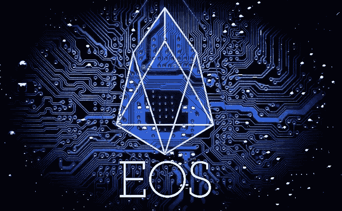
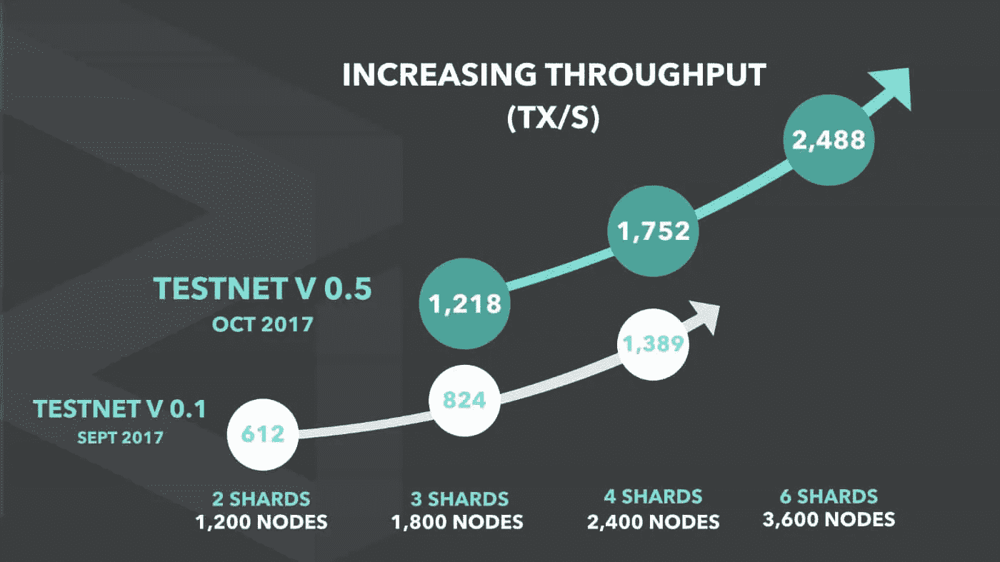
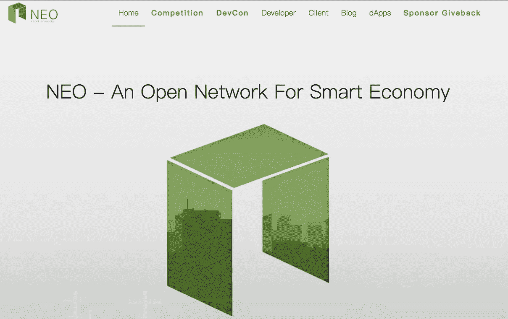
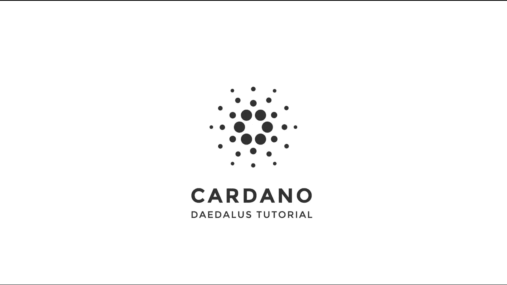
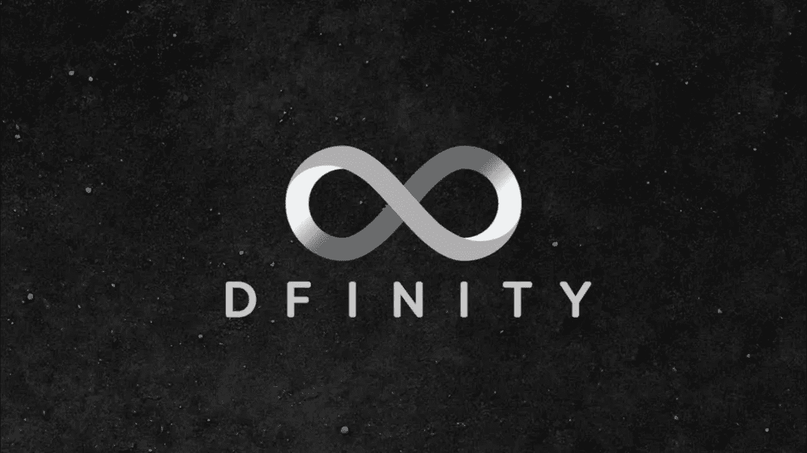
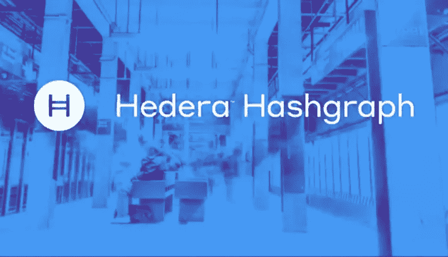

# 加密货币世界需要什么

> 原文：<https://medium.datadriveninvestor.com/what-the-cryptocurrency-world-needs-2a60f6722a83?source=collection_archive---------25----------------------->

## 以太坊杀手和其他区块链改进项目

在加密爱好者情绪低落的背景下，加密货币市场似乎正在经历衰退。比特币失败了，由于区块链的缺点，大多数正在运行的 DAPPs 都变得索然无味，根本无法在实践中应用。然而，数字表明情况恰恰相反。尽管加密货币市场的整体市值下降，但 2018 年 8 月的融资额比 2018 年 7 月高出 44%。据 anycoin.news 市场分析，8 月份举办并完成了 50 场 ico。他们一起筹集了超过 10 亿美元。

吸引投资最多的最成功的 ico 包括在区块链改善领域提供解决方案的项目、创建分散应用程序的几个平台、卫生和环境领域的项目以及金融项目。最成功的项目所在的区域反映了市场以及加密货币和区块链行业的总体需求。

2017 年的加密货币宣传和分散化应用的繁荣表明，技术在实践中的应用取决于与区块链缺陷相关的一些严重问题。从那时起，已经启动了几个项目，承诺创造一个“以太坊杀手”，一个在能力上超过以太坊网络的去中心化应用平台。2018 年 8 月所有成功项目中至少有四分之一是在基础设施领域启动的，这一事实表明，这个问题的解决方案仍未找到。

> 我将告诉你 Buterin 的创意中最著名的竞争者，以及为区块链改进提供各种选择的新项目。

# 黎明的女神

以太坊最有希望的竞争对手之一是 EOS 加密货币。该项目意味着创建一个操作系统，在此基础上有可能创建应用程序和投资项目。

EOS 的创造者丹·拉里默对以太坊区块链进行了改进，使网络性能提高到每秒一百万次交易。作为系统基础的 DPoS 算法的工作原理假设了一种区块链管理系统:密码社区的人选择 20 个能够维持平台运行的见证人。影响力是由他们拥有的令牌数量决定的。证人从他们的活动中获得稳定的收入。如果一个证人的活动不能满足秘密社区，他们可以取消他们的投票，然后他会辞职。EOS 有反对者批评这一网络管理原则。

2018 年 5 月，该项目在一次 ICO 期间吸引了近 40 亿美元，当时没有工作产品。该项目仍在开发中，并计划在某一天展示其在线公投的应用。

# Zilliqa

Zilliqa 项目使用分片技术为以太坊网络的可扩展性问题提供了一个解决方案。这个想法是将一个庞大的交易处理机器网络自动分割成并行的子委员会或“碎片”，每个子委员会或“碎片”由自己的微块处理。产生的微块被组合成最终的微块。这应该能把交易速度提高到每秒 1000 次。

在实践中，这个想法的实现要困难许多倍；这项工程已经进行了两年了。在 2017 年底进行的 token 预售和 ICO 期间，项目创始人筹集了约 4200 万美元。

# 近地天体

另一个被吹嘘的承诺解决区块链问题的基础设施项目。NEO 团队正致力于创造所谓的智能经济，其中包括智能合约平台、一种新的数字资产模型和一个位于区块链的结构识别系统。该项目支持各种数字资产，并且由于 NeoContract，开发人员可以使用熟悉的 C #、Java 和 Go 编程语言创建智能合同。

近地天体系统包括几项仍在开发中的应用。

该平台有一个子公司 OnChain company，目前正在与中国和日本政府以及包括阿里巴巴在内的大公司合作。

NEO 是首批进行 ICO 的项目之一。2015 年，开发商成功吸引了 55 万美元。2016 年 9 月，该项目启动了第二阶段的 ICO，期间又筹集了 400 万美元。

# 卡尔达诺

它是一个分散的平台，允许您以一种廉价、安全和可扩展的方式创建分散的应用程序和智能合同。与其他项目不同，Cardano 认识到监管监督的必要性，但同时提供保密性和消费者保护。

# 确定性

一个公共云计算平台，计划创建一个“巨型互联网计算机”，其工作将得到每个加入其协议的人的支持。该平台与以太坊兼容，旨在解决许多与区块链的性能、缩放和控制相关的问题。据 Coinspeaker 称，该项目成功吸引了约 2 亿美元。

# 海德拉哈希图

Hashgraph 项目是 2018 年 8 月最成功的 ico 之一。它是一个分布式账本，可以用在各种需要高性能和保护的去中心化系统中，从网络游戏到交易平台和拍卖。粗略地说，它是一个创建去中心化应用程序和智能契约的平台。目前，该项目正处于开发阶段；在代币销售期间，它筹集了近 1 亿美元。

## 关注[美国](http://fairwin.io/):

推特:【https://twitter.com/FairwinGambling[T4:](https://twitter.com/FairwinGambling)[https://www.facebook.com/fairwin.gambling/](https://www.facebook.com/fairwin.gambling/)insta gram:[https://www.instagram.com/fairwin_team/](https://www.instagram.com/fairwin_team/)

## 与我们聊天:

不和:[https://discord.gg/Hbardp2](https://discord.gg/Hbardp2)
Reddit:[https://www.reddit.com/user/fair-win](https://www.reddit.com/user/fair-win)
电报:[https://t.me/fair_win](https://t.me/fair_win)