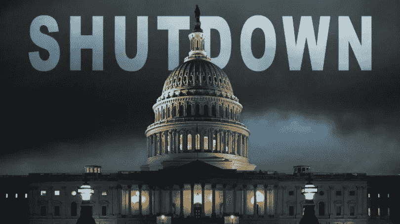

# 政府关门教会了所有人什么。

> 原文：<https://medium.datadriveninvestor.com/what-the-government-shutdown-has-taught-everyone-21ae7b646896?source=collection_archive---------29----------------------->

政府关门现在正式成为历史上最长的关门。持续时间超过 24 天，已进入第四周，特朗普总统和共和党人表示，除非民主党同意为隔离墙提供资金，否则他们不会重新开放政府。

唐纳德·特朗普(Donald Trump)总统似乎排除了(至少目前是这样)宣布全国进入紧急状态，在美墨边境修建一堵墙，这是可能结束政府关闭的第一选择。

特朗普还强调，在立法者试图达成两党移民协议的同时，他反对暂时重开政府。总统否决了一项提议，即让政府开放三周，在继续进行全国紧急状态宣布之前，为达成立法妥协做最后的努力。“我确实拒绝了，”特朗普说。

总统的评论是最新的迹象，表明美国历史上最长的政府关闭还没有结束。双方都在努力，特朗普要求为隔离墙提供超过 50 亿美元的资金，而民主党人坚持认为隔离墙既昂贵又没有必要。

截至周一上午，没有即将达成妥协的迹象，即使许多联邦工作人员在周五错过了他们的第一份薪水。政府停摆导致参议院完全瘫痪。

因此，尽管目前的关闭估计会造成数十亿美元的损失，但政府关闭的每一天都会增加这一数额。

现在，2018 年已经结束，股市经历了自 20 世纪 30 年代以来最糟糕的 12 月，问题是 2019 年将会发生什么。

由于政府已经关闭，工人们已经几个星期没有拿到工资了，每个人都在问；

# 这种情况会持续多久？

没有人真正知道。但我们知道的是，你应该总是期待意想不到的事情。这包括你的财务状况。所以专家指出，你应该有 6 个月的应急基金。虽然这对大多数人来说很难，但正是这样的时刻证明了这一理论是正确的。就当是保险单吧。你支付你的保险费，所以如果有紧急情况，你被覆盖。

因此，政府关门给我们的最重要的教训是，应急基金不仅是一个好主意，而且是大多数人的必需品。